# Introduction 

Many people in Southwest Baltimore do not have easy access to healthcare. Some neighborhoods are far from clinics or hospitals, and others face challenges like poverty, or lack of transportation. These problems can make people sicker over time. That is why it is important to understand where these issues are happening so we can help. 
The Health and Wellness Group Project focuses on leveraging data science to address critical healthcare accessibility issues in Southwest Baltimore. In collaboration with Dr. Megan Doede, the Program Lead for Health and Wellness at Paul’s Place, our team has embarked on a mission to explore the intersection of spatial disparities, environmental stressors, and community health outcomes.  
By applying advanced analytical techniques and geospatial tools using demographic and environmental data, we aim to uncover key patterns that identify healthcare deserts and highlight areas at risk for future health concerns. Our goal is to use these insights to support data-driven, equitable interventions that can improve healthcare delivery and resource distribution for underserved communities. This will help leaders and community groups make better decisions about where to bring services and support.
In this aspect of the project, we create a general health risk predictive model using features contributory to general health and wellness within Southwest Baltimore. It is pertinent to note that the predictive model is still a work in progress as we work with Pauls place and collaborators to collate extensive data within the community to improve the model. 

# METHODOLOGY

## Data Collection 
### Source of Data: 

We used three main sources for our data: 

#### American Community Survey (ACS) from the U.S. Census Bureau.
https://www.census.gov/programs-surveys/acs/news/data-releases/2023.html.
Provided information about income, education, health insurance, race, age, and more which helped us understand the community’s economic and social conditions.

#### Homeless Shelter Locations from Open Baltimore.
https://data.baltimorecity.gov/datasets/baltimore::homeless-shelters-2/explore.
With the use of API url to access updated data this data shows where homeless shelters are located in Baltimore. 


#### Health Department Dataset.
https://data.baltimorecity.gov/datasets/e37ce649df4344dab174b34593b1c4b6_0/explore?location=39.307459%2C-76.628697%2C11.39&showTable=true Provided information about health problems in the community including data on store density (alcohol, tobacco, grocery), mortality, substance abuse, and more.


## Data Exploration 
We looked at the data to see what it tells us about the people living in Southwest Baltimore. 
We checked for missing values, outliers, and important patterns. 
This helped us understand the quality of the data and what we needed to fix before analysis. 

#### Liquor, Healthy food index and crime rate data 


```python
import pandas as pd
import numpy as np

# Load datasets 
try:
    liquor_df = pd.read_csv('/Users/bayowaonabajo/Downloads/SW Baltimore Liquor Store Density.csv')
    food_df = pd.read_csv('/Users/bayowaonabajo/Downloads/SW Baltimore Healthy Food Index.csv') 
    crimerate_df = pd.read_csv('/Users/bayowaonabajo/Downloads/SW Balt Crime Rate - Univ of Balt.csv')
    print(" Files loaded successfully!\n")
    
    print("Liquor Store Density Preview:")
    display(liquor_df.head())
    
    print("\nHealthy Food Index Preview:")
    display(food_df.head())
    
    print("\nCrime Rate Preview:")
    display( crimerate_df.head())

except FileNotFoundError as e:
    print(f" Error: {e}")
   
```

     Files loaded successfully!
    
    Liquor Store Density Preview:


<div>
<style scoped>
    .dataframe tbody tr th:only-of-type {
        vertical-align: middle;
    }

    .dataframe tbody tr th {
        vertical-align: top;
    }

    .dataframe thead th {
        text-align: right;
    }
</style>
<table border="1" class="dataframe">
  <thead>
    <tr style="text-align: right;">
      <th></th>
      <th>Name</th>
      <th>Area</th>
      <th>Liquor Store Density</th>
    </tr>
  </thead>
  <tbody>
    <tr>
      <th>0</th>
      <td>ZCTA5 21207</td>
      <td>Dickeyville-Franklintown</td>
      <td>0.00</td>
    </tr>
    <tr>
      <th>1</th>
      <td>ZCTA5 21216</td>
      <td>Greater Rosemont</td>
      <td>1.05</td>
    </tr>
    <tr>
      <th>2</th>
      <td>ZCTA5 21216</td>
      <td>Forest Park-Walbrook</td>
      <td>0.21</td>
    </tr>
    <tr>
      <th>3</th>
      <td>ZCTA5 21216</td>
      <td>Greater Mondawmin</td>
      <td>0.23</td>
    </tr>
    <tr>
      <th>4</th>
      <td>ZCTA5 21223</td>
      <td>Poppletown</td>
      <td>0.63</td>
    </tr>
  </tbody>
</table>
</div>


    
    Healthy Food Index Preview:


<div>
<style scoped>
    .dataframe tbody tr th:only-of-type {
        vertical-align: middle;
    }

    .dataframe tbody tr th {
        vertical-align: top;
    }

    .dataframe thead th {
        text-align: right;
    }
</style>
<table border="1" class="dataframe">
  <thead>
    <tr style="text-align: right;">
      <th></th>
      <th>Name</th>
      <th>Area</th>
      <th>Healthy Food Availability Index</th>
    </tr>
  </thead>
  <tbody>
    <tr>
      <th>0</th>
      <td>ZCTA5 21207</td>
      <td>Dickeyville-Franklintown</td>
      <td>2.0</td>
    </tr>
    <tr>
      <th>1</th>
      <td>ZCTA5 21216</td>
      <td>Greater Rosemont</td>
      <td>7.5</td>
    </tr>
    <tr>
      <th>2</th>
      <td>ZCTA5 21216</td>
      <td>Forest Park-Walbrook</td>
      <td>9.9</td>
    </tr>
    <tr>
      <th>3</th>
      <td>ZCTA5 21216</td>
      <td>Greater Mondawmin</td>
      <td>9.7</td>
    </tr>
    <tr>
      <th>4</th>
      <td>ZCTA5 21223</td>
      <td>Poppletown</td>
      <td>10.6</td>
    </tr>
  </tbody>
</table>
</div>


    
    Crime Rate Preview:


<div>
<style scoped>
    .dataframe tbody tr th:only-of-type {
        vertical-align: middle;
    }

    .dataframe tbody tr th {
        vertical-align: top;
    }

    .dataframe thead th {
        text-align: right;
    }
</style>
<table border="1" class="dataframe">
  <thead>
    <tr style="text-align: right;">
      <th></th>
      <th>Name</th>
      <th>Area</th>
      <th>Violent Crime Rate</th>
    </tr>
  </thead>
  <tbody>
    <tr>
      <th>0</th>
      <td>ZCTA5 21207</td>
      <td>Dickeyville-Franklintown</td>
      <td>10.00</td>
    </tr>
    <tr>
      <th>1</th>
      <td>ZCTA5 21216</td>
      <td>Greater Rosemont</td>
      <td>22.98</td>
    </tr>
    <tr>
      <th>2</th>
      <td>ZCTA5 21216</td>
      <td>Forest Park-Walbrook</td>
      <td>14.53</td>
    </tr>
    <tr>
      <th>3</th>
      <td>ZCTA5 21216</td>
      <td>Greater Mondawmin</td>
      <td>22.11</td>
    </tr>
    <tr>
      <th>4</th>
      <td>ZCTA5 21223</td>
      <td>Poppletown</td>
      <td>23.26</td>
    </tr>
  </tbody>
</table>
</div>


```python

# Process Liquor Store Density Table
df_liquor = pd.DataFrame(liquor_df)

# Extract ZCTA5 from the "Name" column
df_liquor["ZCTA5"] = df_liquor["Name"].str.extract(r'ZCTA5 (\d+)')
# Aggregate by ZCTA5 (average density if multiple entries exist)
liquor_agg = df_liquor.groupby("ZCTA5")["Liquor Store Density"].mean().reset_index()

# Process Healthy Food Index Table
df_food = pd.DataFrame(food_df)

df_food["ZCTA5"] = df_food["Name"].str.extract(r'ZCTA5 (\d+)')
food_agg = df_food.groupby("ZCTA5")["Healthy Food Availability Index"].mean().reset_index()

# Process Crime Rate Table
df_crime = pd.DataFrame(crimerate_df)

df_crime["ZCTA5"] = df_crime["Name"].str.extract(r'ZCTA5 (\d+)')
crime_agg = df_crime.groupby("ZCTA5")["Violent Crime Rate"].mean().reset_index()
```


```python
# Merge aggregated tables
merged_extra = liquor_agg.merge(food_agg, on="ZCTA5", how="outer") \
                         .merge(crime_agg, on="ZCTA5", how="outer")

merged_extra.head()
```


<div>
<style scoped>
    .dataframe tbody tr th:only-of-type {
        vertical-align: middle;
    }

    .dataframe tbody tr th {
        vertical-align: top;
    }

    .dataframe thead th {
        text-align: right;
    }
</style>
<table border="1" class="dataframe">
  <thead>
    <tr style="text-align: right;">
      <th></th>
      <th>ZCTA5</th>
      <th>Liquor Store Density</th>
      <th>Healthy Food Availability Index</th>
      <th>Violent Crime Rate</th>
    </tr>
  </thead>
  <tbody>
    <tr>
      <th>0</th>
      <td>21207</td>
      <td>0.000000</td>
      <td>2.000000</td>
      <td>10.000000</td>
    </tr>
    <tr>
      <th>1</th>
      <td>21216</td>
      <td>0.496667</td>
      <td>9.033333</td>
      <td>19.873333</td>
    </tr>
    <tr>
      <th>2</th>
      <td>21223</td>
      <td>1.786667</td>
      <td>9.506667</td>
      <td>32.486667</td>
    </tr>
    <tr>
      <th>3</th>
      <td>21229</td>
      <td>0.425000</td>
      <td>8.547500</td>
      <td>14.980000</td>
    </tr>
    <tr>
      <th>4</th>
      <td>21230</td>
      <td>0.490000</td>
      <td>9.585000</td>
      <td>21.305000</td>
    </tr>
  </tbody>
</table>
</div>


#### Social data which includes education


```python
import pandas as pd

data_SW_social = pd.read_csv("/Users/bayowaonabajo/Downloads/ACS  SW Balt Social/ACS 5 year SW Balt Social.csv") #add dataset
#data_SW_social.head(20)
for idx, value in enumerate(data_SW_social['Label (Grouping)'], 1):
    print(f"{idx}. {value}")
```

    1. HOUSEHOLDS BY TYPE
    2.     Total households
    3.         Married-couple household
    4.             With children of the householder under 18 years
    5.         Cohabiting couple household
    6.             With children of the householder under 18 years
    7.         Male householder, no spouse/partner present
    8.             With children of the householder under 18 years
    9.             Householder living alone
    10.                 65 years and over
    11.         Female householder, no spouse/partner present
    12.             With children of the householder under 18 years
    13.             Householder living alone
    14.                 65 years and over
    15.         Households with one or more people under 18 years
    16.         Households with one or more people 65 years and over
    17.         Average household size
    18.         Average family size
    19. RELATIONSHIP
    20.     Population in households
    21.         Householder
    22.         Spouse
    23.         Unmarried partner
    24.         Child
    25.         Other relatives
    26.         Other nonrelatives
    27. MARITAL STATUS
    28.     Males 15 years and over
    29.         Never married
    30.         Now married, except separated
    31.         Separated
    32.         Widowed
    33.         Divorced
    34.     Females 15 years and over
    35.         Never married
    36.         Now married, except separated
    37.         Separated
    38.         Widowed
    39.         Divorced
    40. FERTILITY
    41.     Number of women 15 to 50 years old who had a birth in the past 12 months
    42.         Unmarried women (widowed, divorced, and never married)
    43.             Per 1,000 unmarried women
    44.         Per 1,000 women 15 to 50 years old
    45.         Per 1,000 women 15 to 19 years old
    46.         Per 1,000 women 20 to 34 years old
    47.         Per 1,000 women 35 to 50 years old
    48. GRANDPARENTS
    49.     Number of grandparents living with own grandchildren under 18 years
    50.         Grandparents responsible for grandchildren
    51.         Years responsible for grandchildren
    52.             Less than 1 year
    53.             1 or 2 years
    54.             3 or 4 years
    55.             5 or more years
    56.     Number of grandparents responsible for own grandchildren under 18 years
    57.         Who are female
    58.         Who are married
    59. SCHOOL ENROLLMENT
    60.     Population 3 years and over enrolled in school
    61.         Nursery school, preschool
    62.         Kindergarten
    63.         Elementary school (grades 1-8)
    64.         High school (grades 9-12)
    65.         College or graduate school
    66. EDUCATIONAL ATTAINMENT
    67.     Population 25 years and over
    68.         Less than 9th grade
    69.         9th to 12th grade, no diploma
    70.         High school graduate (includes equivalency)
    71.         Some college, no degree
    72.         Associate's degree
    73.         Bachelor's degree
    74.         Graduate or professional degree
    75.         High school graduate or higher
    76.         Bachelor's degree or higher
    77. VETERAN STATUS
    78.     Civilian population 18 years and over
    79.         Civilian veterans
    80. DISABILITY STATUS OF THE CIVILIAN NONINSTITUTIONALIZED POPULATION
    81.     Total Civilian Noninstitutionalized Population
    82.         With a disability
    83.     Under 18 years
    84.         With a disability
    85.     18 to 64 years
    86.         With a disability
    87.     65 years and over
    88.         With a disability
    89. RESIDENCE 1 YEAR AGO
    90.     Population 1 year and over
    91.         Same house
    92.         Different house (in the U.S. or abroad)
    93.             Different house in the U.S.
    94.                 Same county
    95.                 Different county
    96.                     Same state
    97.                     Different state
    98.             Abroad
    99. PLACE OF BIRTH
    100.     Total population
    101.         Native
    102.             Born in United States
    103.                 State of residence
    104.                 Different state
    105.             Born in Puerto Rico, U.S. Island areas, or born abroad to American parent(s)
    106.         Foreign-born
    107. U.S. CITIZENSHIP STATUS
    108.     Foreign-born population
    109.         Naturalized U.S. citizen
    110.         Not a U.S. citizen
    111. YEAR OF ENTRY
    112.     Population born outside the United States
    113.         Native
    114.             Entered 2010 or later
    115.             Entered before 2010
    116.         Foreign-born
    117.             Entered 2010 or later
    118.             Entered before 2010
    119. WORLD REGION OF BIRTH OF FOREIGN-BORN
    120.     Foreign-born population, excluding population born at sea
    121.         Europe
    122.         Asia
    123.         Africa
    124.         Oceania
    125.         Latin America
    126.         Northern America
    127. LANGUAGE SPOKEN AT HOME
    128.     Population 5 years and over
    129.         English only
    130.         Language other than English
    131.             Speak English less than "very well"
    132.         Spanish
    133.             Speak English less than "very well"
    134.         Other Indo-European languages
    135.             Speak English less than "very well"
    136.         Asian and Pacific Islander languages
    137.             Speak English less than "very well"
    138.         Other languages
    139.             Speak English less than "very well"
    140. ANCESTRY
    141.     Total population
    142.         American
    143.         Arab
    144.         Czech
    145.         Danish
    146.         Dutch
    147.         English
    148.         French (except Basque)
    149.         French Canadian
    150.         German
    151.         Greek
    152.         Hungarian
    153.         Irish
    154.         Italian
    155.         Lithuanian
    156.         Norwegian
    157.         Polish
    158.         Portuguese
    159.         Russian
    160.         Scotch-Irish
    161.         Scottish
    162.         Slovak
    163.         Subsaharan African
    164.         Swedish
    165.         Swiss
    166.         Ukrainian
    167.         Welsh
    168.         West Indian (excluding Hispanic origin groups)
    169. COMPUTERS AND INTERNET USE
    170.     Total households
    171.         With a computer
    172.         With a broadband Internet subscription


```python
import pandas as pd
import numpy as np

# Subset
subset_df = data_SW_social.iloc[64:76].copy()

# Clean column names
clean_columns = {col: col.replace("ZCTA5 ", "").replace("!!", "_") for col in subset_df.columns}
subset_df.rename(columns=clean_columns, inplace=True)

# Melt to long format
melted_df = subset_df.melt(
    id_vars=["Label (Grouping)"], 
    var_name="ZCTA5_Metric", 
    value_name="Value"
)

# Split ZCTA5 and metric
split_vals = melted_df['ZCTA5_Metric'].str.split("_", n=1, expand=True)
melted_df['ZCTA5'] = split_vals[0]
melted_df['Metric'] = split_vals[1].str.replace("Margin", " Margin").str.strip()

# Clean label names
melted_df['Label (Grouping)'] = melted_df['Label (Grouping)'].str.replace('\xa0', ' ').str.strip()

# value cleaning
def clean_value(value):
    try:
        if pd.isna(value) or str(value).strip() in ('(X)', '...'):
            return np.nan
        value_part = str(value).split('±')[0]
        cleaned = value_part.replace(',', '').replace('%', '').strip()
        return float(cleaned) if cleaned else np.nan
    except:
        return np.nan

melted_df['Value'] = melted_df['Value'].apply(clean_value)
melted_df = melted_df.dropna(subset=['Value'])

# Updated education mapping to match cleaned labels
education_mapping = {
    'Less than 9th grade': 'Education below high school',
    '9th to 12th grade, no diploma': 'Education below high school',
    'High school graduate (includes equivalency)': 'High school to grad/professional',
    'Some college, no degree': 'High school to grad/professional',
    "Associate's degree": 'High school to grad/professional',
    "Bachelor's degree": 'High school to grad/professional',
    'Graduate or professional degree': 'High school to grad/professional',
    'High school graduate or higher': 'High school to grad/professional',
    "Bachelor's degree or higher": 'High school to grad/professional'
}

# Filter and map
melted_df = melted_df[melted_df['Label (Grouping)'].isin(education_mapping.keys())]
melted_df['Education Category'] = melted_df['Label (Grouping)'].map(education_mapping)

# Pivot table
final_table = melted_df.pivot_table(
    index=['ZCTA5', 'Education Category'],
    columns='Metric',
    values='Value',
    aggfunc='sum',
    fill_value=0
).reset_index()

# Ensure required columns
required_columns = ['Estimate', 'Percent']
for col in required_columns:
    if col not in final_table.columns:
        final_table[col] = 0

# Final formatting
final_table_soc = final_table[['ZCTA5', 'Education Category'] + required_columns]
final_table_soc[['Estimate']] = final_table[['Estimate']].astype(int)
final_table_soc[['Percent']] = final_table[['Percent', ]].round(1)

final_table_soc.head()
```


<div>
<style scoped>
    .dataframe tbody tr th:only-of-type {
        vertical-align: middle;
    }

    .dataframe tbody tr th {
        vertical-align: top;
    }

    .dataframe thead th {
        text-align: right;
    }
</style>
<table border="1" class="dataframe">
  <thead>
    <tr style="text-align: right;">
      <th>Metric</th>
      <th>ZCTA5</th>
      <th>Education Category</th>
      <th>Estimate</th>
      <th>Percent</th>
    </tr>
  </thead>
  <tbody>
    <tr>
      <th>0</th>
      <td>21207</td>
      <td>Education below high school</td>
      <td>3626</td>
      <td>10.5</td>
    </tr>
    <tr>
      <th>1</th>
      <td>21207</td>
      <td>High school to grad/professional</td>
      <td>72453</td>
      <td>209.8</td>
    </tr>
    <tr>
      <th>2</th>
      <td>21216</td>
      <td>Education below high school</td>
      <td>2493</td>
      <td>13.1</td>
    </tr>
    <tr>
      <th>3</th>
      <td>21216</td>
      <td>High school to grad/professional</td>
      <td>36245</td>
      <td>190.1</td>
    </tr>
    <tr>
      <th>4</th>
      <td>21223</td>
      <td>Education below high school</td>
      <td>3436</td>
      <td>24.8</td>
    </tr>
  </tbody>
</table>
</div>


```python
# Convert ZCTA5 to string in both DataFrames to ensure compatibility
merged_extra["ZCTA5"] = merged_extra["ZCTA5"].astype(str)
final_table_soc["ZCTA5"] = final_table_soc["ZCTA5"].astype(str)

# Perform the merge
final_merged = final_table_soc.merge(merged_extra, on="ZCTA5", how="left")

# (Optional) fill NaN values
final_merged.fillna(0, inplace=True)
final_merged
```


<div>
<style scoped>
    .dataframe tbody tr th:only-of-type {
        vertical-align: middle;
    }

    .dataframe tbody tr th {
        vertical-align: top;
    }

    .dataframe thead th {
        text-align: right;
    }
</style>
<table border="1" class="dataframe">
  <thead>
    <tr style="text-align: right;">
      <th></th>
      <th>ZCTA5</th>
      <th>Education Category</th>
      <th>Estimate</th>
      <th>Percent</th>
      <th>Liquor Store Density</th>
      <th>Healthy Food Availability Index</th>
      <th>Violent Crime Rate</th>
    </tr>
  </thead>
  <tbody>
    <tr>
      <th>0</th>
      <td>21207</td>
      <td>Education below high school</td>
      <td>3626</td>
      <td>10.5</td>
      <td>0.000000</td>
      <td>2.000000</td>
      <td>10.000000</td>
    </tr>
    <tr>
      <th>1</th>
      <td>21207</td>
      <td>High school to grad/professional</td>
      <td>72453</td>
      <td>209.8</td>
      <td>0.000000</td>
      <td>2.000000</td>
      <td>10.000000</td>
    </tr>
    <tr>
      <th>2</th>
      <td>21216</td>
      <td>Education below high school</td>
      <td>2493</td>
      <td>13.1</td>
      <td>0.496667</td>
      <td>9.033333</td>
      <td>19.873333</td>
    </tr>
    <tr>
      <th>3</th>
      <td>21216</td>
      <td>High school to grad/professional</td>
      <td>36245</td>
      <td>190.1</td>
      <td>0.496667</td>
      <td>9.033333</td>
      <td>19.873333</td>
    </tr>
    <tr>
      <th>4</th>
      <td>21223</td>
      <td>Education below high school</td>
      <td>3436</td>
      <td>24.8</td>
      <td>1.786667</td>
      <td>9.506667</td>
      <td>32.486667</td>
    </tr>
    <tr>
      <th>5</th>
      <td>21223</td>
      <td>High school to grad/professional</td>
      <td>22585</td>
      <td>162.9</td>
      <td>1.786667</td>
      <td>9.506667</td>
      <td>32.486667</td>
    </tr>
    <tr>
      <th>6</th>
      <td>21229</td>
      <td>Education below high school</td>
      <td>3462</td>
      <td>11.2</td>
      <td>0.425000</td>
      <td>8.547500</td>
      <td>14.980000</td>
    </tr>
    <tr>
      <th>7</th>
      <td>21229</td>
      <td>High school to grad/professional</td>
      <td>61542</td>
      <td>199.8</td>
      <td>0.425000</td>
      <td>8.547500</td>
      <td>14.980000</td>
    </tr>
    <tr>
      <th>8</th>
      <td>21230</td>
      <td>Education below high school</td>
      <td>2939</td>
      <td>11.8</td>
      <td>0.490000</td>
      <td>9.585000</td>
      <td>21.305000</td>
    </tr>
    <tr>
      <th>9</th>
      <td>21230</td>
      <td>High school to grad/professional</td>
      <td>58484</td>
      <td>235.1</td>
      <td>0.490000</td>
      <td>9.585000</td>
      <td>21.305000</td>
    </tr>
  </tbody>
</table>
</div>


#### Economic data which includes median income and health unisurance estimate


```python
import pandas as pd
data_SW_economic = pd.read_csv("/Users/bayowaonabajo/Downloads/ACS SW Balt Economic Data/ACS 5 year SW Balt Economic.csv") 
print(data_SW_economic.columns.tolist())

```

    ['Label (Grouping)', 'ZCTA5 21207!!Estimate', 'ZCTA5 21207!!Margin of Error', 'ZCTA5 21207!!Percent', 'ZCTA5 21207!!Percent Margin of Error', 'ZCTA5 21216!!Estimate', 'ZCTA5 21216!!Margin of Error', 'ZCTA5 21216!!Percent', 'ZCTA5 21216!!Percent Margin of Error', 'ZCTA5 21223!!Estimate', 'ZCTA5 21223!!Margin of Error', 'ZCTA5 21223!!Percent', 'ZCTA5 21223!!Percent Margin of Error', 'ZCTA5 21229!!Estimate', 'ZCTA5 21229!!Margin of Error', 'ZCTA5 21229!!Percent', 'ZCTA5 21229!!Percent Margin of Error', 'ZCTA5 21230!!Estimate', 'ZCTA5 21230!!Margin of Error', 'ZCTA5 21230!!Percent', 'ZCTA5 21230!!Percent Margin of Error']


```python
for idx, value in enumerate(data_SW_economic['Label (Grouping)'], 1):
    print(f"{idx}. {value}")
```

    1. EMPLOYMENT STATUS
    2.     Population 16 years and over
    3.         In labor force
    4.             Civilian labor force
    5.                 Employed
    6.                 Unemployed
    7.             Armed Forces
    8.         Not in labor force
    9.     Civilian labor force
    10.         Unemployment Rate
    11.     Females 16 years and over
    12.         In labor force
    13.             Civilian labor force
    14.                 Employed
    15.     Own children of the householder under 6 years
    16.         All parents in family in labor force
    17.     Own children of the householder 6 to 17 years
    18.         All parents in family in labor force
    19. COMMUTING TO WORK
    20.     Workers 16 years and over
    21.         Car, truck, or van -- drove alone
    22.         Car, truck, or van -- carpooled
    23.         Public transportation (excluding taxicab)
    24.         Walked
    25.         Other means
    26.         Worked from home
    27.         Mean travel time to work (minutes)
    28. OCCUPATION
    29.     Civilian employed population 16 years and over
    30.         Management, business, science, and arts occupations
    31.         Service occupations
    32.         Sales and office occupations
    33.         Natural resources, construction, and maintenance occupations
    34.         Production, transportation, and material moving occupations
    35. INDUSTRY
    36.     Civilian employed population 16 years and over
    37.         Agriculture, forestry, fishing and hunting, and mining
    38.         Construction
    39.         Manufacturing
    40.         Wholesale trade
    41.         Retail trade
    42.         Transportation and warehousing, and utilities
    43.         Information
    44.         Finance and insurance, and real estate and rental and leasing
    45.         Professional, scientific, and management, and administrative and waste management services
    46.         Educational services, and health care and social assistance
    47.         Arts, entertainment, and recreation, and accommodation and food services
    48.         Other services, except public administration
    49.         Public administration
    50. CLASS OF WORKER
    51.     Civilian employed population 16 years and over
    52.         Private wage and salary workers
    53.         Government workers
    54.         Self-employed in own not incorporated business workers
    55.         Unpaid family workers
    56. INCOME AND BENEFITS (IN 2023 INFLATION-ADJUSTED DOLLARS)
    57.     Total households
    58.         Less than $10,000
    59.         $10,000 to $14,999
    60.         $15,000 to $24,999
    61.         $25,000 to $34,999
    62.         $35,000 to $49,999
    63.         $50,000 to $74,999
    64.         $75,000 to $99,999
    65.         $100,000 to $149,999
    66.         $150,000 to $199,999
    67.         $200,000 or more
    68.         Median household income (dollars)
    69.         Mean household income (dollars)
    70.         With earnings
    71.             Mean earnings (dollars)
    72.         With Social Security
    73.             Mean Social Security income (dollars)
    74.         With retirement income
    75.             Mean retirement income (dollars)
    76.         With Supplemental Security Income
    77.             Mean Supplemental Security Income (dollars)
    78.         With cash public assistance income
    79.             Mean cash public assistance income (dollars)
    80.         With Food Stamp/SNAP benefits in the past 12 months
    81.     Families
    82.         Less than $10,000
    83.         $10,000 to $14,999
    84.         $15,000 to $24,999
    85.         $25,000 to $34,999
    86.         $35,000 to $49,999
    87.         $50,000 to $74,999
    88.         $75,000 to $99,999
    89.         $100,000 to $149,999
    90.         $150,000 to $199,999
    91.         $200,000 or more
    92.         Median family income (dollars)
    93.         Mean family income (dollars)
    94.     Per capita income (dollars)
    95.     Nonfamily households
    96.         Median nonfamily income (dollars)
    97.         Mean nonfamily income (dollars)
    98.     Median earnings for workers (dollars)
    99.     Median earnings for male full-time, year-round workers (dollars)
    100.     Median earnings for female full-time, year-round workers (dollars)
    101. HEALTH INSURANCE COVERAGE
    102.     Civilian noninstitutionalized population
    103.         With health insurance coverage
    104.             With private health insurance
    105.             With public coverage
    106.         No health insurance coverage
    107.     Civilian noninstitutionalized population under 19 years
    108.         No health insurance coverage
    109.     Civilian noninstitutionalized population 19 to 64 years
    110.         In labor force:
    111.             Employed:
    112.                 With health insurance coverage
    113.                     With private health insurance
    114.                     With public coverage
    115.                 No health insurance coverage
    116.             Unemployed:
    117.                 With health insurance coverage
    118.                     With private health insurance
    119.                     With public coverage
    120.                 No health insurance coverage
    121.         Not in labor force:
    122.             With health insurance coverage
    123.                 With private health insurance
    124.                 With public coverage
    125.             No health insurance coverage
    126. PERCENTAGE OF FAMILIES AND PEOPLE WHOSE INCOME IN THE PAST 12 MONTHS IS BELOW THE POVERTY LEVEL
    127.     All families
    128.         With related children of the householder under 18 years
    129.             With related children of the householder under 5 years only
    130.         Married couple families
    131.             With related children of the householder under 18 years
    132.                 With related children of the householder under 5 years only
    133.         Families with female householder, no spouse present
    134.             With related children of the householder under 18 years
    135.                 With related children of the householder under 5 years only
    136.     All people
    137.         Under 18 years
    138.             Related children of the householder under 18 years
    139.                 Related children of the householder under 5 years
    140.                 Related children of the householder 5 to 17 years
    141.         18 years and over
    142.             18 to 64 years
    143.             65 years and over
    144.         People in families
    145.         Unrelated individuals 15 years and over


```python
import pandas as pd

# we extract the desired subset
subset_df = data_SW_economic.iloc[56:125].copy()

# Cleaning column names to make them more readable
clean_columns = {
    col: col.replace("ZCTA5 ", "").replace("!!", "_") for col in subset_df.columns
}
subset_df.rename(columns=clean_columns, inplace=True)

# Reshaping the data to a long format for easier merging
melted_df = subset_df.melt(id_vars=["Label (Grouping)"], var_name="ZCTA5_Metric", value_name="Value")

# Splitting the `ZCTA5_Metric` column into ZCTA5 and Metric for clarity
melted_df[['ZCTA5', 'Metric']] = melted_df['ZCTA5_Metric'].str.split("_", n=1, expand=True)
melted_df.drop(columns=["ZCTA5_Metric"], inplace=True)

# Pivot the table so that it is structured for merging
final_table_econ = melted_df.pivot_table(index=["Label (Grouping)", "ZCTA5"], columns="Metric", values="Value", aggfunc="first").reset_index()

# Display
final_table_econ.head()

```


<div>
<style scoped>
    .dataframe tbody tr th:only-of-type {
        vertical-align: middle;
    }

    .dataframe tbody tr th {
        vertical-align: top;
    }

    .dataframe thead th {
        text-align: right;
    }
</style>
<table border="1" class="dataframe">
  <thead>
    <tr style="text-align: right;">
      <th>Metric</th>
      <th>Label (Grouping)</th>
      <th>ZCTA5</th>
      <th>Estimate</th>
      <th>Margin of Error</th>
      <th>Percent</th>
      <th>Percent Margin of Error</th>
    </tr>
  </thead>
  <tbody>
    <tr>
      <th>0</th>
      <td>Civilian noninstitutionalized population</td>
      <td>21207</td>
      <td>49,164</td>
      <td>±2,694</td>
      <td>49,164</td>
      <td>(X)</td>
    </tr>
    <tr>
      <th>1</th>
      <td>Civilian noninstitutionalized population</td>
      <td>21216</td>
      <td>27,231</td>
      <td>±2,284</td>
      <td>27,231</td>
      <td>(X)</td>
    </tr>
    <tr>
      <th>2</th>
      <td>Civilian noninstitutionalized population</td>
      <td>21223</td>
      <td>19,709</td>
      <td>±1,623</td>
      <td>19,709</td>
      <td>(X)</td>
    </tr>
    <tr>
      <th>3</th>
      <td>Civilian noninstitutionalized population</td>
      <td>21229</td>
      <td>44,133</td>
      <td>±2,465</td>
      <td>44,133</td>
      <td>(X)</td>
    </tr>
    <tr>
      <th>4</th>
      <td>Civilian noninstitutionalized population</td>
      <td>21230</td>
      <td>33,346</td>
      <td>±1,757</td>
      <td>33,346</td>
      <td>(X)</td>
    </tr>
  </tbody>
</table>
</div>


## Data Cleaning and  Preprocessing

We checked for null and missing values to make sure our analysis is accurate and used feature selection to focus on the most important data for our health index score (such as education level, income, alcohol density, healthy food access, health insurance access and crime rate). 
We merged datasets using zip codes and neighborhood names for better analysis and modelling. 

#### Feature Engineering: 

To process the project data, two primary actions were taken. First, the datafame used for ACS survey data required reshaping.  ACS data was imported into a DataFrame, which was converted from a format where there are many columns for different ZIP codes using the melt() function to reshape it into a long format, where each row represents a single observation.
Second, to facilitate predictive modeling, new features were engineered in the form of health-related score indices. Specifically, the following indices were generated: 'Healthy_Food_Score', 'Crime_Score', 'Uninsured_Score', 'Education_Score', 'Liquor_Store_Score', and 'Income_Score'. For each index, scores ranging from 1 to 5 were assigned based on predefined thresholds, where a score of 1 represents the most favorable condition and a score of 5 the least favorable.. 


```python
import pandas as pd
import numpy as np

# Assuming final_table_econ is already defined and contains 'ZCTA5' and 'Estimate'
df = pd.DataFrame(final_table_econ).rename(columns={'Label (Grouping)': 'Metric'})

# Clean and categorize data
def categorize(row):
    metric = row['Metric'].lower().strip()

    if not metric:
        return None

    if any(x in metric for x in ['less than $10,000', '$10,000 to $14,999', '$15,000 to $24,999']):
        return 'below 25,000'
    elif any(x in metric for x in ['$25,000 to $34,999', '$35,000 to $49,999', '$50,000 to $74,999',
                                   '$75,000 to $99,999', '$100,000 to $149,999', '$150,000 to $199,999', '$200,000 or more']):
        return 'above 25,000'
    
    if 'median income' in metric or 'median household income' in metric:
        return 'median_income'
    
    if 'without health insurance' in metric or 'no health insurance' in metric:
        return 'uninsured'
    
    # Removed code for 'no_private_insurance' and 'no_public_insurance'
    
    if 'civilian' in metric:
        return 'total_population'
    
    return None

df['Category'] = df.apply(categorize, axis=1)
df = df.dropna(subset=['Category'])

# Function to clean and sum 'Estimate' values
def clean_and_sum(value):
    if pd.isna(value):
        return 0
    if isinstance(value, str):
        # Remove non-numeric characters except for periods
        value = value.replace(',', '').strip()
    try:
        return float(value)
    except ValueError:
        return 0

df['Estimate'] = df['Estimate'].apply(clean_and_sum)

#ZCTA5 is treated as a string to prevent unintended numerical operations
df['ZCTA5'] = df['ZCTA5'].astype(str)

# Required categories
required_categories = ['below 25,000', 'above 25,000', 'median_income',
                       'total_population', 'uninsured']

df['Category'] = pd.Categorical(df['Category'], categories=required_categories, ordered=True)

# Pivot table with proper numeric aggregation
pivot_df = df.pivot_table(
    index='ZCTA5',
    columns='Category',
    values='Estimate',
    aggfunc='sum',  #summation 
    fill_value=0
).reset_index()

# Rename columns for clarity (removed entries for the excluded categories)
column_mapping = {
    'below 25,000': 'Below25k_Estimate',
    'above 25,000': 'Above25k_Estimate',
    'median_income': 'MedianIncome_Estimate',
    'total_population': 'TotalPop_Estimate',
    'uninsured': 'Uninsured_Estimate'
}

pivot_df = pivot_df.rename(columns=column_mapping)

# Format numbers for better readability
numeric_cols = pivot_df.columns.difference(['ZCTA5'])
pivot_df[numeric_cols] = pivot_df[numeric_cols].applymap(lambda x: f"{int(x):,}" if pd.notnull(x) else x)

# Display
pivot_df

import warnings
warnings.filterwarnings('ignore')
```


```python
pivot_df["ZCTA5"] = pivot_df["ZCTA5"].astype(str)
final_merged["ZCTA5"] = final_merged["ZCTA5"].astype(str)  
```


```python
merged_SwBalt_df = final_merged.merge(
    pivot_df,
    on="ZCTA5",
    how="left"
)
merged_SwBalt_df
```


<div>
<style scoped>
    .dataframe tbody tr th:only-of-type {
        vertical-align: middle;
    }

    .dataframe tbody tr th {
        vertical-align: top;
    }

    .dataframe thead th {
        text-align: right;
    }
</style>
<table border="1" class="dataframe">
  <thead>
    <tr style="text-align: right;">
      <th></th>
      <th>ZCTA5</th>
      <th>Education Category</th>
      <th>Estimate</th>
      <th>Percent</th>
      <th>Liquor Store Density</th>
      <th>Healthy Food Availability Index</th>
      <th>Violent Crime Rate</th>
      <th>Below25k_Estimate</th>
      <th>Above25k_Estimate</th>
      <th>MedianIncome_Estimate</th>
      <th>TotalPop_Estimate</th>
      <th>Uninsured_Estimate</th>
    </tr>
  </thead>
  <tbody>
    <tr>
      <th>0</th>
      <td>21207</td>
      <td>Education below high school</td>
      <td>3626</td>
      <td>10.5</td>
      <td>0.000000</td>
      <td>2.000000</td>
      <td>10.000000</td>
      <td>3,282</td>
      <td>16,326</td>
      <td>64,284</td>
      <td>89,919</td>
      <td>6,724</td>
    </tr>
    <tr>
      <th>1</th>
      <td>21207</td>
      <td>High school to grad/professional</td>
      <td>72453</td>
      <td>209.8</td>
      <td>0.000000</td>
      <td>2.000000</td>
      <td>10.000000</td>
      <td>3,282</td>
      <td>16,326</td>
      <td>64,284</td>
      <td>89,919</td>
      <td>6,724</td>
    </tr>
    <tr>
      <th>2</th>
      <td>21216</td>
      <td>Education below high school</td>
      <td>2493</td>
      <td>13.1</td>
      <td>0.496667</td>
      <td>9.033333</td>
      <td>19.873333</td>
      <td>4,119</td>
      <td>7,548</td>
      <td>46,440</td>
      <td>49,913</td>
      <td>2,250</td>
    </tr>
    <tr>
      <th>3</th>
      <td>21216</td>
      <td>High school to grad/professional</td>
      <td>36245</td>
      <td>190.1</td>
      <td>0.496667</td>
      <td>9.033333</td>
      <td>19.873333</td>
      <td>4,119</td>
      <td>7,548</td>
      <td>46,440</td>
      <td>49,913</td>
      <td>2,250</td>
    </tr>
    <tr>
      <th>4</th>
      <td>21223</td>
      <td>Education below high school</td>
      <td>3436</td>
      <td>24.8</td>
      <td>1.786667</td>
      <td>9.506667</td>
      <td>32.486667</td>
      <td>2,772</td>
      <td>5,528</td>
      <td>41,828</td>
      <td>36,415</td>
      <td>2,707</td>
    </tr>
    <tr>
      <th>5</th>
      <td>21223</td>
      <td>High school to grad/professional</td>
      <td>22585</td>
      <td>162.9</td>
      <td>1.786667</td>
      <td>9.506667</td>
      <td>32.486667</td>
      <td>2,772</td>
      <td>5,528</td>
      <td>41,828</td>
      <td>36,415</td>
      <td>2,707</td>
    </tr>
    <tr>
      <th>6</th>
      <td>21229</td>
      <td>Education below high school</td>
      <td>3462</td>
      <td>11.2</td>
      <td>0.425000</td>
      <td>8.547500</td>
      <td>14.980000</td>
      <td>3,992</td>
      <td>14,525</td>
      <td>55,457</td>
      <td>80,912</td>
      <td>4,497</td>
    </tr>
    <tr>
      <th>7</th>
      <td>21229</td>
      <td>High school to grad/professional</td>
      <td>61542</td>
      <td>199.8</td>
      <td>0.425000</td>
      <td>8.547500</td>
      <td>14.980000</td>
      <td>3,992</td>
      <td>14,525</td>
      <td>55,457</td>
      <td>80,912</td>
      <td>4,497</td>
    </tr>
    <tr>
      <th>8</th>
      <td>21230</td>
      <td>Education below high school</td>
      <td>2939</td>
      <td>11.8</td>
      <td>0.490000</td>
      <td>9.585000</td>
      <td>21.305000</td>
      <td>2,396</td>
      <td>13,607</td>
      <td>94,164</td>
      <td>63,012</td>
      <td>3,692</td>
    </tr>
    <tr>
      <th>9</th>
      <td>21230</td>
      <td>High school to grad/professional</td>
      <td>58484</td>
      <td>235.1</td>
      <td>0.490000</td>
      <td>9.585000</td>
      <td>21.305000</td>
      <td>2,396</td>
      <td>13,607</td>
      <td>94,164</td>
      <td>63,012</td>
      <td>3,692</td>
    </tr>
  </tbody>
</table>
</div>


```python
numeric_cols = ["Below25k_Estimate", "Above25k_Estimate", "MedianIncome_Estimate", "TotalPop_Estimate", "Uninsured_Estimate"]
merged_SwBalt_df[numeric_cols] = merged_SwBalt_df[numeric_cols].replace({',': ''}, regex=True).astype(float)
merged_SwBalt_df
```


<div>
<style scoped>
    .dataframe tbody tr th:only-of-type {
        vertical-align: middle;
    }

    .dataframe tbody tr th {
        vertical-align: top;
    }

    .dataframe thead th {
        text-align: right;
    }
</style>
<table border="1" class="dataframe">
  <thead>
    <tr style="text-align: right;">
      <th></th>
      <th>ZCTA5</th>
      <th>Education Category</th>
      <th>Estimate</th>
      <th>Percent</th>
      <th>Liquor Store Density</th>
      <th>Healthy Food Availability Index</th>
      <th>Violent Crime Rate</th>
      <th>Below25k_Estimate</th>
      <th>Above25k_Estimate</th>
      <th>MedianIncome_Estimate</th>
      <th>TotalPop_Estimate</th>
      <th>Uninsured_Estimate</th>
    </tr>
  </thead>
  <tbody>
    <tr>
      <th>0</th>
      <td>21207</td>
      <td>Education below high school</td>
      <td>3626</td>
      <td>10.5</td>
      <td>0.000000</td>
      <td>2.000000</td>
      <td>10.000000</td>
      <td>3282.0</td>
      <td>16326.0</td>
      <td>64284.0</td>
      <td>89919.0</td>
      <td>6724.0</td>
    </tr>
    <tr>
      <th>1</th>
      <td>21207</td>
      <td>High school to grad/professional</td>
      <td>72453</td>
      <td>209.8</td>
      <td>0.000000</td>
      <td>2.000000</td>
      <td>10.000000</td>
      <td>3282.0</td>
      <td>16326.0</td>
      <td>64284.0</td>
      <td>89919.0</td>
      <td>6724.0</td>
    </tr>
    <tr>
      <th>2</th>
      <td>21216</td>
      <td>Education below high school</td>
      <td>2493</td>
      <td>13.1</td>
      <td>0.496667</td>
      <td>9.033333</td>
      <td>19.873333</td>
      <td>4119.0</td>
      <td>7548.0</td>
      <td>46440.0</td>
      <td>49913.0</td>
      <td>2250.0</td>
    </tr>
    <tr>
      <th>3</th>
      <td>21216</td>
      <td>High school to grad/professional</td>
      <td>36245</td>
      <td>190.1</td>
      <td>0.496667</td>
      <td>9.033333</td>
      <td>19.873333</td>
      <td>4119.0</td>
      <td>7548.0</td>
      <td>46440.0</td>
      <td>49913.0</td>
      <td>2250.0</td>
    </tr>
    <tr>
      <th>4</th>
      <td>21223</td>
      <td>Education below high school</td>
      <td>3436</td>
      <td>24.8</td>
      <td>1.786667</td>
      <td>9.506667</td>
      <td>32.486667</td>
      <td>2772.0</td>
      <td>5528.0</td>
      <td>41828.0</td>
      <td>36415.0</td>
      <td>2707.0</td>
    </tr>
    <tr>
      <th>5</th>
      <td>21223</td>
      <td>High school to grad/professional</td>
      <td>22585</td>
      <td>162.9</td>
      <td>1.786667</td>
      <td>9.506667</td>
      <td>32.486667</td>
      <td>2772.0</td>
      <td>5528.0</td>
      <td>41828.0</td>
      <td>36415.0</td>
      <td>2707.0</td>
    </tr>
    <tr>
      <th>6</th>
      <td>21229</td>
      <td>Education below high school</td>
      <td>3462</td>
      <td>11.2</td>
      <td>0.425000</td>
      <td>8.547500</td>
      <td>14.980000</td>
      <td>3992.0</td>
      <td>14525.0</td>
      <td>55457.0</td>
      <td>80912.0</td>
      <td>4497.0</td>
    </tr>
    <tr>
      <th>7</th>
      <td>21229</td>
      <td>High school to grad/professional</td>
      <td>61542</td>
      <td>199.8</td>
      <td>0.425000</td>
      <td>8.547500</td>
      <td>14.980000</td>
      <td>3992.0</td>
      <td>14525.0</td>
      <td>55457.0</td>
      <td>80912.0</td>
      <td>4497.0</td>
    </tr>
    <tr>
      <th>8</th>
      <td>21230</td>
      <td>Education below high school</td>
      <td>2939</td>
      <td>11.8</td>
      <td>0.490000</td>
      <td>9.585000</td>
      <td>21.305000</td>
      <td>2396.0</td>
      <td>13607.0</td>
      <td>94164.0</td>
      <td>63012.0</td>
      <td>3692.0</td>
    </tr>
    <tr>
      <th>9</th>
      <td>21230</td>
      <td>High school to grad/professional</td>
      <td>58484</td>
      <td>235.1</td>
      <td>0.490000</td>
      <td>9.585000</td>
      <td>21.305000</td>
      <td>2396.0</td>
      <td>13607.0</td>
      <td>94164.0</td>
      <td>63012.0</td>
      <td>3692.0</td>
    </tr>
  </tbody>
</table>
</div>


```python
merged_SwBalt_df.info(10)
```

    <class 'pandas.core.frame.DataFrame'>
    RangeIndex: 10 entries, 0 to 9
    Data columns (total 12 columns):
     #   Column                           Non-Null Count  Dtype  
    ---  ------                           --------------  -----  
     0   ZCTA5                            10 non-null     object 
     1   Education Category               10 non-null     object 
     2   Estimate                         10 non-null     int64  
     3   Percent                          10 non-null     float64
     4   Liquor Store Density             10 non-null     float64
     5   Healthy Food Availability Index  10 non-null     float64
     6   Violent Crime Rate               10 non-null     float64
     7   Below25k_Estimate                10 non-null     float64
     8   Above25k_Estimate                10 non-null     float64
     9   MedianIncome_Estimate            10 non-null     float64
     10  TotalPop_Estimate                10 non-null     float64
     11  Uninsured_Estimate               10 non-null     float64
    dtypes: float64(9), int64(1), object(2)
    memory usage: 1.1+ KB


```python
import geopandas as gpd

#data path 
shapefile_path = "/Users/bayowaonabajo/Downloads/tl_2023_us_zcta520/tl_2023_us_zcta520.shp"

# Load the shapefile
zcta = gpd.read_file(shapefile_path)

# Check 
print(zcta.head())
```

      ZCTA5CE20 GEOID20       GEOIDFQ20 CLASSFP20 MTFCC20 FUNCSTAT20  ALAND20  \
    0     47236   47236  860Z200US47236        B5   G6350          S  1029063   
    1     47870   47870  860Z200US47870        B5   G6350          S     8830   
    2     47851   47851  860Z200US47851        B5   G6350          S    53326   
    3     47337   47337  860Z200US47337        B5   G6350          S   303089   
    4     47435   47435  860Z200US47435        B5   G6350          S    13302   
    
       AWATER20   INTPTLAT20    INTPTLON20  \
    0         0  +39.1517426  -085.7252769   
    1         0  +39.3701518  -087.4735141   
    2         0  +39.5735839  -087.2459559   
    3         0  +39.8027537  -085.4372850   
    4         0  +39.2657557  -086.2951577   
    
                                                geometry  
    0  POLYGON ((-85.7341 39.15597, -85.72794 39.1561...  
    1  POLYGON ((-87.47414 39.37016, -87.47409 39.370...  
    2  POLYGON ((-87.24769 39.5745, -87.24711 39.5744...  
    3  POLYGON ((-85.44357 39.80328, -85.44346 39.803...  
    4  POLYGON ((-86.29592 39.26547, -86.29592 39.266...  


#### Data Transformation: 

To address our general health risk scoring index, each health index was converted to a weighted score using EQUAL_WEIGHT = 1 / 6 since there are six index features. 

## Exploratory Data Analysis 

To gain insights into the data and explore relationships between variables, visualizations were generated. 


```python
import pandas as pd

# Sample Data
data_SW = merged_SwBalt_df.copy()


# Function to classify Healthy Food Score
def classify_healthy_food(x):
    if x > 24:
        return 1
    elif x > 18:
        return 2
    elif x > 12:
        return 3
    elif x > 6:
        return 4
    else:
        return 5

# Function to classify Crime Score
def classify_crime(x):
    if x < 0.5:
        return 1
    elif x < 1:
        return 2
    elif x < 1.5:
        return 3
    elif x < 2:
        return 4
    else:
        return 5

# Function to classify Health Insurance Unavailability Score
def classify_uninsured(x):
    if x < 1000:
        return 1
    elif x < 2000:
        return 2
    elif x < 3000:
        return 3
    elif x < 4000:
        return 4
    else:
        return 5

# Function to classify Education Score (only for "Education below high school")
def classify_education(x):
    if x < 2500:
        return 1
    elif x < 5000:
        return 2
    elif x < 7500:
        return 3
    elif x < 10000:
        return 4
    else:
        return 5

# Function to classify Liquor Store Density (Substance Abuse Risk)
def classify_liquor_density(x):
    if x > 2.0:
        return 5
    elif x > 1.5:
        return 4
    elif x > 1.0:
        return 3
    elif x > 0.5:
        return 2
    else:
        return 1

# Function to classify Median Income Score
def classify_income(x):
    if x > 100000:
        return 1
    elif x > 75000:
        return 2
    elif x > 50000:
        return 3
    elif x > 25000:
        return 4
    else:
        return 5

# Compute Uninsured Percentage 
data_SW["Uninsured_Percent"] = (data_SW["Uninsured_Estimate"] / data_SW["TotalPop_Estimate"]) * 100

# Filter only rows where "Education Category" is "Education below high school"
education_filtered = data_SW[data_SW["Education Category"] == "Education below high school"].copy()

# Apply classification functions to data_SW
data_SW["Healthy_Food_Score"] = data_SW["Healthy Food Availability Index"].apply(classify_healthy_food)
data_SW["Crime_Score"] = data_SW["Violent Crime Rate"].apply(classify_crime)
data_SW["Uninsured_Score"] = data_SW["Uninsured_Estimate"].apply(classify_uninsured)
data_SW["Liquor_Store_Score"] = data_SW["Liquor Store Density"].apply(classify_liquor_density)
data_SW["Income_Score"] = data_SW["MedianIncome_Estimate"].apply(classify_income)

# Apply education classification to the filtered dataset
education_filtered["Education_Score"] = education_filtered["Estimate"].apply(classify_education)

# Merge education scores back to the original dataset
data_SW_clean = data_SW.merge(
    education_filtered[["ZCTA5", "Education_Score"]],
    on="ZCTA5",
    how="left"
)

# Handle missing Education_Score
data_SW_clean["Education_Score"] = data_SW_clean["Education_Score"].fillna(0)


# Display
data_SW_clean[
    ["ZCTA5", "Healthy_Food_Score", "Crime_Score", "Uninsured_Score", 
     "Education_Score", "Liquor_Store_Score", "Income_Score"]
].head()
```


<div>
<style scoped>
    .dataframe tbody tr th:only-of-type {
        vertical-align: middle;
    }

    .dataframe tbody tr th {
        vertical-align: top;
    }

    .dataframe thead th {
        text-align: right;
    }
</style>
<table border="1" class="dataframe">
  <thead>
    <tr style="text-align: right;">
      <th></th>
      <th>ZCTA5</th>
      <th>Healthy_Food_Score</th>
      <th>Crime_Score</th>
      <th>Uninsured_Score</th>
      <th>Education_Score</th>
      <th>Liquor_Store_Score</th>
      <th>Income_Score</th>
    </tr>
  </thead>
  <tbody>
    <tr>
      <th>0</th>
      <td>21207</td>
      <td>5</td>
      <td>5</td>
      <td>5</td>
      <td>2</td>
      <td>1</td>
      <td>3</td>
    </tr>
    <tr>
      <th>1</th>
      <td>21207</td>
      <td>5</td>
      <td>5</td>
      <td>5</td>
      <td>2</td>
      <td>1</td>
      <td>3</td>
    </tr>
    <tr>
      <th>2</th>
      <td>21216</td>
      <td>4</td>
      <td>5</td>
      <td>3</td>
      <td>1</td>
      <td>1</td>
      <td>4</td>
    </tr>
    <tr>
      <th>3</th>
      <td>21216</td>
      <td>4</td>
      <td>5</td>
      <td>3</td>
      <td>1</td>
      <td>1</td>
      <td>4</td>
    </tr>
    <tr>
      <th>4</th>
      <td>21223</td>
      <td>4</td>
      <td>5</td>
      <td>3</td>
      <td>2</td>
      <td>4</td>
      <td>4</td>
    </tr>
  </tbody>
</table>
</div>


```python
import pandas as pd

# Create a copy of the cleaned data
data_weighted_health_score = pd.DataFrame(data_SW_clean)

# Compute Composite Score using Equal Weights (Average)
data_weighted_health_score["Composite_Score_Avg"] = data_weighted_health_score[
    ["Healthy_Food_Score", "Crime_Score", "Uninsured_Score",
     "Education_Score", "Liquor_Store_Score", "Income_Score"]
].mean(axis=1)

# Using Equal Weights for the Weighted Score
EQUAL_WEIGHT = 1 / 6  # Since there are 6 features
data_weighted_health_score["Composite_Score_Weighted"] = (
    data_weighted_health_score["Healthy_Food_Score"] * EQUAL_WEIGHT +
    data_weighted_health_score["Crime_Score"] * EQUAL_WEIGHT +
    data_weighted_health_score["Uninsured_Score"] * EQUAL_WEIGHT +
    data_weighted_health_score["Education_Score"] * EQUAL_WEIGHT +
    data_weighted_health_score["Liquor_Store_Score"] * EQUAL_WEIGHT +
    data_weighted_health_score["Income_Score"] * EQUAL_WEIGHT
)


data_weighted_health_score[["ZCTA5", "Composite_Score_Avg", "Composite_Score_Weighted"]].head()

```


<div>
<style scoped>
    .dataframe tbody tr th:only-of-type {
        vertical-align: middle;
    }

    .dataframe tbody tr th {
        vertical-align: top;
    }

    .dataframe thead th {
        text-align: right;
    }
</style>
<table border="1" class="dataframe">
  <thead>
    <tr style="text-align: right;">
      <th></th>
      <th>ZCTA5</th>
      <th>Composite_Score_Avg</th>
      <th>Composite_Score_Weighted</th>
    </tr>
  </thead>
  <tbody>
    <tr>
      <th>0</th>
      <td>21207</td>
      <td>3.500000</td>
      <td>3.500000</td>
    </tr>
    <tr>
      <th>1</th>
      <td>21207</td>
      <td>3.500000</td>
      <td>3.500000</td>
    </tr>
    <tr>
      <th>2</th>
      <td>21216</td>
      <td>3.000000</td>
      <td>3.000000</td>
    </tr>
    <tr>
      <th>3</th>
      <td>21216</td>
      <td>3.000000</td>
      <td>3.000000</td>
    </tr>
    <tr>
      <th>4</th>
      <td>21223</td>
      <td>3.666667</td>
      <td>3.666667</td>
    </tr>
  </tbody>
</table>
</div>


```python
data_SW_clean["ZCTA5"] = data_SW_clean["ZCTA5"].astype(str)
data_weighted_health_score["ZCTA5"] = data_weighted_health_score["ZCTA5"].astype(str)

final_merged_SW = data_SW_clean.merge(
    data_weighted_health_score[["ZCTA5", "Composite_Score_Avg", "Composite_Score_Weighted"]],
    on="ZCTA5",
    how="left"
)
final_SW_Health_score_index = final_merged_SW[
    ["ZCTA5", "Healthy_Food_Score", "Crime_Score", "Uninsured_Score", 
     "Education_Score", "Liquor_Store_Score", "Income_Score",
     "Composite_Score_Avg", "Composite_Score_Weighted"]
]


final_SW_Health_score_index.head()
```


<div>
<style scoped>
    .dataframe tbody tr th:only-of-type {
        vertical-align: middle;
    }

    .dataframe tbody tr th {
        vertical-align: top;
    }

    .dataframe thead th {
        text-align: right;
    }
</style>
<table border="1" class="dataframe">
  <thead>
    <tr style="text-align: right;">
      <th></th>
      <th>ZCTA5</th>
      <th>Healthy_Food_Score</th>
      <th>Crime_Score</th>
      <th>Uninsured_Score</th>
      <th>Education_Score</th>
      <th>Liquor_Store_Score</th>
      <th>Income_Score</th>
      <th>Composite_Score_Avg</th>
      <th>Composite_Score_Weighted</th>
    </tr>
  </thead>
  <tbody>
    <tr>
      <th>0</th>
      <td>21207</td>
      <td>5</td>
      <td>5</td>
      <td>5</td>
      <td>2</td>
      <td>1</td>
      <td>3</td>
      <td>3.5</td>
      <td>3.5</td>
    </tr>
    <tr>
      <th>1</th>
      <td>21207</td>
      <td>5</td>
      <td>5</td>
      <td>5</td>
      <td>2</td>
      <td>1</td>
      <td>3</td>
      <td>3.5</td>
      <td>3.5</td>
    </tr>
    <tr>
      <th>2</th>
      <td>21207</td>
      <td>5</td>
      <td>5</td>
      <td>5</td>
      <td>2</td>
      <td>1</td>
      <td>3</td>
      <td>3.5</td>
      <td>3.5</td>
    </tr>
    <tr>
      <th>3</th>
      <td>21207</td>
      <td>5</td>
      <td>5</td>
      <td>5</td>
      <td>2</td>
      <td>1</td>
      <td>3</td>
      <td>3.5</td>
      <td>3.5</td>
    </tr>
    <tr>
      <th>4</th>
      <td>21216</td>
      <td>4</td>
      <td>5</td>
      <td>3</td>
      <td>1</td>
      <td>1</td>
      <td>4</td>
      <td>3.0</td>
      <td>3.0</td>
    </tr>
  </tbody>
</table>
</div>


```python
import geopandas as gpd
import pandas as pd

# Load the shapefile
zcta = gpd.read_file("/Users/bayowaonabajo/Downloads/tl_2023_us_zcta520/tl_2023_us_zcta520.shp")

#Convert to a Projected CRS for accurate centroid calculation

zcta_projected = zcta.to_crs(epsg=2248)  

# 3. Calculate centroid coordinates 
zcta["longitude"] = zcta_projected.geometry.centroid.x
zcta["latitude"] = zcta_projected.geometry.centroid.y

# 4. Convert back to WGS 84 
zcta = zcta.to_crs(epsg=4326)

# 5. Rename ZCTA5 column 
zcta = zcta.rename(columns={"ZCTA5CE20": "ZCTA5"})

# 6. Merge 
final_SW_Health_score_index_merged = pd.merge(
    final_SW_Health_score_index,
    zcta[["ZCTA5", "geometry", "longitude", "latitude"]],  # Keep geometry
    on="ZCTA5",
    how="left"
)

# Display
final_SW_Health_score_index_merged.head()
```


<div>
<style scoped>
    .dataframe tbody tr th:only-of-type {
        vertical-align: middle;
    }

    .dataframe tbody tr th {
        vertical-align: top;
    }

    .dataframe thead th {
        text-align: right;
    }
</style>
<table border="1" class="dataframe">
  <thead>
    <tr style="text-align: right;">
      <th></th>
      <th>ZCTA5</th>
      <th>Healthy_Food_Score</th>
      <th>Crime_Score</th>
      <th>Uninsured_Score</th>
      <th>Education_Score</th>
      <th>Liquor_Store_Score</th>
      <th>Income_Score</th>
      <th>Composite_Score_Avg</th>
      <th>Composite_Score_Weighted</th>
      <th>geometry</th>
      <th>longitude</th>
      <th>latitude</th>
    </tr>
  </thead>
  <tbody>
    <tr>
      <th>0</th>
      <td>21207</td>
      <td>5</td>
      <td>5</td>
      <td>5</td>
      <td>2</td>
      <td>1</td>
      <td>3</td>
      <td>3.5</td>
      <td>3.5</td>
      <td>POLYGON ((-76.74658 39.35974, -76.74639 39.359...</td>
      <td>1.391485e+06</td>
      <td>603768.963615</td>
    </tr>
    <tr>
      <th>1</th>
      <td>21207</td>
      <td>5</td>
      <td>5</td>
      <td>5</td>
      <td>2</td>
      <td>1</td>
      <td>3</td>
      <td>3.5</td>
      <td>3.5</td>
      <td>POLYGON ((-76.74658 39.35974, -76.74639 39.359...</td>
      <td>1.391485e+06</td>
      <td>603768.963615</td>
    </tr>
    <tr>
      <th>2</th>
      <td>21207</td>
      <td>5</td>
      <td>5</td>
      <td>5</td>
      <td>2</td>
      <td>1</td>
      <td>3</td>
      <td>3.5</td>
      <td>3.5</td>
      <td>POLYGON ((-76.74658 39.35974, -76.74639 39.359...</td>
      <td>1.391485e+06</td>
      <td>603768.963615</td>
    </tr>
    <tr>
      <th>3</th>
      <td>21207</td>
      <td>5</td>
      <td>5</td>
      <td>5</td>
      <td>2</td>
      <td>1</td>
      <td>3</td>
      <td>3.5</td>
      <td>3.5</td>
      <td>POLYGON ((-76.74658 39.35974, -76.74639 39.359...</td>
      <td>1.391485e+06</td>
      <td>603768.963615</td>
    </tr>
    <tr>
      <th>4</th>
      <td>21216</td>
      <td>4</td>
      <td>5</td>
      <td>3</td>
      <td>1</td>
      <td>1</td>
      <td>4</td>
      <td>3.0</td>
      <td>3.0</td>
      <td>POLYGON ((-76.69876 39.31819, -76.6985 39.3187...</td>
      <td>1.405295e+06</td>
      <td>598957.784684</td>
    </tr>
  </tbody>
</table>
</div>


```python
final_SW_Health_score_index.info()
```

    <class 'pandas.core.frame.DataFrame'>
    RangeIndex: 20 entries, 0 to 19
    Data columns (total 9 columns):
     #   Column                    Non-Null Count  Dtype  
    ---  ------                    --------------  -----  
     0   ZCTA5                     20 non-null     object 
     1   Healthy_Food_Score        20 non-null     int64  
     2   Crime_Score               20 non-null     int64  
     3   Uninsured_Score           20 non-null     int64  
     4   Education_Score           20 non-null     int64  
     5   Liquor_Store_Score        20 non-null     int64  
     6   Income_Score              20 non-null     int64  
     7   Composite_Score_Avg       20 non-null     float64
     8   Composite_Score_Weighted  20 non-null     float64
    dtypes: float64(2), int64(6), object(1)
    memory usage: 1.5+ KB


```python
final_SW_Health_score_index.shape
```


    (20, 9)


```python
import matplotlib.pyplot as plt
import seaborn as sns
# 1. Bar Charts
def bar_chart(data, x, y, title, xlabel, ylabel):
  plt.figure(figsize=(10, 6))
  sns.barplot(x=x, y=y, data=data)
  plt.title(title)
  plt.xlabel(xlabel)
  plt.ylabel(ylabel)
  plt.xticks(rotation=45, ha="right")  # Rotate x-axis labels for better readability
  plt.tight_layout() # Adjust layout to prevent labels from overlapping
  plt.show()
 

 # Bar charts
for score in ["Healthy_Food_Score", "Crime_Score", "Uninsured_Score", "Education_Score", "Liquor_Store_Score", "Income_Score"]:
        bar_chart(final_SW_Health_score_index, "ZCTA5", score, f"{score} by ZCTA5", "ZCTA5", score)
```


    
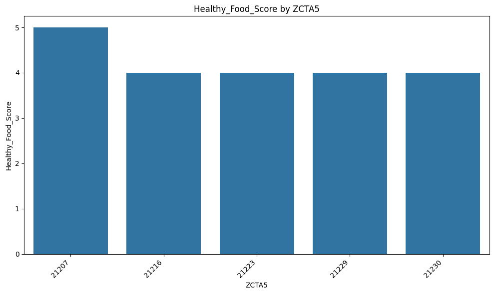
    


    
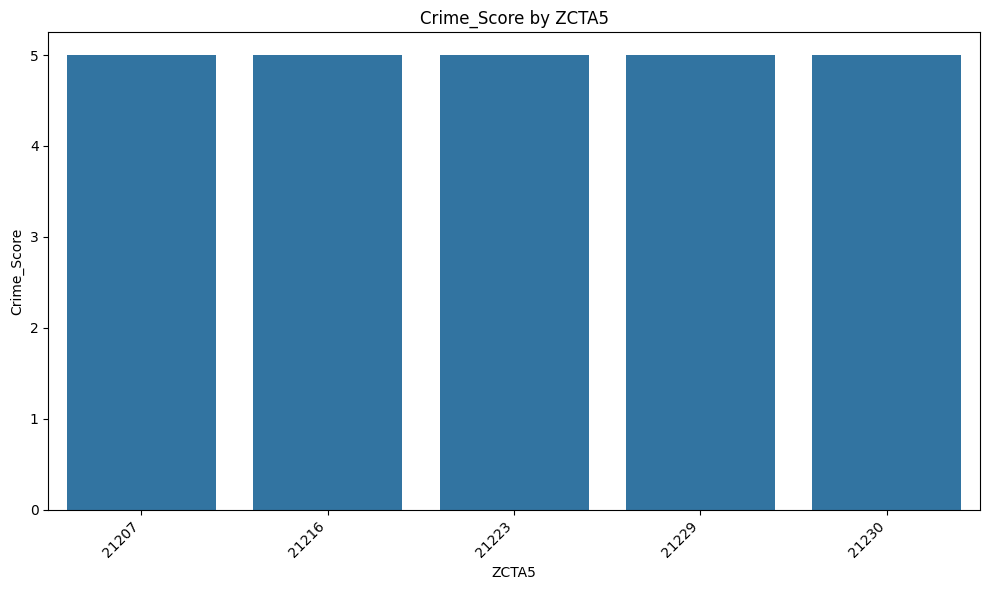
    


    
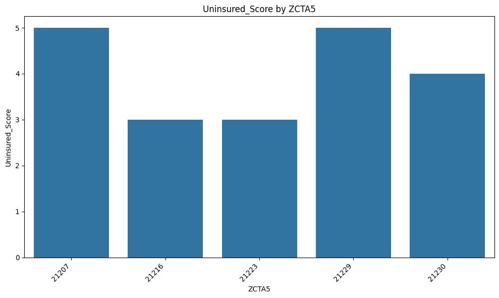
    


    
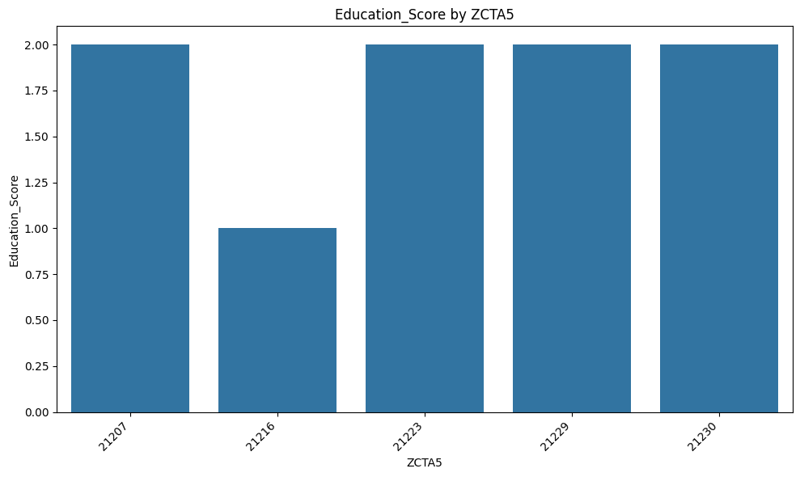
    


    
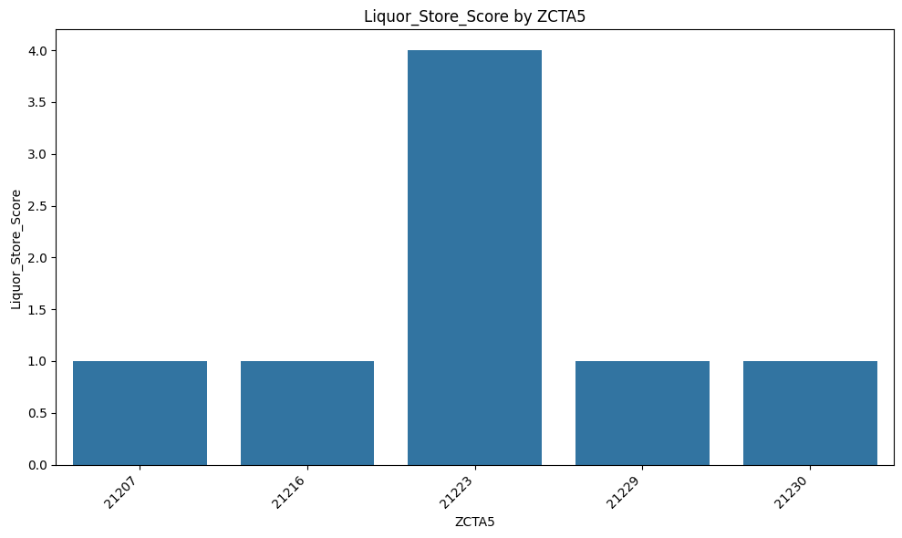
    


    
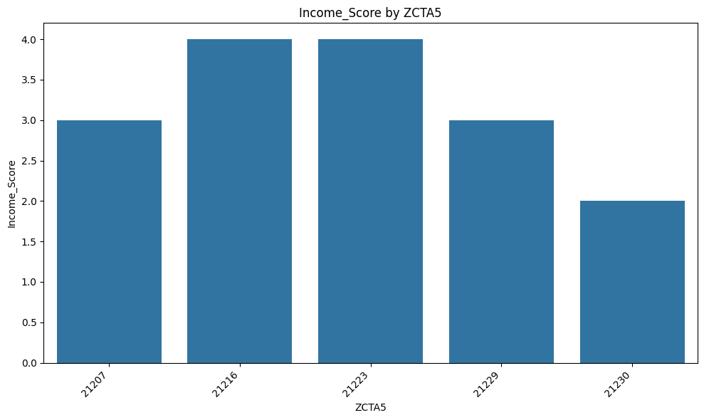
    


```python
cols_to_use = ["Composite_Score_Weighted", "Healthy_Food_Score", "Crime_Score",
               "Uninsured_Score", "Education_Score", "Liquor_Store_Score", "Income_Score"]

def heatmap_plot(data, title, cols):  # Pass columns to use
    plt.figure(figsize=(10, 8))
    corr_matrix = data[cols].corr()  # Calculate correlation only on selected columns
    sns.heatmap(corr_matrix, annot=True, cmap='coolwarm')
    plt.title(title)
    plt.tight_layout()
    plt.show()


heatmap_plot(final_SW_Health_score_index, "Correlation Matrix of Health Scoring Index Features", cols_to_use)
```


    

    


### Logistic Regression Model


```python
from sklearn.linear_model import LogisticRegression
from sklearn.preprocessing import StandardScaler
from sklearn.model_selection import train_test_split
```


```python
import pandas as pd
from sklearn.linear_model import LogisticRegression
from sklearn.model_selection import train_test_split
from sklearn.preprocessing import StandardScaler
from sklearn.metrics import classification_report

# final_SW_Health_score_index is DataFrame

# Add Risk_Label
final_SW_Health_score_index["Risk_Label"] = final_SW_Health_score_index["Composite_Score_Weighted"].apply(
    lambda x: 0 if x <= 3.4 else 1
)

# Features and target
X = final_SW_Health_score_index[["Healthy_Food_Score", "Crime_Score", "Uninsured_Score",
                                    "Education_Score", "Liquor_Store_Score", "Income_Score"]]
y = final_SW_Health_score_index["Risk_Label"]

#check the unique values and counts in the target variable BEFORE splitting
print("Unique values in 'Risk_Label' before split:")
print(y.unique())
print("\Value counts in 'Risk_Label' before split:")
print(y.value_counts())

# Train-test split
X_train, X_test, y_train, y_test = train_test_split(X, y, test_size=0.3, random_state=42)

# check the unique values and counts in the training target variable AFTER splitting
print("\nUnique values in y_train:")
print(pd.Series(y_train).unique())
print("\nValue counts in y_train:")
print(pd.Series(y_train).value_counts())

# Scale features
scaler = StandardScaler()
X_train_scaled = scaler.fit_transform(X_train)
X_test_scaled = scaler.transform(X_test)

import warnings
warnings.filterwarnings('ignore')
```

    Unique values in 'Risk_Label' before split:
    [1 0]
    \Value counts in 'Risk_Label' before split:
    Risk_Label
    0    12
    1     8
    Name: count, dtype: int64
    
    Unique values in y_train:
    [1 0]
    
    Value counts in y_train:
    Risk_Label
    0    9
    1    5
    Name: count, dtype: int64


```python
final_SW_Health_score_index_with_risk = pd.DataFrame(final_SW_Health_score_index)
final_SW_Health_score_index_with_risk["Risk_Label"] = final_SW_Health_score_index_with_risk["Composite_Score_Weighted"].apply(
    lambda x: 0 if x <= 3.4 else 1
)

# Verify results
final_SW_Health_score_index_with_risk.head()
```


<div>
<style scoped>
    .dataframe tbody tr th:only-of-type {
        vertical-align: middle;
    }

    .dataframe tbody tr th {
        vertical-align: top;
    }

    .dataframe thead th {
        text-align: right;
    }
</style>
<table border="1" class="dataframe">
  <thead>
    <tr style="text-align: right;">
      <th></th>
      <th>ZCTA5</th>
      <th>Healthy_Food_Score</th>
      <th>Crime_Score</th>
      <th>Uninsured_Score</th>
      <th>Education_Score</th>
      <th>Liquor_Store_Score</th>
      <th>Income_Score</th>
      <th>Composite_Score_Avg</th>
      <th>Composite_Score_Weighted</th>
      <th>Risk_Label</th>
    </tr>
  </thead>
  <tbody>
    <tr>
      <th>0</th>
      <td>21207</td>
      <td>5</td>
      <td>5</td>
      <td>5</td>
      <td>2</td>
      <td>1</td>
      <td>3</td>
      <td>3.5</td>
      <td>3.5</td>
      <td>1</td>
    </tr>
    <tr>
      <th>1</th>
      <td>21207</td>
      <td>5</td>
      <td>5</td>
      <td>5</td>
      <td>2</td>
      <td>1</td>
      <td>3</td>
      <td>3.5</td>
      <td>3.5</td>
      <td>1</td>
    </tr>
    <tr>
      <th>2</th>
      <td>21207</td>
      <td>5</td>
      <td>5</td>
      <td>5</td>
      <td>2</td>
      <td>1</td>
      <td>3</td>
      <td>3.5</td>
      <td>3.5</td>
      <td>1</td>
    </tr>
    <tr>
      <th>3</th>
      <td>21207</td>
      <td>5</td>
      <td>5</td>
      <td>5</td>
      <td>2</td>
      <td>1</td>
      <td>3</td>
      <td>3.5</td>
      <td>3.5</td>
      <td>1</td>
    </tr>
    <tr>
      <th>4</th>
      <td>21216</td>
      <td>4</td>
      <td>5</td>
      <td>3</td>
      <td>1</td>
      <td>1</td>
      <td>4</td>
      <td>3.0</td>
      <td>3.0</td>
      <td>0</td>
    </tr>
  </tbody>
</table>
</div>


## Model Development.

### Model Selection: 
Logistic Regression was selected for its interpretability and suitability for binary classification while K-Nearest Neighbors (KNN) was chosen due to its flexibility in capturing local patterns, especially for small datasets. 

### Justification for Model Choice: 
Logistic Regression helped understand the influence of health factors like liquor store density, education level, and uninsured population in predicting Health risk label as either high or low. 
KNN was effective with curated, low-dimensional data and performed strongly during initial evaluations. 


```python
log_model = LogisticRegression()
```


```python
log_model.fit(X_train_scaled,y_train)
```


<style>#sk-container-id-1 {
  /* Definition of color scheme common for light and dark mode */
  --sklearn-color-text: #000;
  --sklearn-color-text-muted: #666;
  --sklearn-color-line: gray;
  /* Definition of color scheme for unfitted estimators */
  --sklearn-color-unfitted-level-0: #fff5e6;
  --sklearn-color-unfitted-level-1: #f6e4d2;
  --sklearn-color-unfitted-level-2: #ffe0b3;
  --sklearn-color-unfitted-level-3: chocolate;
  /* Definition of color scheme for fitted estimators */
  --sklearn-color-fitted-level-0: #f0f8ff;
  --sklearn-color-fitted-level-1: #d4ebff;
  --sklearn-color-fitted-level-2: #b3dbfd;
  --sklearn-color-fitted-level-3: cornflowerblue;

  /* Specific color for light theme */
  --sklearn-color-text-on-default-background: var(--sg-text-color, var(--theme-code-foreground, var(--jp-content-font-color1, black)));
  --sklearn-color-background: var(--sg-background-color, var(--theme-background, var(--jp-layout-color0, white)));
  --sklearn-color-border-box: var(--sg-text-color, var(--theme-code-foreground, var(--jp-content-font-color1, black)));
  --sklearn-color-icon: #696969;

  @media (prefers-color-scheme: dark) {
    /* Redefinition of color scheme for dark theme */
    --sklearn-color-text-on-default-background: var(--sg-text-color, var(--theme-code-foreground, var(--jp-content-font-color1, white)));
    --sklearn-color-background: var(--sg-background-color, var(--theme-background, var(--jp-layout-color0, #111)));
    --sklearn-color-border-box: var(--sg-text-color, var(--theme-code-foreground, var(--jp-content-font-color1, white)));
    --sklearn-color-icon: #878787;
  }
}

#sk-container-id-1 {
  color: var(--sklearn-color-text);
}

#sk-container-id-1 pre {
  padding: 0;
}

#sk-container-id-1 input.sk-hidden--visually {
  border: 0;
  clip: rect(1px 1px 1px 1px);
  clip: rect(1px, 1px, 1px, 1px);
  height: 1px;
  margin: -1px;
  overflow: hidden;
  padding: 0;
  position: absolute;
  width: 1px;
}

#sk-container-id-1 div.sk-dashed-wrapped {
  border: 1px dashed var(--sklearn-color-line);
  margin: 0 0.4em 0.5em 0.4em;
  box-sizing: border-box;
  padding-bottom: 0.4em;
  background-color: var(--sklearn-color-background);
}

#sk-container-id-1 div.sk-container {
  /* jupyter's `normalize.less` sets `[hidden] { display: none; }`
     but bootstrap.min.css set `[hidden] { display: none !important; }`
     so we also need the `!important` here to be able to override the
     default hidden behavior on the sphinx rendered scikit-learn.org.
     See: https://github.com/scikit-learn/scikit-learn/issues/21755 */
  display: inline-block !important;
  position: relative;
}

#sk-container-id-1 div.sk-text-repr-fallback {
  display: none;
}

div.sk-parallel-item,
div.sk-serial,
div.sk-item {
  /* draw centered vertical line to link estimators */
  background-image: linear-gradient(var(--sklearn-color-text-on-default-background), var(--sklearn-color-text-on-default-background));
  background-size: 2px 100%;
  background-repeat: no-repeat;
  background-position: center center;
}

/* Parallel-specific style estimator block */

#sk-container-id-1 div.sk-parallel-item::after {
  content: "";
  width: 100%;
  border-bottom: 2px solid var(--sklearn-color-text-on-default-background);
  flex-grow: 1;
}

#sk-container-id-1 div.sk-parallel {
  display: flex;
  align-items: stretch;
  justify-content: center;
  background-color: var(--sklearn-color-background);
  position: relative;
}

#sk-container-id-1 div.sk-parallel-item {
  display: flex;
  flex-direction: column;
}

#sk-container-id-1 div.sk-parallel-item:first-child::after {
  align-self: flex-end;
  width: 50%;
}

#sk-container-id-1 div.sk-parallel-item:last-child::after {
  align-self: flex-start;
  width: 50%;
}

#sk-container-id-1 div.sk-parallel-item:only-child::after {
  width: 0;
}

/* Serial-specific style estimator block */

#sk-container-id-1 div.sk-serial {
  display: flex;
  flex-direction: column;
  align-items: center;
  background-color: var(--sklearn-color-background);
  padding-right: 1em;
  padding-left: 1em;
}


/* Toggleable style: style used for estimator/Pipeline/ColumnTransformer box that is
clickable and can be expanded/collapsed.
- Pipeline and ColumnTransformer use this feature and define the default style
- Estimators will overwrite some part of the style using the `sk-estimator` class
*/

/* Pipeline and ColumnTransformer style (default) */

#sk-container-id-1 div.sk-toggleable {
  /* Default theme specific background. It is overwritten whether we have a
  specific estimator or a Pipeline/ColumnTransformer */
  background-color: var(--sklearn-color-background);
}

/* Toggleable label */
#sk-container-id-1 label.sk-toggleable__label {
  cursor: pointer;
  display: flex;
  width: 100%;
  margin-bottom: 0;
  padding: 0.5em;
  box-sizing: border-box;
  text-align: center;
  align-items: start;
  justify-content: space-between;
  gap: 0.5em;
}

#sk-container-id-1 label.sk-toggleable__label .caption {
  font-size: 0.6rem;
  font-weight: lighter;
  color: var(--sklearn-color-text-muted);
}

#sk-container-id-1 label.sk-toggleable__label-arrow:before {
  /* Arrow on the left of the label */
  content: "▸";
  float: left;
  margin-right: 0.25em;
  color: var(--sklearn-color-icon);
}

#sk-container-id-1 label.sk-toggleable__label-arrow:hover:before {
  color: var(--sklearn-color-text);
}

/* Toggleable content - dropdown */

#sk-container-id-1 div.sk-toggleable__content {
  max-height: 0;
  max-width: 0;
  overflow: hidden;
  text-align: left;
  /* unfitted */
  background-color: var(--sklearn-color-unfitted-level-0);
}

#sk-container-id-1 div.sk-toggleable__content.fitted {
  /* fitted */
  background-color: var(--sklearn-color-fitted-level-0);
}

#sk-container-id-1 div.sk-toggleable__content pre {
  margin: 0.2em;
  border-radius: 0.25em;
  color: var(--sklearn-color-text);
  /* unfitted */
  background-color: var(--sklearn-color-unfitted-level-0);
}

#sk-container-id-1 div.sk-toggleable__content.fitted pre {
  /* unfitted */
  background-color: var(--sklearn-color-fitted-level-0);
}

#sk-container-id-1 input.sk-toggleable__control:checked~div.sk-toggleable__content {
  /* Expand drop-down */
  max-height: 200px;
  max-width: 100%;
  overflow: auto;
}

#sk-container-id-1 input.sk-toggleable__control:checked~label.sk-toggleable__label-arrow:before {
  content: "▾";
}

/* Pipeline/ColumnTransformer-specific style */

#sk-container-id-1 div.sk-label input.sk-toggleable__control:checked~label.sk-toggleable__label {
  color: var(--sklearn-color-text);
  background-color: var(--sklearn-color-unfitted-level-2);
}

#sk-container-id-1 div.sk-label.fitted input.sk-toggleable__control:checked~label.sk-toggleable__label {
  background-color: var(--sklearn-color-fitted-level-2);
}

/* Estimator-specific style */

/* Colorize estimator box */
#sk-container-id-1 div.sk-estimator input.sk-toggleable__control:checked~label.sk-toggleable__label {
  /* unfitted */
  background-color: var(--sklearn-color-unfitted-level-2);
}

#sk-container-id-1 div.sk-estimator.fitted input.sk-toggleable__control:checked~label.sk-toggleable__label {
  /* fitted */
  background-color: var(--sklearn-color-fitted-level-2);
}

#sk-container-id-1 div.sk-label label.sk-toggleable__label,
#sk-container-id-1 div.sk-label label {
  /* The background is the default theme color */
  color: var(--sklearn-color-text-on-default-background);
}

/* On hover, darken the color of the background */
#sk-container-id-1 div.sk-label:hover label.sk-toggleable__label {
  color: var(--sklearn-color-text);
  background-color: var(--sklearn-color-unfitted-level-2);
}

/* Label box, darken color on hover, fitted */
#sk-container-id-1 div.sk-label.fitted:hover label.sk-toggleable__label.fitted {
  color: var(--sklearn-color-text);
  background-color: var(--sklearn-color-fitted-level-2);
}

/* Estimator label */

#sk-container-id-1 div.sk-label label {
  font-family: monospace;
  font-weight: bold;
  display: inline-block;
  line-height: 1.2em;
}

#sk-container-id-1 div.sk-label-container {
  text-align: center;
}

/* Estimator-specific */
#sk-container-id-1 div.sk-estimator {
  font-family: monospace;
  border: 1px dotted var(--sklearn-color-border-box);
  border-radius: 0.25em;
  box-sizing: border-box;
  margin-bottom: 0.5em;
  /* unfitted */
  background-color: var(--sklearn-color-unfitted-level-0);
}

#sk-container-id-1 div.sk-estimator.fitted {
  /* fitted */
  background-color: var(--sklearn-color-fitted-level-0);
}

/* on hover */
#sk-container-id-1 div.sk-estimator:hover {
  /* unfitted */
  background-color: var(--sklearn-color-unfitted-level-2);
}

#sk-container-id-1 div.sk-estimator.fitted:hover {
  /* fitted */
  background-color: var(--sklearn-color-fitted-level-2);
}

/* Specification for estimator info (e.g. "i" and "?") */

/* Common style for "i" and "?" */

.sk-estimator-doc-link,
a:link.sk-estimator-doc-link,
a:visited.sk-estimator-doc-link {
  float: right;
  font-size: smaller;
  line-height: 1em;
  font-family: monospace;
  background-color: var(--sklearn-color-background);
  border-radius: 1em;
  height: 1em;
  width: 1em;
  text-decoration: none !important;
  margin-left: 0.5em;
  text-align: center;
  /* unfitted */
  border: var(--sklearn-color-unfitted-level-1) 1pt solid;
  color: var(--sklearn-color-unfitted-level-1);
}

.sk-estimator-doc-link.fitted,
a:link.sk-estimator-doc-link.fitted,
a:visited.sk-estimator-doc-link.fitted {
  /* fitted */
  border: var(--sklearn-color-fitted-level-1) 1pt solid;
  color: var(--sklearn-color-fitted-level-1);
}

/* On hover */
div.sk-estimator:hover .sk-estimator-doc-link:hover,
.sk-estimator-doc-link:hover,
div.sk-label-container:hover .sk-estimator-doc-link:hover,
.sk-estimator-doc-link:hover {
  /* unfitted */
  background-color: var(--sklearn-color-unfitted-level-3);
  color: var(--sklearn-color-background);
  text-decoration: none;
}

div.sk-estimator.fitted:hover .sk-estimator-doc-link.fitted:hover,
.sk-estimator-doc-link.fitted:hover,
div.sk-label-container:hover .sk-estimator-doc-link.fitted:hover,
.sk-estimator-doc-link.fitted:hover {
  /* fitted */
  background-color: var(--sklearn-color-fitted-level-3);
  color: var(--sklearn-color-background);
  text-decoration: none;
}

/* Span, style for the box shown on hovering the info icon */
.sk-estimator-doc-link span {
  display: none;
  z-index: 9999;
  position: relative;
  font-weight: normal;
  right: .2ex;
  padding: .5ex;
  margin: .5ex;
  width: min-content;
  min-width: 20ex;
  max-width: 50ex;
  color: var(--sklearn-color-text);
  box-shadow: 2pt 2pt 4pt #999;
  /* unfitted */
  background: var(--sklearn-color-unfitted-level-0);
  border: .5pt solid var(--sklearn-color-unfitted-level-3);
}

.sk-estimator-doc-link.fitted span {
  /* fitted */
  background: var(--sklearn-color-fitted-level-0);
  border: var(--sklearn-color-fitted-level-3);
}

.sk-estimator-doc-link:hover span {
  display: block;
}

/* "?"-specific style due to the `<a>` HTML tag */

#sk-container-id-1 a.estimator_doc_link {
  float: right;
  font-size: 1rem;
  line-height: 1em;
  font-family: monospace;
  background-color: var(--sklearn-color-background);
  border-radius: 1rem;
  height: 1rem;
  width: 1rem;
  text-decoration: none;
  /* unfitted */
  color: var(--sklearn-color-unfitted-level-1);
  border: var(--sklearn-color-unfitted-level-1) 1pt solid;
}

#sk-container-id-1 a.estimator_doc_link.fitted {
  /* fitted */
  border: var(--sklearn-color-fitted-level-1) 1pt solid;
  color: var(--sklearn-color-fitted-level-1);
}

/* On hover */
#sk-container-id-1 a.estimator_doc_link:hover {
  /* unfitted */
  background-color: var(--sklearn-color-unfitted-level-3);
  color: var(--sklearn-color-background);
  text-decoration: none;
}

#sk-container-id-1 a.estimator_doc_link.fitted:hover {
  /* fitted */
  background-color: var(--sklearn-color-fitted-level-3);
}
</style><div id="sk-container-id-1" class="sk-top-container"><div class="sk-text-repr-fallback"><pre>LogisticRegression()</pre><b>In a Jupyter environment, please rerun this cell to show the HTML representation or trust the notebook. <br />On GitHub, the HTML representation is unable to render, please try loading this page with nbviewer.org.</b></div><div class="sk-container" hidden><div class="sk-item"><div class="sk-estimator fitted sk-toggleable"><input class="sk-toggleable__control sk-hidden--visually" id="sk-estimator-id-1" type="checkbox" checked><label for="sk-estimator-id-1" class="sk-toggleable__label fitted sk-toggleable__label-arrow"><div><div>LogisticRegression</div></div><div><a class="sk-estimator-doc-link fitted" rel="noreferrer" target="_blank" href="https://scikit-learn.org/1.6/modules/generated/sklearn.linear_model.LogisticRegression.html">?<span>Documentation for LogisticRegression</span></a><span class="sk-estimator-doc-link fitted">i<span>Fitted</span></span></div></label><div class="sk-toggleable__content fitted"><pre>LogisticRegression()</pre></div> </div></div></div></div>


```python
log_model.coef_
```


    array([[ 1.16581266,  0.        , -0.16941651,  0.61674653,  1.08044782,
             0.54505922]])


```python
from sklearn.metrics import accuracy_score,confusion_matrix,classification_report,ConfusionMatrixDisplay
```


```python
y_pred = log_model.predict(X_test_scaled)
```


```python
accuracy_score(y_test,y_pred)
```


    1.0


```python
confusion_matrix(y_test,y_pred)
```


    array([[3, 0],
           [0, 3]])


```python
ConfusionMatrixDisplay.from_estimator(log_model,X_test_scaled,y_test)
```


    <sklearn.metrics._plot.confusion_matrix.ConfusionMatrixDisplay at 0x3bac2bad0>


    
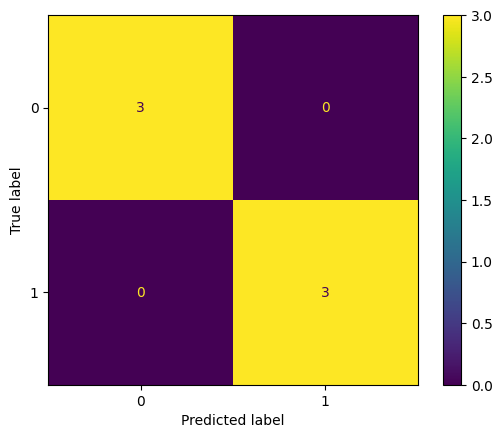
    


```python
# Scaled so highest value=1
ConfusionMatrixDisplay.from_estimator(log_model,X_test_scaled,y_test,normalize='true')
```


    <sklearn.metrics._plot.confusion_matrix.ConfusionMatrixDisplay at 0x3bac2baa0>


    

    


```python
X_train.iloc[1]
```


    Healthy_Food_Score    5
    Crime_Score           5
    Uninsured_Score       5
    Education_Score       2
    Liquor_Store_Score    1
    Income_Score          3
    Name: 3, dtype: int64


```python
y_train.iloc[1]
```


    1


```python
log_model.predict_proba(X_train.iloc[1].values.reshape(1, -1))
```


    array([[3.23597552e-04, 9.99676402e-01]])


```python
log_model.predict(X_train.iloc[1].values.reshape(1, -1))
```


    array([1])


```python
print(classification_report(y_test,y_pred))
```

                  precision    recall  f1-score   support
    
               0       1.00      1.00      1.00         3
               1       1.00      1.00      1.00         3
    
        accuracy                           1.00         6
       macro avg       1.00      1.00      1.00         6
    weighted avg       1.00      1.00      1.00         6
    


```python
from sklearn.metrics import precision_recall_curve,PrecisionRecallDisplay, RocCurveDisplay
```


```python
PrecisionRecallDisplay.from_estimator(log_model,X_test_scaled,y_test)
```


    <sklearn.metrics._plot.precision_recall_curve.PrecisionRecallDisplay at 0x3b8c97d40>


    
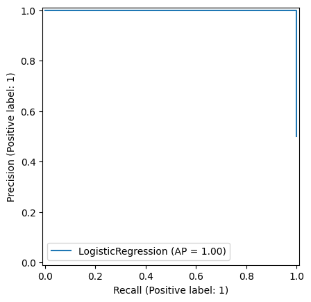
    


### Model Training. 

The dataset was split into training (70%) and test (30%) sets using “train_test_split” with a fixed random state. Furthermore, the training procedure was done with features normalized scores from Healthy Food Index, Crime Rate, Uninsured Rate, Education Level, Liquor Store Density, and Median Income while the target was the binary outcome “Risk_Label” generated by thresholding “Composite_Score_Weighted” at 3.4. 
Our scaling was applied using “StandardScaler “to optimize model performance. 
#### Note on Dataset Size: 
The dataset was relatively small, consisting of data from a limited number of ZIP Code Tabulation Areas (ZCTAs). This imposes constraints on the statistical power of the models, increasing the risk of overfitting and limiting generalizability. As such, model results, particularly those from non-parametric models like KNN, should be interpreted with caution. 

### K Nearest Neighbour Model


```python
import numpy as np
import pandas as pd
import matplotlib.pyplot as plt
import seaborn as sns
```


```python
df = pd.DataFrame(final_SW_Health_score_index_with_risk)
```


```python
sns.scatterplot(x='ZCTA5',y='Composite_Score_Weighted',hue='Risk_Label',data=df,alpha=0.7)
```


    <Axes: xlabel='ZCTA5', ylabel='Composite_Score_Weighted'>


    
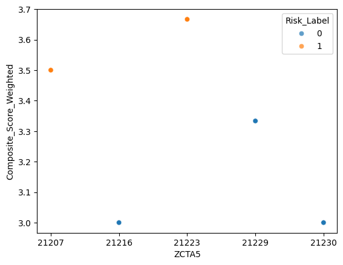
    


```python
sns.scatterplot(x='ZCTA5',y='Composite_Score_Weighted',hue='Risk_Label',data=df)
plt.xlim(2,6)
plt.ylim(3,10)
plt.legend(loc=(1.1,0.5))
```


    <matplotlib.legend.Legend at 0x16c15bef0>


    
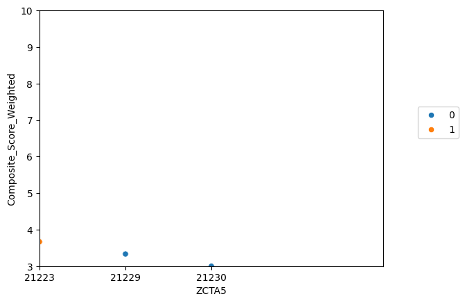
    


```python
from sklearn.model_selection import train_test_split
from sklearn.preprocessing import StandardScaler
```


```python
X = df.drop('Risk_Label',axis=1)
y = df['Risk_Label']
```


```python
X_train, X_test, y_train, y_test = train_test_split(X, y, test_size=0.3, random_state=42)
```


```python
scaler = StandardScaler()
```


```python
scaled_X_train = scaler.fit_transform(X_train)
scaled_X_test = scaler.transform(X_test)
```


```python
from sklearn.neighbors import KNeighborsClassifier
```


```python
knn_model = KNeighborsClassifier(n_neighbors=1)
```


```python
knn_model.fit(scaled_X_train,y_train)
```


<style>#sk-container-id-2 {
  /* Definition of color scheme common for light and dark mode */
  --sklearn-color-text: #000;
  --sklearn-color-text-muted: #666;
  --sklearn-color-line: gray;
  /* Definition of color scheme for unfitted estimators */
  --sklearn-color-unfitted-level-0: #fff5e6;
  --sklearn-color-unfitted-level-1: #f6e4d2;
  --sklearn-color-unfitted-level-2: #ffe0b3;
  --sklearn-color-unfitted-level-3: chocolate;
  /* Definition of color scheme for fitted estimators */
  --sklearn-color-fitted-level-0: #f0f8ff;
  --sklearn-color-fitted-level-1: #d4ebff;
  --sklearn-color-fitted-level-2: #b3dbfd;
  --sklearn-color-fitted-level-3: cornflowerblue;

  /* Specific color for light theme */
  --sklearn-color-text-on-default-background: var(--sg-text-color, var(--theme-code-foreground, var(--jp-content-font-color1, black)));
  --sklearn-color-background: var(--sg-background-color, var(--theme-background, var(--jp-layout-color0, white)));
  --sklearn-color-border-box: var(--sg-text-color, var(--theme-code-foreground, var(--jp-content-font-color1, black)));
  --sklearn-color-icon: #696969;

  @media (prefers-color-scheme: dark) {
    /* Redefinition of color scheme for dark theme */
    --sklearn-color-text-on-default-background: var(--sg-text-color, var(--theme-code-foreground, var(--jp-content-font-color1, white)));
    --sklearn-color-background: var(--sg-background-color, var(--theme-background, var(--jp-layout-color0, #111)));
    --sklearn-color-border-box: var(--sg-text-color, var(--theme-code-foreground, var(--jp-content-font-color1, white)));
    --sklearn-color-icon: #878787;
  }
}

#sk-container-id-2 {
  color: var(--sklearn-color-text);
}

#sk-container-id-2 pre {
  padding: 0;
}

#sk-container-id-2 input.sk-hidden--visually {
  border: 0;
  clip: rect(1px 1px 1px 1px);
  clip: rect(1px, 1px, 1px, 1px);
  height: 1px;
  margin: -1px;
  overflow: hidden;
  padding: 0;
  position: absolute;
  width: 1px;
}

#sk-container-id-2 div.sk-dashed-wrapped {
  border: 1px dashed var(--sklearn-color-line);
  margin: 0 0.4em 0.5em 0.4em;
  box-sizing: border-box;
  padding-bottom: 0.4em;
  background-color: var(--sklearn-color-background);
}

#sk-container-id-2 div.sk-container {
  /* jupyter's `normalize.less` sets `[hidden] { display: none; }`
     but bootstrap.min.css set `[hidden] { display: none !important; }`
     so we also need the `!important` here to be able to override the
     default hidden behavior on the sphinx rendered scikit-learn.org.
     See: https://github.com/scikit-learn/scikit-learn/issues/21755 */
  display: inline-block !important;
  position: relative;
}

#sk-container-id-2 div.sk-text-repr-fallback {
  display: none;
}

div.sk-parallel-item,
div.sk-serial,
div.sk-item {
  /* draw centered vertical line to link estimators */
  background-image: linear-gradient(var(--sklearn-color-text-on-default-background), var(--sklearn-color-text-on-default-background));
  background-size: 2px 100%;
  background-repeat: no-repeat;
  background-position: center center;
}

/* Parallel-specific style estimator block */

#sk-container-id-2 div.sk-parallel-item::after {
  content: "";
  width: 100%;
  border-bottom: 2px solid var(--sklearn-color-text-on-default-background);
  flex-grow: 1;
}

#sk-container-id-2 div.sk-parallel {
  display: flex;
  align-items: stretch;
  justify-content: center;
  background-color: var(--sklearn-color-background);
  position: relative;
}

#sk-container-id-2 div.sk-parallel-item {
  display: flex;
  flex-direction: column;
}

#sk-container-id-2 div.sk-parallel-item:first-child::after {
  align-self: flex-end;
  width: 50%;
}

#sk-container-id-2 div.sk-parallel-item:last-child::after {
  align-self: flex-start;
  width: 50%;
}

#sk-container-id-2 div.sk-parallel-item:only-child::after {
  width: 0;
}

/* Serial-specific style estimator block */

#sk-container-id-2 div.sk-serial {
  display: flex;
  flex-direction: column;
  align-items: center;
  background-color: var(--sklearn-color-background);
  padding-right: 1em;
  padding-left: 1em;
}


/* Toggleable style: style used for estimator/Pipeline/ColumnTransformer box that is
clickable and can be expanded/collapsed.
- Pipeline and ColumnTransformer use this feature and define the default style
- Estimators will overwrite some part of the style using the `sk-estimator` class
*/

/* Pipeline and ColumnTransformer style (default) */

#sk-container-id-2 div.sk-toggleable {
  /* Default theme specific background. It is overwritten whether we have a
  specific estimator or a Pipeline/ColumnTransformer */
  background-color: var(--sklearn-color-background);
}

/* Toggleable label */
#sk-container-id-2 label.sk-toggleable__label {
  cursor: pointer;
  display: flex;
  width: 100%;
  margin-bottom: 0;
  padding: 0.5em;
  box-sizing: border-box;
  text-align: center;
  align-items: start;
  justify-content: space-between;
  gap: 0.5em;
}

#sk-container-id-2 label.sk-toggleable__label .caption {
  font-size: 0.6rem;
  font-weight: lighter;
  color: var(--sklearn-color-text-muted);
}

#sk-container-id-2 label.sk-toggleable__label-arrow:before {
  /* Arrow on the left of the label */
  content: "▸";
  float: left;
  margin-right: 0.25em;
  color: var(--sklearn-color-icon);
}

#sk-container-id-2 label.sk-toggleable__label-arrow:hover:before {
  color: var(--sklearn-color-text);
}

/* Toggleable content - dropdown */

#sk-container-id-2 div.sk-toggleable__content {
  max-height: 0;
  max-width: 0;
  overflow: hidden;
  text-align: left;
  /* unfitted */
  background-color: var(--sklearn-color-unfitted-level-0);
}

#sk-container-id-2 div.sk-toggleable__content.fitted {
  /* fitted */
  background-color: var(--sklearn-color-fitted-level-0);
}

#sk-container-id-2 div.sk-toggleable__content pre {
  margin: 0.2em;
  border-radius: 0.25em;
  color: var(--sklearn-color-text);
  /* unfitted */
  background-color: var(--sklearn-color-unfitted-level-0);
}

#sk-container-id-2 div.sk-toggleable__content.fitted pre {
  /* unfitted */
  background-color: var(--sklearn-color-fitted-level-0);
}

#sk-container-id-2 input.sk-toggleable__control:checked~div.sk-toggleable__content {
  /* Expand drop-down */
  max-height: 200px;
  max-width: 100%;
  overflow: auto;
}

#sk-container-id-2 input.sk-toggleable__control:checked~label.sk-toggleable__label-arrow:before {
  content: "▾";
}

/* Pipeline/ColumnTransformer-specific style */

#sk-container-id-2 div.sk-label input.sk-toggleable__control:checked~label.sk-toggleable__label {
  color: var(--sklearn-color-text);
  background-color: var(--sklearn-color-unfitted-level-2);
}

#sk-container-id-2 div.sk-label.fitted input.sk-toggleable__control:checked~label.sk-toggleable__label {
  background-color: var(--sklearn-color-fitted-level-2);
}

/* Estimator-specific style */

/* Colorize estimator box */
#sk-container-id-2 div.sk-estimator input.sk-toggleable__control:checked~label.sk-toggleable__label {
  /* unfitted */
  background-color: var(--sklearn-color-unfitted-level-2);
}

#sk-container-id-2 div.sk-estimator.fitted input.sk-toggleable__control:checked~label.sk-toggleable__label {
  /* fitted */
  background-color: var(--sklearn-color-fitted-level-2);
}

#sk-container-id-2 div.sk-label label.sk-toggleable__label,
#sk-container-id-2 div.sk-label label {
  /* The background is the default theme color */
  color: var(--sklearn-color-text-on-default-background);
}

/* On hover, darken the color of the background */
#sk-container-id-2 div.sk-label:hover label.sk-toggleable__label {
  color: var(--sklearn-color-text);
  background-color: var(--sklearn-color-unfitted-level-2);
}

/* Label box, darken color on hover, fitted */
#sk-container-id-2 div.sk-label.fitted:hover label.sk-toggleable__label.fitted {
  color: var(--sklearn-color-text);
  background-color: var(--sklearn-color-fitted-level-2);
}

/* Estimator label */

#sk-container-id-2 div.sk-label label {
  font-family: monospace;
  font-weight: bold;
  display: inline-block;
  line-height: 1.2em;
}

#sk-container-id-2 div.sk-label-container {
  text-align: center;
}

/* Estimator-specific */
#sk-container-id-2 div.sk-estimator {
  font-family: monospace;
  border: 1px dotted var(--sklearn-color-border-box);
  border-radius: 0.25em;
  box-sizing: border-box;
  margin-bottom: 0.5em;
  /* unfitted */
  background-color: var(--sklearn-color-unfitted-level-0);
}

#sk-container-id-2 div.sk-estimator.fitted {
  /* fitted */
  background-color: var(--sklearn-color-fitted-level-0);
}

/* on hover */
#sk-container-id-2 div.sk-estimator:hover {
  /* unfitted */
  background-color: var(--sklearn-color-unfitted-level-2);
}

#sk-container-id-2 div.sk-estimator.fitted:hover {
  /* fitted */
  background-color: var(--sklearn-color-fitted-level-2);
}

/* Specification for estimator info (e.g. "i" and "?") */

/* Common style for "i" and "?" */

.sk-estimator-doc-link,
a:link.sk-estimator-doc-link,
a:visited.sk-estimator-doc-link {
  float: right;
  font-size: smaller;
  line-height: 1em;
  font-family: monospace;
  background-color: var(--sklearn-color-background);
  border-radius: 1em;
  height: 1em;
  width: 1em;
  text-decoration: none !important;
  margin-left: 0.5em;
  text-align: center;
  /* unfitted */
  border: var(--sklearn-color-unfitted-level-1) 1pt solid;
  color: var(--sklearn-color-unfitted-level-1);
}

.sk-estimator-doc-link.fitted,
a:link.sk-estimator-doc-link.fitted,
a:visited.sk-estimator-doc-link.fitted {
  /* fitted */
  border: var(--sklearn-color-fitted-level-1) 1pt solid;
  color: var(--sklearn-color-fitted-level-1);
}

/* On hover */
div.sk-estimator:hover .sk-estimator-doc-link:hover,
.sk-estimator-doc-link:hover,
div.sk-label-container:hover .sk-estimator-doc-link:hover,
.sk-estimator-doc-link:hover {
  /* unfitted */
  background-color: var(--sklearn-color-unfitted-level-3);
  color: var(--sklearn-color-background);
  text-decoration: none;
}

div.sk-estimator.fitted:hover .sk-estimator-doc-link.fitted:hover,
.sk-estimator-doc-link.fitted:hover,
div.sk-label-container:hover .sk-estimator-doc-link.fitted:hover,
.sk-estimator-doc-link.fitted:hover {
  /* fitted */
  background-color: var(--sklearn-color-fitted-level-3);
  color: var(--sklearn-color-background);
  text-decoration: none;
}

/* Span, style for the box shown on hovering the info icon */
.sk-estimator-doc-link span {
  display: none;
  z-index: 9999;
  position: relative;
  font-weight: normal;
  right: .2ex;
  padding: .5ex;
  margin: .5ex;
  width: min-content;
  min-width: 20ex;
  max-width: 50ex;
  color: var(--sklearn-color-text);
  box-shadow: 2pt 2pt 4pt #999;
  /* unfitted */
  background: var(--sklearn-color-unfitted-level-0);
  border: .5pt solid var(--sklearn-color-unfitted-level-3);
}

.sk-estimator-doc-link.fitted span {
  /* fitted */
  background: var(--sklearn-color-fitted-level-0);
  border: var(--sklearn-color-fitted-level-3);
}

.sk-estimator-doc-link:hover span {
  display: block;
}

/* "?"-specific style due to the `<a>` HTML tag */

#sk-container-id-2 a.estimator_doc_link {
  float: right;
  font-size: 1rem;
  line-height: 1em;
  font-family: monospace;
  background-color: var(--sklearn-color-background);
  border-radius: 1rem;
  height: 1rem;
  width: 1rem;
  text-decoration: none;
  /* unfitted */
  color: var(--sklearn-color-unfitted-level-1);
  border: var(--sklearn-color-unfitted-level-1) 1pt solid;
}

#sk-container-id-2 a.estimator_doc_link.fitted {
  /* fitted */
  border: var(--sklearn-color-fitted-level-1) 1pt solid;
  color: var(--sklearn-color-fitted-level-1);
}

/* On hover */
#sk-container-id-2 a.estimator_doc_link:hover {
  /* unfitted */
  background-color: var(--sklearn-color-unfitted-level-3);
  color: var(--sklearn-color-background);
  text-decoration: none;
}

#sk-container-id-2 a.estimator_doc_link.fitted:hover {
  /* fitted */
  background-color: var(--sklearn-color-fitted-level-3);
}
</style><div id="sk-container-id-2" class="sk-top-container"><div class="sk-text-repr-fallback"><pre>KNeighborsClassifier(n_neighbors=1)</pre><b>In a Jupyter environment, please rerun this cell to show the HTML representation or trust the notebook. <br />On GitHub, the HTML representation is unable to render, please try loading this page with nbviewer.org.</b></div><div class="sk-container" hidden><div class="sk-item"><div class="sk-estimator fitted sk-toggleable"><input class="sk-toggleable__control sk-hidden--visually" id="sk-estimator-id-2" type="checkbox" checked><label for="sk-estimator-id-2" class="sk-toggleable__label fitted sk-toggleable__label-arrow"><div><div>KNeighborsClassifier</div></div><div><a class="sk-estimator-doc-link fitted" rel="noreferrer" target="_blank" href="https://scikit-learn.org/1.6/modules/generated/sklearn.neighbors.KNeighborsClassifier.html">?<span>Documentation for KNeighborsClassifier</span></a><span class="sk-estimator-doc-link fitted">i<span>Fitted</span></span></div></label><div class="sk-toggleable__content fitted"><pre>KNeighborsClassifier(n_neighbors=1)</pre></div> </div></div></div></div>


```python
full_test = pd.concat([X_test,y_test],axis=1)
```


```python
len(full_test)
```


    6


```python
sns.scatterplot(x='ZCTA5',y='Composite_Score_Weighted',hue='Risk_Label',
                data=full_test,alpha=0.7)
```


    <Axes: xlabel='ZCTA5', ylabel='Composite_Score_Weighted'>


    
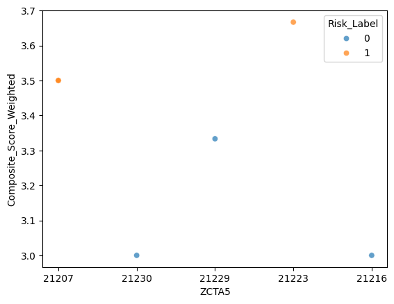
    


```python
y_pred = knn_model.predict(scaled_X_test)
```


```python
from sklearn.metrics import classification_report,confusion_matrix,accuracy_score
```


```python
accuracy_score(y_test,y_pred)
```


    1.0


```python
confusion_matrix(y_test,y_pred)
```


    array([[3, 0],
           [0, 3]])


```python
print(classification_report(y_test,y_pred))
```

                  precision    recall  f1-score   support
    
               0       1.00      1.00      1.00         3
               1       1.00      1.00      1.00         3
    
        accuracy                           1.00         6
       macro avg       1.00      1.00      1.00         6
    weighted avg       1.00      1.00      1.00         6
    


```python
test_error_rates = []


for k in range(1,6):
    knn_model = KNeighborsClassifier(n_neighbors=k)
    knn_model.fit(scaled_X_train,y_train) 
   
    y_pred_test = knn_model.predict(scaled_X_test)
    
    test_error = 1 - accuracy_score(y_test,y_pred_test)
    test_error_rates.append(test_error)
```


```python
plt.figure(figsize=(10,6),dpi=200)
plt.plot(range(1,6),test_error_rates,label='Test Error')
plt.legend()
plt.ylabel('Error Rate')
plt.xlabel("K Value")
```


    Text(0.5, 0, 'K Value')


    
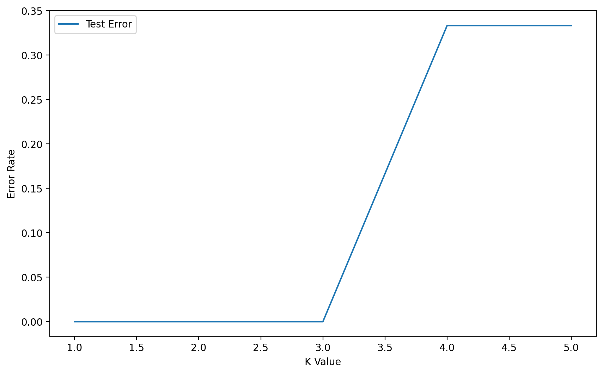
    


```python
scaler = StandardScaler()
```


```python
knn = KNeighborsClassifier()
```


```python
knn.get_params().keys()
```


    dict_keys(['algorithm', 'leaf_size', 'metric', 'metric_params', 'n_jobs', 'n_neighbors', 'p', 'weights'])


```python
# Highly recommend string code matches variable name!
operations = [('scaler',scaler),('knn',knn)]
```


```python
from sklearn.pipeline import Pipeline
```


```python
pipe = Pipeline(operations)
```


```python
from sklearn.model_selection import GridSearchCV
```


```python
k_values = list(range(1,6))
```


```python
k_values
```


    [1, 2, 3, 4, 5]


```python
param_grid = {'knn__n_neighbors': k_values}
```


```python
full_cv_classifier = GridSearchCV(pipe,param_grid,cv=5,scoring='accuracy')
```


```python
# Use full X and y if you DON'T want a hold-out test set
# Use X_train and y_train if you DO want a holdout test set (X_test,y_test)
full_cv_classifier.fit(X_train,y_train)
```


<style>#sk-container-id-3 {
  /* Definition of color scheme common for light and dark mode */
  --sklearn-color-text: #000;
  --sklearn-color-text-muted: #666;
  --sklearn-color-line: gray;
  /* Definition of color scheme for unfitted estimators */
  --sklearn-color-unfitted-level-0: #fff5e6;
  --sklearn-color-unfitted-level-1: #f6e4d2;
  --sklearn-color-unfitted-level-2: #ffe0b3;
  --sklearn-color-unfitted-level-3: chocolate;
  /* Definition of color scheme for fitted estimators */
  --sklearn-color-fitted-level-0: #f0f8ff;
  --sklearn-color-fitted-level-1: #d4ebff;
  --sklearn-color-fitted-level-2: #b3dbfd;
  --sklearn-color-fitted-level-3: cornflowerblue;

  /* Specific color for light theme */
  --sklearn-color-text-on-default-background: var(--sg-text-color, var(--theme-code-foreground, var(--jp-content-font-color1, black)));
  --sklearn-color-background: var(--sg-background-color, var(--theme-background, var(--jp-layout-color0, white)));
  --sklearn-color-border-box: var(--sg-text-color, var(--theme-code-foreground, var(--jp-content-font-color1, black)));
  --sklearn-color-icon: #696969;

  @media (prefers-color-scheme: dark) {
    /* Redefinition of color scheme for dark theme */
    --sklearn-color-text-on-default-background: var(--sg-text-color, var(--theme-code-foreground, var(--jp-content-font-color1, white)));
    --sklearn-color-background: var(--sg-background-color, var(--theme-background, var(--jp-layout-color0, #111)));
    --sklearn-color-border-box: var(--sg-text-color, var(--theme-code-foreground, var(--jp-content-font-color1, white)));
    --sklearn-color-icon: #878787;
  }
}

#sk-container-id-3 {
  color: var(--sklearn-color-text);
}

#sk-container-id-3 pre {
  padding: 0;
}

#sk-container-id-3 input.sk-hidden--visually {
  border: 0;
  clip: rect(1px 1px 1px 1px);
  clip: rect(1px, 1px, 1px, 1px);
  height: 1px;
  margin: -1px;
  overflow: hidden;
  padding: 0;
  position: absolute;
  width: 1px;
}

#sk-container-id-3 div.sk-dashed-wrapped {
  border: 1px dashed var(--sklearn-color-line);
  margin: 0 0.4em 0.5em 0.4em;
  box-sizing: border-box;
  padding-bottom: 0.4em;
  background-color: var(--sklearn-color-background);
}

#sk-container-id-3 div.sk-container {
  /* jupyter's `normalize.less` sets `[hidden] { display: none; }`
     but bootstrap.min.css set `[hidden] { display: none !important; }`
     so we also need the `!important` here to be able to override the
     default hidden behavior on the sphinx rendered scikit-learn.org.
     See: https://github.com/scikit-learn/scikit-learn/issues/21755 */
  display: inline-block !important;
  position: relative;
}

#sk-container-id-3 div.sk-text-repr-fallback {
  display: none;
}

div.sk-parallel-item,
div.sk-serial,
div.sk-item {
  /* draw centered vertical line to link estimators */
  background-image: linear-gradient(var(--sklearn-color-text-on-default-background), var(--sklearn-color-text-on-default-background));
  background-size: 2px 100%;
  background-repeat: no-repeat;
  background-position: center center;
}

/* Parallel-specific style estimator block */

#sk-container-id-3 div.sk-parallel-item::after {
  content: "";
  width: 100%;
  border-bottom: 2px solid var(--sklearn-color-text-on-default-background);
  flex-grow: 1;
}

#sk-container-id-3 div.sk-parallel {
  display: flex;
  align-items: stretch;
  justify-content: center;
  background-color: var(--sklearn-color-background);
  position: relative;
}

#sk-container-id-3 div.sk-parallel-item {
  display: flex;
  flex-direction: column;
}

#sk-container-id-3 div.sk-parallel-item:first-child::after {
  align-self: flex-end;
  width: 50%;
}

#sk-container-id-3 div.sk-parallel-item:last-child::after {
  align-self: flex-start;
  width: 50%;
}

#sk-container-id-3 div.sk-parallel-item:only-child::after {
  width: 0;
}

/* Serial-specific style estimator block */

#sk-container-id-3 div.sk-serial {
  display: flex;
  flex-direction: column;
  align-items: center;
  background-color: var(--sklearn-color-background);
  padding-right: 1em;
  padding-left: 1em;
}


/* Toggleable style: style used for estimator/Pipeline/ColumnTransformer box that is
clickable and can be expanded/collapsed.
- Pipeline and ColumnTransformer use this feature and define the default style
- Estimators will overwrite some part of the style using the `sk-estimator` class
*/

/* Pipeline and ColumnTransformer style (default) */

#sk-container-id-3 div.sk-toggleable {
  /* Default theme specific background. It is overwritten whether we have a
  specific estimator or a Pipeline/ColumnTransformer */
  background-color: var(--sklearn-color-background);
}

/* Toggleable label */
#sk-container-id-3 label.sk-toggleable__label {
  cursor: pointer;
  display: flex;
  width: 100%;
  margin-bottom: 0;
  padding: 0.5em;
  box-sizing: border-box;
  text-align: center;
  align-items: start;
  justify-content: space-between;
  gap: 0.5em;
}

#sk-container-id-3 label.sk-toggleable__label .caption {
  font-size: 0.6rem;
  font-weight: lighter;
  color: var(--sklearn-color-text-muted);
}

#sk-container-id-3 label.sk-toggleable__label-arrow:before {
  /* Arrow on the left of the label */
  content: "▸";
  float: left;
  margin-right: 0.25em;
  color: var(--sklearn-color-icon);
}

#sk-container-id-3 label.sk-toggleable__label-arrow:hover:before {
  color: var(--sklearn-color-text);
}

/* Toggleable content - dropdown */

#sk-container-id-3 div.sk-toggleable__content {
  max-height: 0;
  max-width: 0;
  overflow: hidden;
  text-align: left;
  /* unfitted */
  background-color: var(--sklearn-color-unfitted-level-0);
}

#sk-container-id-3 div.sk-toggleable__content.fitted {
  /* fitted */
  background-color: var(--sklearn-color-fitted-level-0);
}

#sk-container-id-3 div.sk-toggleable__content pre {
  margin: 0.2em;
  border-radius: 0.25em;
  color: var(--sklearn-color-text);
  /* unfitted */
  background-color: var(--sklearn-color-unfitted-level-0);
}

#sk-container-id-3 div.sk-toggleable__content.fitted pre {
  /* unfitted */
  background-color: var(--sklearn-color-fitted-level-0);
}

#sk-container-id-3 input.sk-toggleable__control:checked~div.sk-toggleable__content {
  /* Expand drop-down */
  max-height: 200px;
  max-width: 100%;
  overflow: auto;
}

#sk-container-id-3 input.sk-toggleable__control:checked~label.sk-toggleable__label-arrow:before {
  content: "▾";
}

/* Pipeline/ColumnTransformer-specific style */

#sk-container-id-3 div.sk-label input.sk-toggleable__control:checked~label.sk-toggleable__label {
  color: var(--sklearn-color-text);
  background-color: var(--sklearn-color-unfitted-level-2);
}

#sk-container-id-3 div.sk-label.fitted input.sk-toggleable__control:checked~label.sk-toggleable__label {
  background-color: var(--sklearn-color-fitted-level-2);
}

/* Estimator-specific style */

/* Colorize estimator box */
#sk-container-id-3 div.sk-estimator input.sk-toggleable__control:checked~label.sk-toggleable__label {
  /* unfitted */
  background-color: var(--sklearn-color-unfitted-level-2);
}

#sk-container-id-3 div.sk-estimator.fitted input.sk-toggleable__control:checked~label.sk-toggleable__label {
  /* fitted */
  background-color: var(--sklearn-color-fitted-level-2);
}

#sk-container-id-3 div.sk-label label.sk-toggleable__label,
#sk-container-id-3 div.sk-label label {
  /* The background is the default theme color */
  color: var(--sklearn-color-text-on-default-background);
}

/* On hover, darken the color of the background */
#sk-container-id-3 div.sk-label:hover label.sk-toggleable__label {
  color: var(--sklearn-color-text);
  background-color: var(--sklearn-color-unfitted-level-2);
}

/* Label box, darken color on hover, fitted */
#sk-container-id-3 div.sk-label.fitted:hover label.sk-toggleable__label.fitted {
  color: var(--sklearn-color-text);
  background-color: var(--sklearn-color-fitted-level-2);
}

/* Estimator label */

#sk-container-id-3 div.sk-label label {
  font-family: monospace;
  font-weight: bold;
  display: inline-block;
  line-height: 1.2em;
}

#sk-container-id-3 div.sk-label-container {
  text-align: center;
}

/* Estimator-specific */
#sk-container-id-3 div.sk-estimator {
  font-family: monospace;
  border: 1px dotted var(--sklearn-color-border-box);
  border-radius: 0.25em;
  box-sizing: border-box;
  margin-bottom: 0.5em;
  /* unfitted */
  background-color: var(--sklearn-color-unfitted-level-0);
}

#sk-container-id-3 div.sk-estimator.fitted {
  /* fitted */
  background-color: var(--sklearn-color-fitted-level-0);
}

/* on hover */
#sk-container-id-3 div.sk-estimator:hover {
  /* unfitted */
  background-color: var(--sklearn-color-unfitted-level-2);
}

#sk-container-id-3 div.sk-estimator.fitted:hover {
  /* fitted */
  background-color: var(--sklearn-color-fitted-level-2);
}

/* Specification for estimator info (e.g. "i" and "?") */

/* Common style for "i" and "?" */

.sk-estimator-doc-link,
a:link.sk-estimator-doc-link,
a:visited.sk-estimator-doc-link {
  float: right;
  font-size: smaller;
  line-height: 1em;
  font-family: monospace;
  background-color: var(--sklearn-color-background);
  border-radius: 1em;
  height: 1em;
  width: 1em;
  text-decoration: none !important;
  margin-left: 0.5em;
  text-align: center;
  /* unfitted */
  border: var(--sklearn-color-unfitted-level-1) 1pt solid;
  color: var(--sklearn-color-unfitted-level-1);
}

.sk-estimator-doc-link.fitted,
a:link.sk-estimator-doc-link.fitted,
a:visited.sk-estimator-doc-link.fitted {
  /* fitted */
  border: var(--sklearn-color-fitted-level-1) 1pt solid;
  color: var(--sklearn-color-fitted-level-1);
}

/* On hover */
div.sk-estimator:hover .sk-estimator-doc-link:hover,
.sk-estimator-doc-link:hover,
div.sk-label-container:hover .sk-estimator-doc-link:hover,
.sk-estimator-doc-link:hover {
  /* unfitted */
  background-color: var(--sklearn-color-unfitted-level-3);
  color: var(--sklearn-color-background);
  text-decoration: none;
}

div.sk-estimator.fitted:hover .sk-estimator-doc-link.fitted:hover,
.sk-estimator-doc-link.fitted:hover,
div.sk-label-container:hover .sk-estimator-doc-link.fitted:hover,
.sk-estimator-doc-link.fitted:hover {
  /* fitted */
  background-color: var(--sklearn-color-fitted-level-3);
  color: var(--sklearn-color-background);
  text-decoration: none;
}

/* Span, style for the box shown on hovering the info icon */
.sk-estimator-doc-link span {
  display: none;
  z-index: 9999;
  position: relative;
  font-weight: normal;
  right: .2ex;
  padding: .5ex;
  margin: .5ex;
  width: min-content;
  min-width: 20ex;
  max-width: 50ex;
  color: var(--sklearn-color-text);
  box-shadow: 2pt 2pt 4pt #999;
  /* unfitted */
  background: var(--sklearn-color-unfitted-level-0);
  border: .5pt solid var(--sklearn-color-unfitted-level-3);
}

.sk-estimator-doc-link.fitted span {
  /* fitted */
  background: var(--sklearn-color-fitted-level-0);
  border: var(--sklearn-color-fitted-level-3);
}

.sk-estimator-doc-link:hover span {
  display: block;
}

/* "?"-specific style due to the `<a>` HTML tag */

#sk-container-id-3 a.estimator_doc_link {
  float: right;
  font-size: 1rem;
  line-height: 1em;
  font-family: monospace;
  background-color: var(--sklearn-color-background);
  border-radius: 1rem;
  height: 1rem;
  width: 1rem;
  text-decoration: none;
  /* unfitted */
  color: var(--sklearn-color-unfitted-level-1);
  border: var(--sklearn-color-unfitted-level-1) 1pt solid;
}

#sk-container-id-3 a.estimator_doc_link.fitted {
  /* fitted */
  border: var(--sklearn-color-fitted-level-1) 1pt solid;
  color: var(--sklearn-color-fitted-level-1);
}

/* On hover */
#sk-container-id-3 a.estimator_doc_link:hover {
  /* unfitted */
  background-color: var(--sklearn-color-unfitted-level-3);
  color: var(--sklearn-color-background);
  text-decoration: none;
}

#sk-container-id-3 a.estimator_doc_link.fitted:hover {
  /* fitted */
  background-color: var(--sklearn-color-fitted-level-3);
}
</style><div id="sk-container-id-3" class="sk-top-container"><div class="sk-text-repr-fallback"><pre>GridSearchCV(cv=5,
             estimator=Pipeline(steps=[(&#x27;scaler&#x27;, StandardScaler()),
                                       (&#x27;knn&#x27;, KNeighborsClassifier())]),
             param_grid={&#x27;knn__n_neighbors&#x27;: [1, 2, 3, 4, 5]},
             scoring=&#x27;accuracy&#x27;)</pre><b>In a Jupyter environment, please rerun this cell to show the HTML representation or trust the notebook. <br />On GitHub, the HTML representation is unable to render, please try loading this page with nbviewer.org.</b></div><div class="sk-container" hidden><div class="sk-item sk-dashed-wrapped"><div class="sk-label-container"><div class="sk-label fitted sk-toggleable"><input class="sk-toggleable__control sk-hidden--visually" id="sk-estimator-id-3" type="checkbox" ><label for="sk-estimator-id-3" class="sk-toggleable__label fitted sk-toggleable__label-arrow"><div><div>GridSearchCV</div></div><div><a class="sk-estimator-doc-link fitted" rel="noreferrer" target="_blank" href="https://scikit-learn.org/1.6/modules/generated/sklearn.model_selection.GridSearchCV.html">?<span>Documentation for GridSearchCV</span></a><span class="sk-estimator-doc-link fitted">i<span>Fitted</span></span></div></label><div class="sk-toggleable__content fitted"><pre>GridSearchCV(cv=5,
             estimator=Pipeline(steps=[(&#x27;scaler&#x27;, StandardScaler()),
                                       (&#x27;knn&#x27;, KNeighborsClassifier())]),
             param_grid={&#x27;knn__n_neighbors&#x27;: [1, 2, 3, 4, 5]},
             scoring=&#x27;accuracy&#x27;)</pre></div> </div></div><div class="sk-parallel"><div class="sk-parallel-item"><div class="sk-item"><div class="sk-label-container"><div class="sk-label fitted sk-toggleable"><input class="sk-toggleable__control sk-hidden--visually" id="sk-estimator-id-4" type="checkbox" ><label for="sk-estimator-id-4" class="sk-toggleable__label fitted sk-toggleable__label-arrow"><div><div>best_estimator_: Pipeline</div></div></label><div class="sk-toggleable__content fitted"><pre>Pipeline(steps=[(&#x27;scaler&#x27;, StandardScaler()),
                (&#x27;knn&#x27;, KNeighborsClassifier(n_neighbors=1))])</pre></div> </div></div><div class="sk-serial"><div class="sk-item"><div class="sk-serial"><div class="sk-item"><div class="sk-estimator fitted sk-toggleable"><input class="sk-toggleable__control sk-hidden--visually" id="sk-estimator-id-5" type="checkbox" ><label for="sk-estimator-id-5" class="sk-toggleable__label fitted sk-toggleable__label-arrow"><div><div>StandardScaler</div></div><div><a class="sk-estimator-doc-link fitted" rel="noreferrer" target="_blank" href="https://scikit-learn.org/1.6/modules/generated/sklearn.preprocessing.StandardScaler.html">?<span>Documentation for StandardScaler</span></a></div></label><div class="sk-toggleable__content fitted"><pre>StandardScaler()</pre></div> </div></div><div class="sk-item"><div class="sk-estimator fitted sk-toggleable"><input class="sk-toggleable__control sk-hidden--visually" id="sk-estimator-id-6" type="checkbox" ><label for="sk-estimator-id-6" class="sk-toggleable__label fitted sk-toggleable__label-arrow"><div><div>KNeighborsClassifier</div></div><div><a class="sk-estimator-doc-link fitted" rel="noreferrer" target="_blank" href="https://scikit-learn.org/1.6/modules/generated/sklearn.neighbors.KNeighborsClassifier.html">?<span>Documentation for KNeighborsClassifier</span></a></div></label><div class="sk-toggleable__content fitted"><pre>KNeighborsClassifier(n_neighbors=1)</pre></div> </div></div></div></div></div></div></div></div></div></div></div>


```python
full_cv_classifier.best_estimator_.get_params()
```


    {'memory': None,
     'steps': [('scaler', StandardScaler()),
      ('knn', KNeighborsClassifier(n_neighbors=1))],
     'transform_input': None,
     'verbose': False,
     'scaler': StandardScaler(),
     'knn': KNeighborsClassifier(n_neighbors=1),
     'scaler__copy': True,
     'scaler__with_mean': True,
     'scaler__with_std': True,
     'knn__algorithm': 'auto',
     'knn__leaf_size': 30,
     'knn__metric': 'minkowski',
     'knn__metric_params': None,
     'knn__n_jobs': None,
     'knn__n_neighbors': 1,
     'knn__p': 2,
     'knn__weights': 'uniform'}


```python
full_cv_classifier.cv_results_.keys()
```


    dict_keys(['mean_fit_time', 'std_fit_time', 'mean_score_time', 'std_score_time', 'param_knn__n_neighbors', 'params', 'split0_test_score', 'split1_test_score', 'split2_test_score', 'split3_test_score', 'split4_test_score', 'mean_test_score', 'std_test_score', 'rank_test_score'])


```python
len(k_values)
```


    5


```python
full_cv_classifier.cv_results_['mean_test_score']
```


    array([1.        , 0.86666667, 0.86666667, 0.63333333, 0.83333333])


```python
len(full_cv_classifier.cv_results_['mean_test_score'])
```


    5


```python
scaler = StandardScaler()
knn14 = KNeighborsClassifier(n_neighbors=14)
operations = [('scaler',scaler),('knn14',knn14)]
```


```python
pipe = Pipeline(operations)
```


```python
pipe.fit(X_train,y_train)
```


<style>#sk-container-id-4 {
  /* Definition of color scheme common for light and dark mode */
  --sklearn-color-text: #000;
  --sklearn-color-text-muted: #666;
  --sklearn-color-line: gray;
  /* Definition of color scheme for unfitted estimators */
  --sklearn-color-unfitted-level-0: #fff5e6;
  --sklearn-color-unfitted-level-1: #f6e4d2;
  --sklearn-color-unfitted-level-2: #ffe0b3;
  --sklearn-color-unfitted-level-3: chocolate;
  /* Definition of color scheme for fitted estimators */
  --sklearn-color-fitted-level-0: #f0f8ff;
  --sklearn-color-fitted-level-1: #d4ebff;
  --sklearn-color-fitted-level-2: #b3dbfd;
  --sklearn-color-fitted-level-3: cornflowerblue;

  /* Specific color for light theme */
  --sklearn-color-text-on-default-background: var(--sg-text-color, var(--theme-code-foreground, var(--jp-content-font-color1, black)));
  --sklearn-color-background: var(--sg-background-color, var(--theme-background, var(--jp-layout-color0, white)));
  --sklearn-color-border-box: var(--sg-text-color, var(--theme-code-foreground, var(--jp-content-font-color1, black)));
  --sklearn-color-icon: #696969;

  @media (prefers-color-scheme: dark) {
    /* Redefinition of color scheme for dark theme */
    --sklearn-color-text-on-default-background: var(--sg-text-color, var(--theme-code-foreground, var(--jp-content-font-color1, white)));
    --sklearn-color-background: var(--sg-background-color, var(--theme-background, var(--jp-layout-color0, #111)));
    --sklearn-color-border-box: var(--sg-text-color, var(--theme-code-foreground, var(--jp-content-font-color1, white)));
    --sklearn-color-icon: #878787;
  }
}

#sk-container-id-4 {
  color: var(--sklearn-color-text);
}

#sk-container-id-4 pre {
  padding: 0;
}

#sk-container-id-4 input.sk-hidden--visually {
  border: 0;
  clip: rect(1px 1px 1px 1px);
  clip: rect(1px, 1px, 1px, 1px);
  height: 1px;
  margin: -1px;
  overflow: hidden;
  padding: 0;
  position: absolute;
  width: 1px;
}

#sk-container-id-4 div.sk-dashed-wrapped {
  border: 1px dashed var(--sklearn-color-line);
  margin: 0 0.4em 0.5em 0.4em;
  box-sizing: border-box;
  padding-bottom: 0.4em;
  background-color: var(--sklearn-color-background);
}

#sk-container-id-4 div.sk-container {
  /* jupyter's `normalize.less` sets `[hidden] { display: none; }`
     but bootstrap.min.css set `[hidden] { display: none !important; }`
     so we also need the `!important` here to be able to override the
     default hidden behavior on the sphinx rendered scikit-learn.org.
     See: https://github.com/scikit-learn/scikit-learn/issues/21755 */
  display: inline-block !important;
  position: relative;
}

#sk-container-id-4 div.sk-text-repr-fallback {
  display: none;
}

div.sk-parallel-item,
div.sk-serial,
div.sk-item {
  /* draw centered vertical line to link estimators */
  background-image: linear-gradient(var(--sklearn-color-text-on-default-background), var(--sklearn-color-text-on-default-background));
  background-size: 2px 100%;
  background-repeat: no-repeat;
  background-position: center center;
}

/* Parallel-specific style estimator block */

#sk-container-id-4 div.sk-parallel-item::after {
  content: "";
  width: 100%;
  border-bottom: 2px solid var(--sklearn-color-text-on-default-background);
  flex-grow: 1;
}

#sk-container-id-4 div.sk-parallel {
  display: flex;
  align-items: stretch;
  justify-content: center;
  background-color: var(--sklearn-color-background);
  position: relative;
}

#sk-container-id-4 div.sk-parallel-item {
  display: flex;
  flex-direction: column;
}

#sk-container-id-4 div.sk-parallel-item:first-child::after {
  align-self: flex-end;
  width: 50%;
}

#sk-container-id-4 div.sk-parallel-item:last-child::after {
  align-self: flex-start;
  width: 50%;
}

#sk-container-id-4 div.sk-parallel-item:only-child::after {
  width: 0;
}

/* Serial-specific style estimator block */

#sk-container-id-4 div.sk-serial {
  display: flex;
  flex-direction: column;
  align-items: center;
  background-color: var(--sklearn-color-background);
  padding-right: 1em;
  padding-left: 1em;
}


/* Toggleable style: style used for estimator/Pipeline/ColumnTransformer box that is
clickable and can be expanded/collapsed.
- Pipeline and ColumnTransformer use this feature and define the default style
- Estimators will overwrite some part of the style using the `sk-estimator` class
*/

/* Pipeline and ColumnTransformer style (default) */

#sk-container-id-4 div.sk-toggleable {
  /* Default theme specific background. It is overwritten whether we have a
  specific estimator or a Pipeline/ColumnTransformer */
  background-color: var(--sklearn-color-background);
}

/* Toggleable label */
#sk-container-id-4 label.sk-toggleable__label {
  cursor: pointer;
  display: flex;
  width: 100%;
  margin-bottom: 0;
  padding: 0.5em;
  box-sizing: border-box;
  text-align: center;
  align-items: start;
  justify-content: space-between;
  gap: 0.5em;
}

#sk-container-id-4 label.sk-toggleable__label .caption {
  font-size: 0.6rem;
  font-weight: lighter;
  color: var(--sklearn-color-text-muted);
}

#sk-container-id-4 label.sk-toggleable__label-arrow:before {
  /* Arrow on the left of the label */
  content: "▸";
  float: left;
  margin-right: 0.25em;
  color: var(--sklearn-color-icon);
}

#sk-container-id-4 label.sk-toggleable__label-arrow:hover:before {
  color: var(--sklearn-color-text);
}

/* Toggleable content - dropdown */

#sk-container-id-4 div.sk-toggleable__content {
  max-height: 0;
  max-width: 0;
  overflow: hidden;
  text-align: left;
  /* unfitted */
  background-color: var(--sklearn-color-unfitted-level-0);
}

#sk-container-id-4 div.sk-toggleable__content.fitted {
  /* fitted */
  background-color: var(--sklearn-color-fitted-level-0);
}

#sk-container-id-4 div.sk-toggleable__content pre {
  margin: 0.2em;
  border-radius: 0.25em;
  color: var(--sklearn-color-text);
  /* unfitted */
  background-color: var(--sklearn-color-unfitted-level-0);
}

#sk-container-id-4 div.sk-toggleable__content.fitted pre {
  /* unfitted */
  background-color: var(--sklearn-color-fitted-level-0);
}

#sk-container-id-4 input.sk-toggleable__control:checked~div.sk-toggleable__content {
  /* Expand drop-down */
  max-height: 200px;
  max-width: 100%;
  overflow: auto;
}

#sk-container-id-4 input.sk-toggleable__control:checked~label.sk-toggleable__label-arrow:before {
  content: "▾";
}

/* Pipeline/ColumnTransformer-specific style */

#sk-container-id-4 div.sk-label input.sk-toggleable__control:checked~label.sk-toggleable__label {
  color: var(--sklearn-color-text);
  background-color: var(--sklearn-color-unfitted-level-2);
}

#sk-container-id-4 div.sk-label.fitted input.sk-toggleable__control:checked~label.sk-toggleable__label {
  background-color: var(--sklearn-color-fitted-level-2);
}

/* Estimator-specific style */

/* Colorize estimator box */
#sk-container-id-4 div.sk-estimator input.sk-toggleable__control:checked~label.sk-toggleable__label {
  /* unfitted */
  background-color: var(--sklearn-color-unfitted-level-2);
}

#sk-container-id-4 div.sk-estimator.fitted input.sk-toggleable__control:checked~label.sk-toggleable__label {
  /* fitted */
  background-color: var(--sklearn-color-fitted-level-2);
}

#sk-container-id-4 div.sk-label label.sk-toggleable__label,
#sk-container-id-4 div.sk-label label {
  /* The background is the default theme color */
  color: var(--sklearn-color-text-on-default-background);
}

/* On hover, darken the color of the background */
#sk-container-id-4 div.sk-label:hover label.sk-toggleable__label {
  color: var(--sklearn-color-text);
  background-color: var(--sklearn-color-unfitted-level-2);
}

/* Label box, darken color on hover, fitted */
#sk-container-id-4 div.sk-label.fitted:hover label.sk-toggleable__label.fitted {
  color: var(--sklearn-color-text);
  background-color: var(--sklearn-color-fitted-level-2);
}

/* Estimator label */

#sk-container-id-4 div.sk-label label {
  font-family: monospace;
  font-weight: bold;
  display: inline-block;
  line-height: 1.2em;
}

#sk-container-id-4 div.sk-label-container {
  text-align: center;
}

/* Estimator-specific */
#sk-container-id-4 div.sk-estimator {
  font-family: monospace;
  border: 1px dotted var(--sklearn-color-border-box);
  border-radius: 0.25em;
  box-sizing: border-box;
  margin-bottom: 0.5em;
  /* unfitted */
  background-color: var(--sklearn-color-unfitted-level-0);
}

#sk-container-id-4 div.sk-estimator.fitted {
  /* fitted */
  background-color: var(--sklearn-color-fitted-level-0);
}

/* on hover */
#sk-container-id-4 div.sk-estimator:hover {
  /* unfitted */
  background-color: var(--sklearn-color-unfitted-level-2);
}

#sk-container-id-4 div.sk-estimator.fitted:hover {
  /* fitted */
  background-color: var(--sklearn-color-fitted-level-2);
}

/* Specification for estimator info (e.g. "i" and "?") */

/* Common style for "i" and "?" */

.sk-estimator-doc-link,
a:link.sk-estimator-doc-link,
a:visited.sk-estimator-doc-link {
  float: right;
  font-size: smaller;
  line-height: 1em;
  font-family: monospace;
  background-color: var(--sklearn-color-background);
  border-radius: 1em;
  height: 1em;
  width: 1em;
  text-decoration: none !important;
  margin-left: 0.5em;
  text-align: center;
  /* unfitted */
  border: var(--sklearn-color-unfitted-level-1) 1pt solid;
  color: var(--sklearn-color-unfitted-level-1);
}

.sk-estimator-doc-link.fitted,
a:link.sk-estimator-doc-link.fitted,
a:visited.sk-estimator-doc-link.fitted {
  /* fitted */
  border: var(--sklearn-color-fitted-level-1) 1pt solid;
  color: var(--sklearn-color-fitted-level-1);
}

/* On hover */
div.sk-estimator:hover .sk-estimator-doc-link:hover,
.sk-estimator-doc-link:hover,
div.sk-label-container:hover .sk-estimator-doc-link:hover,
.sk-estimator-doc-link:hover {
  /* unfitted */
  background-color: var(--sklearn-color-unfitted-level-3);
  color: var(--sklearn-color-background);
  text-decoration: none;
}

div.sk-estimator.fitted:hover .sk-estimator-doc-link.fitted:hover,
.sk-estimator-doc-link.fitted:hover,
div.sk-label-container:hover .sk-estimator-doc-link.fitted:hover,
.sk-estimator-doc-link.fitted:hover {
  /* fitted */
  background-color: var(--sklearn-color-fitted-level-3);
  color: var(--sklearn-color-background);
  text-decoration: none;
}

/* Span, style for the box shown on hovering the info icon */
.sk-estimator-doc-link span {
  display: none;
  z-index: 9999;
  position: relative;
  font-weight: normal;
  right: .2ex;
  padding: .5ex;
  margin: .5ex;
  width: min-content;
  min-width: 20ex;
  max-width: 50ex;
  color: var(--sklearn-color-text);
  box-shadow: 2pt 2pt 4pt #999;
  /* unfitted */
  background: var(--sklearn-color-unfitted-level-0);
  border: .5pt solid var(--sklearn-color-unfitted-level-3);
}

.sk-estimator-doc-link.fitted span {
  /* fitted */
  background: var(--sklearn-color-fitted-level-0);
  border: var(--sklearn-color-fitted-level-3);
}

.sk-estimator-doc-link:hover span {
  display: block;
}

/* "?"-specific style due to the `<a>` HTML tag */

#sk-container-id-4 a.estimator_doc_link {
  float: right;
  font-size: 1rem;
  line-height: 1em;
  font-family: monospace;
  background-color: var(--sklearn-color-background);
  border-radius: 1rem;
  height: 1rem;
  width: 1rem;
  text-decoration: none;
  /* unfitted */
  color: var(--sklearn-color-unfitted-level-1);
  border: var(--sklearn-color-unfitted-level-1) 1pt solid;
}

#sk-container-id-4 a.estimator_doc_link.fitted {
  /* fitted */
  border: var(--sklearn-color-fitted-level-1) 1pt solid;
  color: var(--sklearn-color-fitted-level-1);
}

/* On hover */
#sk-container-id-4 a.estimator_doc_link:hover {
  /* unfitted */
  background-color: var(--sklearn-color-unfitted-level-3);
  color: var(--sklearn-color-background);
  text-decoration: none;
}

#sk-container-id-4 a.estimator_doc_link.fitted:hover {
  /* fitted */
  background-color: var(--sklearn-color-fitted-level-3);
}
</style><div id="sk-container-id-4" class="sk-top-container"><div class="sk-text-repr-fallback"><pre>Pipeline(steps=[(&#x27;scaler&#x27;, StandardScaler()),
                (&#x27;knn14&#x27;, KNeighborsClassifier(n_neighbors=14))])</pre><b>In a Jupyter environment, please rerun this cell to show the HTML representation or trust the notebook. <br />On GitHub, the HTML representation is unable to render, please try loading this page with nbviewer.org.</b></div><div class="sk-container" hidden><div class="sk-item sk-dashed-wrapped"><div class="sk-label-container"><div class="sk-label fitted sk-toggleable"><input class="sk-toggleable__control sk-hidden--visually" id="sk-estimator-id-7" type="checkbox" ><label for="sk-estimator-id-7" class="sk-toggleable__label fitted sk-toggleable__label-arrow"><div><div>Pipeline</div></div><div><a class="sk-estimator-doc-link fitted" rel="noreferrer" target="_blank" href="https://scikit-learn.org/1.6/modules/generated/sklearn.pipeline.Pipeline.html">?<span>Documentation for Pipeline</span></a><span class="sk-estimator-doc-link fitted">i<span>Fitted</span></span></div></label><div class="sk-toggleable__content fitted"><pre>Pipeline(steps=[(&#x27;scaler&#x27;, StandardScaler()),
                (&#x27;knn14&#x27;, KNeighborsClassifier(n_neighbors=14))])</pre></div> </div></div><div class="sk-serial"><div class="sk-item"><div class="sk-estimator fitted sk-toggleable"><input class="sk-toggleable__control sk-hidden--visually" id="sk-estimator-id-8" type="checkbox" ><label for="sk-estimator-id-8" class="sk-toggleable__label fitted sk-toggleable__label-arrow"><div><div>StandardScaler</div></div><div><a class="sk-estimator-doc-link fitted" rel="noreferrer" target="_blank" href="https://scikit-learn.org/1.6/modules/generated/sklearn.preprocessing.StandardScaler.html">?<span>Documentation for StandardScaler</span></a></div></label><div class="sk-toggleable__content fitted"><pre>StandardScaler()</pre></div> </div></div><div class="sk-item"><div class="sk-estimator fitted sk-toggleable"><input class="sk-toggleable__control sk-hidden--visually" id="sk-estimator-id-9" type="checkbox" ><label for="sk-estimator-id-9" class="sk-toggleable__label fitted sk-toggleable__label-arrow"><div><div>KNeighborsClassifier</div></div><div><a class="sk-estimator-doc-link fitted" rel="noreferrer" target="_blank" href="https://scikit-learn.org/1.6/modules/generated/sklearn.neighbors.KNeighborsClassifier.html">?<span>Documentation for KNeighborsClassifier</span></a></div></label><div class="sk-toggleable__content fitted"><pre>KNeighborsClassifier(n_neighbors=14)</pre></div> </div></div></div></div></div></div>


```python
pipe_pred = pipe.predict(X_test)
```


```python
print(classification_report(y_test,pipe_pred))

```

                  precision    recall  f1-score   support
    
               0       0.50      1.00      0.67         3
               1       0.00      0.00      0.00         3
    
        accuracy                           0.50         6
       macro avg       0.25      0.50      0.33         6
    weighted avg       0.25      0.50      0.33         6
    


    /opt/anaconda3/lib/python3.12/site-packages/sklearn/metrics/_classification.py:1565: UndefinedMetricWarning: Precision is ill-defined and being set to 0.0 in labels with no predicted samples. Use `zero_division` parameter to control this behavior.
      _warn_prf(average, modifier, f"{metric.capitalize()} is", len(result))
    /opt/anaconda3/lib/python3.12/site-packages/sklearn/metrics/_classification.py:1565: UndefinedMetricWarning: Precision is ill-defined and being set to 0.0 in labels with no predicted samples. Use `zero_division` parameter to control this behavior.
      _warn_prf(average, modifier, f"{metric.capitalize()} is", len(result))
    /opt/anaconda3/lib/python3.12/site-packages/sklearn/metrics/_classification.py:1565: UndefinedMetricWarning: Precision is ill-defined and being set to 0.0 in labels with no predicted samples. Use `zero_division` parameter to control this behavior.
      _warn_prf(average, modifier, f"{metric.capitalize()} is", len(result))


```python
single_sample = X_test.iloc[4]
```


```python
single_sample
```


    ZCTA5                          21223
    Healthy_Food_Score                 4
    Crime_Score                        5
    Uninsured_Score                    3
    Education_Score                    2
    Liquor_Store_Score                 4
    Income_Score                       4
    Composite_Score_Avg         3.666667
    Composite_Score_Weighted    3.666667
    Name: 8, dtype: object


```python
pipe.predict(single_sample.values.reshape(1, -1))
import warnings
warnings.filterwarnings('ignore')
```


```python
pipe.predict_proba(single_sample.values.reshape(1, -1))
import warnings
warnings.filterwarnings('ignore')
```

### Model Evaluation. 

#### Performance metrics used were Accuracy, Precision, Recall, F1-Score, while Confusion Matrix was used subsequently to analyze model predictions. 
Initial results were perfect scores on the test set with accuracy of 1 for logistic regression and k of 1 for k nearest neighbor. Further caution was noted due to possible overfitting and small dataset size. Perfect accuracy scores on the test set may be misleading due to the small dataset. A small test set, combined with potential class imbalance, can yield overly great performance metrics. Larger sample sizes are required to confirm the reliability of these findings. 

#### Hyperparameter Tuning. 
KNN Tuning was done with “GridSearchCV” with 5-fold CV tuned at “n_neighbors” from 1 to 5. Best result was k=1, but performance decreased for higher k-values. 
Logistic Regression was done with minimal tuning, but future optimization could include regularization and penalty parameters. 

#### Cross-Validation. 
Cross-validation with 5 folds was used during “GridSearchCV” for model evaluation. Our findings show variability in cross-validation performance which highlights potential instability due to limited data. We suggest emphasis on the need for larger datasets in future iterations to enhance reliability and generalization. Cross-validation folds contain few samples, which can exaggerate variance and reduce the reliability of the validation results.  

Our model didnt do well on predictions and probability prediction and model generalization would greatly benefit from additional data points across more ZCTA regions around Paul’s Center. 

# Conclusion.

Our project was about figuring out which parts of Southwest Baltimore are struggling the most when it comes to health and access to services. We used 3 public datasets to create a health risk score based on things like crime, income, food access, alcohol store density, insurance, and education a. We found that half the deaths in that area could’ve been prevented if people had better access to healthcare. There are more liquor stores in these neighborhoods than in other parts of the city, and fewer places to get healthy food.  

This work matters because it helps places like Paul’s Place and others know where to focus their time and energy. With limited resources, it’s important to know which neighborhoods need the most help. The model we built can be used in the future to keep track of how things change over time. 

Some of the challenges we had was that we didn’t have a lot of data directly from Paul’s Place, so we had to depend on public data like such as US Census Bureau, Open Baltimore, and health department dataset. Another challenge was the access to resources Paul's Place has which makes it harder to determine how we’d want to gather new patient information and store this data. 

Moving forward, it would help a lot if more data was collected internally. Things like online forms or surveys could really make a difference. Being able to get and store current user data would help get insights on people going to Paul’s Place 

# References 

-American Community Survey (ACS) from the U.S. Census Bureau.https://www.census.gov/programs-surveys/acs/news/data-releases/2023.html.

-Hospitals. (n.d.). https://data.baltimorecity.gov/datasets/e37ce649df4344dab174b34593b1c4b6_0/explore?location=39.307459%2C-76.628697%2C11.39&showTable=true. 
  
-Homeless shelters. (n.d.). https://data.baltimorecity.gov/datasets/710b935a4e864284ad5da9019fe5fca2_0/explore?location=39.306731%2C-76.588463%2C11.39&showTable=true. 
 
-Nursing homes. (n.d.). https://data.baltimorecity.gov/datasets/0cdbec57cdc64dc685f85d747e1a6fb0_0/explore.  
  
-Evacuation shelter. (n.d.). https://data.baltimorecity.gov/datasets/6f43d196fbe14397bfc53f553b75e9fe_0/explore?showTable=true.  
  
-Southwest Baltimore neighborhood in Baltimore, Maryland (MD), 21223, 21229, 21230, 21216, 21207 subdivision profile - real estate, apartments, condos, homes, community, population, jobs, income, streets. (n.d.). https://www.city-data.com/neighborhood/Southwest-Baltimore-Baltimore-MD.html.  
  
-Alliance, B. –. B. N. I. (n.d.). BNIA - Baltimore Neighborhood Indicators Alliance. https://bniajfi.org/community/Baltimore%20City/. 
 
-Duncan, I. G. (2011). Healthcare risk adjustment and predictive modeling. ACTEX Publications. 
 
-Paulsplacemd.github.io. (n.d.). Paulsplacemd. https://paulsplacemd.github.io/. 
 
-https://paulsplacemd.github.io/SWBaltimorepaulsplacehealthcenteraccesibilitymap/. 


```python

```
