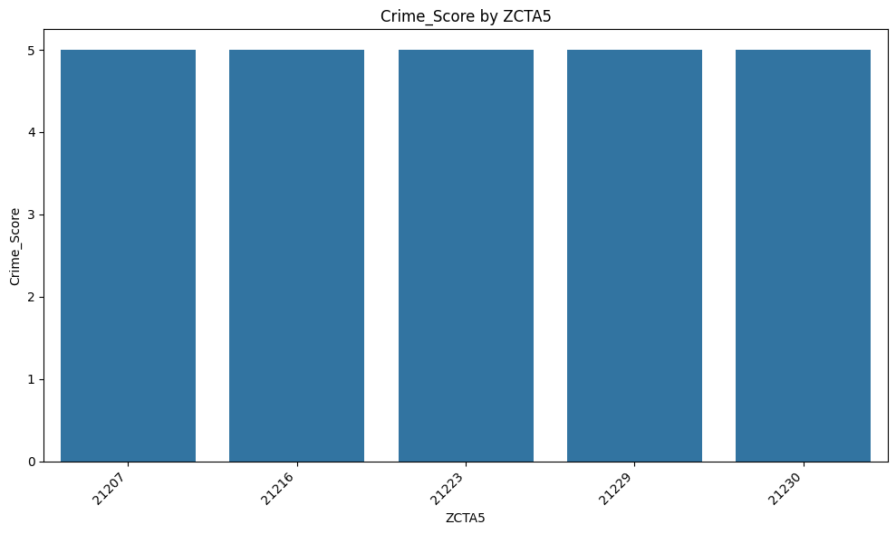
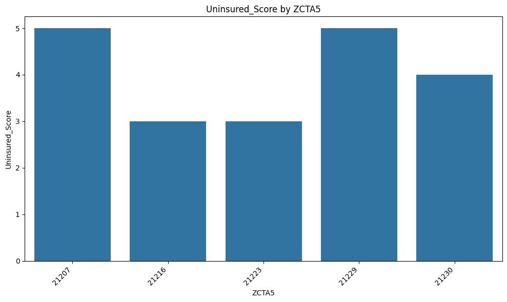
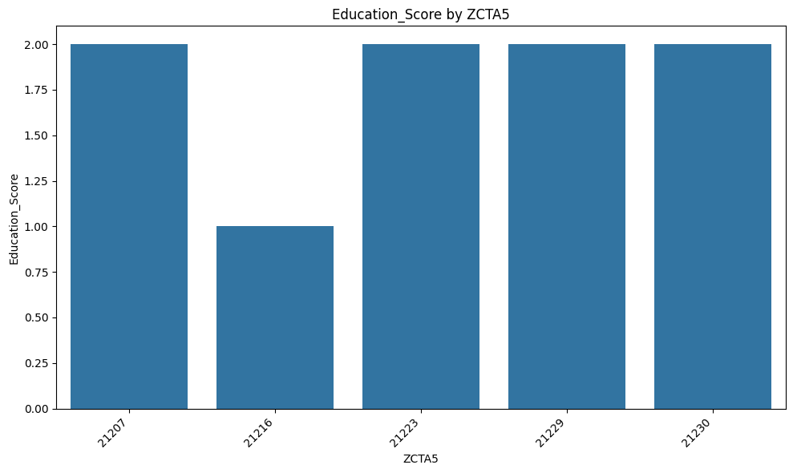
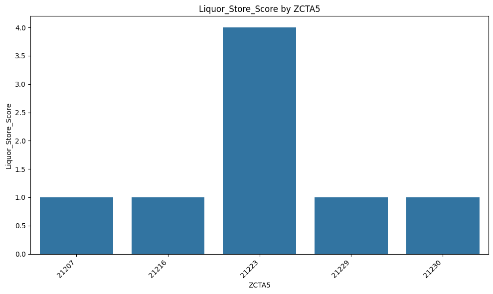
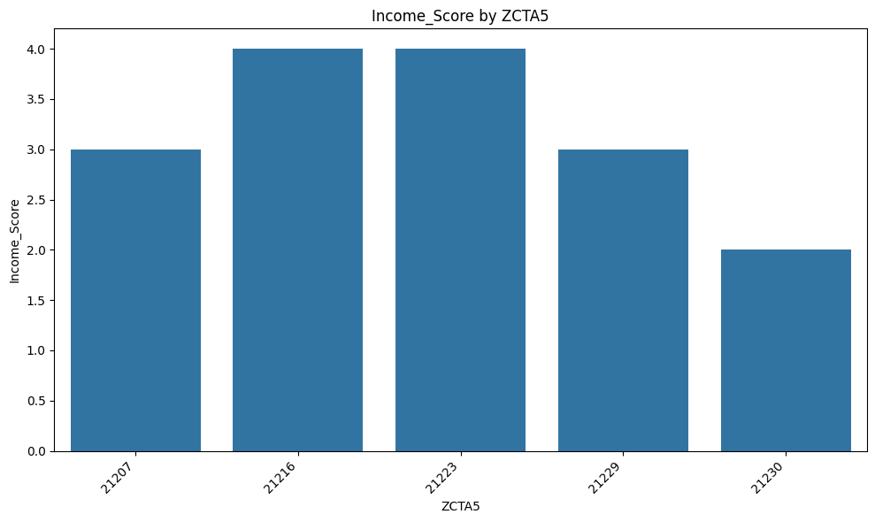
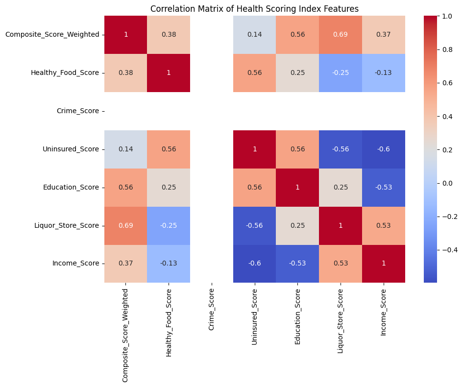
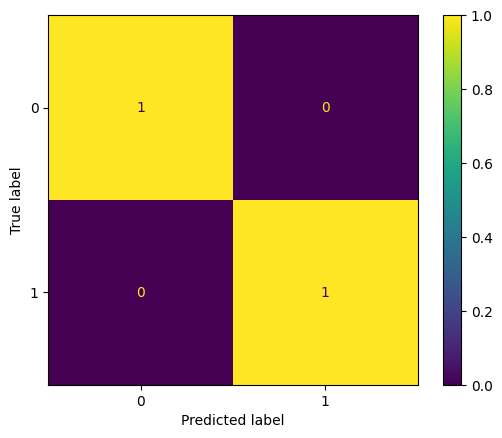
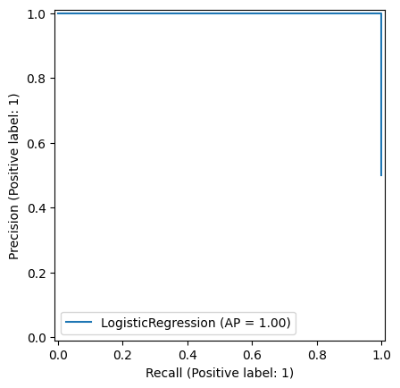
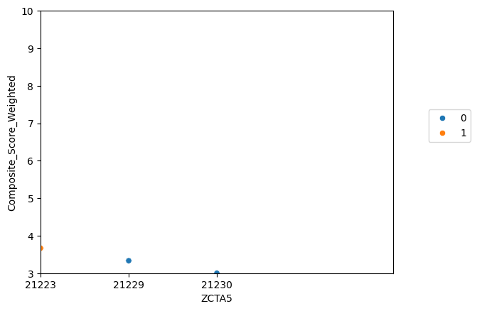
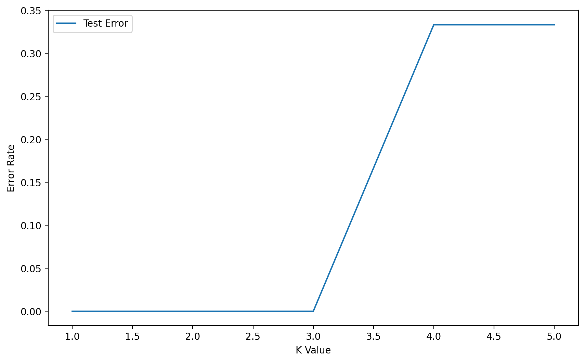

# Introduction 

Many people in Southwest Baltimore do not have easy access to healthcare. Some neighborhoods are far from clinics or hospitals, and others face challenges like poverty, or lack of transportation. These problems can make people sicker over time. That is why it is important to understand where these issues are happening so we can help. 
The Health and Wellness Group Project focuses on leveraging data science to address critical healthcare accessibility issues in Southwest Baltimore. In collaboration with Dr. Megan Doede, the Program Lead for Health and Wellness at Paul’s Place, our team has embarked on a mission to explore the intersection of spatial disparities, environmental stressors, and community health outcomes.  
By applying advanced analytical techniques and geospatial tools using demographic and environmental data, we aim to uncover key patterns that identify healthcare deserts and highlight areas at risk for future health concerns. Our goal is to use these insights to support data-driven, equitable interventions that can improve healthcare delivery and resource distribution for underserved communities. This will help leaders and community groups make better decisions about where to bring services and support.
In this aspect of the project, we create a general health risk predictive model using features contributory to general health and wellness within Southwest Baltimore. It is pertinent to note that the predictive model is still a work in progress as we work with Pauls place and collaborators to collate extensive data within the community to improve the model. 

# METHODOLOGY

## Data Collection 
### Source of Data: 

We used three main sources for our data: 

#### American Community Survey (ACS) from the U.S. Census Bureau.
https://www.census.gov/programs-surveys/acs/news/data-releases/2023.html.
Provided information about income, education, health insurance, race, age, and more which helped us understand the community’s economic and social conditions.

#### Homeless Shelter Locations from Open Baltimore.
https://data.baltimorecity.gov/datasets/baltimore::homeless-shelters-2/explore.
With the use of API url to access updated data this data shows where homeless shelters are located in Baltimore. 


#### Health Department Dataset.
https://data.baltimorecity.gov/datasets/e37ce649df4344dab174b34593b1c4b6_0/explore?location=39.307459%2C-76.628697%2C11.39&showTable=true Provided information about health problems in the community including data on store density (alcohol, tobacco, grocery), mortality, substance abuse, and more.


## Data Exploration 
We looked at the data to see what it tells us about the people living in Southwest Baltimore. 
We checked for missing values, outliers, and important patterns. 
This helped us understand the quality of the data and what we needed to fix before analysis. 

#### Liquor, Healthy food index and crime rate data 


```python
import pandas as pd
import numpy as np

# Load datasets 
try:
    liquor_df = pd.read_csv('/Users/bayowaonabajo/Downloads/SW Baltimore Liquor Store Density.csv')
    food_df = pd.read_csv('/Users/bayowaonabajo/Downloads/SW Baltimore Healthy Food Index.csv') 
    crimerate_df = pd.read_csv('/Users/bayowaonabajo/Downloads/SW Balt Crime Rate - Univ of Balt.csv')
    print(" Files loaded successfully!\n")
    
    print("Liquor Store Density Preview:")
    display(liquor_df.head())
    
    print("\nHealthy Food Index Preview:")
    display(food_df.head())
    
    print("\nCrime Rate Preview:")
    display( crimerate_df.head())

except FileNotFoundError as e:
    print(f" Error: {e}")
   
```

     Files loaded successfully!
    
    Liquor Store Density Preview:


<div>
<style scoped>
    .dataframe tbody tr th:only-of-type {
        vertical-align: middle;
    }

    .dataframe tbody tr th {
        vertical-align: top;
    }

    .dataframe thead th {
        text-align: right;
    }
</style>
<table border="1" class="dataframe">
  <thead>
    <tr style="text-align: right;">
      <th></th>
      <th>Name</th>
      <th>Area</th>
      <th>Liquor Store Density</th>
    </tr>
  </thead>
  <tbody>
    <tr>
      <th>0</th>
      <td>ZCTA5 21207</td>
      <td>Dickeyville-Franklintown</td>
      <td>0.00</td>
    </tr>
    <tr>
      <th>1</th>
      <td>ZCTA5 21216</td>
      <td>Greater Rosemont</td>
      <td>1.05</td>
    </tr>
    <tr>
      <th>2</th>
      <td>ZCTA5 21216</td>
      <td>Forest Park-Walbrook</td>
      <td>0.21</td>
    </tr>
    <tr>
      <th>3</th>
      <td>ZCTA5 21216</td>
      <td>Greater Mondawmin</td>
      <td>0.23</td>
    </tr>
    <tr>
      <th>4</th>
      <td>ZCTA5 21223</td>
      <td>Poppletown</td>
      <td>0.63</td>
    </tr>
  </tbody>
</table>
</div>


    
    Healthy Food Index Preview:


<div>
<style scoped>
    .dataframe tbody tr th:only-of-type {
        vertical-align: middle;
    }

    .dataframe tbody tr th {
        vertical-align: top;
    }

    .dataframe thead th {
        text-align: right;
    }
</style>
<table border="1" class="dataframe">
  <thead>
    <tr style="text-align: right;">
      <th></th>
      <th>Name</th>
      <th>Area</th>
      <th>Healthy Food Availability Index</th>
    </tr>
  </thead>
  <tbody>
    <tr>
      <th>0</th>
      <td>ZCTA5 21207</td>
      <td>Dickeyville-Franklintown</td>
      <td>2.0</td>
    </tr>
    <tr>
      <th>1</th>
      <td>ZCTA5 21216</td>
      <td>Greater Rosemont</td>
      <td>7.5</td>
    </tr>
    <tr>
      <th>2</th>
      <td>ZCTA5 21216</td>
      <td>Forest Park-Walbrook</td>
      <td>9.9</td>
    </tr>
    <tr>
      <th>3</th>
      <td>ZCTA5 21216</td>
      <td>Greater Mondawmin</td>
      <td>9.7</td>
    </tr>
    <tr>
      <th>4</th>
      <td>ZCTA5 21223</td>
      <td>Poppletown</td>
      <td>10.6</td>
    </tr>
  </tbody>
</table>
</div>


    
    Crime Rate Preview:


<div>
<style scoped>
    .dataframe tbody tr th:only-of-type {
        vertical-align: middle;
    }

    .dataframe tbody tr th {
        vertical-align: top;
    }

    .dataframe thead th {
        text-align: right;
    }
</style>
<table border="1" class="dataframe">
  <thead>
    <tr style="text-align: right;">
      <th></th>
      <th>Name</th>
      <th>Area</th>
      <th>Violent Crime Rate</th>
    </tr>
  </thead>
  <tbody>
    <tr>
      <th>0</th>
      <td>ZCTA5 21207</td>
      <td>Dickeyville-Franklintown</td>
      <td>10.00</td>
    </tr>
    <tr>
      <th>1</th>
      <td>ZCTA5 21216</td>
      <td>Greater Rosemont</td>
      <td>22.98</td>
    </tr>
    <tr>
      <th>2</th>
      <td>ZCTA5 21216</td>
      <td>Forest Park-Walbrook</td>
      <td>14.53</td>
    </tr>
    <tr>
      <th>3</th>
      <td>ZCTA5 21216</td>
      <td>Greater Mondawmin</td>
      <td>22.11</td>
    </tr>
    <tr>
      <th>4</th>
      <td>ZCTA5 21223</td>
      <td>Poppletown</td>
      <td>23.26</td>
    </tr>
  </tbody>
</table>
</div>


```python

# Process Liquor Store Density Table
df_liquor = pd.DataFrame(liquor_df)

# Extract ZCTA5 from the "Name" column
df_liquor["ZCTA5"] = df_liquor["Name"].str.extract(r'ZCTA5 (\d+)')
# Aggregate by ZCTA5 (average density if multiple entries exist)
liquor_agg = df_liquor.groupby("ZCTA5")["Liquor Store Density"].mean().reset_index()

# Process Healthy Food Index Table
df_food = pd.DataFrame(food_df)

df_food["ZCTA5"] = df_food["Name"].str.extract(r'ZCTA5 (\d+)')
food_agg = df_food.groupby("ZCTA5")["Healthy Food Availability Index"].mean().reset_index()

# Process Crime Rate Table
df_crime = pd.DataFrame(crimerate_df)

df_crime["ZCTA5"] = df_crime["Name"].str.extract(r'ZCTA5 (\d+)')
crime_agg = df_crime.groupby("ZCTA5")["Violent Crime Rate"].mean().reset_index()
```


```python
# Merge aggregated tables
merged_extra = liquor_agg.merge(food_agg, on="ZCTA5", how="outer") \
                         .merge(crime_agg, on="ZCTA5", how="outer")

merged_extra.head()
```


<div>
<style scoped>
    .dataframe tbody tr th:only-of-type {
        vertical-align: middle;
    }

    .dataframe tbody tr th {
        vertical-align: top;
    }

    .dataframe thead th {
        text-align: right;
    }
</style>
<table border="1" class="dataframe">
  <thead>
    <tr style="text-align: right;">
      <th></th>
      <th>ZCTA5</th>
      <th>Liquor Store Density</th>
      <th>Healthy Food Availability Index</th>
      <th>Violent Crime Rate</th>
    </tr>
  </thead>
  <tbody>
    <tr>
      <th>0</th>
      <td>21207</td>
      <td>0.000000</td>
      <td>2.000000</td>
      <td>10.000000</td>
    </tr>
    <tr>
      <th>1</th>
      <td>21216</td>
      <td>0.496667</td>
      <td>9.033333</td>
      <td>19.873333</td>
    </tr>
    <tr>
      <th>2</th>
      <td>21223</td>
      <td>1.786667</td>
      <td>9.506667</td>
      <td>32.486667</td>
    </tr>
    <tr>
      <th>3</th>
      <td>21229</td>
      <td>0.425000</td>
      <td>8.547500</td>
      <td>14.980000</td>
    </tr>
    <tr>
      <th>4</th>
      <td>21230</td>
      <td>0.490000</td>
      <td>9.585000</td>
      <td>21.305000</td>
    </tr>
  </tbody>
</table>
</div>


#### Social data which includes education


```python
import pandas as pd

data_SW_social = pd.read_csv("/Users/bayowaonabajo/Downloads/ACS  SW Balt Social/ACS 5 year SW Balt Social.csv") #add dataset
#data_SW_social.head(20)
for idx, value in enumerate(data_SW_social['Label (Grouping)'], 1):
    print(f"{idx}. {value}")
```

    1. HOUSEHOLDS BY TYPE
    2.     Total households
    3.         Married-couple household
    4.             With children of the householder under 18 years
    5.         Cohabiting couple household
    6.             With children of the householder under 18 years
    7.         Male householder, no spouse/partner present
    8.             With children of the householder under 18 years
    9.             Householder living alone
    10.                 65 years and over
    11.         Female householder, no spouse/partner present
    12.             With children of the householder under 18 years
    13.             Householder living alone
    14.                 65 years and over
    15.         Households with one or more people under 18 years
    16.         Households with one or more people 65 years and over
    17.         Average household size
    18.         Average family size
    19. RELATIONSHIP
    20.     Population in households
    21.         Householder
    22.         Spouse
    23.         Unmarried partner
    24.         Child
    25.         Other relatives
    26.         Other nonrelatives
    27. MARITAL STATUS
    28.     Males 15 years and over
    29.         Never married
    30.         Now married, except separated
    31.         Separated
    32.         Widowed
    33.         Divorced
    34.     Females 15 years and over
    35.         Never married
    36.         Now married, except separated
    37.         Separated
    38.         Widowed
    39.         Divorced
    40. FERTILITY
    41.     Number of women 15 to 50 years old who had a birth in the past 12 months
    42.         Unmarried women (widowed, divorced, and never married)
    43.             Per 1,000 unmarried women
    44.         Per 1,000 women 15 to 50 years old
    45.         Per 1,000 women 15 to 19 years old
    46.         Per 1,000 women 20 to 34 years old
    47.         Per 1,000 women 35 to 50 years old
    48. GRANDPARENTS
    49.     Number of grandparents living with own grandchildren under 18 years
    50.         Grandparents responsible for grandchildren
    51.         Years responsible for grandchildren
    52.             Less than 1 year
    53.             1 or 2 years
    54.             3 or 4 years
    55.             5 or more years
    56.     Number of grandparents responsible for own grandchildren under 18 years
    57.         Who are female
    58.         Who are married
    59. SCHOOL ENROLLMENT
    60.     Population 3 years and over enrolled in school
    61.         Nursery school, preschool
    62.         Kindergarten
    63.         Elementary school (grades 1-8)
    64.         High school (grades 9-12)
    65.         College or graduate school
    66. EDUCATIONAL ATTAINMENT
    67.     Population 25 years and over
    68.         Less than 9th grade
    69.         9th to 12th grade, no diploma
    70.         High school graduate (includes equivalency)
    71.         Some college, no degree
    72.         Associate's degree
    73.         Bachelor's degree
    74.         Graduate or professional degree
    75.         High school graduate or higher
    76.         Bachelor's degree or higher
    77. VETERAN STATUS
    78.     Civilian population 18 years and over
    79.         Civilian veterans
    80. DISABILITY STATUS OF THE CIVILIAN NONINSTITUTIONALIZED POPULATION
    81.     Total Civilian Noninstitutionalized Population
    82.         With a disability
    83.     Under 18 years
    84.         With a disability
    85.     18 to 64 years
    86.         With a disability
    87.     65 years and over
    88.         With a disability
    89. RESIDENCE 1 YEAR AGO
    90.     Population 1 year and over
    91.         Same house
    92.         Different house (in the U.S. or abroad)
    93.             Different house in the U.S.
    94.                 Same county
    95.                 Different county
    96.                     Same state
    97.                     Different state
    98.             Abroad
    99. PLACE OF BIRTH
    100.     Total population
    101.         Native
    102.             Born in United States
    103.                 State of residence
    104.                 Different state
    105.             Born in Puerto Rico, U.S. Island areas, or born abroad to American parent(s)
    106.         Foreign-born
    107. U.S. CITIZENSHIP STATUS
    108.     Foreign-born population
    109.         Naturalized U.S. citizen
    110.         Not a U.S. citizen
    111. YEAR OF ENTRY
    112.     Population born outside the United States
    113.         Native
    114.             Entered 2010 or later
    115.             Entered before 2010
    116.         Foreign-born
    117.             Entered 2010 or later
    118.             Entered before 2010
    119. WORLD REGION OF BIRTH OF FOREIGN-BORN
    120.     Foreign-born population, excluding population born at sea
    121.         Europe
    122.         Asia
    123.         Africa
    124.         Oceania
    125.         Latin America
    126.         Northern America
    127. LANGUAGE SPOKEN AT HOME
    128.     Population 5 years and over
    129.         English only
    130.         Language other than English
    131.             Speak English less than "very well"
    132.         Spanish
    133.             Speak English less than "very well"
    134.         Other Indo-European languages
    135.             Speak English less than "very well"
    136.         Asian and Pacific Islander languages
    137.             Speak English less than "very well"
    138.         Other languages
    139.             Speak English less than "very well"
    140. ANCESTRY
    141.     Total population
    142.         American
    143.         Arab
    144.         Czech
    145.         Danish
    146.         Dutch
    147.         English
    148.         French (except Basque)
    149.         French Canadian
    150.         German
    151.         Greek
    152.         Hungarian
    153.         Irish
    154.         Italian
    155.         Lithuanian
    156.         Norwegian
    157.         Polish
    158.         Portuguese
    159.         Russian
    160.         Scotch-Irish
    161.         Scottish
    162.         Slovak
    163.         Subsaharan African
    164.         Swedish
    165.         Swiss
    166.         Ukrainian
    167.         Welsh
    168.         West Indian (excluding Hispanic origin groups)
    169. COMPUTERS AND INTERNET USE
    170.     Total households
    171.         With a computer
    172.         With a broadband Internet subscription


```python
import pandas as pd
import numpy as np

# Subset
subset_df = data_SW_social.iloc[64:76].copy()

# Clean column names
clean_columns = {col: col.replace("ZCTA5 ", "").replace("!!", "_") for col in subset_df.columns}
subset_df.rename(columns=clean_columns, inplace=True)

# Melt to long format
melted_df = subset_df.melt(
    id_vars=["Label (Grouping)"], 
    var_name="ZCTA5_Metric", 
    value_name="Value"
)

# Split ZCTA5 and metric
split_vals = melted_df['ZCTA5_Metric'].str.split("_", n=1, expand=True)
melted_df['ZCTA5'] = split_vals[0]
melted_df['Metric'] = split_vals[1].str.replace("Margin", " Margin").str.strip()

# Clean label names
melted_df['Label (Grouping)'] = melted_df['Label (Grouping)'].str.replace('\xa0', ' ').str.strip()

# value cleaning
def clean_value(value):
    try:
        if pd.isna(value) or str(value).strip() in ('(X)', '...'):
            return np.nan
        value_part = str(value).split('±')[0]
        cleaned = value_part.replace(',', '').replace('%', '').strip()
        return float(cleaned) if cleaned else np.nan
    except:
        return np.nan

melted_df['Value'] = melted_df['Value'].apply(clean_value)
melted_df = melted_df.dropna(subset=['Value'])

# Updated education mapping to match cleaned labels
education_mapping = {
    'Less than 9th grade': 'Education below high school',
    '9th to 12th grade, no diploma': 'Education below high school',
    'High school graduate (includes equivalency)': 'High school to grad/professional',
    'Some college, no degree': 'High school to grad/professional',
    "Associate's degree": 'High school to grad/professional',
    "Bachelor's degree": 'High school to grad/professional',
    'Graduate or professional degree': 'High school to grad/professional',
    'High school graduate or higher': 'High school to grad/professional',
    "Bachelor's degree or higher": 'High school to grad/professional'
}

# Filter and map
melted_df = melted_df[melted_df['Label (Grouping)'].isin(education_mapping.keys())]
melted_df['Education Category'] = melted_df['Label (Grouping)'].map(education_mapping)

# Pivot table
final_table = melted_df.pivot_table(
    index=['ZCTA5', 'Education Category'],
    columns='Metric',
    values='Value',
    aggfunc='sum',
    fill_value=0
).reset_index()

# Ensure required columns
required_columns = ['Estimate', 'Percent']
for col in required_columns:
    if col not in final_table.columns:
        final_table[col] = 0

# Final formatting
final_table_soc = final_table[['ZCTA5', 'Education Category'] + required_columns]
final_table_soc[['Estimate']] = final_table[['Estimate']].astype(int)
final_table_soc[['Percent']] = final_table[['Percent', ]].round(1)

final_table_soc.head()
```


<div>
<style scoped>
    .dataframe tbody tr th:only-of-type {
        vertical-align: middle;
    }

    .dataframe tbody tr th {
        vertical-align: top;
    }

    .dataframe thead th {
        text-align: right;
    }
</style>
<table border="1" class="dataframe">
  <thead>
    <tr style="text-align: right;">
      <th>Metric</th>
      <th>ZCTA5</th>
      <th>Education Category</th>
      <th>Estimate</th>
      <th>Percent</th>
    </tr>
  </thead>
  <tbody>
    <tr>
      <th>0</th>
      <td>21207</td>
      <td>Education below high school</td>
      <td>3626</td>
      <td>10.5</td>
    </tr>
    <tr>
      <th>1</th>
      <td>21207</td>
      <td>High school to grad/professional</td>
      <td>72453</td>
      <td>209.8</td>
    </tr>
    <tr>
      <th>2</th>
      <td>21216</td>
      <td>Education below high school</td>
      <td>2493</td>
      <td>13.1</td>
    </tr>
    <tr>
      <th>3</th>
      <td>21216</td>
      <td>High school to grad/professional</td>
      <td>36245</td>
      <td>190.1</td>
    </tr>
    <tr>
      <th>4</th>
      <td>21223</td>
      <td>Education below high school</td>
      <td>3436</td>
      <td>24.8</td>
    </tr>
  </tbody>
</table>
</div>


```python
# Convert ZCTA5 to string in both DataFrames to ensure compatibility
merged_extra["ZCTA5"] = merged_extra["ZCTA5"].astype(str)
final_table_soc["ZCTA5"] = final_table_soc["ZCTA5"].astype(str)

# Perform the merge
final_merged = final_table_soc.merge(merged_extra, on="ZCTA5", how="left")

# (Optional) fill NaN values
final_merged.fillna(0, inplace=True)
final_merged
```


<div>
<style scoped>
    .dataframe tbody tr th:only-of-type {
        vertical-align: middle;
    }

    .dataframe tbody tr th {
        vertical-align: top;
    }

    .dataframe thead th {
        text-align: right;
    }
</style>
<table border="1" class="dataframe">
  <thead>
    <tr style="text-align: right;">
      <th></th>
      <th>ZCTA5</th>
      <th>Education Category</th>
      <th>Estimate</th>
      <th>Percent</th>
      <th>Liquor Store Density</th>
      <th>Healthy Food Availability Index</th>
      <th>Violent Crime Rate</th>
    </tr>
  </thead>
  <tbody>
    <tr>
      <th>0</th>
      <td>21207</td>
      <td>Education below high school</td>
      <td>3626</td>
      <td>10.5</td>
      <td>0.000000</td>
      <td>2.000000</td>
      <td>10.000000</td>
    </tr>
    <tr>
      <th>1</th>
      <td>21207</td>
      <td>High school to grad/professional</td>
      <td>72453</td>
      <td>209.8</td>
      <td>0.000000</td>
      <td>2.000000</td>
      <td>10.000000</td>
    </tr>
    <tr>
      <th>2</th>
      <td>21216</td>
      <td>Education below high school</td>
      <td>2493</td>
      <td>13.1</td>
      <td>0.496667</td>
      <td>9.033333</td>
      <td>19.873333</td>
    </tr>
    <tr>
      <th>3</th>
      <td>21216</td>
      <td>High school to grad/professional</td>
      <td>36245</td>
      <td>190.1</td>
      <td>0.496667</td>
      <td>9.033333</td>
      <td>19.873333</td>
    </tr>
    <tr>
      <th>4</th>
      <td>21223</td>
      <td>Education below high school</td>
      <td>3436</td>
      <td>24.8</td>
      <td>1.786667</td>
      <td>9.506667</td>
      <td>32.486667</td>
    </tr>
    <tr>
      <th>5</th>
      <td>21223</td>
      <td>High school to grad/professional</td>
      <td>22585</td>
      <td>162.9</td>
      <td>1.786667</td>
      <td>9.506667</td>
      <td>32.486667</td>
    </tr>
    <tr>
      <th>6</th>
      <td>21229</td>
      <td>Education below high school</td>
      <td>3462</td>
      <td>11.2</td>
      <td>0.425000</td>
      <td>8.547500</td>
      <td>14.980000</td>
    </tr>
    <tr>
      <th>7</th>
      <td>21229</td>
      <td>High school to grad/professional</td>
      <td>61542</td>
      <td>199.8</td>
      <td>0.425000</td>
      <td>8.547500</td>
      <td>14.980000</td>
    </tr>
    <tr>
      <th>8</th>
      <td>21230</td>
      <td>Education below high school</td>
      <td>2939</td>
      <td>11.8</td>
      <td>0.490000</td>
      <td>9.585000</td>
      <td>21.305000</td>
    </tr>
    <tr>
      <th>9</th>
      <td>21230</td>
      <td>High school to grad/professional</td>
      <td>58484</td>
      <td>235.1</td>
      <td>0.490000</td>
      <td>9.585000</td>
      <td>21.305000</td>
    </tr>
  </tbody>
</table>
</div>


#### Economic data which includes median income and health unisurance estimate


```python
import pandas as pd
data_SW_economic = pd.read_csv("/Users/bayowaonabajo/Downloads/ACS SW Balt Economic Data/ACS 5 year SW Balt Economic.csv") 
print(data_SW_economic.columns.tolist())

```

    ['Label (Grouping)', 'ZCTA5 21207!!Estimate', 'ZCTA5 21207!!Margin of Error', 'ZCTA5 21207!!Percent', 'ZCTA5 21207!!Percent Margin of Error', 'ZCTA5 21216!!Estimate', 'ZCTA5 21216!!Margin of Error', 'ZCTA5 21216!!Percent', 'ZCTA5 21216!!Percent Margin of Error', 'ZCTA5 21223!!Estimate', 'ZCTA5 21223!!Margin of Error', 'ZCTA5 21223!!Percent', 'ZCTA5 21223!!Percent Margin of Error', 'ZCTA5 21229!!Estimate', 'ZCTA5 21229!!Margin of Error', 'ZCTA5 21229!!Percent', 'ZCTA5 21229!!Percent Margin of Error', 'ZCTA5 21230!!Estimate', 'ZCTA5 21230!!Margin of Error', 'ZCTA5 21230!!Percent', 'ZCTA5 21230!!Percent Margin of Error']


```python
for idx, value in enumerate(data_SW_economic['Label (Grouping)'], 1):
    print(f"{idx}. {value}")
```

    1. EMPLOYMENT STATUS
    2.     Population 16 years and over
    3.         In labor force
    4.             Civilian labor force
    5.                 Employed
    6.                 Unemployed
    7.             Armed Forces
    8.         Not in labor force
    9.     Civilian labor force
    10.         Unemployment Rate
    11.     Females 16 years and over
    12.         In labor force
    13.             Civilian labor force
    14.                 Employed
    15.     Own children of the householder under 6 years
    16.         All parents in family in labor force
    17.     Own children of the householder 6 to 17 years
    18.         All parents in family in labor force
    19. COMMUTING TO WORK
    20.     Workers 16 years and over
    21.         Car, truck, or van -- drove alone
    22.         Car, truck, or van -- carpooled
    23.         Public transportation (excluding taxicab)
    24.         Walked
    25.         Other means
    26.         Worked from home
    27.         Mean travel time to work (minutes)
    28. OCCUPATION
    29.     Civilian employed population 16 years and over
    30.         Management, business, science, and arts occupations
    31.         Service occupations
    32.         Sales and office occupations
    33.         Natural resources, construction, and maintenance occupations
    34.         Production, transportation, and material moving occupations
    35. INDUSTRY
    36.     Civilian employed population 16 years and over
    37.         Agriculture, forestry, fishing and hunting, and mining
    38.         Construction
    39.         Manufacturing
    40.         Wholesale trade
    41.         Retail trade
    42.         Transportation and warehousing, and utilities
    43.         Information
    44.         Finance and insurance, and real estate and rental and leasing
    45.         Professional, scientific, and management, and administrative and waste management services
    46.         Educational services, and health care and social assistance
    47.         Arts, entertainment, and recreation, and accommodation and food services
    48.         Other services, except public administration
    49.         Public administration
    50. CLASS OF WORKER
    51.     Civilian employed population 16 years and over
    52.         Private wage and salary workers
    53.         Government workers
    54.         Self-employed in own not incorporated business workers
    55.         Unpaid family workers
    56. INCOME AND BENEFITS (IN 2023 INFLATION-ADJUSTED DOLLARS)
    57.     Total households
    58.         Less than $10,000
    59.         $10,000 to $14,999
    60.         $15,000 to $24,999
    61.         $25,000 to $34,999
    62.         $35,000 to $49,999
    63.         $50,000 to $74,999
    64.         $75,000 to $99,999
    65.         $100,000 to $149,999
    66.         $150,000 to $199,999
    67.         $200,000 or more
    68.         Median household income (dollars)
    69.         Mean household income (dollars)
    70.         With earnings
    71.             Mean earnings (dollars)
    72.         With Social Security
    73.             Mean Social Security income (dollars)
    74.         With retirement income
    75.             Mean retirement income (dollars)
    76.         With Supplemental Security Income
    77.             Mean Supplemental Security Income (dollars)
    78.         With cash public assistance income
    79.             Mean cash public assistance income (dollars)
    80.         With Food Stamp/SNAP benefits in the past 12 months
    81.     Families
    82.         Less than $10,000
    83.         $10,000 to $14,999
    84.         $15,000 to $24,999
    85.         $25,000 to $34,999
    86.         $35,000 to $49,999
    87.         $50,000 to $74,999
    88.         $75,000 to $99,999
    89.         $100,000 to $149,999
    90.         $150,000 to $199,999
    91.         $200,000 or more
    92.         Median family income (dollars)
    93.         Mean family income (dollars)
    94.     Per capita income (dollars)
    95.     Nonfamily households
    96.         Median nonfamily income (dollars)
    97.         Mean nonfamily income (dollars)
    98.     Median earnings for workers (dollars)
    99.     Median earnings for male full-time, year-round workers (dollars)
    100.     Median earnings for female full-time, year-round workers (dollars)
    101. HEALTH INSURANCE COVERAGE
    102.     Civilian noninstitutionalized population
    103.         With health insurance coverage
    104.             With private health insurance
    105.             With public coverage
    106.         No health insurance coverage
    107.     Civilian noninstitutionalized population under 19 years
    108.         No health insurance coverage
    109.     Civilian noninstitutionalized population 19 to 64 years
    110.         In labor force:
    111.             Employed:
    112.                 With health insurance coverage
    113.                     With private health insurance
    114.                     With public coverage
    115.                 No health insurance coverage
    116.             Unemployed:
    117.                 With health insurance coverage
    118.                     With private health insurance
    119.                     With public coverage
    120.                 No health insurance coverage
    121.         Not in labor force:
    122.             With health insurance coverage
    123.                 With private health insurance
    124.                 With public coverage
    125.             No health insurance coverage
    126. PERCENTAGE OF FAMILIES AND PEOPLE WHOSE INCOME IN THE PAST 12 MONTHS IS BELOW THE POVERTY LEVEL
    127.     All families
    128.         With related children of the householder under 18 years
    129.             With related children of the householder under 5 years only
    130.         Married couple families
    131.             With related children of the householder under 18 years
    132.                 With related children of the householder under 5 years only
    133.         Families with female householder, no spouse present
    134.             With related children of the householder under 18 years
    135.                 With related children of the householder under 5 years only
    136.     All people
    137.         Under 18 years
    138.             Related children of the householder under 18 years
    139.                 Related children of the householder under 5 years
    140.                 Related children of the householder 5 to 17 years
    141.         18 years and over
    142.             18 to 64 years
    143.             65 years and over
    144.         People in families
    145.         Unrelated individuals 15 years and over


```python
import pandas as pd

# we extract the desired subset
subset_df = data_SW_economic.iloc[56:125].copy()

# Cleaning column names to make them more readable
clean_columns = {
    col: col.replace("ZCTA5 ", "").replace("!!", "_") for col in subset_df.columns
}
subset_df.rename(columns=clean_columns, inplace=True)

# Reshaping the data to a long format for easier merging
melted_df = subset_df.melt(id_vars=["Label (Grouping)"], var_name="ZCTA5_Metric", value_name="Value")

# Splitting the `ZCTA5_Metric` column into ZCTA5 and Metric for clarity
melted_df[['ZCTA5', 'Metric']] = melted_df['ZCTA5_Metric'].str.split("_", n=1, expand=True)
melted_df.drop(columns=["ZCTA5_Metric"], inplace=True)

# Pivot the table so that it is structured for merging
final_table_econ = melted_df.pivot_table(index=["Label (Grouping)", "ZCTA5"], columns="Metric", values="Value", aggfunc="first").reset_index()

# Display
final_table_econ.head()

```


<div>
<style scoped>
    .dataframe tbody tr th:only-of-type {
        vertical-align: middle;
    }

    .dataframe tbody tr th {
        vertical-align: top;
    }

    .dataframe thead th {
        text-align: right;
    }
</style>
<table border="1" class="dataframe">
  <thead>
    <tr style="text-align: right;">
      <th>Metric</th>
      <th>Label (Grouping)</th>
      <th>ZCTA5</th>
      <th>Estimate</th>
      <th>Margin of Error</th>
      <th>Percent</th>
      <th>Percent Margin of Error</th>
    </tr>
  </thead>
  <tbody>
    <tr>
      <th>0</th>
      <td>Civilian noninstitutionalized population</td>
      <td>21207</td>
      <td>49,164</td>
      <td>±2,694</td>
      <td>49,164</td>
      <td>(X)</td>
    </tr>
    <tr>
      <th>1</th>
      <td>Civilian noninstitutionalized population</td>
      <td>21216</td>
      <td>27,231</td>
      <td>±2,284</td>
      <td>27,231</td>
      <td>(X)</td>
    </tr>
    <tr>
      <th>2</th>
      <td>Civilian noninstitutionalized population</td>
      <td>21223</td>
      <td>19,709</td>
      <td>±1,623</td>
      <td>19,709</td>
      <td>(X)</td>
    </tr>
    <tr>
      <th>3</th>
      <td>Civilian noninstitutionalized population</td>
      <td>21229</td>
      <td>44,133</td>
      <td>±2,465</td>
      <td>44,133</td>
      <td>(X)</td>
    </tr>
    <tr>
      <th>4</th>
      <td>Civilian noninstitutionalized population</td>
      <td>21230</td>
      <td>33,346</td>
      <td>±1,757</td>
      <td>33,346</td>
      <td>(X)</td>
    </tr>
  </tbody>
</table>
</div>


## Data Cleaning and  Preprocessing

We checked for null and missing values to make sure our analysis is accurate and used feature selection to focus on the most important data for our health index score (such as education level, income, alcohol density, healthy food access, health insurance access and crime rate). 
We merged datasets using zip codes and neighborhood names for better analysis and modelling. 

#### Feature Engineering: 

To process the project data, two primary actions were taken. First, the datafame used for ACS survey data required reshaping.  ACS data was imported into a DataFrame, which was converted from a format where there are many columns for different ZIP codes using the melt() function to reshape it into a long format, where each row represents a single observation.
Second, to facilitate predictive modeling, new features were engineered in the form of health-related score indices. Specifically, the following indices were generated: 'Healthy_Food_Score', 'Crime_Score', 'Uninsured_Score', 'Education_Score', 'Liquor_Store_Score', and 'Income_Score'. For each index, scores ranging from 1 to 5 were assigned based on predefined thresholds, where a score of 1 represents the most favorable condition and a score of 5 the least favorable.. 


```python
import pandas as pd
import numpy as np

# Assuming final_table_econ is already defined and contains 'ZCTA5' and 'Estimate'
df = pd.DataFrame(final_table_econ).rename(columns={'Label (Grouping)': 'Metric'})

# Clean and categorize data
def categorize(row):
    metric = row['Metric'].lower().strip()

    if not metric:
        return None

    if any(x in metric for x in ['less than $10,000', '$10,000 to $14,999', '$15,000 to $24,999']):
        return 'below 25,000'
    elif any(x in metric for x in ['$25,000 to $34,999', '$35,000 to $49,999', '$50,000 to $74,999',
                                   '$75,000 to $99,999', '$100,000 to $149,999', '$150,000 to $199,999', '$200,000 or more']):
        return 'above 25,000'
    
    if 'median income' in metric or 'median household income' in metric:
        return 'median_income'
    
    if 'without health insurance' in metric or 'no health insurance' in metric:
        return 'uninsured'
    
    # Removed code for 'no_private_insurance' and 'no_public_insurance'
    
    if 'civilian' in metric:
        return 'total_population'
    
    return None

df['Category'] = df.apply(categorize, axis=1)
df = df.dropna(subset=['Category'])

# Function to clean and sum 'Estimate' values
def clean_and_sum(value):
    if pd.isna(value):
        return 0
    if isinstance(value, str):
        # Remove non-numeric characters except for periods
        value = value.replace(',', '').strip()
    try:
        return float(value)
    except ValueError:
        return 0

df['Estimate'] = df['Estimate'].apply(clean_and_sum)

#ZCTA5 is treated as a string to prevent unintended numerical operations
df['ZCTA5'] = df['ZCTA5'].astype(str)

# Required categories
required_categories = ['below 25,000', 'above 25,000', 'median_income',
                       'total_population', 'uninsured']

df['Category'] = pd.Categorical(df['Category'], categories=required_categories, ordered=True)

# Pivot table with proper numeric aggregation
pivot_df = df.pivot_table(
    index='ZCTA5',
    columns='Category',
    values='Estimate',
    aggfunc='sum',  #summation 
    fill_value=0
).reset_index()

# Rename columns for clarity (removed entries for the excluded categories)
column_mapping = {
    'below 25,000': 'Below25k_Estimate',
    'above 25,000': 'Above25k_Estimate',
    'median_income': 'MedianIncome_Estimate',
    'total_population': 'TotalPop_Estimate',
    'uninsured': 'Uninsured_Estimate'
}

pivot_df = pivot_df.rename(columns=column_mapping)

# Format numbers for better readability
numeric_cols = pivot_df.columns.difference(['ZCTA5'])
pivot_df[numeric_cols] = pivot_df[numeric_cols].applymap(lambda x: f"{int(x):,}" if pd.notnull(x) else x)

# Display
pivot_df
```

    /var/folders/z0/vng18cmj41x80kcsp_9tylwr0000gn/T/ipykernel_1801/511255682.py:60: FutureWarning: The default value of observed=False is deprecated and will change to observed=True in a future version of pandas. Specify observed=False to silence this warning and retain the current behavior
      pivot_df = df.pivot_table(
    /var/folders/z0/vng18cmj41x80kcsp_9tylwr0000gn/T/ipykernel_1801/511255682.py:81: FutureWarning: DataFrame.applymap has been deprecated. Use DataFrame.map instead.
      pivot_df[numeric_cols] = pivot_df[numeric_cols].applymap(lambda x: f"{int(x):,}" if pd.notnull(x) else x)


<div>
<style scoped>
    .dataframe tbody tr th:only-of-type {
        vertical-align: middle;
    }

    .dataframe tbody tr th {
        vertical-align: top;
    }

    .dataframe thead th {
        text-align: right;
    }
</style>
<table border="1" class="dataframe">
  <thead>
    <tr style="text-align: right;">
      <th>Category</th>
      <th>ZCTA5</th>
      <th>Below25k_Estimate</th>
      <th>Above25k_Estimate</th>
      <th>MedianIncome_Estimate</th>
      <th>TotalPop_Estimate</th>
      <th>Uninsured_Estimate</th>
    </tr>
  </thead>
  <tbody>
    <tr>
      <th>0</th>
      <td>21207</td>
      <td>3,282</td>
      <td>16,326</td>
      <td>64,284</td>
      <td>89,919</td>
      <td>6,724</td>
    </tr>
    <tr>
      <th>1</th>
      <td>21216</td>
      <td>4,119</td>
      <td>7,548</td>
      <td>46,440</td>
      <td>49,913</td>
      <td>2,250</td>
    </tr>
    <tr>
      <th>2</th>
      <td>21223</td>
      <td>2,772</td>
      <td>5,528</td>
      <td>41,828</td>
      <td>36,415</td>
      <td>2,707</td>
    </tr>
    <tr>
      <th>3</th>
      <td>21229</td>
      <td>3,992</td>
      <td>14,525</td>
      <td>55,457</td>
      <td>80,912</td>
      <td>4,497</td>
    </tr>
    <tr>
      <th>4</th>
      <td>21230</td>
      <td>2,396</td>
      <td>13,607</td>
      <td>94,164</td>
      <td>63,012</td>
      <td>3,692</td>
    </tr>
  </tbody>
</table>
</div>


```python
pivot_df["ZCTA5"] = pivot_df["ZCTA5"].astype(str)
final_merged["ZCTA5"] = final_merged["ZCTA5"].astype(str)  
```


```python
merged_SwBalt_df = final_merged.merge(
    pivot_df,
    on="ZCTA5",
    how="left"
)
merged_SwBalt_df
```


<div>
<style scoped>
    .dataframe tbody tr th:only-of-type {
        vertical-align: middle;
    }

    .dataframe tbody tr th {
        vertical-align: top;
    }

    .dataframe thead th {
        text-align: right;
    }
</style>
<table border="1" class="dataframe">
  <thead>
    <tr style="text-align: right;">
      <th></th>
      <th>ZCTA5</th>
      <th>Education Category</th>
      <th>Estimate</th>
      <th>Percent</th>
      <th>Liquor Store Density</th>
      <th>Healthy Food Availability Index</th>
      <th>Violent Crime Rate</th>
      <th>Below25k_Estimate</th>
      <th>Above25k_Estimate</th>
      <th>MedianIncome_Estimate</th>
      <th>TotalPop_Estimate</th>
      <th>Uninsured_Estimate</th>
    </tr>
  </thead>
  <tbody>
    <tr>
      <th>0</th>
      <td>21207</td>
      <td>Education below high school</td>
      <td>3626</td>
      <td>10.5</td>
      <td>0.000000</td>
      <td>2.000000</td>
      <td>10.000000</td>
      <td>3,282</td>
      <td>16,326</td>
      <td>64,284</td>
      <td>89,919</td>
      <td>6,724</td>
    </tr>
    <tr>
      <th>1</th>
      <td>21207</td>
      <td>High school to grad/professional</td>
      <td>72453</td>
      <td>209.8</td>
      <td>0.000000</td>
      <td>2.000000</td>
      <td>10.000000</td>
      <td>3,282</td>
      <td>16,326</td>
      <td>64,284</td>
      <td>89,919</td>
      <td>6,724</td>
    </tr>
    <tr>
      <th>2</th>
      <td>21216</td>
      <td>Education below high school</td>
      <td>2493</td>
      <td>13.1</td>
      <td>0.496667</td>
      <td>9.033333</td>
      <td>19.873333</td>
      <td>4,119</td>
      <td>7,548</td>
      <td>46,440</td>
      <td>49,913</td>
      <td>2,250</td>
    </tr>
    <tr>
      <th>3</th>
      <td>21216</td>
      <td>High school to grad/professional</td>
      <td>36245</td>
      <td>190.1</td>
      <td>0.496667</td>
      <td>9.033333</td>
      <td>19.873333</td>
      <td>4,119</td>
      <td>7,548</td>
      <td>46,440</td>
      <td>49,913</td>
      <td>2,250</td>
    </tr>
    <tr>
      <th>4</th>
      <td>21223</td>
      <td>Education below high school</td>
      <td>3436</td>
      <td>24.8</td>
      <td>1.786667</td>
      <td>9.506667</td>
      <td>32.486667</td>
      <td>2,772</td>
      <td>5,528</td>
      <td>41,828</td>
      <td>36,415</td>
      <td>2,707</td>
    </tr>
    <tr>
      <th>5</th>
      <td>21223</td>
      <td>High school to grad/professional</td>
      <td>22585</td>
      <td>162.9</td>
      <td>1.786667</td>
      <td>9.506667</td>
      <td>32.486667</td>
      <td>2,772</td>
      <td>5,528</td>
      <td>41,828</td>
      <td>36,415</td>
      <td>2,707</td>
    </tr>
    <tr>
      <th>6</th>
      <td>21229</td>
      <td>Education below high school</td>
      <td>3462</td>
      <td>11.2</td>
      <td>0.425000</td>
      <td>8.547500</td>
      <td>14.980000</td>
      <td>3,992</td>
      <td>14,525</td>
      <td>55,457</td>
      <td>80,912</td>
      <td>4,497</td>
    </tr>
    <tr>
      <th>7</th>
      <td>21229</td>
      <td>High school to grad/professional</td>
      <td>61542</td>
      <td>199.8</td>
      <td>0.425000</td>
      <td>8.547500</td>
      <td>14.980000</td>
      <td>3,992</td>
      <td>14,525</td>
      <td>55,457</td>
      <td>80,912</td>
      <td>4,497</td>
    </tr>
    <tr>
      <th>8</th>
      <td>21230</td>
      <td>Education below high school</td>
      <td>2939</td>
      <td>11.8</td>
      <td>0.490000</td>
      <td>9.585000</td>
      <td>21.305000</td>
      <td>2,396</td>
      <td>13,607</td>
      <td>94,164</td>
      <td>63,012</td>
      <td>3,692</td>
    </tr>
    <tr>
      <th>9</th>
      <td>21230</td>
      <td>High school to grad/professional</td>
      <td>58484</td>
      <td>235.1</td>
      <td>0.490000</td>
      <td>9.585000</td>
      <td>21.305000</td>
      <td>2,396</td>
      <td>13,607</td>
      <td>94,164</td>
      <td>63,012</td>
      <td>3,692</td>
    </tr>
  </tbody>
</table>
</div>


```python
numeric_cols = ["Below25k_Estimate", "Above25k_Estimate", "MedianIncome_Estimate", "TotalPop_Estimate", "Uninsured_Estimate"]
merged_SwBalt_df[numeric_cols] = merged_SwBalt_df[numeric_cols].replace({',': ''}, regex=True).astype(float)
merged_SwBalt_df
```


<div>
<style scoped>
    .dataframe tbody tr th:only-of-type {
        vertical-align: middle;
    }

    .dataframe tbody tr th {
        vertical-align: top;
    }

    .dataframe thead th {
        text-align: right;
    }
</style>
<table border="1" class="dataframe">
  <thead>
    <tr style="text-align: right;">
      <th></th>
      <th>ZCTA5</th>
      <th>Education Category</th>
      <th>Estimate</th>
      <th>Percent</th>
      <th>Liquor Store Density</th>
      <th>Healthy Food Availability Index</th>
      <th>Violent Crime Rate</th>
      <th>Below25k_Estimate</th>
      <th>Above25k_Estimate</th>
      <th>MedianIncome_Estimate</th>
      <th>TotalPop_Estimate</th>
      <th>Uninsured_Estimate</th>
    </tr>
  </thead>
  <tbody>
    <tr>
      <th>0</th>
      <td>21207</td>
      <td>Education below high school</td>
      <td>3626</td>
      <td>10.5</td>
      <td>0.000000</td>
      <td>2.000000</td>
      <td>10.000000</td>
      <td>3282.0</td>
      <td>16326.0</td>
      <td>64284.0</td>
      <td>89919.0</td>
      <td>6724.0</td>
    </tr>
    <tr>
      <th>1</th>
      <td>21207</td>
      <td>High school to grad/professional</td>
      <td>72453</td>
      <td>209.8</td>
      <td>0.000000</td>
      <td>2.000000</td>
      <td>10.000000</td>
      <td>3282.0</td>
      <td>16326.0</td>
      <td>64284.0</td>
      <td>89919.0</td>
      <td>6724.0</td>
    </tr>
    <tr>
      <th>2</th>
      <td>21216</td>
      <td>Education below high school</td>
      <td>2493</td>
      <td>13.1</td>
      <td>0.496667</td>
      <td>9.033333</td>
      <td>19.873333</td>
      <td>4119.0</td>
      <td>7548.0</td>
      <td>46440.0</td>
      <td>49913.0</td>
      <td>2250.0</td>
    </tr>
    <tr>
      <th>3</th>
      <td>21216</td>
      <td>High school to grad/professional</td>
      <td>36245</td>
      <td>190.1</td>
      <td>0.496667</td>
      <td>9.033333</td>
      <td>19.873333</td>
      <td>4119.0</td>
      <td>7548.0</td>
      <td>46440.0</td>
      <td>49913.0</td>
      <td>2250.0</td>
    </tr>
    <tr>
      <th>4</th>
      <td>21223</td>
      <td>Education below high school</td>
      <td>3436</td>
      <td>24.8</td>
      <td>1.786667</td>
      <td>9.506667</td>
      <td>32.486667</td>
      <td>2772.0</td>
      <td>5528.0</td>
      <td>41828.0</td>
      <td>36415.0</td>
      <td>2707.0</td>
    </tr>
    <tr>
      <th>5</th>
      <td>21223</td>
      <td>High school to grad/professional</td>
      <td>22585</td>
      <td>162.9</td>
      <td>1.786667</td>
      <td>9.506667</td>
      <td>32.486667</td>
      <td>2772.0</td>
      <td>5528.0</td>
      <td>41828.0</td>
      <td>36415.0</td>
      <td>2707.0</td>
    </tr>
    <tr>
      <th>6</th>
      <td>21229</td>
      <td>Education below high school</td>
      <td>3462</td>
      <td>11.2</td>
      <td>0.425000</td>
      <td>8.547500</td>
      <td>14.980000</td>
      <td>3992.0</td>
      <td>14525.0</td>
      <td>55457.0</td>
      <td>80912.0</td>
      <td>4497.0</td>
    </tr>
    <tr>
      <th>7</th>
      <td>21229</td>
      <td>High school to grad/professional</td>
      <td>61542</td>
      <td>199.8</td>
      <td>0.425000</td>
      <td>8.547500</td>
      <td>14.980000</td>
      <td>3992.0</td>
      <td>14525.0</td>
      <td>55457.0</td>
      <td>80912.0</td>
      <td>4497.0</td>
    </tr>
    <tr>
      <th>8</th>
      <td>21230</td>
      <td>Education below high school</td>
      <td>2939</td>
      <td>11.8</td>
      <td>0.490000</td>
      <td>9.585000</td>
      <td>21.305000</td>
      <td>2396.0</td>
      <td>13607.0</td>
      <td>94164.0</td>
      <td>63012.0</td>
      <td>3692.0</td>
    </tr>
    <tr>
      <th>9</th>
      <td>21230</td>
      <td>High school to grad/professional</td>
      <td>58484</td>
      <td>235.1</td>
      <td>0.490000</td>
      <td>9.585000</td>
      <td>21.305000</td>
      <td>2396.0</td>
      <td>13607.0</td>
      <td>94164.0</td>
      <td>63012.0</td>
      <td>3692.0</td>
    </tr>
  </tbody>
</table>
</div>


```python
merged_SwBalt_df.info(10)
```

    <class 'pandas.core.frame.DataFrame'>
    RangeIndex: 10 entries, 0 to 9
    Data columns (total 12 columns):
     #   Column                           Non-Null Count  Dtype  
    ---  ------                           --------------  -----  
     0   ZCTA5                            10 non-null     object 
     1   Education Category               10 non-null     object 
     2   Estimate                         10 non-null     int64  
     3   Percent                          10 non-null     float64
     4   Liquor Store Density             10 non-null     float64
     5   Healthy Food Availability Index  10 non-null     float64
     6   Violent Crime Rate               10 non-null     float64
     7   Below25k_Estimate                10 non-null     float64
     8   Above25k_Estimate                10 non-null     float64
     9   MedianIncome_Estimate            10 non-null     float64
     10  TotalPop_Estimate                10 non-null     float64
     11  Uninsured_Estimate               10 non-null     float64
    dtypes: float64(9), int64(1), object(2)
    memory usage: 1.1+ KB


```python
import geopandas as gpd

#data path 
shapefile_path = "/Users/bayowaonabajo/Downloads/tl_2023_us_zcta520/tl_2023_us_zcta520.shp"

# Load the shapefile
zcta = gpd.read_file(shapefile_path)

# Check 
print(zcta.head())
```

      ZCTA5CE20 GEOID20       GEOIDFQ20 CLASSFP20 MTFCC20 FUNCSTAT20  ALAND20  \
    0     47236   47236  860Z200US47236        B5   G6350          S  1029063   
    1     47870   47870  860Z200US47870        B5   G6350          S     8830   
    2     47851   47851  860Z200US47851        B5   G6350          S    53326   
    3     47337   47337  860Z200US47337        B5   G6350          S   303089   
    4     47435   47435  860Z200US47435        B5   G6350          S    13302   
    
       AWATER20   INTPTLAT20    INTPTLON20  \
    0         0  +39.1517426  -085.7252769   
    1         0  +39.3701518  -087.4735141   
    2         0  +39.5735839  -087.2459559   
    3         0  +39.8027537  -085.4372850   
    4         0  +39.2657557  -086.2951577   
    
                                                geometry  
    0  POLYGON ((-85.7341 39.15597, -85.72794 39.1561...  
    1  POLYGON ((-87.47414 39.37016, -87.47409 39.370...  
    2  POLYGON ((-87.24769 39.5745, -87.24711 39.5744...  
    3  POLYGON ((-85.44357 39.80328, -85.44346 39.803...  
    4  POLYGON ((-86.29592 39.26547, -86.29592 39.266...  


#### Data Transformation: 

To address our general health risk scoring index, each health index was converted to a weighted score using EQUAL_WEIGHT = 1 / 6 since there are six index features. 

## Exploratory Data Analysis 

To gain insights into the data and explore relationships between variables, visualizations were generated. 


```python
import pandas as pd

# Sample Data
data_SW = merged_SwBalt_df.copy()


# Function to classify Healthy Food Score
def classify_healthy_food(x):
    if x > 24:
        return 1
    elif x > 18:
        return 2
    elif x > 12:
        return 3
    elif x > 6:
        return 4
    else:
        return 5

# Function to classify Crime Score
def classify_crime(x):
    if x < 0.5:
        return 1
    elif x < 1:
        return 2
    elif x < 1.5:
        return 3
    elif x < 2:
        return 4
    else:
        return 5

# Function to classify Health Insurance Unavailability Score
def classify_uninsured(x):
    if x < 1000:
        return 1
    elif x < 2000:
        return 2
    elif x < 3000:
        return 3
    elif x < 4000:
        return 4
    else:
        return 5

# Function to classify Education Score (only for "Education below high school")
def classify_education(x):
    if x < 2500:
        return 1
    elif x < 5000:
        return 2
    elif x < 7500:
        return 3
    elif x < 10000:
        return 4
    else:
        return 5

# Function to classify Liquor Store Density (Substance Abuse Risk)
def classify_liquor_density(x):
    if x > 2.0:
        return 5
    elif x > 1.5:
        return 4
    elif x > 1.0:
        return 3
    elif x > 0.5:
        return 2
    else:
        return 1

# Function to classify Median Income Score
def classify_income(x):
    if x > 100000:
        return 1
    elif x > 75000:
        return 2
    elif x > 50000:
        return 3
    elif x > 25000:
        return 4
    else:
        return 5

# Compute Uninsured Percentage 
data_SW["Uninsured_Percent"] = (data_SW["Uninsured_Estimate"] / data_SW["TotalPop_Estimate"]) * 100

# Filter only rows where "Education Category" is "Education below high school"
education_filtered = data_SW[data_SW["Education Category"] == "Education below high school"].copy()

# Apply classification functions to data_SW
data_SW["Healthy_Food_Score"] = data_SW["Healthy Food Availability Index"].apply(classify_healthy_food)
data_SW["Crime_Score"] = data_SW["Violent Crime Rate"].apply(classify_crime)
data_SW["Uninsured_Score"] = data_SW["Uninsured_Estimate"].apply(classify_uninsured)
data_SW["Liquor_Store_Score"] = data_SW["Liquor Store Density"].apply(classify_liquor_density)
data_SW["Income_Score"] = data_SW["MedianIncome_Estimate"].apply(classify_income)

# Apply education classification to the filtered dataset
education_filtered["Education_Score"] = education_filtered["Estimate"].apply(classify_education)

# Merge education scores back to the original dataset
data_SW_clean = data_SW.merge(
    education_filtered[["ZCTA5", "Education_Score"]],
    on="ZCTA5",
    how="left"
)

# Handle missing Education_Score
data_SW_clean["Education_Score"] = data_SW_clean["Education_Score"].fillna(0)


# Display
data_SW_clean[
    ["ZCTA5", "Healthy_Food_Score", "Crime_Score", "Uninsured_Score", 
     "Education_Score", "Liquor_Store_Score", "Income_Score"]
].head()
```


<div>
<style scoped>
    .dataframe tbody tr th:only-of-type {
        vertical-align: middle;
    }

    .dataframe tbody tr th {
        vertical-align: top;
    }

    .dataframe thead th {
        text-align: right;
    }
</style>
<table border="1" class="dataframe">
  <thead>
    <tr style="text-align: right;">
      <th></th>
      <th>ZCTA5</th>
      <th>Healthy_Food_Score</th>
      <th>Crime_Score</th>
      <th>Uninsured_Score</th>
      <th>Education_Score</th>
      <th>Liquor_Store_Score</th>
      <th>Income_Score</th>
    </tr>
  </thead>
  <tbody>
    <tr>
      <th>0</th>
      <td>21207</td>
      <td>5</td>
      <td>5</td>
      <td>5</td>
      <td>2</td>
      <td>1</td>
      <td>3</td>
    </tr>
    <tr>
      <th>1</th>
      <td>21207</td>
      <td>5</td>
      <td>5</td>
      <td>5</td>
      <td>2</td>
      <td>1</td>
      <td>3</td>
    </tr>
    <tr>
      <th>2</th>
      <td>21216</td>
      <td>4</td>
      <td>5</td>
      <td>3</td>
      <td>1</td>
      <td>1</td>
      <td>4</td>
    </tr>
    <tr>
      <th>3</th>
      <td>21216</td>
      <td>4</td>
      <td>5</td>
      <td>3</td>
      <td>1</td>
      <td>1</td>
      <td>4</td>
    </tr>
    <tr>
      <th>4</th>
      <td>21223</td>
      <td>4</td>
      <td>5</td>
      <td>3</td>
      <td>2</td>
      <td>4</td>
      <td>4</td>
    </tr>
  </tbody>
</table>
</div>


```python
import pandas as pd

# Create a copy of the cleaned data
data_weighted_health_score = pd.DataFrame(data_SW_clean)

# Compute Composite Score using Equal Weights (Average)
data_weighted_health_score["Composite_Score_Avg"] = data_weighted_health_score[
    ["Healthy_Food_Score", "Crime_Score", "Uninsured_Score",
     "Education_Score", "Liquor_Store_Score", "Income_Score"]
].mean(axis=1)

# Using Equal Weights for the Weighted Score
EQUAL_WEIGHT = 1 / 6  # Since there are 6 features
data_weighted_health_score["Composite_Score_Weighted"] = (
    data_weighted_health_score["Healthy_Food_Score"] * EQUAL_WEIGHT +
    data_weighted_health_score["Crime_Score"] * EQUAL_WEIGHT +
    data_weighted_health_score["Uninsured_Score"] * EQUAL_WEIGHT +
    data_weighted_health_score["Education_Score"] * EQUAL_WEIGHT +
    data_weighted_health_score["Liquor_Store_Score"] * EQUAL_WEIGHT +
    data_weighted_health_score["Income_Score"] * EQUAL_WEIGHT
)


data_weighted_health_score[["ZCTA5", "Composite_Score_Avg", "Composite_Score_Weighted"]].head()

```


<div>
<style scoped>
    .dataframe tbody tr th:only-of-type {
        vertical-align: middle;
    }

    .dataframe tbody tr th {
        vertical-align: top;
    }

    .dataframe thead th {
        text-align: right;
    }
</style>
<table border="1" class="dataframe">
  <thead>
    <tr style="text-align: right;">
      <th></th>
      <th>ZCTA5</th>
      <th>Composite_Score_Avg</th>
      <th>Composite_Score_Weighted</th>
    </tr>
  </thead>
  <tbody>
    <tr>
      <th>0</th>
      <td>21207</td>
      <td>3.500000</td>
      <td>3.500000</td>
    </tr>
    <tr>
      <th>1</th>
      <td>21207</td>
      <td>3.500000</td>
      <td>3.500000</td>
    </tr>
    <tr>
      <th>2</th>
      <td>21216</td>
      <td>3.000000</td>
      <td>3.000000</td>
    </tr>
    <tr>
      <th>3</th>
      <td>21216</td>
      <td>3.000000</td>
      <td>3.000000</td>
    </tr>
    <tr>
      <th>4</th>
      <td>21223</td>
      <td>3.666667</td>
      <td>3.666667</td>
    </tr>
  </tbody>
</table>
</div>


```python
data_SW_clean["ZCTA5"] = data_SW_clean["ZCTA5"].astype(str)
data_weighted_health_score["ZCTA5"] = data_weighted_health_score["ZCTA5"].astype(str)

final_merged_SW = data_SW_clean.merge(
    data_weighted_health_score[["ZCTA5", "Composite_Score_Avg", "Composite_Score_Weighted"]],
    on="ZCTA5",
    how="left"
)
final_SW_Health_score_index = final_merged_SW[
    ["ZCTA5", "Healthy_Food_Score", "Crime_Score", "Uninsured_Score", 
     "Education_Score", "Liquor_Store_Score", "Income_Score",
     "Composite_Score_Avg", "Composite_Score_Weighted"]
]


final_SW_Health_score_index.head()
```


<div>
<style scoped>
    .dataframe tbody tr th:only-of-type {
        vertical-align: middle;
    }

    .dataframe tbody tr th {
        vertical-align: top;
    }

    .dataframe thead th {
        text-align: right;
    }
</style>
<table border="1" class="dataframe">
  <thead>
    <tr style="text-align: right;">
      <th></th>
      <th>ZCTA5</th>
      <th>Healthy_Food_Score</th>
      <th>Crime_Score</th>
      <th>Uninsured_Score</th>
      <th>Education_Score</th>
      <th>Liquor_Store_Score</th>
      <th>Income_Score</th>
      <th>Composite_Score_Avg</th>
      <th>Composite_Score_Weighted</th>
    </tr>
  </thead>
  <tbody>
    <tr>
      <th>0</th>
      <td>21207</td>
      <td>5</td>
      <td>5</td>
      <td>5</td>
      <td>2</td>
      <td>1</td>
      <td>3</td>
      <td>3.5</td>
      <td>3.5</td>
    </tr>
    <tr>
      <th>1</th>
      <td>21207</td>
      <td>5</td>
      <td>5</td>
      <td>5</td>
      <td>2</td>
      <td>1</td>
      <td>3</td>
      <td>3.5</td>
      <td>3.5</td>
    </tr>
    <tr>
      <th>2</th>
      <td>21207</td>
      <td>5</td>
      <td>5</td>
      <td>5</td>
      <td>2</td>
      <td>1</td>
      <td>3</td>
      <td>3.5</td>
      <td>3.5</td>
    </tr>
    <tr>
      <th>3</th>
      <td>21207</td>
      <td>5</td>
      <td>5</td>
      <td>5</td>
      <td>2</td>
      <td>1</td>
      <td>3</td>
      <td>3.5</td>
      <td>3.5</td>
    </tr>
    <tr>
      <th>4</th>
      <td>21216</td>
      <td>4</td>
      <td>5</td>
      <td>3</td>
      <td>1</td>
      <td>1</td>
      <td>4</td>
      <td>3.0</td>
      <td>3.0</td>
    </tr>
  </tbody>
</table>
</div>


```python
import geopandas as gpd
import pandas as pd

# Load the shapefile
zcta = gpd.read_file("/Users/bayowaonabajo/Downloads/tl_2023_us_zcta520/tl_2023_us_zcta520.shp")

#Convert to a Projected CRS for accurate centroid calculation

zcta_projected = zcta.to_crs(epsg=2248)  

# 3. Calculate centroid coordinates 
zcta["longitude"] = zcta_projected.geometry.centroid.x
zcta["latitude"] = zcta_projected.geometry.centroid.y

# 4. Convert back to WGS 84 
zcta = zcta.to_crs(epsg=4326)

# 5. Rename ZCTA5 column 
zcta = zcta.rename(columns={"ZCTA5CE20": "ZCTA5"})

# 6. Merge 
final_SW_Health_score_index_merged = pd.merge(
    final_SW_Health_score_index,
    zcta[["ZCTA5", "geometry", "longitude", "latitude"]],  # Keep geometry
    on="ZCTA5",
    how="left"
)

# Display
final_SW_Health_score_index_merged.head()
```


<div>
<style scoped>
    .dataframe tbody tr th:only-of-type {
        vertical-align: middle;
    }

    .dataframe tbody tr th {
        vertical-align: top;
    }

    .dataframe thead th {
        text-align: right;
    }
</style>
<table border="1" class="dataframe">
  <thead>
    <tr style="text-align: right;">
      <th></th>
      <th>ZCTA5</th>
      <th>Healthy_Food_Score</th>
      <th>Crime_Score</th>
      <th>Uninsured_Score</th>
      <th>Education_Score</th>
      <th>Liquor_Store_Score</th>
      <th>Income_Score</th>
      <th>Composite_Score_Avg</th>
      <th>Composite_Score_Weighted</th>
      <th>geometry</th>
      <th>longitude</th>
      <th>latitude</th>
    </tr>
  </thead>
  <tbody>
    <tr>
      <th>0</th>
      <td>21207</td>
      <td>5</td>
      <td>5</td>
      <td>5</td>
      <td>2</td>
      <td>1</td>
      <td>3</td>
      <td>3.5</td>
      <td>3.5</td>
      <td>POLYGON ((-76.74658 39.35974, -76.74639 39.359...</td>
      <td>1.391485e+06</td>
      <td>603768.963615</td>
    </tr>
    <tr>
      <th>1</th>
      <td>21207</td>
      <td>5</td>
      <td>5</td>
      <td>5</td>
      <td>2</td>
      <td>1</td>
      <td>3</td>
      <td>3.5</td>
      <td>3.5</td>
      <td>POLYGON ((-76.74658 39.35974, -76.74639 39.359...</td>
      <td>1.391485e+06</td>
      <td>603768.963615</td>
    </tr>
    <tr>
      <th>2</th>
      <td>21207</td>
      <td>5</td>
      <td>5</td>
      <td>5</td>
      <td>2</td>
      <td>1</td>
      <td>3</td>
      <td>3.5</td>
      <td>3.5</td>
      <td>POLYGON ((-76.74658 39.35974, -76.74639 39.359...</td>
      <td>1.391485e+06</td>
      <td>603768.963615</td>
    </tr>
    <tr>
      <th>3</th>
      <td>21207</td>
      <td>5</td>
      <td>5</td>
      <td>5</td>
      <td>2</td>
      <td>1</td>
      <td>3</td>
      <td>3.5</td>
      <td>3.5</td>
      <td>POLYGON ((-76.74658 39.35974, -76.74639 39.359...</td>
      <td>1.391485e+06</td>
      <td>603768.963615</td>
    </tr>
    <tr>
      <th>4</th>
      <td>21216</td>
      <td>4</td>
      <td>5</td>
      <td>3</td>
      <td>1</td>
      <td>1</td>
      <td>4</td>
      <td>3.0</td>
      <td>3.0</td>
      <td>POLYGON ((-76.69876 39.31819, -76.6985 39.3187...</td>
      <td>1.405295e+06</td>
      <td>598957.784684</td>
    </tr>
  </tbody>
</table>
</div>


```python
import plotly.graph_objects as go
import geopandas as gpd

# (Assuming you have final_SW_Health_score_index_merged)

# 1. Calculate the bounding box
bounds = final_SW_Health_score_index_merged.geometry.total_bounds
lon_min, lat_min, lon_max, lat_max = bounds

# 2. Convert the GeoDataFrame to GeoJSON
geojson_data = final_SW_Health_score_index_merged.__geo_interface__

# 3. Create the figure
fig = go.Figure(go.Choroplethmapbox(
    geojson=geojson_data,  # Use the GeoJSON data
    locations=final_SW_Health_score_index_merged.ZCTA5,
    z=final_SW_Health_score_index_merged.Composite_Score_Avg,
    colorscale="Viridis",
    marker_opacity=0.7,
    marker_line_width=0
))

# 4. Update the layout to control the map's extent
fig.update_layout(
    mapbox_style="carto-positron",
    mapbox_accesstoken="YOUR_MAPBOX_TOKEN",  # Replace with your Mapbox token
    mapbox_zoom=10,  # You might still need to fine-tune this
    mapbox_center={"lon": (lon_min + lon_max) / 2, "lat": (lat_min + lat_max) / 2},
    mapbox_bounds={"west": lon_min, "east": lon_max, "south": lat_min, "north": lat_max},
    margin={"r": 0, "t": 0, "l": 0, "b": 0},
    title_text="Health Scores by ZCTA5"
)

fig.show()
```


<div>                            <div id="bae82bca-c32e-4946-b502-1eb4c362bcb5" class="plotly-graph-div" style="height:525px; width:100%;"></div>            <script type="text/javascript">                require(["plotly"], function(Plotly) {                    window.PLOTLYENV=window.PLOTLYENV || {};                                    if (document.getElementById("bae82bca-c32e-4946-b502-1eb4c362bcb5")) {                    Plotly.newPlot(                        "bae82bca-c32e-4946-b502-1eb4c362bcb5",                        [{"colorscale":[[0.0,"#440154"],[0.1111111111111111,"#482878"],[0.2222222222222222,"#3e4989"],[0.3333333333333333,"#31688e"],[0.4444444444444444,"#26828e"],[0.5555555555555556,"#1f9e89"],[0.6666666666666666,"#35b779"],[0.7777777777777778,"#6ece58"],[0.8888888888888888,"#b5de2b"],[1.0,"#fde725"]],"geojson":{"type":"FeatureCollection","features":[{"id":"0","type":"Feature","properties":{"ZCTA5":"21207","Healthy_Food_Score":5,"Crime_Score":5,"Uninsured_Score":5,"Education_Score":2,"Liquor_Store_Score":1,"Income_Score":3,"Composite_Score_Avg":3.5,"Composite_Score_Weighted":3.5,"longitude":1391485.0711243218,"latitude":603768.9636148977},"geometry":{"type":"Polygon","coordinates":[[[-76.746585,39.35974],[-76.746387,39.359768],[-76.746311,39.359779],[-76.745985,39.359825],[-76.745605,39.359852],[-76.745233,39.359863],[-76.74491,39.359858],[-76.744875,39.359658],[-76.744804,39.359552],[-76.74476,39.359463],[-76.744673,39.359322],[-76.744564,39.35922],[-76.744449,39.359118],[-76.744318,39.359054],[-76.744209,39.359037],[-76.744094,39.359062],[-76.744011,39.359117],[-76.743918,39.359147],[-76.743655,39.359138],[-76.743425,39.359082],[-76.74328,39.359035],[-76.743149,39.358958],[-76.743029,39.358864],[-76.742904,39.358715],[-76.742824,39.358634],[-76.742786,39.358528],[-76.742787,39.358418],[-76.742754,39.358294],[-76.7427,39.358192],[-76.74263,39.358001],[-76.742559,39.357873],[-76.742505,39.357695],[-76.742445,39.35755],[-76.742312,39.357291],[-76.742285,39.357206],[-76.742323,39.357104],[-76.742291,39.356997],[-76.742209,39.356942],[-76.742143,39.356874],[-76.742127,39.356785],[-76.742202,39.356683],[-76.742218,39.356602],[-76.742158,39.356487],[-76.742011,39.356292],[-76.741946,39.356134],[-76.741941,39.356015],[-76.742071,39.355874],[-76.742226,39.355739],[-76.742334,39.355596],[-76.742363,39.355452],[-76.742377,39.355331],[-76.742435,39.355187],[-76.742592,39.354989],[-76.74265,39.354812],[-76.742665,39.354658],[-76.74268,39.354448],[-76.742581,39.35426],[-76.74251,39.354028],[-76.742454,39.353884],[-76.742369,39.353818],[-76.74222,39.353619],[-76.742163,39.353497],[-76.742149,39.353398],[-76.742193,39.353265],[-76.742307,39.3531],[-76.742279,39.352912],[-76.742223,39.352735],[-76.742067,39.352503],[-76.741869,39.352281],[-76.741803,39.352225],[-76.739545,39.354298],[-76.739318,39.354558],[-76.73909,39.354558],[-76.738768,39.354558],[-76.738454,39.354541],[-76.738106,39.354511],[-76.737844,39.35448],[-76.737796,39.354538],[-76.736291,39.354535],[-76.734189,39.355531],[-76.73141,39.356373],[-76.729877,39.3573],[-76.72957,39.356808],[-76.729476,39.356655],[-76.729365,39.356504],[-76.729254,39.356359],[-76.72913,39.356224],[-76.728404,39.355485],[-76.726777,39.35642],[-76.726239,39.35443],[-76.723979,39.354891],[-76.724512,39.356665],[-76.724846,39.357773],[-76.724571,39.357875],[-76.724733,39.358339],[-76.724346,39.358415],[-76.723702,39.358564],[-76.722477,39.355136],[-76.722182,39.355415],[-76.721936,39.355598],[-76.721303,39.355552],[-76.719163,39.354713],[-76.718311,39.356315],[-76.718201,39.356522],[-76.718085,39.356465],[-76.717927,39.356392],[-76.717694,39.356305],[-76.71697,39.356079],[-76.716117,39.355828],[-76.715225,39.355562],[-76.714336,39.355308],[-76.713572,39.355083],[-76.71378,39.354988],[-76.713806,39.354966],[-76.714352,39.354503],[-76.714815,39.354111],[-76.714523,39.353861],[-76.71598,39.352451],[-76.712506,39.348726],[-76.71179,39.349209],[-76.711388,39.349496],[-76.711294,39.348305],[-76.711248,39.346705],[-76.711194,39.344805],[-76.71117,39.343628],[-76.711193,39.342405],[-76.711193,39.340405],[-76.711031,39.336822],[-76.711011,39.336391],[-76.711025,39.336333],[-76.710851,39.336314],[-76.710353,39.336148],[-76.709912,39.33599],[-76.709474,39.336625],[-76.709413,39.336741],[-76.709389,39.336748],[-76.709213,39.336797],[-76.709069,39.336835],[-76.708981,39.336854],[-76.708899,39.336873],[-76.708859,39.336885],[-76.708807,39.336911],[-76.708737,39.336953],[-76.708666,39.337015],[-76.708521,39.337148],[-76.708469,39.337211],[-76.708447,39.337259],[-76.708428,39.33731],[-76.708412,39.337426],[-76.708401,39.337487],[-76.70838,39.337562],[-76.708361,39.33762],[-76.708316,39.337678],[-76.708175,39.337799],[-76.708057,39.337921],[-76.707944,39.338019],[-76.707888,39.338058],[-76.707826,39.338099],[-76.707762,39.33813],[-76.707658,39.338149],[-76.707575,39.338157],[-76.707423,39.338147],[-76.707349,39.338149],[-76.707281,39.338159],[-76.707214,39.338177],[-76.70717,39.338209],[-76.707133,39.338258],[-76.707106,39.338297],[-76.707089,39.338342],[-76.707095,39.338386],[-76.707105,39.33841],[-76.707132,39.338444],[-76.707206,39.338496],[-76.707283,39.338544],[-76.707344,39.338586],[-76.707381,39.338625],[-76.707394,39.338677],[-76.707397,39.338724],[-76.707397,39.338779],[-76.707376,39.338826],[-76.707336,39.338873],[-76.707261,39.33891],[-76.707162,39.338936],[-76.706947,39.33896],[-76.706879,39.338978],[-76.706811,39.339012],[-76.706772,39.339049],[-76.706754,39.339084],[-76.706751,39.339132],[-76.706753,39.339208],[-76.706791,39.33933],[-76.706856,39.339434],[-76.706969,39.339556],[-76.707111,39.339667],[-76.707168,39.339716],[-76.707221,39.339799],[-76.707248,39.339907],[-76.707267,39.340041],[-76.703792,39.342447],[-76.70354,39.342486],[-76.703718,39.341957],[-76.703853,39.341558],[-76.704118,39.340771],[-76.704148,39.340513],[-76.703727,39.340464],[-76.703652,39.340443],[-76.702873,39.340287],[-76.702784,39.340553],[-76.702384,39.340469],[-76.702316,39.340454],[-76.702214,39.340432],[-76.701541,39.340321],[-76.70087,39.340321],[-76.700548,39.340349],[-76.700469,39.340331],[-76.700371,39.340322],[-76.699988,39.340322],[-76.69999,39.339727],[-76.698663,39.339944],[-76.698663,39.340089],[-76.698131,39.340379],[-76.698131,39.340555],[-76.69813,39.340654],[-76.697559,39.340654],[-76.697286,39.340741],[-76.697652,39.340404],[-76.697447,39.340221],[-76.69713,39.339939],[-76.696892,39.339727],[-76.696674,39.339532],[-76.697581,39.338908],[-76.696899,39.338343],[-76.696184,39.339056],[-76.695747,39.338708],[-76.695377,39.338376],[-76.695135,39.338166],[-76.694552,39.337658],[-76.694273,39.337416],[-76.693374,39.336633],[-76.693093,39.336632],[-76.693141,39.33643],[-76.692856,39.33617],[-76.692813,39.33614],[-76.692764,39.336119],[-76.692705,39.336115],[-76.692026,39.336113],[-76.691681,39.336108],[-76.691692,39.335628],[-76.691569,39.335061],[-76.691111,39.334652],[-76.690928,39.334488],[-76.690423,39.334036],[-76.690265,39.334149],[-76.689676,39.333961],[-76.689675,39.333394],[-76.689095,39.333212],[-76.689009,39.333185],[-76.688862,39.333143],[-76.688802,39.333136],[-76.688654,39.333138],[-76.688306,39.333152],[-76.687043,39.333201],[-76.687043,39.332912],[-76.682796,39.332851],[-76.682774,39.332755],[-76.682757,39.332643],[-76.682741,39.332506],[-76.682723,39.332368],[-76.682702,39.332216],[-76.682607,39.331401],[-76.682509,39.330452],[-76.683172,39.330453],[-76.68318,39.329981],[-76.683189,39.32951],[-76.683133,39.327711],[-76.683448,39.327766],[-76.683718,39.327755],[-76.683584,39.327618],[-76.683473,39.32748],[-76.68273,39.326123],[-76.682638,39.325974],[-76.682564,39.325842],[-76.683165,39.32566],[-76.683376,39.325596],[-76.683588,39.325532],[-76.684189,39.325351],[-76.683966,39.32495],[-76.683928,39.324881],[-76.685411,39.324438],[-76.686033,39.324247],[-76.686852,39.323971],[-76.687134,39.323874],[-76.688334,39.323514],[-76.688994,39.323307],[-76.689789,39.323065],[-76.689839,39.323153],[-76.690014,39.323457],[-76.690069,39.323586],[-76.690198,39.323552],[-76.691537,39.323147],[-76.693036,39.322693],[-76.69258,39.321854],[-76.694051,39.321402],[-76.694789,39.321181],[-76.695112,39.321074],[-76.695207,39.321056],[-76.695326,39.321043],[-76.695479,39.321033],[-76.695959,39.321],[-76.696271,39.320864],[-76.696487,39.320758],[-76.696579,39.320701],[-76.696685,39.320619],[-76.697682,39.319646],[-76.69777,39.319419],[-76.698496,39.318716],[-76.69876,39.318192],[-76.698695,39.318192],[-76.698528,39.31818],[-76.69846,39.318152],[-76.698386,39.318083],[-76.698317,39.317964],[-76.698267,39.317895],[-76.698189,39.317826],[-76.698068,39.317751],[-76.697848,39.317675],[-76.69724,39.317505],[-76.696804,39.317391],[-76.696527,39.317324],[-76.696402,39.31729],[-76.696345,39.317263],[-76.696303,39.317232],[-76.696267,39.317193],[-76.696235,39.317149],[-76.696215,39.317022],[-76.696219,39.316801],[-76.696486,39.315349],[-76.69605,39.314935],[-76.695508,39.314864],[-76.69518,39.314829],[-76.694756,39.314809],[-76.694201,39.314808],[-76.693787,39.314801],[-76.693308,39.314791],[-76.693026,39.314777],[-76.692656,39.314735],[-76.692569,39.314719],[-76.692475,39.314695],[-76.69241,39.314676],[-76.692113,39.314546],[-76.691902,39.314404],[-76.691756,39.314303],[-76.691639,39.314216],[-76.691433,39.314129],[-76.691376,39.314106],[-76.691302,39.31408],[-76.691265,39.31407],[-76.691231,39.314062],[-76.691201,39.314057],[-76.690781,39.31405],[-76.690634,39.31404],[-76.690533,39.314023],[-76.690458,39.31399],[-76.690318,39.313898],[-76.69023,39.31382],[-76.690148,39.313734],[-76.690031,39.313633],[-76.689931,39.313528],[-76.689814,39.3134],[-76.689622,39.313153],[-76.689563,39.313016],[-76.689421,39.312335],[-76.689685,39.312336],[-76.689848,39.312352],[-76.68994,39.312368],[-76.690004,39.312386],[-76.689982,39.312108],[-76.689979,39.311929],[-76.689988,39.311767],[-76.690014,39.311613],[-76.690169,39.31117],[-76.690393,39.310323],[-76.690431,39.310017],[-76.690432,39.30988],[-76.690392,39.309683],[-76.69036,39.309557],[-76.690295,39.309409],[-76.690196,39.309254],[-76.690118,39.309141],[-76.689618,39.308521],[-76.689039,39.307783],[-76.688179,39.306557],[-76.687738,39.305914],[-76.687503,39.305698],[-76.68737,39.305592],[-76.687203,39.305491],[-76.68693,39.305408],[-76.686633,39.305356],[-76.686431,39.305348],[-76.686638,39.305069],[-76.686862,39.304876],[-76.686938,39.304857],[-76.68701,39.304864],[-76.687081,39.304874],[-76.687136,39.304893],[-76.687199,39.304933],[-76.687277,39.304992],[-76.687419,39.305117],[-76.68755,39.305196],[-76.687689,39.305216],[-76.687811,39.305216],[-76.687933,39.305197],[-76.688123,39.305164],[-76.688224,39.305125],[-76.688343,39.305077],[-76.688381,39.305077],[-76.688427,39.305093],[-76.688507,39.305116],[-76.688597,39.305153],[-76.688749,39.305166],[-76.689021,39.305147],[-76.689582,39.305099],[-76.690187,39.305083],[-76.690405,39.305026],[-76.690511,39.304992],[-76.690617,39.304934],[-76.690773,39.304814],[-76.690948,39.304655],[-76.691085,39.304602],[-76.691203,39.304574],[-76.691328,39.304569],[-76.691517,39.30456],[-76.691822,39.304585],[-76.692313,39.304654],[-76.692919,39.304796],[-76.693298,39.304883],[-76.693522,39.304923],[-76.69402,39.304929],[-76.694244,39.304929],[-76.694331,39.304896],[-76.694415,39.304843],[-76.694509,39.304737],[-76.694622,39.304563],[-76.694698,39.304346],[-76.694729,39.304283],[-76.694773,39.304245],[-76.694872,39.304178],[-76.694929,39.304115],[-76.69496,39.304014],[-76.694952,39.303883],[-76.694897,39.303763],[-76.694576,39.30322],[-76.694354,39.302936],[-76.694284,39.30274],[-76.694275,39.302575],[-76.694346,39.302434],[-76.694519,39.302245],[-76.694866,39.302016],[-76.695685,39.302106],[-76.695889,39.3021],[-76.696181,39.302076],[-76.696476,39.302041],[-76.69665,39.301998],[-76.696831,39.301876],[-76.69695,39.301773],[-76.697124,39.301633],[-76.697313,39.301517],[-76.697455,39.301456],[-76.697648,39.301414],[-76.697979,39.301403],[-76.698136,39.301415],[-76.698357,39.301434],[-76.698451,39.301471],[-76.698537,39.301539],[-76.698624,39.301661],[-76.698686,39.30182],[-76.698772,39.301918],[-76.698898,39.301961],[-76.69913,39.302011],[-76.699524,39.302036],[-76.69972,39.302031],[-76.700272,39.301934],[-76.70054,39.301886],[-76.700698,39.30185],[-76.700857,39.30177],[-76.701021,39.301548],[-76.701193,39.301297],[-76.701274,39.30123],[-76.701356,39.301198],[-76.701424,39.301179],[-76.701558,39.301151],[-76.701768,39.301121],[-76.701894,39.301088],[-76.702054,39.301026],[-76.702733,39.30069],[-76.702808,39.300631],[-76.702852,39.300556],[-76.702871,39.300493],[-76.702878,39.300313],[-76.702847,39.30013],[-76.702856,39.300018],[-76.702915,39.299912],[-76.703122,39.299745],[-76.703304,39.299672],[-76.703555,39.299634],[-76.7038,39.299627],[-76.704259,39.299698],[-76.704609,39.299741],[-76.704779,39.299746],[-76.704886,39.299732],[-76.704971,39.29971],[-76.705202,39.299637],[-76.705439,39.299553],[-76.705573,39.299517],[-76.705711,39.299506],[-76.705855,39.299516],[-76.705958,39.299536],[-76.706064,39.299589],[-76.706178,39.299673],[-76.706295,39.299791],[-76.706428,39.29999],[-76.706533,39.3002],[-76.706607,39.300472],[-76.706635,39.300655],[-76.706635,39.300779],[-76.706622,39.300879],[-76.706603,39.300936],[-76.706546,39.301013],[-76.706482,39.301093],[-76.706316,39.301246],[-76.705855,39.301677],[-76.705737,39.301785],[-76.705656,39.301836],[-76.705527,39.301902],[-76.705471,39.301958],[-76.705437,39.302041],[-76.705418,39.302158],[-76.705413,39.302238],[-76.705445,39.302347],[-76.705474,39.302408],[-76.705521,39.302474],[-76.705698,39.302611],[-76.705844,39.302712],[-76.706105,39.302835],[-76.706329,39.302922],[-76.706532,39.302998],[-76.706721,39.303057],[-76.706972,39.303104],[-76.707116,39.303134],[-76.707315,39.303179],[-76.707765,39.303308],[-76.708192,39.30338],[-76.708403,39.303395],[-76.708674,39.303392],[-76.708913,39.303374],[-76.709029,39.303351],[-76.709092,39.303323],[-76.709219,39.303227],[-76.709424,39.303025],[-76.709733,39.302769],[-76.709868,39.30273],[-76.710008,39.302717],[-76.710167,39.302726],[-76.710366,39.302762],[-76.710598,39.302816],[-76.711191,39.302955],[-76.711193,39.302105],[-76.7112,39.301786],[-76.711201,39.301749],[-76.711201,39.301717],[-76.711203,39.301638],[-76.711206,39.301511],[-76.711203,39.301294],[-76.711202,39.301234],[-76.711201,39.301184],[-76.711201,39.301158],[-76.7112,39.301119],[-76.711193,39.300605],[-76.711193,39.30054],[-76.711193,39.300005],[-76.711202,39.299885],[-76.711203,39.299871],[-76.711207,39.299821],[-76.71121,39.299778],[-76.711311,39.299795],[-76.711439,39.299781],[-76.711614,39.299733],[-76.711739,39.299687],[-76.711872,39.299628],[-76.712015,39.299568],[-76.712945,39.298998],[-76.713293,39.298805],[-76.713452,39.298742],[-76.713722,39.29866],[-76.714027,39.298575],[-76.714115,39.298547],[-76.714509,39.295774],[-76.715848,39.294438],[-76.717905,39.294604],[-76.718057,39.29451],[-76.718409,39.294186],[-76.718476,39.294125],[-76.718784,39.293842],[-76.718683,39.293711],[-76.718387,39.293622],[-76.718438,39.293329],[-76.718577,39.293329],[-76.718626,39.293319],[-76.718682,39.293286],[-76.718745,39.293227],[-76.718912,39.293087],[-76.719381,39.292607],[-76.719744,39.292218],[-76.719849,39.292111],[-76.719884,39.292062],[-76.719919,39.291992],[-76.719979,39.291905],[-76.719997,39.29187],[-76.72001,39.291832],[-76.72002,39.291795],[-76.720022,39.291762],[-76.72001,39.291731],[-76.719951,39.291689],[-76.719651,39.291536],[-76.719598,39.291527],[-76.719546,39.291524],[-76.719482,39.291531],[-76.719392,39.291164],[-76.719517,39.291159],[-76.719603,39.291165],[-76.719664,39.291173],[-76.719746,39.291188],[-76.719866,39.291214],[-76.720355,39.291394],[-76.720573,39.291502],[-76.720558,39.291407],[-76.720539,39.291279],[-76.720536,39.291213],[-76.720627,39.291025],[-76.720655,39.290975],[-76.720684,39.290939],[-76.720747,39.290888],[-76.720862,39.290825],[-76.720963,39.290781],[-76.721121,39.290729],[-76.722528,39.290389],[-76.723339,39.290204],[-76.723445,39.290176],[-76.724535,39.289896],[-76.725106,39.289755],[-76.725579,39.290006],[-76.725752,39.290084],[-76.72608,39.290242],[-76.726334,39.290355],[-76.726407,39.290385],[-76.726542,39.290186],[-76.726547,39.290135],[-76.726525,39.290048],[-76.726431,39.289801],[-76.728783,39.290695],[-76.731178,39.291717],[-76.730862,39.292169],[-76.730706,39.292233],[-76.73103,39.292638],[-76.731242,39.292908],[-76.73177,39.293494],[-76.732095,39.293254],[-76.734442,39.296003],[-76.734386,39.296039],[-76.734103,39.296237],[-76.73416,39.2963],[-76.734672,39.29691],[-76.735265,39.297546],[-76.735524,39.297334],[-76.73875,39.299107],[-76.738955,39.299692],[-76.739941,39.300106],[-76.740358,39.300235],[-76.740897,39.300394],[-76.741202,39.300478],[-76.741475,39.300547],[-76.741731,39.3006],[-76.741985,39.300648],[-76.742458,39.300749],[-76.74299,39.299225],[-76.743786,39.30585],[-76.743788,39.305869],[-76.74381,39.306022],[-76.743982,39.30601],[-76.744078,39.306387],[-76.744192,39.307418],[-76.744359,39.308716],[-76.744478,39.309505],[-76.744632,39.311099],[-76.744744,39.312365],[-76.744746,39.312404],[-76.744751,39.312537],[-76.744765,39.313012],[-76.744768,39.313829],[-76.74478,39.314649],[-76.744798,39.31524],[-76.744839,39.316695],[-76.744809,39.317562],[-76.744811,39.318746],[-76.74481,39.320144],[-76.744801,39.321634],[-76.744804,39.321943],[-76.744812,39.323176],[-76.744834,39.326019],[-76.744827,39.328938],[-76.744823,39.329319],[-76.744805,39.331085],[-76.744795,39.332737],[-76.744796,39.333165],[-76.744819,39.333876],[-76.744814,39.334501],[-76.744824,39.335142],[-76.744825,39.335848],[-76.744831,39.336458],[-76.744823,39.337086],[-76.744832,39.338541],[-76.744838,39.338976],[-76.744858,39.339668],[-76.744882,39.340287],[-76.744904,39.340829],[-76.744935,39.341376],[-76.744974,39.341826],[-76.745059,39.342691],[-76.745095,39.343093],[-76.745139,39.343555],[-76.745224,39.344493],[-76.745281,39.344988],[-76.745289,39.345256],[-76.745658,39.349094],[-76.745665,39.349155],[-76.745668,39.349287],[-76.745697,39.349596],[-76.745736,39.350235],[-76.745751,39.350587],[-76.745793,39.351011],[-76.745822,39.35135],[-76.745855,39.351764],[-76.745887,39.352109],[-76.745931,39.352523],[-76.745952,39.352862],[-76.746009,39.353399],[-76.746107,39.354134],[-76.746234,39.355534],[-76.746326,39.356761],[-76.746512,39.358823],[-76.746585,39.35974]]]},"bbox":[-76.746585,39.289755,-76.682509,39.359863]},{"id":"1","type":"Feature","properties":{"ZCTA5":"21207","Healthy_Food_Score":5,"Crime_Score":5,"Uninsured_Score":5,"Education_Score":2,"Liquor_Store_Score":1,"Income_Score":3,"Composite_Score_Avg":3.5,"Composite_Score_Weighted":3.5,"longitude":1391485.0711243218,"latitude":603768.9636148977},"geometry":{"type":"Polygon","coordinates":[[[-76.746585,39.35974],[-76.746387,39.359768],[-76.746311,39.359779],[-76.745985,39.359825],[-76.745605,39.359852],[-76.745233,39.359863],[-76.74491,39.359858],[-76.744875,39.359658],[-76.744804,39.359552],[-76.74476,39.359463],[-76.744673,39.359322],[-76.744564,39.35922],[-76.744449,39.359118],[-76.744318,39.359054],[-76.744209,39.359037],[-76.744094,39.359062],[-76.744011,39.359117],[-76.743918,39.359147],[-76.743655,39.359138],[-76.743425,39.359082],[-76.74328,39.359035],[-76.743149,39.358958],[-76.743029,39.358864],[-76.742904,39.358715],[-76.742824,39.358634],[-76.742786,39.358528],[-76.742787,39.358418],[-76.742754,39.358294],[-76.7427,39.358192],[-76.74263,39.358001],[-76.742559,39.357873],[-76.742505,39.357695],[-76.742445,39.35755],[-76.742312,39.357291],[-76.742285,39.357206],[-76.742323,39.357104],[-76.742291,39.356997],[-76.742209,39.356942],[-76.742143,39.356874],[-76.742127,39.356785],[-76.742202,39.356683],[-76.742218,39.356602],[-76.742158,39.356487],[-76.742011,39.356292],[-76.741946,39.356134],[-76.741941,39.356015],[-76.742071,39.355874],[-76.742226,39.355739],[-76.742334,39.355596],[-76.742363,39.355452],[-76.742377,39.355331],[-76.742435,39.355187],[-76.742592,39.354989],[-76.74265,39.354812],[-76.742665,39.354658],[-76.74268,39.354448],[-76.742581,39.35426],[-76.74251,39.354028],[-76.742454,39.353884],[-76.742369,39.353818],[-76.74222,39.353619],[-76.742163,39.353497],[-76.742149,39.353398],[-76.742193,39.353265],[-76.742307,39.3531],[-76.742279,39.352912],[-76.742223,39.352735],[-76.742067,39.352503],[-76.741869,39.352281],[-76.741803,39.352225],[-76.739545,39.354298],[-76.739318,39.354558],[-76.73909,39.354558],[-76.738768,39.354558],[-76.738454,39.354541],[-76.738106,39.354511],[-76.737844,39.35448],[-76.737796,39.354538],[-76.736291,39.354535],[-76.734189,39.355531],[-76.73141,39.356373],[-76.729877,39.3573],[-76.72957,39.356808],[-76.729476,39.356655],[-76.729365,39.356504],[-76.729254,39.356359],[-76.72913,39.356224],[-76.728404,39.355485],[-76.726777,39.35642],[-76.726239,39.35443],[-76.723979,39.354891],[-76.724512,39.356665],[-76.724846,39.357773],[-76.724571,39.357875],[-76.724733,39.358339],[-76.724346,39.358415],[-76.723702,39.358564],[-76.722477,39.355136],[-76.722182,39.355415],[-76.721936,39.355598],[-76.721303,39.355552],[-76.719163,39.354713],[-76.718311,39.356315],[-76.718201,39.356522],[-76.718085,39.356465],[-76.717927,39.356392],[-76.717694,39.356305],[-76.71697,39.356079],[-76.716117,39.355828],[-76.715225,39.355562],[-76.714336,39.355308],[-76.713572,39.355083],[-76.71378,39.354988],[-76.713806,39.354966],[-76.714352,39.354503],[-76.714815,39.354111],[-76.714523,39.353861],[-76.71598,39.352451],[-76.712506,39.348726],[-76.71179,39.349209],[-76.711388,39.349496],[-76.711294,39.348305],[-76.711248,39.346705],[-76.711194,39.344805],[-76.71117,39.343628],[-76.711193,39.342405],[-76.711193,39.340405],[-76.711031,39.336822],[-76.711011,39.336391],[-76.711025,39.336333],[-76.710851,39.336314],[-76.710353,39.336148],[-76.709912,39.33599],[-76.709474,39.336625],[-76.709413,39.336741],[-76.709389,39.336748],[-76.709213,39.336797],[-76.709069,39.336835],[-76.708981,39.336854],[-76.708899,39.336873],[-76.708859,39.336885],[-76.708807,39.336911],[-76.708737,39.336953],[-76.708666,39.337015],[-76.708521,39.337148],[-76.708469,39.337211],[-76.708447,39.337259],[-76.708428,39.33731],[-76.708412,39.337426],[-76.708401,39.337487],[-76.70838,39.337562],[-76.708361,39.33762],[-76.708316,39.337678],[-76.708175,39.337799],[-76.708057,39.337921],[-76.707944,39.338019],[-76.707888,39.338058],[-76.707826,39.338099],[-76.707762,39.33813],[-76.707658,39.338149],[-76.707575,39.338157],[-76.707423,39.338147],[-76.707349,39.338149],[-76.707281,39.338159],[-76.707214,39.338177],[-76.70717,39.338209],[-76.707133,39.338258],[-76.707106,39.338297],[-76.707089,39.338342],[-76.707095,39.338386],[-76.707105,39.33841],[-76.707132,39.338444],[-76.707206,39.338496],[-76.707283,39.338544],[-76.707344,39.338586],[-76.707381,39.338625],[-76.707394,39.338677],[-76.707397,39.338724],[-76.707397,39.338779],[-76.707376,39.338826],[-76.707336,39.338873],[-76.707261,39.33891],[-76.707162,39.338936],[-76.706947,39.33896],[-76.706879,39.338978],[-76.706811,39.339012],[-76.706772,39.339049],[-76.706754,39.339084],[-76.706751,39.339132],[-76.706753,39.339208],[-76.706791,39.33933],[-76.706856,39.339434],[-76.706969,39.339556],[-76.707111,39.339667],[-76.707168,39.339716],[-76.707221,39.339799],[-76.707248,39.339907],[-76.707267,39.340041],[-76.703792,39.342447],[-76.70354,39.342486],[-76.703718,39.341957],[-76.703853,39.341558],[-76.704118,39.340771],[-76.704148,39.340513],[-76.703727,39.340464],[-76.703652,39.340443],[-76.702873,39.340287],[-76.702784,39.340553],[-76.702384,39.340469],[-76.702316,39.340454],[-76.702214,39.340432],[-76.701541,39.340321],[-76.70087,39.340321],[-76.700548,39.340349],[-76.700469,39.340331],[-76.700371,39.340322],[-76.699988,39.340322],[-76.69999,39.339727],[-76.698663,39.339944],[-76.698663,39.340089],[-76.698131,39.340379],[-76.698131,39.340555],[-76.69813,39.340654],[-76.697559,39.340654],[-76.697286,39.340741],[-76.697652,39.340404],[-76.697447,39.340221],[-76.69713,39.339939],[-76.696892,39.339727],[-76.696674,39.339532],[-76.697581,39.338908],[-76.696899,39.338343],[-76.696184,39.339056],[-76.695747,39.338708],[-76.695377,39.338376],[-76.695135,39.338166],[-76.694552,39.337658],[-76.694273,39.337416],[-76.693374,39.336633],[-76.693093,39.336632],[-76.693141,39.33643],[-76.692856,39.33617],[-76.692813,39.33614],[-76.692764,39.336119],[-76.692705,39.336115],[-76.692026,39.336113],[-76.691681,39.336108],[-76.691692,39.335628],[-76.691569,39.335061],[-76.691111,39.334652],[-76.690928,39.334488],[-76.690423,39.334036],[-76.690265,39.334149],[-76.689676,39.333961],[-76.689675,39.333394],[-76.689095,39.333212],[-76.689009,39.333185],[-76.688862,39.333143],[-76.688802,39.333136],[-76.688654,39.333138],[-76.688306,39.333152],[-76.687043,39.333201],[-76.687043,39.332912],[-76.682796,39.332851],[-76.682774,39.332755],[-76.682757,39.332643],[-76.682741,39.332506],[-76.682723,39.332368],[-76.682702,39.332216],[-76.682607,39.331401],[-76.682509,39.330452],[-76.683172,39.330453],[-76.68318,39.329981],[-76.683189,39.32951],[-76.683133,39.327711],[-76.683448,39.327766],[-76.683718,39.327755],[-76.683584,39.327618],[-76.683473,39.32748],[-76.68273,39.326123],[-76.682638,39.325974],[-76.682564,39.325842],[-76.683165,39.32566],[-76.683376,39.325596],[-76.683588,39.325532],[-76.684189,39.325351],[-76.683966,39.32495],[-76.683928,39.324881],[-76.685411,39.324438],[-76.686033,39.324247],[-76.686852,39.323971],[-76.687134,39.323874],[-76.688334,39.323514],[-76.688994,39.323307],[-76.689789,39.323065],[-76.689839,39.323153],[-76.690014,39.323457],[-76.690069,39.323586],[-76.690198,39.323552],[-76.691537,39.323147],[-76.693036,39.322693],[-76.69258,39.321854],[-76.694051,39.321402],[-76.694789,39.321181],[-76.695112,39.321074],[-76.695207,39.321056],[-76.695326,39.321043],[-76.695479,39.321033],[-76.695959,39.321],[-76.696271,39.320864],[-76.696487,39.320758],[-76.696579,39.320701],[-76.696685,39.320619],[-76.697682,39.319646],[-76.69777,39.319419],[-76.698496,39.318716],[-76.69876,39.318192],[-76.698695,39.318192],[-76.698528,39.31818],[-76.69846,39.318152],[-76.698386,39.318083],[-76.698317,39.317964],[-76.698267,39.317895],[-76.698189,39.317826],[-76.698068,39.317751],[-76.697848,39.317675],[-76.69724,39.317505],[-76.696804,39.317391],[-76.696527,39.317324],[-76.696402,39.31729],[-76.696345,39.317263],[-76.696303,39.317232],[-76.696267,39.317193],[-76.696235,39.317149],[-76.696215,39.317022],[-76.696219,39.316801],[-76.696486,39.315349],[-76.69605,39.314935],[-76.695508,39.314864],[-76.69518,39.314829],[-76.694756,39.314809],[-76.694201,39.314808],[-76.693787,39.314801],[-76.693308,39.314791],[-76.693026,39.314777],[-76.692656,39.314735],[-76.692569,39.314719],[-76.692475,39.314695],[-76.69241,39.314676],[-76.692113,39.314546],[-76.691902,39.314404],[-76.691756,39.314303],[-76.691639,39.314216],[-76.691433,39.314129],[-76.691376,39.314106],[-76.691302,39.31408],[-76.691265,39.31407],[-76.691231,39.314062],[-76.691201,39.314057],[-76.690781,39.31405],[-76.690634,39.31404],[-76.690533,39.314023],[-76.690458,39.31399],[-76.690318,39.313898],[-76.69023,39.31382],[-76.690148,39.313734],[-76.690031,39.313633],[-76.689931,39.313528],[-76.689814,39.3134],[-76.689622,39.313153],[-76.689563,39.313016],[-76.689421,39.312335],[-76.689685,39.312336],[-76.689848,39.312352],[-76.68994,39.312368],[-76.690004,39.312386],[-76.689982,39.312108],[-76.689979,39.311929],[-76.689988,39.311767],[-76.690014,39.311613],[-76.690169,39.31117],[-76.690393,39.310323],[-76.690431,39.310017],[-76.690432,39.30988],[-76.690392,39.309683],[-76.69036,39.309557],[-76.690295,39.309409],[-76.690196,39.309254],[-76.690118,39.309141],[-76.689618,39.308521],[-76.689039,39.307783],[-76.688179,39.306557],[-76.687738,39.305914],[-76.687503,39.305698],[-76.68737,39.305592],[-76.687203,39.305491],[-76.68693,39.305408],[-76.686633,39.305356],[-76.686431,39.305348],[-76.686638,39.305069],[-76.686862,39.304876],[-76.686938,39.304857],[-76.68701,39.304864],[-76.687081,39.304874],[-76.687136,39.304893],[-76.687199,39.304933],[-76.687277,39.304992],[-76.687419,39.305117],[-76.68755,39.305196],[-76.687689,39.305216],[-76.687811,39.305216],[-76.687933,39.305197],[-76.688123,39.305164],[-76.688224,39.305125],[-76.688343,39.305077],[-76.688381,39.305077],[-76.688427,39.305093],[-76.688507,39.305116],[-76.688597,39.305153],[-76.688749,39.305166],[-76.689021,39.305147],[-76.689582,39.305099],[-76.690187,39.305083],[-76.690405,39.305026],[-76.690511,39.304992],[-76.690617,39.304934],[-76.690773,39.304814],[-76.690948,39.304655],[-76.691085,39.304602],[-76.691203,39.304574],[-76.691328,39.304569],[-76.691517,39.30456],[-76.691822,39.304585],[-76.692313,39.304654],[-76.692919,39.304796],[-76.693298,39.304883],[-76.693522,39.304923],[-76.69402,39.304929],[-76.694244,39.304929],[-76.694331,39.304896],[-76.694415,39.304843],[-76.694509,39.304737],[-76.694622,39.304563],[-76.694698,39.304346],[-76.694729,39.304283],[-76.694773,39.304245],[-76.694872,39.304178],[-76.694929,39.304115],[-76.69496,39.304014],[-76.694952,39.303883],[-76.694897,39.303763],[-76.694576,39.30322],[-76.694354,39.302936],[-76.694284,39.30274],[-76.694275,39.302575],[-76.694346,39.302434],[-76.694519,39.302245],[-76.694866,39.302016],[-76.695685,39.302106],[-76.695889,39.3021],[-76.696181,39.302076],[-76.696476,39.302041],[-76.69665,39.301998],[-76.696831,39.301876],[-76.69695,39.301773],[-76.697124,39.301633],[-76.697313,39.301517],[-76.697455,39.301456],[-76.697648,39.301414],[-76.697979,39.301403],[-76.698136,39.301415],[-76.698357,39.301434],[-76.698451,39.301471],[-76.698537,39.301539],[-76.698624,39.301661],[-76.698686,39.30182],[-76.698772,39.301918],[-76.698898,39.301961],[-76.69913,39.302011],[-76.699524,39.302036],[-76.69972,39.302031],[-76.700272,39.301934],[-76.70054,39.301886],[-76.700698,39.30185],[-76.700857,39.30177],[-76.701021,39.301548],[-76.701193,39.301297],[-76.701274,39.30123],[-76.701356,39.301198],[-76.701424,39.301179],[-76.701558,39.301151],[-76.701768,39.301121],[-76.701894,39.301088],[-76.702054,39.301026],[-76.702733,39.30069],[-76.702808,39.300631],[-76.702852,39.300556],[-76.702871,39.300493],[-76.702878,39.300313],[-76.702847,39.30013],[-76.702856,39.300018],[-76.702915,39.299912],[-76.703122,39.299745],[-76.703304,39.299672],[-76.703555,39.299634],[-76.7038,39.299627],[-76.704259,39.299698],[-76.704609,39.299741],[-76.704779,39.299746],[-76.704886,39.299732],[-76.704971,39.29971],[-76.705202,39.299637],[-76.705439,39.299553],[-76.705573,39.299517],[-76.705711,39.299506],[-76.705855,39.299516],[-76.705958,39.299536],[-76.706064,39.299589],[-76.706178,39.299673],[-76.706295,39.299791],[-76.706428,39.29999],[-76.706533,39.3002],[-76.706607,39.300472],[-76.706635,39.300655],[-76.706635,39.300779],[-76.706622,39.300879],[-76.706603,39.300936],[-76.706546,39.301013],[-76.706482,39.301093],[-76.706316,39.301246],[-76.705855,39.301677],[-76.705737,39.301785],[-76.705656,39.301836],[-76.705527,39.301902],[-76.705471,39.301958],[-76.705437,39.302041],[-76.705418,39.302158],[-76.705413,39.302238],[-76.705445,39.302347],[-76.705474,39.302408],[-76.705521,39.302474],[-76.705698,39.302611],[-76.705844,39.302712],[-76.706105,39.302835],[-76.706329,39.302922],[-76.706532,39.302998],[-76.706721,39.303057],[-76.706972,39.303104],[-76.707116,39.303134],[-76.707315,39.303179],[-76.707765,39.303308],[-76.708192,39.30338],[-76.708403,39.303395],[-76.708674,39.303392],[-76.708913,39.303374],[-76.709029,39.303351],[-76.709092,39.303323],[-76.709219,39.303227],[-76.709424,39.303025],[-76.709733,39.302769],[-76.709868,39.30273],[-76.710008,39.302717],[-76.710167,39.302726],[-76.710366,39.302762],[-76.710598,39.302816],[-76.711191,39.302955],[-76.711193,39.302105],[-76.7112,39.301786],[-76.711201,39.301749],[-76.711201,39.301717],[-76.711203,39.301638],[-76.711206,39.301511],[-76.711203,39.301294],[-76.711202,39.301234],[-76.711201,39.301184],[-76.711201,39.301158],[-76.7112,39.301119],[-76.711193,39.300605],[-76.711193,39.30054],[-76.711193,39.300005],[-76.711202,39.299885],[-76.711203,39.299871],[-76.711207,39.299821],[-76.71121,39.299778],[-76.711311,39.299795],[-76.711439,39.299781],[-76.711614,39.299733],[-76.711739,39.299687],[-76.711872,39.299628],[-76.712015,39.299568],[-76.712945,39.298998],[-76.713293,39.298805],[-76.713452,39.298742],[-76.713722,39.29866],[-76.714027,39.298575],[-76.714115,39.298547],[-76.714509,39.295774],[-76.715848,39.294438],[-76.717905,39.294604],[-76.718057,39.29451],[-76.718409,39.294186],[-76.718476,39.294125],[-76.718784,39.293842],[-76.718683,39.293711],[-76.718387,39.293622],[-76.718438,39.293329],[-76.718577,39.293329],[-76.718626,39.293319],[-76.718682,39.293286],[-76.718745,39.293227],[-76.718912,39.293087],[-76.719381,39.292607],[-76.719744,39.292218],[-76.719849,39.292111],[-76.719884,39.292062],[-76.719919,39.291992],[-76.719979,39.291905],[-76.719997,39.29187],[-76.72001,39.291832],[-76.72002,39.291795],[-76.720022,39.291762],[-76.72001,39.291731],[-76.719951,39.291689],[-76.719651,39.291536],[-76.719598,39.291527],[-76.719546,39.291524],[-76.719482,39.291531],[-76.719392,39.291164],[-76.719517,39.291159],[-76.719603,39.291165],[-76.719664,39.291173],[-76.719746,39.291188],[-76.719866,39.291214],[-76.720355,39.291394],[-76.720573,39.291502],[-76.720558,39.291407],[-76.720539,39.291279],[-76.720536,39.291213],[-76.720627,39.291025],[-76.720655,39.290975],[-76.720684,39.290939],[-76.720747,39.290888],[-76.720862,39.290825],[-76.720963,39.290781],[-76.721121,39.290729],[-76.722528,39.290389],[-76.723339,39.290204],[-76.723445,39.290176],[-76.724535,39.289896],[-76.725106,39.289755],[-76.725579,39.290006],[-76.725752,39.290084],[-76.72608,39.290242],[-76.726334,39.290355],[-76.726407,39.290385],[-76.726542,39.290186],[-76.726547,39.290135],[-76.726525,39.290048],[-76.726431,39.289801],[-76.728783,39.290695],[-76.731178,39.291717],[-76.730862,39.292169],[-76.730706,39.292233],[-76.73103,39.292638],[-76.731242,39.292908],[-76.73177,39.293494],[-76.732095,39.293254],[-76.734442,39.296003],[-76.734386,39.296039],[-76.734103,39.296237],[-76.73416,39.2963],[-76.734672,39.29691],[-76.735265,39.297546],[-76.735524,39.297334],[-76.73875,39.299107],[-76.738955,39.299692],[-76.739941,39.300106],[-76.740358,39.300235],[-76.740897,39.300394],[-76.741202,39.300478],[-76.741475,39.300547],[-76.741731,39.3006],[-76.741985,39.300648],[-76.742458,39.300749],[-76.74299,39.299225],[-76.743786,39.30585],[-76.743788,39.305869],[-76.74381,39.306022],[-76.743982,39.30601],[-76.744078,39.306387],[-76.744192,39.307418],[-76.744359,39.308716],[-76.744478,39.309505],[-76.744632,39.311099],[-76.744744,39.312365],[-76.744746,39.312404],[-76.744751,39.312537],[-76.744765,39.313012],[-76.744768,39.313829],[-76.74478,39.314649],[-76.744798,39.31524],[-76.744839,39.316695],[-76.744809,39.317562],[-76.744811,39.318746],[-76.74481,39.320144],[-76.744801,39.321634],[-76.744804,39.321943],[-76.744812,39.323176],[-76.744834,39.326019],[-76.744827,39.328938],[-76.744823,39.329319],[-76.744805,39.331085],[-76.744795,39.332737],[-76.744796,39.333165],[-76.744819,39.333876],[-76.744814,39.334501],[-76.744824,39.335142],[-76.744825,39.335848],[-76.744831,39.336458],[-76.744823,39.337086],[-76.744832,39.338541],[-76.744838,39.338976],[-76.744858,39.339668],[-76.744882,39.340287],[-76.744904,39.340829],[-76.744935,39.341376],[-76.744974,39.341826],[-76.745059,39.342691],[-76.745095,39.343093],[-76.745139,39.343555],[-76.745224,39.344493],[-76.745281,39.344988],[-76.745289,39.345256],[-76.745658,39.349094],[-76.745665,39.349155],[-76.745668,39.349287],[-76.745697,39.349596],[-76.745736,39.350235],[-76.745751,39.350587],[-76.745793,39.351011],[-76.745822,39.35135],[-76.745855,39.351764],[-76.745887,39.352109],[-76.745931,39.352523],[-76.745952,39.352862],[-76.746009,39.353399],[-76.746107,39.354134],[-76.746234,39.355534],[-76.746326,39.356761],[-76.746512,39.358823],[-76.746585,39.35974]]]},"bbox":[-76.746585,39.289755,-76.682509,39.359863]},{"id":"2","type":"Feature","properties":{"ZCTA5":"21207","Healthy_Food_Score":5,"Crime_Score":5,"Uninsured_Score":5,"Education_Score":2,"Liquor_Store_Score":1,"Income_Score":3,"Composite_Score_Avg":3.5,"Composite_Score_Weighted":3.5,"longitude":1391485.0711243218,"latitude":603768.9636148977},"geometry":{"type":"Polygon","coordinates":[[[-76.746585,39.35974],[-76.746387,39.359768],[-76.746311,39.359779],[-76.745985,39.359825],[-76.745605,39.359852],[-76.745233,39.359863],[-76.74491,39.359858],[-76.744875,39.359658],[-76.744804,39.359552],[-76.74476,39.359463],[-76.744673,39.359322],[-76.744564,39.35922],[-76.744449,39.359118],[-76.744318,39.359054],[-76.744209,39.359037],[-76.744094,39.359062],[-76.744011,39.359117],[-76.743918,39.359147],[-76.743655,39.359138],[-76.743425,39.359082],[-76.74328,39.359035],[-76.743149,39.358958],[-76.743029,39.358864],[-76.742904,39.358715],[-76.742824,39.358634],[-76.742786,39.358528],[-76.742787,39.358418],[-76.742754,39.358294],[-76.7427,39.358192],[-76.74263,39.358001],[-76.742559,39.357873],[-76.742505,39.357695],[-76.742445,39.35755],[-76.742312,39.357291],[-76.742285,39.357206],[-76.742323,39.357104],[-76.742291,39.356997],[-76.742209,39.356942],[-76.742143,39.356874],[-76.742127,39.356785],[-76.742202,39.356683],[-76.742218,39.356602],[-76.742158,39.356487],[-76.742011,39.356292],[-76.741946,39.356134],[-76.741941,39.356015],[-76.742071,39.355874],[-76.742226,39.355739],[-76.742334,39.355596],[-76.742363,39.355452],[-76.742377,39.355331],[-76.742435,39.355187],[-76.742592,39.354989],[-76.74265,39.354812],[-76.742665,39.354658],[-76.74268,39.354448],[-76.742581,39.35426],[-76.74251,39.354028],[-76.742454,39.353884],[-76.742369,39.353818],[-76.74222,39.353619],[-76.742163,39.353497],[-76.742149,39.353398],[-76.742193,39.353265],[-76.742307,39.3531],[-76.742279,39.352912],[-76.742223,39.352735],[-76.742067,39.352503],[-76.741869,39.352281],[-76.741803,39.352225],[-76.739545,39.354298],[-76.739318,39.354558],[-76.73909,39.354558],[-76.738768,39.354558],[-76.738454,39.354541],[-76.738106,39.354511],[-76.737844,39.35448],[-76.737796,39.354538],[-76.736291,39.354535],[-76.734189,39.355531],[-76.73141,39.356373],[-76.729877,39.3573],[-76.72957,39.356808],[-76.729476,39.356655],[-76.729365,39.356504],[-76.729254,39.356359],[-76.72913,39.356224],[-76.728404,39.355485],[-76.726777,39.35642],[-76.726239,39.35443],[-76.723979,39.354891],[-76.724512,39.356665],[-76.724846,39.357773],[-76.724571,39.357875],[-76.724733,39.358339],[-76.724346,39.358415],[-76.723702,39.358564],[-76.722477,39.355136],[-76.722182,39.355415],[-76.721936,39.355598],[-76.721303,39.355552],[-76.719163,39.354713],[-76.718311,39.356315],[-76.718201,39.356522],[-76.718085,39.356465],[-76.717927,39.356392],[-76.717694,39.356305],[-76.71697,39.356079],[-76.716117,39.355828],[-76.715225,39.355562],[-76.714336,39.355308],[-76.713572,39.355083],[-76.71378,39.354988],[-76.713806,39.354966],[-76.714352,39.354503],[-76.714815,39.354111],[-76.714523,39.353861],[-76.71598,39.352451],[-76.712506,39.348726],[-76.71179,39.349209],[-76.711388,39.349496],[-76.711294,39.348305],[-76.711248,39.346705],[-76.711194,39.344805],[-76.71117,39.343628],[-76.711193,39.342405],[-76.711193,39.340405],[-76.711031,39.336822],[-76.711011,39.336391],[-76.711025,39.336333],[-76.710851,39.336314],[-76.710353,39.336148],[-76.709912,39.33599],[-76.709474,39.336625],[-76.709413,39.336741],[-76.709389,39.336748],[-76.709213,39.336797],[-76.709069,39.336835],[-76.708981,39.336854],[-76.708899,39.336873],[-76.708859,39.336885],[-76.708807,39.336911],[-76.708737,39.336953],[-76.708666,39.337015],[-76.708521,39.337148],[-76.708469,39.337211],[-76.708447,39.337259],[-76.708428,39.33731],[-76.708412,39.337426],[-76.708401,39.337487],[-76.70838,39.337562],[-76.708361,39.33762],[-76.708316,39.337678],[-76.708175,39.337799],[-76.708057,39.337921],[-76.707944,39.338019],[-76.707888,39.338058],[-76.707826,39.338099],[-76.707762,39.33813],[-76.707658,39.338149],[-76.707575,39.338157],[-76.707423,39.338147],[-76.707349,39.338149],[-76.707281,39.338159],[-76.707214,39.338177],[-76.70717,39.338209],[-76.707133,39.338258],[-76.707106,39.338297],[-76.707089,39.338342],[-76.707095,39.338386],[-76.707105,39.33841],[-76.707132,39.338444],[-76.707206,39.338496],[-76.707283,39.338544],[-76.707344,39.338586],[-76.707381,39.338625],[-76.707394,39.338677],[-76.707397,39.338724],[-76.707397,39.338779],[-76.707376,39.338826],[-76.707336,39.338873],[-76.707261,39.33891],[-76.707162,39.338936],[-76.706947,39.33896],[-76.706879,39.338978],[-76.706811,39.339012],[-76.706772,39.339049],[-76.706754,39.339084],[-76.706751,39.339132],[-76.706753,39.339208],[-76.706791,39.33933],[-76.706856,39.339434],[-76.706969,39.339556],[-76.707111,39.339667],[-76.707168,39.339716],[-76.707221,39.339799],[-76.707248,39.339907],[-76.707267,39.340041],[-76.703792,39.342447],[-76.70354,39.342486],[-76.703718,39.341957],[-76.703853,39.341558],[-76.704118,39.340771],[-76.704148,39.340513],[-76.703727,39.340464],[-76.703652,39.340443],[-76.702873,39.340287],[-76.702784,39.340553],[-76.702384,39.340469],[-76.702316,39.340454],[-76.702214,39.340432],[-76.701541,39.340321],[-76.70087,39.340321],[-76.700548,39.340349],[-76.700469,39.340331],[-76.700371,39.340322],[-76.699988,39.340322],[-76.69999,39.339727],[-76.698663,39.339944],[-76.698663,39.340089],[-76.698131,39.340379],[-76.698131,39.340555],[-76.69813,39.340654],[-76.697559,39.340654],[-76.697286,39.340741],[-76.697652,39.340404],[-76.697447,39.340221],[-76.69713,39.339939],[-76.696892,39.339727],[-76.696674,39.339532],[-76.697581,39.338908],[-76.696899,39.338343],[-76.696184,39.339056],[-76.695747,39.338708],[-76.695377,39.338376],[-76.695135,39.338166],[-76.694552,39.337658],[-76.694273,39.337416],[-76.693374,39.336633],[-76.693093,39.336632],[-76.693141,39.33643],[-76.692856,39.33617],[-76.692813,39.33614],[-76.692764,39.336119],[-76.692705,39.336115],[-76.692026,39.336113],[-76.691681,39.336108],[-76.691692,39.335628],[-76.691569,39.335061],[-76.691111,39.334652],[-76.690928,39.334488],[-76.690423,39.334036],[-76.690265,39.334149],[-76.689676,39.333961],[-76.689675,39.333394],[-76.689095,39.333212],[-76.689009,39.333185],[-76.688862,39.333143],[-76.688802,39.333136],[-76.688654,39.333138],[-76.688306,39.333152],[-76.687043,39.333201],[-76.687043,39.332912],[-76.682796,39.332851],[-76.682774,39.332755],[-76.682757,39.332643],[-76.682741,39.332506],[-76.682723,39.332368],[-76.682702,39.332216],[-76.682607,39.331401],[-76.682509,39.330452],[-76.683172,39.330453],[-76.68318,39.329981],[-76.683189,39.32951],[-76.683133,39.327711],[-76.683448,39.327766],[-76.683718,39.327755],[-76.683584,39.327618],[-76.683473,39.32748],[-76.68273,39.326123],[-76.682638,39.325974],[-76.682564,39.325842],[-76.683165,39.32566],[-76.683376,39.325596],[-76.683588,39.325532],[-76.684189,39.325351],[-76.683966,39.32495],[-76.683928,39.324881],[-76.685411,39.324438],[-76.686033,39.324247],[-76.686852,39.323971],[-76.687134,39.323874],[-76.688334,39.323514],[-76.688994,39.323307],[-76.689789,39.323065],[-76.689839,39.323153],[-76.690014,39.323457],[-76.690069,39.323586],[-76.690198,39.323552],[-76.691537,39.323147],[-76.693036,39.322693],[-76.69258,39.321854],[-76.694051,39.321402],[-76.694789,39.321181],[-76.695112,39.321074],[-76.695207,39.321056],[-76.695326,39.321043],[-76.695479,39.321033],[-76.695959,39.321],[-76.696271,39.320864],[-76.696487,39.320758],[-76.696579,39.320701],[-76.696685,39.320619],[-76.697682,39.319646],[-76.69777,39.319419],[-76.698496,39.318716],[-76.69876,39.318192],[-76.698695,39.318192],[-76.698528,39.31818],[-76.69846,39.318152],[-76.698386,39.318083],[-76.698317,39.317964],[-76.698267,39.317895],[-76.698189,39.317826],[-76.698068,39.317751],[-76.697848,39.317675],[-76.69724,39.317505],[-76.696804,39.317391],[-76.696527,39.317324],[-76.696402,39.31729],[-76.696345,39.317263],[-76.696303,39.317232],[-76.696267,39.317193],[-76.696235,39.317149],[-76.696215,39.317022],[-76.696219,39.316801],[-76.696486,39.315349],[-76.69605,39.314935],[-76.695508,39.314864],[-76.69518,39.314829],[-76.694756,39.314809],[-76.694201,39.314808],[-76.693787,39.314801],[-76.693308,39.314791],[-76.693026,39.314777],[-76.692656,39.314735],[-76.692569,39.314719],[-76.692475,39.314695],[-76.69241,39.314676],[-76.692113,39.314546],[-76.691902,39.314404],[-76.691756,39.314303],[-76.691639,39.314216],[-76.691433,39.314129],[-76.691376,39.314106],[-76.691302,39.31408],[-76.691265,39.31407],[-76.691231,39.314062],[-76.691201,39.314057],[-76.690781,39.31405],[-76.690634,39.31404],[-76.690533,39.314023],[-76.690458,39.31399],[-76.690318,39.313898],[-76.69023,39.31382],[-76.690148,39.313734],[-76.690031,39.313633],[-76.689931,39.313528],[-76.689814,39.3134],[-76.689622,39.313153],[-76.689563,39.313016],[-76.689421,39.312335],[-76.689685,39.312336],[-76.689848,39.312352],[-76.68994,39.312368],[-76.690004,39.312386],[-76.689982,39.312108],[-76.689979,39.311929],[-76.689988,39.311767],[-76.690014,39.311613],[-76.690169,39.31117],[-76.690393,39.310323],[-76.690431,39.310017],[-76.690432,39.30988],[-76.690392,39.309683],[-76.69036,39.309557],[-76.690295,39.309409],[-76.690196,39.309254],[-76.690118,39.309141],[-76.689618,39.308521],[-76.689039,39.307783],[-76.688179,39.306557],[-76.687738,39.305914],[-76.687503,39.305698],[-76.68737,39.305592],[-76.687203,39.305491],[-76.68693,39.305408],[-76.686633,39.305356],[-76.686431,39.305348],[-76.686638,39.305069],[-76.686862,39.304876],[-76.686938,39.304857],[-76.68701,39.304864],[-76.687081,39.304874],[-76.687136,39.304893],[-76.687199,39.304933],[-76.687277,39.304992],[-76.687419,39.305117],[-76.68755,39.305196],[-76.687689,39.305216],[-76.687811,39.305216],[-76.687933,39.305197],[-76.688123,39.305164],[-76.688224,39.305125],[-76.688343,39.305077],[-76.688381,39.305077],[-76.688427,39.305093],[-76.688507,39.305116],[-76.688597,39.305153],[-76.688749,39.305166],[-76.689021,39.305147],[-76.689582,39.305099],[-76.690187,39.305083],[-76.690405,39.305026],[-76.690511,39.304992],[-76.690617,39.304934],[-76.690773,39.304814],[-76.690948,39.304655],[-76.691085,39.304602],[-76.691203,39.304574],[-76.691328,39.304569],[-76.691517,39.30456],[-76.691822,39.304585],[-76.692313,39.304654],[-76.692919,39.304796],[-76.693298,39.304883],[-76.693522,39.304923],[-76.69402,39.304929],[-76.694244,39.304929],[-76.694331,39.304896],[-76.694415,39.304843],[-76.694509,39.304737],[-76.694622,39.304563],[-76.694698,39.304346],[-76.694729,39.304283],[-76.694773,39.304245],[-76.694872,39.304178],[-76.694929,39.304115],[-76.69496,39.304014],[-76.694952,39.303883],[-76.694897,39.303763],[-76.694576,39.30322],[-76.694354,39.302936],[-76.694284,39.30274],[-76.694275,39.302575],[-76.694346,39.302434],[-76.694519,39.302245],[-76.694866,39.302016],[-76.695685,39.302106],[-76.695889,39.3021],[-76.696181,39.302076],[-76.696476,39.302041],[-76.69665,39.301998],[-76.696831,39.301876],[-76.69695,39.301773],[-76.697124,39.301633],[-76.697313,39.301517],[-76.697455,39.301456],[-76.697648,39.301414],[-76.697979,39.301403],[-76.698136,39.301415],[-76.698357,39.301434],[-76.698451,39.301471],[-76.698537,39.301539],[-76.698624,39.301661],[-76.698686,39.30182],[-76.698772,39.301918],[-76.698898,39.301961],[-76.69913,39.302011],[-76.699524,39.302036],[-76.69972,39.302031],[-76.700272,39.301934],[-76.70054,39.301886],[-76.700698,39.30185],[-76.700857,39.30177],[-76.701021,39.301548],[-76.701193,39.301297],[-76.701274,39.30123],[-76.701356,39.301198],[-76.701424,39.301179],[-76.701558,39.301151],[-76.701768,39.301121],[-76.701894,39.301088],[-76.702054,39.301026],[-76.702733,39.30069],[-76.702808,39.300631],[-76.702852,39.300556],[-76.702871,39.300493],[-76.702878,39.300313],[-76.702847,39.30013],[-76.702856,39.300018],[-76.702915,39.299912],[-76.703122,39.299745],[-76.703304,39.299672],[-76.703555,39.299634],[-76.7038,39.299627],[-76.704259,39.299698],[-76.704609,39.299741],[-76.704779,39.299746],[-76.704886,39.299732],[-76.704971,39.29971],[-76.705202,39.299637],[-76.705439,39.299553],[-76.705573,39.299517],[-76.705711,39.299506],[-76.705855,39.299516],[-76.705958,39.299536],[-76.706064,39.299589],[-76.706178,39.299673],[-76.706295,39.299791],[-76.706428,39.29999],[-76.706533,39.3002],[-76.706607,39.300472],[-76.706635,39.300655],[-76.706635,39.300779],[-76.706622,39.300879],[-76.706603,39.300936],[-76.706546,39.301013],[-76.706482,39.301093],[-76.706316,39.301246],[-76.705855,39.301677],[-76.705737,39.301785],[-76.705656,39.301836],[-76.705527,39.301902],[-76.705471,39.301958],[-76.705437,39.302041],[-76.705418,39.302158],[-76.705413,39.302238],[-76.705445,39.302347],[-76.705474,39.302408],[-76.705521,39.302474],[-76.705698,39.302611],[-76.705844,39.302712],[-76.706105,39.302835],[-76.706329,39.302922],[-76.706532,39.302998],[-76.706721,39.303057],[-76.706972,39.303104],[-76.707116,39.303134],[-76.707315,39.303179],[-76.707765,39.303308],[-76.708192,39.30338],[-76.708403,39.303395],[-76.708674,39.303392],[-76.708913,39.303374],[-76.709029,39.303351],[-76.709092,39.303323],[-76.709219,39.303227],[-76.709424,39.303025],[-76.709733,39.302769],[-76.709868,39.30273],[-76.710008,39.302717],[-76.710167,39.302726],[-76.710366,39.302762],[-76.710598,39.302816],[-76.711191,39.302955],[-76.711193,39.302105],[-76.7112,39.301786],[-76.711201,39.301749],[-76.711201,39.301717],[-76.711203,39.301638],[-76.711206,39.301511],[-76.711203,39.301294],[-76.711202,39.301234],[-76.711201,39.301184],[-76.711201,39.301158],[-76.7112,39.301119],[-76.711193,39.300605],[-76.711193,39.30054],[-76.711193,39.300005],[-76.711202,39.299885],[-76.711203,39.299871],[-76.711207,39.299821],[-76.71121,39.299778],[-76.711311,39.299795],[-76.711439,39.299781],[-76.711614,39.299733],[-76.711739,39.299687],[-76.711872,39.299628],[-76.712015,39.299568],[-76.712945,39.298998],[-76.713293,39.298805],[-76.713452,39.298742],[-76.713722,39.29866],[-76.714027,39.298575],[-76.714115,39.298547],[-76.714509,39.295774],[-76.715848,39.294438],[-76.717905,39.294604],[-76.718057,39.29451],[-76.718409,39.294186],[-76.718476,39.294125],[-76.718784,39.293842],[-76.718683,39.293711],[-76.718387,39.293622],[-76.718438,39.293329],[-76.718577,39.293329],[-76.718626,39.293319],[-76.718682,39.293286],[-76.718745,39.293227],[-76.718912,39.293087],[-76.719381,39.292607],[-76.719744,39.292218],[-76.719849,39.292111],[-76.719884,39.292062],[-76.719919,39.291992],[-76.719979,39.291905],[-76.719997,39.29187],[-76.72001,39.291832],[-76.72002,39.291795],[-76.720022,39.291762],[-76.72001,39.291731],[-76.719951,39.291689],[-76.719651,39.291536],[-76.719598,39.291527],[-76.719546,39.291524],[-76.719482,39.291531],[-76.719392,39.291164],[-76.719517,39.291159],[-76.719603,39.291165],[-76.719664,39.291173],[-76.719746,39.291188],[-76.719866,39.291214],[-76.720355,39.291394],[-76.720573,39.291502],[-76.720558,39.291407],[-76.720539,39.291279],[-76.720536,39.291213],[-76.720627,39.291025],[-76.720655,39.290975],[-76.720684,39.290939],[-76.720747,39.290888],[-76.720862,39.290825],[-76.720963,39.290781],[-76.721121,39.290729],[-76.722528,39.290389],[-76.723339,39.290204],[-76.723445,39.290176],[-76.724535,39.289896],[-76.725106,39.289755],[-76.725579,39.290006],[-76.725752,39.290084],[-76.72608,39.290242],[-76.726334,39.290355],[-76.726407,39.290385],[-76.726542,39.290186],[-76.726547,39.290135],[-76.726525,39.290048],[-76.726431,39.289801],[-76.728783,39.290695],[-76.731178,39.291717],[-76.730862,39.292169],[-76.730706,39.292233],[-76.73103,39.292638],[-76.731242,39.292908],[-76.73177,39.293494],[-76.732095,39.293254],[-76.734442,39.296003],[-76.734386,39.296039],[-76.734103,39.296237],[-76.73416,39.2963],[-76.734672,39.29691],[-76.735265,39.297546],[-76.735524,39.297334],[-76.73875,39.299107],[-76.738955,39.299692],[-76.739941,39.300106],[-76.740358,39.300235],[-76.740897,39.300394],[-76.741202,39.300478],[-76.741475,39.300547],[-76.741731,39.3006],[-76.741985,39.300648],[-76.742458,39.300749],[-76.74299,39.299225],[-76.743786,39.30585],[-76.743788,39.305869],[-76.74381,39.306022],[-76.743982,39.30601],[-76.744078,39.306387],[-76.744192,39.307418],[-76.744359,39.308716],[-76.744478,39.309505],[-76.744632,39.311099],[-76.744744,39.312365],[-76.744746,39.312404],[-76.744751,39.312537],[-76.744765,39.313012],[-76.744768,39.313829],[-76.74478,39.314649],[-76.744798,39.31524],[-76.744839,39.316695],[-76.744809,39.317562],[-76.744811,39.318746],[-76.74481,39.320144],[-76.744801,39.321634],[-76.744804,39.321943],[-76.744812,39.323176],[-76.744834,39.326019],[-76.744827,39.328938],[-76.744823,39.329319],[-76.744805,39.331085],[-76.744795,39.332737],[-76.744796,39.333165],[-76.744819,39.333876],[-76.744814,39.334501],[-76.744824,39.335142],[-76.744825,39.335848],[-76.744831,39.336458],[-76.744823,39.337086],[-76.744832,39.338541],[-76.744838,39.338976],[-76.744858,39.339668],[-76.744882,39.340287],[-76.744904,39.340829],[-76.744935,39.341376],[-76.744974,39.341826],[-76.745059,39.342691],[-76.745095,39.343093],[-76.745139,39.343555],[-76.745224,39.344493],[-76.745281,39.344988],[-76.745289,39.345256],[-76.745658,39.349094],[-76.745665,39.349155],[-76.745668,39.349287],[-76.745697,39.349596],[-76.745736,39.350235],[-76.745751,39.350587],[-76.745793,39.351011],[-76.745822,39.35135],[-76.745855,39.351764],[-76.745887,39.352109],[-76.745931,39.352523],[-76.745952,39.352862],[-76.746009,39.353399],[-76.746107,39.354134],[-76.746234,39.355534],[-76.746326,39.356761],[-76.746512,39.358823],[-76.746585,39.35974]]]},"bbox":[-76.746585,39.289755,-76.682509,39.359863]},{"id":"3","type":"Feature","properties":{"ZCTA5":"21207","Healthy_Food_Score":5,"Crime_Score":5,"Uninsured_Score":5,"Education_Score":2,"Liquor_Store_Score":1,"Income_Score":3,"Composite_Score_Avg":3.5,"Composite_Score_Weighted":3.5,"longitude":1391485.0711243218,"latitude":603768.9636148977},"geometry":{"type":"Polygon","coordinates":[[[-76.746585,39.35974],[-76.746387,39.359768],[-76.746311,39.359779],[-76.745985,39.359825],[-76.745605,39.359852],[-76.745233,39.359863],[-76.74491,39.359858],[-76.744875,39.359658],[-76.744804,39.359552],[-76.74476,39.359463],[-76.744673,39.359322],[-76.744564,39.35922],[-76.744449,39.359118],[-76.744318,39.359054],[-76.744209,39.359037],[-76.744094,39.359062],[-76.744011,39.359117],[-76.743918,39.359147],[-76.743655,39.359138],[-76.743425,39.359082],[-76.74328,39.359035],[-76.743149,39.358958],[-76.743029,39.358864],[-76.742904,39.358715],[-76.742824,39.358634],[-76.742786,39.358528],[-76.742787,39.358418],[-76.742754,39.358294],[-76.7427,39.358192],[-76.74263,39.358001],[-76.742559,39.357873],[-76.742505,39.357695],[-76.742445,39.35755],[-76.742312,39.357291],[-76.742285,39.357206],[-76.742323,39.357104],[-76.742291,39.356997],[-76.742209,39.356942],[-76.742143,39.356874],[-76.742127,39.356785],[-76.742202,39.356683],[-76.742218,39.356602],[-76.742158,39.356487],[-76.742011,39.356292],[-76.741946,39.356134],[-76.741941,39.356015],[-76.742071,39.355874],[-76.742226,39.355739],[-76.742334,39.355596],[-76.742363,39.355452],[-76.742377,39.355331],[-76.742435,39.355187],[-76.742592,39.354989],[-76.74265,39.354812],[-76.742665,39.354658],[-76.74268,39.354448],[-76.742581,39.35426],[-76.74251,39.354028],[-76.742454,39.353884],[-76.742369,39.353818],[-76.74222,39.353619],[-76.742163,39.353497],[-76.742149,39.353398],[-76.742193,39.353265],[-76.742307,39.3531],[-76.742279,39.352912],[-76.742223,39.352735],[-76.742067,39.352503],[-76.741869,39.352281],[-76.741803,39.352225],[-76.739545,39.354298],[-76.739318,39.354558],[-76.73909,39.354558],[-76.738768,39.354558],[-76.738454,39.354541],[-76.738106,39.354511],[-76.737844,39.35448],[-76.737796,39.354538],[-76.736291,39.354535],[-76.734189,39.355531],[-76.73141,39.356373],[-76.729877,39.3573],[-76.72957,39.356808],[-76.729476,39.356655],[-76.729365,39.356504],[-76.729254,39.356359],[-76.72913,39.356224],[-76.728404,39.355485],[-76.726777,39.35642],[-76.726239,39.35443],[-76.723979,39.354891],[-76.724512,39.356665],[-76.724846,39.357773],[-76.724571,39.357875],[-76.724733,39.358339],[-76.724346,39.358415],[-76.723702,39.358564],[-76.722477,39.355136],[-76.722182,39.355415],[-76.721936,39.355598],[-76.721303,39.355552],[-76.719163,39.354713],[-76.718311,39.356315],[-76.718201,39.356522],[-76.718085,39.356465],[-76.717927,39.356392],[-76.717694,39.356305],[-76.71697,39.356079],[-76.716117,39.355828],[-76.715225,39.355562],[-76.714336,39.355308],[-76.713572,39.355083],[-76.71378,39.354988],[-76.713806,39.354966],[-76.714352,39.354503],[-76.714815,39.354111],[-76.714523,39.353861],[-76.71598,39.352451],[-76.712506,39.348726],[-76.71179,39.349209],[-76.711388,39.349496],[-76.711294,39.348305],[-76.711248,39.346705],[-76.711194,39.344805],[-76.71117,39.343628],[-76.711193,39.342405],[-76.711193,39.340405],[-76.711031,39.336822],[-76.711011,39.336391],[-76.711025,39.336333],[-76.710851,39.336314],[-76.710353,39.336148],[-76.709912,39.33599],[-76.709474,39.336625],[-76.709413,39.336741],[-76.709389,39.336748],[-76.709213,39.336797],[-76.709069,39.336835],[-76.708981,39.336854],[-76.708899,39.336873],[-76.708859,39.336885],[-76.708807,39.336911],[-76.708737,39.336953],[-76.708666,39.337015],[-76.708521,39.337148],[-76.708469,39.337211],[-76.708447,39.337259],[-76.708428,39.33731],[-76.708412,39.337426],[-76.708401,39.337487],[-76.70838,39.337562],[-76.708361,39.33762],[-76.708316,39.337678],[-76.708175,39.337799],[-76.708057,39.337921],[-76.707944,39.338019],[-76.707888,39.338058],[-76.707826,39.338099],[-76.707762,39.33813],[-76.707658,39.338149],[-76.707575,39.338157],[-76.707423,39.338147],[-76.707349,39.338149],[-76.707281,39.338159],[-76.707214,39.338177],[-76.70717,39.338209],[-76.707133,39.338258],[-76.707106,39.338297],[-76.707089,39.338342],[-76.707095,39.338386],[-76.707105,39.33841],[-76.707132,39.338444],[-76.707206,39.338496],[-76.707283,39.338544],[-76.707344,39.338586],[-76.707381,39.338625],[-76.707394,39.338677],[-76.707397,39.338724],[-76.707397,39.338779],[-76.707376,39.338826],[-76.707336,39.338873],[-76.707261,39.33891],[-76.707162,39.338936],[-76.706947,39.33896],[-76.706879,39.338978],[-76.706811,39.339012],[-76.706772,39.339049],[-76.706754,39.339084],[-76.706751,39.339132],[-76.706753,39.339208],[-76.706791,39.33933],[-76.706856,39.339434],[-76.706969,39.339556],[-76.707111,39.339667],[-76.707168,39.339716],[-76.707221,39.339799],[-76.707248,39.339907],[-76.707267,39.340041],[-76.703792,39.342447],[-76.70354,39.342486],[-76.703718,39.341957],[-76.703853,39.341558],[-76.704118,39.340771],[-76.704148,39.340513],[-76.703727,39.340464],[-76.703652,39.340443],[-76.702873,39.340287],[-76.702784,39.340553],[-76.702384,39.340469],[-76.702316,39.340454],[-76.702214,39.340432],[-76.701541,39.340321],[-76.70087,39.340321],[-76.700548,39.340349],[-76.700469,39.340331],[-76.700371,39.340322],[-76.699988,39.340322],[-76.69999,39.339727],[-76.698663,39.339944],[-76.698663,39.340089],[-76.698131,39.340379],[-76.698131,39.340555],[-76.69813,39.340654],[-76.697559,39.340654],[-76.697286,39.340741],[-76.697652,39.340404],[-76.697447,39.340221],[-76.69713,39.339939],[-76.696892,39.339727],[-76.696674,39.339532],[-76.697581,39.338908],[-76.696899,39.338343],[-76.696184,39.339056],[-76.695747,39.338708],[-76.695377,39.338376],[-76.695135,39.338166],[-76.694552,39.337658],[-76.694273,39.337416],[-76.693374,39.336633],[-76.693093,39.336632],[-76.693141,39.33643],[-76.692856,39.33617],[-76.692813,39.33614],[-76.692764,39.336119],[-76.692705,39.336115],[-76.692026,39.336113],[-76.691681,39.336108],[-76.691692,39.335628],[-76.691569,39.335061],[-76.691111,39.334652],[-76.690928,39.334488],[-76.690423,39.334036],[-76.690265,39.334149],[-76.689676,39.333961],[-76.689675,39.333394],[-76.689095,39.333212],[-76.689009,39.333185],[-76.688862,39.333143],[-76.688802,39.333136],[-76.688654,39.333138],[-76.688306,39.333152],[-76.687043,39.333201],[-76.687043,39.332912],[-76.682796,39.332851],[-76.682774,39.332755],[-76.682757,39.332643],[-76.682741,39.332506],[-76.682723,39.332368],[-76.682702,39.332216],[-76.682607,39.331401],[-76.682509,39.330452],[-76.683172,39.330453],[-76.68318,39.329981],[-76.683189,39.32951],[-76.683133,39.327711],[-76.683448,39.327766],[-76.683718,39.327755],[-76.683584,39.327618],[-76.683473,39.32748],[-76.68273,39.326123],[-76.682638,39.325974],[-76.682564,39.325842],[-76.683165,39.32566],[-76.683376,39.325596],[-76.683588,39.325532],[-76.684189,39.325351],[-76.683966,39.32495],[-76.683928,39.324881],[-76.685411,39.324438],[-76.686033,39.324247],[-76.686852,39.323971],[-76.687134,39.323874],[-76.688334,39.323514],[-76.688994,39.323307],[-76.689789,39.323065],[-76.689839,39.323153],[-76.690014,39.323457],[-76.690069,39.323586],[-76.690198,39.323552],[-76.691537,39.323147],[-76.693036,39.322693],[-76.69258,39.321854],[-76.694051,39.321402],[-76.694789,39.321181],[-76.695112,39.321074],[-76.695207,39.321056],[-76.695326,39.321043],[-76.695479,39.321033],[-76.695959,39.321],[-76.696271,39.320864],[-76.696487,39.320758],[-76.696579,39.320701],[-76.696685,39.320619],[-76.697682,39.319646],[-76.69777,39.319419],[-76.698496,39.318716],[-76.69876,39.318192],[-76.698695,39.318192],[-76.698528,39.31818],[-76.69846,39.318152],[-76.698386,39.318083],[-76.698317,39.317964],[-76.698267,39.317895],[-76.698189,39.317826],[-76.698068,39.317751],[-76.697848,39.317675],[-76.69724,39.317505],[-76.696804,39.317391],[-76.696527,39.317324],[-76.696402,39.31729],[-76.696345,39.317263],[-76.696303,39.317232],[-76.696267,39.317193],[-76.696235,39.317149],[-76.696215,39.317022],[-76.696219,39.316801],[-76.696486,39.315349],[-76.69605,39.314935],[-76.695508,39.314864],[-76.69518,39.314829],[-76.694756,39.314809],[-76.694201,39.314808],[-76.693787,39.314801],[-76.693308,39.314791],[-76.693026,39.314777],[-76.692656,39.314735],[-76.692569,39.314719],[-76.692475,39.314695],[-76.69241,39.314676],[-76.692113,39.314546],[-76.691902,39.314404],[-76.691756,39.314303],[-76.691639,39.314216],[-76.691433,39.314129],[-76.691376,39.314106],[-76.691302,39.31408],[-76.691265,39.31407],[-76.691231,39.314062],[-76.691201,39.314057],[-76.690781,39.31405],[-76.690634,39.31404],[-76.690533,39.314023],[-76.690458,39.31399],[-76.690318,39.313898],[-76.69023,39.31382],[-76.690148,39.313734],[-76.690031,39.313633],[-76.689931,39.313528],[-76.689814,39.3134],[-76.689622,39.313153],[-76.689563,39.313016],[-76.689421,39.312335],[-76.689685,39.312336],[-76.689848,39.312352],[-76.68994,39.312368],[-76.690004,39.312386],[-76.689982,39.312108],[-76.689979,39.311929],[-76.689988,39.311767],[-76.690014,39.311613],[-76.690169,39.31117],[-76.690393,39.310323],[-76.690431,39.310017],[-76.690432,39.30988],[-76.690392,39.309683],[-76.69036,39.309557],[-76.690295,39.309409],[-76.690196,39.309254],[-76.690118,39.309141],[-76.689618,39.308521],[-76.689039,39.307783],[-76.688179,39.306557],[-76.687738,39.305914],[-76.687503,39.305698],[-76.68737,39.305592],[-76.687203,39.305491],[-76.68693,39.305408],[-76.686633,39.305356],[-76.686431,39.305348],[-76.686638,39.305069],[-76.686862,39.304876],[-76.686938,39.304857],[-76.68701,39.304864],[-76.687081,39.304874],[-76.687136,39.304893],[-76.687199,39.304933],[-76.687277,39.304992],[-76.687419,39.305117],[-76.68755,39.305196],[-76.687689,39.305216],[-76.687811,39.305216],[-76.687933,39.305197],[-76.688123,39.305164],[-76.688224,39.305125],[-76.688343,39.305077],[-76.688381,39.305077],[-76.688427,39.305093],[-76.688507,39.305116],[-76.688597,39.305153],[-76.688749,39.305166],[-76.689021,39.305147],[-76.689582,39.305099],[-76.690187,39.305083],[-76.690405,39.305026],[-76.690511,39.304992],[-76.690617,39.304934],[-76.690773,39.304814],[-76.690948,39.304655],[-76.691085,39.304602],[-76.691203,39.304574],[-76.691328,39.304569],[-76.691517,39.30456],[-76.691822,39.304585],[-76.692313,39.304654],[-76.692919,39.304796],[-76.693298,39.304883],[-76.693522,39.304923],[-76.69402,39.304929],[-76.694244,39.304929],[-76.694331,39.304896],[-76.694415,39.304843],[-76.694509,39.304737],[-76.694622,39.304563],[-76.694698,39.304346],[-76.694729,39.304283],[-76.694773,39.304245],[-76.694872,39.304178],[-76.694929,39.304115],[-76.69496,39.304014],[-76.694952,39.303883],[-76.694897,39.303763],[-76.694576,39.30322],[-76.694354,39.302936],[-76.694284,39.30274],[-76.694275,39.302575],[-76.694346,39.302434],[-76.694519,39.302245],[-76.694866,39.302016],[-76.695685,39.302106],[-76.695889,39.3021],[-76.696181,39.302076],[-76.696476,39.302041],[-76.69665,39.301998],[-76.696831,39.301876],[-76.69695,39.301773],[-76.697124,39.301633],[-76.697313,39.301517],[-76.697455,39.301456],[-76.697648,39.301414],[-76.697979,39.301403],[-76.698136,39.301415],[-76.698357,39.301434],[-76.698451,39.301471],[-76.698537,39.301539],[-76.698624,39.301661],[-76.698686,39.30182],[-76.698772,39.301918],[-76.698898,39.301961],[-76.69913,39.302011],[-76.699524,39.302036],[-76.69972,39.302031],[-76.700272,39.301934],[-76.70054,39.301886],[-76.700698,39.30185],[-76.700857,39.30177],[-76.701021,39.301548],[-76.701193,39.301297],[-76.701274,39.30123],[-76.701356,39.301198],[-76.701424,39.301179],[-76.701558,39.301151],[-76.701768,39.301121],[-76.701894,39.301088],[-76.702054,39.301026],[-76.702733,39.30069],[-76.702808,39.300631],[-76.702852,39.300556],[-76.702871,39.300493],[-76.702878,39.300313],[-76.702847,39.30013],[-76.702856,39.300018],[-76.702915,39.299912],[-76.703122,39.299745],[-76.703304,39.299672],[-76.703555,39.299634],[-76.7038,39.299627],[-76.704259,39.299698],[-76.704609,39.299741],[-76.704779,39.299746],[-76.704886,39.299732],[-76.704971,39.29971],[-76.705202,39.299637],[-76.705439,39.299553],[-76.705573,39.299517],[-76.705711,39.299506],[-76.705855,39.299516],[-76.705958,39.299536],[-76.706064,39.299589],[-76.706178,39.299673],[-76.706295,39.299791],[-76.706428,39.29999],[-76.706533,39.3002],[-76.706607,39.300472],[-76.706635,39.300655],[-76.706635,39.300779],[-76.706622,39.300879],[-76.706603,39.300936],[-76.706546,39.301013],[-76.706482,39.301093],[-76.706316,39.301246],[-76.705855,39.301677],[-76.705737,39.301785],[-76.705656,39.301836],[-76.705527,39.301902],[-76.705471,39.301958],[-76.705437,39.302041],[-76.705418,39.302158],[-76.705413,39.302238],[-76.705445,39.302347],[-76.705474,39.302408],[-76.705521,39.302474],[-76.705698,39.302611],[-76.705844,39.302712],[-76.706105,39.302835],[-76.706329,39.302922],[-76.706532,39.302998],[-76.706721,39.303057],[-76.706972,39.303104],[-76.707116,39.303134],[-76.707315,39.303179],[-76.707765,39.303308],[-76.708192,39.30338],[-76.708403,39.303395],[-76.708674,39.303392],[-76.708913,39.303374],[-76.709029,39.303351],[-76.709092,39.303323],[-76.709219,39.303227],[-76.709424,39.303025],[-76.709733,39.302769],[-76.709868,39.30273],[-76.710008,39.302717],[-76.710167,39.302726],[-76.710366,39.302762],[-76.710598,39.302816],[-76.711191,39.302955],[-76.711193,39.302105],[-76.7112,39.301786],[-76.711201,39.301749],[-76.711201,39.301717],[-76.711203,39.301638],[-76.711206,39.301511],[-76.711203,39.301294],[-76.711202,39.301234],[-76.711201,39.301184],[-76.711201,39.301158],[-76.7112,39.301119],[-76.711193,39.300605],[-76.711193,39.30054],[-76.711193,39.300005],[-76.711202,39.299885],[-76.711203,39.299871],[-76.711207,39.299821],[-76.71121,39.299778],[-76.711311,39.299795],[-76.711439,39.299781],[-76.711614,39.299733],[-76.711739,39.299687],[-76.711872,39.299628],[-76.712015,39.299568],[-76.712945,39.298998],[-76.713293,39.298805],[-76.713452,39.298742],[-76.713722,39.29866],[-76.714027,39.298575],[-76.714115,39.298547],[-76.714509,39.295774],[-76.715848,39.294438],[-76.717905,39.294604],[-76.718057,39.29451],[-76.718409,39.294186],[-76.718476,39.294125],[-76.718784,39.293842],[-76.718683,39.293711],[-76.718387,39.293622],[-76.718438,39.293329],[-76.718577,39.293329],[-76.718626,39.293319],[-76.718682,39.293286],[-76.718745,39.293227],[-76.718912,39.293087],[-76.719381,39.292607],[-76.719744,39.292218],[-76.719849,39.292111],[-76.719884,39.292062],[-76.719919,39.291992],[-76.719979,39.291905],[-76.719997,39.29187],[-76.72001,39.291832],[-76.72002,39.291795],[-76.720022,39.291762],[-76.72001,39.291731],[-76.719951,39.291689],[-76.719651,39.291536],[-76.719598,39.291527],[-76.719546,39.291524],[-76.719482,39.291531],[-76.719392,39.291164],[-76.719517,39.291159],[-76.719603,39.291165],[-76.719664,39.291173],[-76.719746,39.291188],[-76.719866,39.291214],[-76.720355,39.291394],[-76.720573,39.291502],[-76.720558,39.291407],[-76.720539,39.291279],[-76.720536,39.291213],[-76.720627,39.291025],[-76.720655,39.290975],[-76.720684,39.290939],[-76.720747,39.290888],[-76.720862,39.290825],[-76.720963,39.290781],[-76.721121,39.290729],[-76.722528,39.290389],[-76.723339,39.290204],[-76.723445,39.290176],[-76.724535,39.289896],[-76.725106,39.289755],[-76.725579,39.290006],[-76.725752,39.290084],[-76.72608,39.290242],[-76.726334,39.290355],[-76.726407,39.290385],[-76.726542,39.290186],[-76.726547,39.290135],[-76.726525,39.290048],[-76.726431,39.289801],[-76.728783,39.290695],[-76.731178,39.291717],[-76.730862,39.292169],[-76.730706,39.292233],[-76.73103,39.292638],[-76.731242,39.292908],[-76.73177,39.293494],[-76.732095,39.293254],[-76.734442,39.296003],[-76.734386,39.296039],[-76.734103,39.296237],[-76.73416,39.2963],[-76.734672,39.29691],[-76.735265,39.297546],[-76.735524,39.297334],[-76.73875,39.299107],[-76.738955,39.299692],[-76.739941,39.300106],[-76.740358,39.300235],[-76.740897,39.300394],[-76.741202,39.300478],[-76.741475,39.300547],[-76.741731,39.3006],[-76.741985,39.300648],[-76.742458,39.300749],[-76.74299,39.299225],[-76.743786,39.30585],[-76.743788,39.305869],[-76.74381,39.306022],[-76.743982,39.30601],[-76.744078,39.306387],[-76.744192,39.307418],[-76.744359,39.308716],[-76.744478,39.309505],[-76.744632,39.311099],[-76.744744,39.312365],[-76.744746,39.312404],[-76.744751,39.312537],[-76.744765,39.313012],[-76.744768,39.313829],[-76.74478,39.314649],[-76.744798,39.31524],[-76.744839,39.316695],[-76.744809,39.317562],[-76.744811,39.318746],[-76.74481,39.320144],[-76.744801,39.321634],[-76.744804,39.321943],[-76.744812,39.323176],[-76.744834,39.326019],[-76.744827,39.328938],[-76.744823,39.329319],[-76.744805,39.331085],[-76.744795,39.332737],[-76.744796,39.333165],[-76.744819,39.333876],[-76.744814,39.334501],[-76.744824,39.335142],[-76.744825,39.335848],[-76.744831,39.336458],[-76.744823,39.337086],[-76.744832,39.338541],[-76.744838,39.338976],[-76.744858,39.339668],[-76.744882,39.340287],[-76.744904,39.340829],[-76.744935,39.341376],[-76.744974,39.341826],[-76.745059,39.342691],[-76.745095,39.343093],[-76.745139,39.343555],[-76.745224,39.344493],[-76.745281,39.344988],[-76.745289,39.345256],[-76.745658,39.349094],[-76.745665,39.349155],[-76.745668,39.349287],[-76.745697,39.349596],[-76.745736,39.350235],[-76.745751,39.350587],[-76.745793,39.351011],[-76.745822,39.35135],[-76.745855,39.351764],[-76.745887,39.352109],[-76.745931,39.352523],[-76.745952,39.352862],[-76.746009,39.353399],[-76.746107,39.354134],[-76.746234,39.355534],[-76.746326,39.356761],[-76.746512,39.358823],[-76.746585,39.35974]]]},"bbox":[-76.746585,39.289755,-76.682509,39.359863]},{"id":"4","type":"Feature","properties":{"ZCTA5":"21216","Healthy_Food_Score":4,"Crime_Score":5,"Uninsured_Score":3,"Education_Score":1,"Liquor_Store_Score":1,"Income_Score":4,"Composite_Score_Avg":3.0,"Composite_Score_Weighted":2.9999999999999996,"longitude":1405295.4405273355,"latitude":598957.7846843587},"geometry":{"type":"Polygon","coordinates":[[[-76.69876,39.318192],[-76.698496,39.318716],[-76.69777,39.319419],[-76.697682,39.319646],[-76.696685,39.320619],[-76.696579,39.320701],[-76.696487,39.320758],[-76.696271,39.320864],[-76.695959,39.321],[-76.695479,39.321033],[-76.695326,39.321043],[-76.695207,39.321056],[-76.695112,39.321074],[-76.694789,39.321181],[-76.694051,39.321402],[-76.69258,39.321854],[-76.693036,39.322693],[-76.691537,39.323147],[-76.690198,39.323552],[-76.690069,39.323586],[-76.690014,39.323457],[-76.689839,39.323153],[-76.689789,39.323065],[-76.688994,39.323307],[-76.688334,39.323514],[-76.687134,39.323874],[-76.686852,39.323971],[-76.686033,39.324247],[-76.685411,39.324438],[-76.683928,39.324881],[-76.683966,39.32495],[-76.684189,39.325351],[-76.683588,39.325532],[-76.683376,39.325596],[-76.683165,39.32566],[-76.682564,39.325842],[-76.682638,39.325974],[-76.68273,39.326123],[-76.683473,39.32748],[-76.683584,39.327618],[-76.683718,39.327755],[-76.682537,39.327412],[-76.682416,39.327368],[-76.682216,39.327299],[-76.681946,39.327213],[-76.681281,39.327011],[-76.681068,39.326945],[-76.681281,39.326491],[-76.679212,39.325687],[-76.679119,39.325888],[-76.678587,39.325721],[-76.678383,39.325658],[-76.678061,39.325565],[-76.677971,39.325535],[-76.677876,39.325487],[-76.677819,39.325461],[-76.677703,39.325424],[-76.677114,39.32526],[-76.676763,39.325152],[-76.675389,39.324731],[-76.674926,39.324609],[-76.674813,39.324579],[-76.6744,39.324426],[-76.673847,39.324262],[-76.673387,39.324134],[-76.672425,39.323857],[-76.672345,39.32391],[-76.67171,39.323714],[-76.671608,39.3239],[-76.671499,39.3241],[-76.67145,39.324189],[-76.671297,39.324143],[-76.670473,39.323896],[-76.669893,39.323731],[-76.669499,39.323619],[-76.668544,39.323349],[-76.668524,39.323344],[-76.667586,39.323052],[-76.666584,39.322741],[-76.666216,39.322629],[-76.664776,39.322194],[-76.664773,39.322074],[-76.66477,39.32196],[-76.664756,39.3217],[-76.664703,39.321426],[-76.664611,39.32108],[-76.6645,39.320808],[-76.664412,39.320627],[-76.66431,39.320449],[-76.664217,39.320289],[-76.664059,39.320081],[-76.663827,39.319824],[-76.663196,39.31919],[-76.662477,39.318477],[-76.6615,39.317498],[-76.661187,39.317169],[-76.661094,39.317067],[-76.660801,39.316748],[-76.660458,39.31638],[-76.660367,39.316253],[-76.659852,39.315402],[-76.659779,39.315224],[-76.658931,39.315486],[-76.658759,39.315535],[-76.658636,39.315572],[-76.658238,39.315691],[-76.657912,39.31577],[-76.657701,39.315812],[-76.657607,39.315824],[-76.657507,39.315837],[-76.657288,39.315857],[-76.657094,39.315867],[-76.656918,39.315871],[-76.656719,39.315871],[-76.656394,39.315857],[-76.655994,39.315808],[-76.65574,39.315765],[-76.655551,39.315725],[-76.655309,39.31566],[-76.65513,39.315609],[-76.654948,39.315561],[-76.654851,39.315536],[-76.654632,39.315496],[-76.654415,39.315458],[-76.654196,39.315431],[-76.654046,39.315425],[-76.654008,39.315423],[-76.653826,39.315417],[-76.653657,39.315416],[-76.653623,39.315416],[-76.653369,39.315428],[-76.653141,39.315444],[-76.652905,39.315473],[-76.652674,39.315517],[-76.652453,39.315571],[-76.652236,39.315639],[-76.651958,39.315746],[-76.651865,39.315652],[-76.651772,39.315547],[-76.651717,39.315461],[-76.651678,39.315365],[-76.651655,39.315258],[-76.651628,39.314981],[-76.651612,39.314596],[-76.651564,39.313958],[-76.651522,39.312899],[-76.651986,39.312886],[-76.652432,39.312873],[-76.652541,39.31287],[-76.65291,39.31286],[-76.652449,39.312748],[-76.652412,39.312149],[-76.652428,39.312122],[-76.65242,39.311873],[-76.65244,39.311795],[-76.652462,39.311691],[-76.652439,39.311308],[-76.652684,39.311301],[-76.652804,39.311245],[-76.652788,39.310716],[-76.652761,39.310186],[-76.652712,39.309613],[-76.652571,39.309472],[-76.651824,39.309501],[-76.651815,39.309246],[-76.651688,39.309251],[-76.651681,39.309127],[-76.6517,39.309126],[-76.651696,39.309011],[-76.65219,39.308994],[-76.652261,39.308994],[-76.652246,39.308731],[-76.652266,39.308674],[-76.652238,39.308549],[-76.652205,39.308064],[-76.652191,39.307853],[-76.652311,39.307849],[-76.652308,39.307794],[-76.652248,39.307739],[-76.652121,39.307622],[-76.652057,39.306548],[-76.652045,39.306475],[-76.652027,39.306367],[-76.652007,39.305778],[-76.652,39.305553],[-76.652053,39.305551],[-76.652045,39.305414],[-76.652327,39.305406],[-76.652461,39.305463],[-76.652451,39.305072],[-76.651715,39.305093],[-76.65172,39.304637],[-76.651706,39.304057],[-76.651687,39.303732],[-76.651685,39.303604],[-76.651675,39.303531],[-76.651657,39.30347],[-76.651607,39.30335],[-76.650752,39.303248],[-76.650398,39.303199],[-76.650103,39.30315],[-76.649841,39.303102],[-76.649293,39.303027],[-76.649061,39.302987],[-76.64865,39.302917],[-76.648483,39.302863],[-76.648353,39.302797],[-76.648133,39.302645],[-76.647717,39.302305],[-76.647935,39.30226],[-76.648165,39.302198],[-76.648351,39.302134],[-76.648618,39.302021],[-76.648948,39.301878],[-76.649226,39.301738],[-76.649479,39.301595],[-76.650177,39.30107],[-76.650461,39.300776],[-76.65063,39.300566],[-76.65077,39.300372],[-76.650905,39.300165],[-76.651046,39.299773],[-76.651345,39.298947],[-76.651354,39.298638],[-76.651052,39.298646],[-76.650607,39.298663],[-76.650599,39.298134],[-76.650561,39.297509],[-76.65057,39.297255],[-76.651513,39.29713],[-76.651568,39.296776],[-76.651627,39.29638],[-76.651686,39.296131],[-76.651766,39.295823],[-76.652072,39.294902],[-76.652532,39.294874],[-76.652849,39.294864],[-76.653285,39.294838],[-76.653294,39.295249],[-76.654693,39.295181],[-76.654835,39.295176],[-76.656356,39.295117],[-76.657766,39.295068],[-76.657897,39.295057],[-76.657999,39.295048],[-76.659294,39.294998],[-76.659431,39.294983],[-76.660232,39.294948],[-76.660684,39.294931],[-76.661411,39.294903],[-76.662236,39.294871],[-76.663003,39.294842],[-76.662995,39.294675],[-76.662986,39.294491],[-76.66333,39.294486],[-76.664642,39.295465],[-76.664999,39.2957],[-76.664975,39.295208],[-76.665068,39.295135],[-76.665058,39.294814],[-76.66584,39.294787],[-76.66673,39.294774],[-76.667412,39.294742],[-76.668173,39.294724],[-76.668163,39.294454],[-76.668201,39.294427],[-76.668566,39.294412],[-76.668664,39.294325],[-76.668964,39.294309],[-76.669717,39.294276],[-76.669871,39.294269],[-76.669946,39.294266],[-76.67017,39.294266],[-76.670465,39.294257],[-76.670487,39.294316],[-76.670535,39.294542],[-76.670565,39.294763],[-76.670591,39.295084],[-76.67059,39.295499],[-76.67054,39.295972],[-76.670455,39.296388],[-76.670668,39.296362],[-76.670726,39.296354],[-76.670821,39.296352],[-76.670949,39.296346],[-76.671077,39.296362],[-76.671184,39.296402],[-76.671285,39.296446],[-76.671445,39.296556],[-76.671512,39.296597],[-76.671676,39.296747],[-76.671741,39.29681],[-76.671828,39.296904],[-76.671903,39.296979],[-76.671957,39.297045],[-76.672013,39.297104],[-76.672126,39.297194],[-76.672404,39.297361],[-76.672595,39.297493],[-76.67275,39.297609],[-76.672835,39.297706],[-76.672883,39.297791],[-76.672919,39.297883],[-76.672955,39.297968],[-76.673001,39.298137],[-76.673048,39.298303],[-76.673124,39.298544],[-76.67316,39.298677],[-76.673233,39.299056],[-76.673283,39.299187],[-76.673317,39.299323],[-76.673393,39.299542],[-76.673418,39.299636],[-76.673454,39.299746],[-76.67349,39.299837],[-76.673521,39.29994],[-76.673546,39.300039],[-76.673556,39.300112],[-76.673565,39.300149],[-76.673564,39.300208],[-76.673604,39.300497],[-76.673623,39.300663],[-76.673617,39.300744],[-76.6736,39.300808],[-76.673568,39.30086],[-76.673512,39.30096],[-76.673486,39.301039],[-76.673487,39.301114],[-76.673486,39.301219],[-76.673498,39.30129],[-76.673526,39.301386],[-76.673519,39.301443],[-76.673615,39.301638],[-76.673681,39.301731],[-76.673846,39.301922],[-76.673969,39.302058],[-76.674046,39.302129],[-76.674145,39.302276],[-76.67421,39.302373],[-76.674394,39.302518],[-76.67447,39.302605],[-76.674788,39.302916],[-76.67481,39.302948],[-76.674838,39.302976],[-76.67488,39.303041],[-76.675119,39.303282],[-76.67522,39.303364],[-76.675296,39.303421],[-76.675381,39.303468],[-76.675441,39.303517],[-76.675534,39.303564],[-76.675625,39.303607],[-76.675699,39.303644],[-76.675778,39.303688],[-76.675865,39.303744],[-76.676128,39.303866],[-76.67621,39.30391],[-76.676287,39.303942],[-76.676347,39.303964],[-76.676426,39.303987],[-76.676635,39.304059],[-76.676866,39.304151],[-76.677097,39.304245],[-76.677202,39.304294],[-76.677347,39.304364],[-76.677453,39.304399],[-76.677505,39.304433],[-76.677558,39.304454],[-76.677634,39.30446],[-76.677673,39.304462],[-76.677735,39.304458],[-76.677791,39.304458],[-76.677839,39.304464],[-76.677882,39.304475],[-76.678256,39.304645],[-76.678329,39.304671],[-76.678447,39.304692],[-76.678509,39.304705],[-76.678607,39.304732],[-76.678672,39.304768],[-76.678741,39.304839],[-76.67883,39.30491],[-76.678912,39.304989],[-76.678973,39.305077],[-76.679027,39.305169],[-76.679143,39.305291],[-76.679311,39.305422],[-76.679403,39.30549],[-76.679427,39.305515],[-76.679464,39.305553],[-76.679492,39.305592],[-76.679524,39.305641],[-76.679581,39.305707],[-76.679644,39.305765],[-76.679702,39.305814],[-76.679736,39.30584],[-76.679783,39.30587],[-76.679827,39.305893],[-76.680189,39.306061],[-76.680718,39.306305],[-76.681147,39.306492],[-76.681292,39.30654],[-76.681403,39.306571],[-76.681565,39.306584],[-76.681791,39.306585],[-76.681995,39.306564],[-76.682212,39.306504],[-76.682439,39.306431],[-76.682657,39.306345],[-76.682897,39.30628],[-76.683076,39.306251],[-76.683324,39.306217],[-76.683625,39.306183],[-76.684066,39.306128],[-76.684426,39.306077],[-76.684761,39.306055],[-76.684875,39.306033],[-76.684955,39.305984],[-76.685057,39.305949],[-76.685354,39.305919],[-76.685553,39.305867],[-76.685765,39.305779],[-76.685936,39.3057],[-76.686119,39.305607],[-76.686302,39.305506],[-76.686431,39.305348],[-76.686633,39.305356],[-76.68693,39.305408],[-76.687203,39.305491],[-76.68737,39.305592],[-76.687503,39.305698],[-76.687738,39.305914],[-76.688179,39.306557],[-76.689039,39.307783],[-76.689618,39.308521],[-76.690118,39.309141],[-76.690196,39.309254],[-76.690295,39.309409],[-76.69036,39.309557],[-76.690392,39.309683],[-76.690432,39.30988],[-76.690431,39.310017],[-76.690393,39.310323],[-76.690169,39.31117],[-76.690014,39.311613],[-76.689988,39.311767],[-76.689979,39.311929],[-76.689982,39.312108],[-76.690004,39.312386],[-76.68994,39.312368],[-76.689848,39.312352],[-76.689685,39.312336],[-76.689421,39.312335],[-76.689563,39.313016],[-76.689622,39.313153],[-76.689814,39.3134],[-76.689931,39.313528],[-76.690031,39.313633],[-76.690148,39.313734],[-76.69023,39.31382],[-76.690318,39.313898],[-76.690458,39.31399],[-76.690533,39.314023],[-76.690634,39.31404],[-76.690781,39.31405],[-76.691201,39.314057],[-76.691231,39.314062],[-76.691265,39.31407],[-76.691302,39.31408],[-76.691376,39.314106],[-76.691433,39.314129],[-76.691639,39.314216],[-76.691756,39.314303],[-76.691902,39.314404],[-76.692113,39.314546],[-76.69241,39.314676],[-76.692475,39.314695],[-76.692569,39.314719],[-76.692656,39.314735],[-76.693026,39.314777],[-76.693308,39.314791],[-76.693787,39.314801],[-76.694201,39.314808],[-76.694756,39.314809],[-76.69518,39.314829],[-76.695508,39.314864],[-76.69605,39.314935],[-76.696486,39.315349],[-76.696219,39.316801],[-76.696215,39.317022],[-76.696235,39.317149],[-76.696267,39.317193],[-76.696303,39.317232],[-76.696345,39.317263],[-76.696402,39.31729],[-76.696527,39.317324],[-76.696804,39.317391],[-76.69724,39.317505],[-76.697848,39.317675],[-76.698068,39.317751],[-76.698189,39.317826],[-76.698267,39.317895],[-76.698317,39.317964],[-76.698386,39.318083],[-76.69846,39.318152],[-76.698528,39.31818],[-76.698695,39.318192],[-76.69876,39.318192]]]},"bbox":[-76.69876,39.294257,-76.647717,39.327755]},{"id":"5","type":"Feature","properties":{"ZCTA5":"21216","Healthy_Food_Score":4,"Crime_Score":5,"Uninsured_Score":3,"Education_Score":1,"Liquor_Store_Score":1,"Income_Score":4,"Composite_Score_Avg":3.0,"Composite_Score_Weighted":2.9999999999999996,"longitude":1405295.4405273355,"latitude":598957.7846843587},"geometry":{"type":"Polygon","coordinates":[[[-76.69876,39.318192],[-76.698496,39.318716],[-76.69777,39.319419],[-76.697682,39.319646],[-76.696685,39.320619],[-76.696579,39.320701],[-76.696487,39.320758],[-76.696271,39.320864],[-76.695959,39.321],[-76.695479,39.321033],[-76.695326,39.321043],[-76.695207,39.321056],[-76.695112,39.321074],[-76.694789,39.321181],[-76.694051,39.321402],[-76.69258,39.321854],[-76.693036,39.322693],[-76.691537,39.323147],[-76.690198,39.323552],[-76.690069,39.323586],[-76.690014,39.323457],[-76.689839,39.323153],[-76.689789,39.323065],[-76.688994,39.323307],[-76.688334,39.323514],[-76.687134,39.323874],[-76.686852,39.323971],[-76.686033,39.324247],[-76.685411,39.324438],[-76.683928,39.324881],[-76.683966,39.32495],[-76.684189,39.325351],[-76.683588,39.325532],[-76.683376,39.325596],[-76.683165,39.32566],[-76.682564,39.325842],[-76.682638,39.325974],[-76.68273,39.326123],[-76.683473,39.32748],[-76.683584,39.327618],[-76.683718,39.327755],[-76.682537,39.327412],[-76.682416,39.327368],[-76.682216,39.327299],[-76.681946,39.327213],[-76.681281,39.327011],[-76.681068,39.326945],[-76.681281,39.326491],[-76.679212,39.325687],[-76.679119,39.325888],[-76.678587,39.325721],[-76.678383,39.325658],[-76.678061,39.325565],[-76.677971,39.325535],[-76.677876,39.325487],[-76.677819,39.325461],[-76.677703,39.325424],[-76.677114,39.32526],[-76.676763,39.325152],[-76.675389,39.324731],[-76.674926,39.324609],[-76.674813,39.324579],[-76.6744,39.324426],[-76.673847,39.324262],[-76.673387,39.324134],[-76.672425,39.323857],[-76.672345,39.32391],[-76.67171,39.323714],[-76.671608,39.3239],[-76.671499,39.3241],[-76.67145,39.324189],[-76.671297,39.324143],[-76.670473,39.323896],[-76.669893,39.323731],[-76.669499,39.323619],[-76.668544,39.323349],[-76.668524,39.323344],[-76.667586,39.323052],[-76.666584,39.322741],[-76.666216,39.322629],[-76.664776,39.322194],[-76.664773,39.322074],[-76.66477,39.32196],[-76.664756,39.3217],[-76.664703,39.321426],[-76.664611,39.32108],[-76.6645,39.320808],[-76.664412,39.320627],[-76.66431,39.320449],[-76.664217,39.320289],[-76.664059,39.320081],[-76.663827,39.319824],[-76.663196,39.31919],[-76.662477,39.318477],[-76.6615,39.317498],[-76.661187,39.317169],[-76.661094,39.317067],[-76.660801,39.316748],[-76.660458,39.31638],[-76.660367,39.316253],[-76.659852,39.315402],[-76.659779,39.315224],[-76.658931,39.315486],[-76.658759,39.315535],[-76.658636,39.315572],[-76.658238,39.315691],[-76.657912,39.31577],[-76.657701,39.315812],[-76.657607,39.315824],[-76.657507,39.315837],[-76.657288,39.315857],[-76.657094,39.315867],[-76.656918,39.315871],[-76.656719,39.315871],[-76.656394,39.315857],[-76.655994,39.315808],[-76.65574,39.315765],[-76.655551,39.315725],[-76.655309,39.31566],[-76.65513,39.315609],[-76.654948,39.315561],[-76.654851,39.315536],[-76.654632,39.315496],[-76.654415,39.315458],[-76.654196,39.315431],[-76.654046,39.315425],[-76.654008,39.315423],[-76.653826,39.315417],[-76.653657,39.315416],[-76.653623,39.315416],[-76.653369,39.315428],[-76.653141,39.315444],[-76.652905,39.315473],[-76.652674,39.315517],[-76.652453,39.315571],[-76.652236,39.315639],[-76.651958,39.315746],[-76.651865,39.315652],[-76.651772,39.315547],[-76.651717,39.315461],[-76.651678,39.315365],[-76.651655,39.315258],[-76.651628,39.314981],[-76.651612,39.314596],[-76.651564,39.313958],[-76.651522,39.312899],[-76.651986,39.312886],[-76.652432,39.312873],[-76.652541,39.31287],[-76.65291,39.31286],[-76.652449,39.312748],[-76.652412,39.312149],[-76.652428,39.312122],[-76.65242,39.311873],[-76.65244,39.311795],[-76.652462,39.311691],[-76.652439,39.311308],[-76.652684,39.311301],[-76.652804,39.311245],[-76.652788,39.310716],[-76.652761,39.310186],[-76.652712,39.309613],[-76.652571,39.309472],[-76.651824,39.309501],[-76.651815,39.309246],[-76.651688,39.309251],[-76.651681,39.309127],[-76.6517,39.309126],[-76.651696,39.309011],[-76.65219,39.308994],[-76.652261,39.308994],[-76.652246,39.308731],[-76.652266,39.308674],[-76.652238,39.308549],[-76.652205,39.308064],[-76.652191,39.307853],[-76.652311,39.307849],[-76.652308,39.307794],[-76.652248,39.307739],[-76.652121,39.307622],[-76.652057,39.306548],[-76.652045,39.306475],[-76.652027,39.306367],[-76.652007,39.305778],[-76.652,39.305553],[-76.652053,39.305551],[-76.652045,39.305414],[-76.652327,39.305406],[-76.652461,39.305463],[-76.652451,39.305072],[-76.651715,39.305093],[-76.65172,39.304637],[-76.651706,39.304057],[-76.651687,39.303732],[-76.651685,39.303604],[-76.651675,39.303531],[-76.651657,39.30347],[-76.651607,39.30335],[-76.650752,39.303248],[-76.650398,39.303199],[-76.650103,39.30315],[-76.649841,39.303102],[-76.649293,39.303027],[-76.649061,39.302987],[-76.64865,39.302917],[-76.648483,39.302863],[-76.648353,39.302797],[-76.648133,39.302645],[-76.647717,39.302305],[-76.647935,39.30226],[-76.648165,39.302198],[-76.648351,39.302134],[-76.648618,39.302021],[-76.648948,39.301878],[-76.649226,39.301738],[-76.649479,39.301595],[-76.650177,39.30107],[-76.650461,39.300776],[-76.65063,39.300566],[-76.65077,39.300372],[-76.650905,39.300165],[-76.651046,39.299773],[-76.651345,39.298947],[-76.651354,39.298638],[-76.651052,39.298646],[-76.650607,39.298663],[-76.650599,39.298134],[-76.650561,39.297509],[-76.65057,39.297255],[-76.651513,39.29713],[-76.651568,39.296776],[-76.651627,39.29638],[-76.651686,39.296131],[-76.651766,39.295823],[-76.652072,39.294902],[-76.652532,39.294874],[-76.652849,39.294864],[-76.653285,39.294838],[-76.653294,39.295249],[-76.654693,39.295181],[-76.654835,39.295176],[-76.656356,39.295117],[-76.657766,39.295068],[-76.657897,39.295057],[-76.657999,39.295048],[-76.659294,39.294998],[-76.659431,39.294983],[-76.660232,39.294948],[-76.660684,39.294931],[-76.661411,39.294903],[-76.662236,39.294871],[-76.663003,39.294842],[-76.662995,39.294675],[-76.662986,39.294491],[-76.66333,39.294486],[-76.664642,39.295465],[-76.664999,39.2957],[-76.664975,39.295208],[-76.665068,39.295135],[-76.665058,39.294814],[-76.66584,39.294787],[-76.66673,39.294774],[-76.667412,39.294742],[-76.668173,39.294724],[-76.668163,39.294454],[-76.668201,39.294427],[-76.668566,39.294412],[-76.668664,39.294325],[-76.668964,39.294309],[-76.669717,39.294276],[-76.669871,39.294269],[-76.669946,39.294266],[-76.67017,39.294266],[-76.670465,39.294257],[-76.670487,39.294316],[-76.670535,39.294542],[-76.670565,39.294763],[-76.670591,39.295084],[-76.67059,39.295499],[-76.67054,39.295972],[-76.670455,39.296388],[-76.670668,39.296362],[-76.670726,39.296354],[-76.670821,39.296352],[-76.670949,39.296346],[-76.671077,39.296362],[-76.671184,39.296402],[-76.671285,39.296446],[-76.671445,39.296556],[-76.671512,39.296597],[-76.671676,39.296747],[-76.671741,39.29681],[-76.671828,39.296904],[-76.671903,39.296979],[-76.671957,39.297045],[-76.672013,39.297104],[-76.672126,39.297194],[-76.672404,39.297361],[-76.672595,39.297493],[-76.67275,39.297609],[-76.672835,39.297706],[-76.672883,39.297791],[-76.672919,39.297883],[-76.672955,39.297968],[-76.673001,39.298137],[-76.673048,39.298303],[-76.673124,39.298544],[-76.67316,39.298677],[-76.673233,39.299056],[-76.673283,39.299187],[-76.673317,39.299323],[-76.673393,39.299542],[-76.673418,39.299636],[-76.673454,39.299746],[-76.67349,39.299837],[-76.673521,39.29994],[-76.673546,39.300039],[-76.673556,39.300112],[-76.673565,39.300149],[-76.673564,39.300208],[-76.673604,39.300497],[-76.673623,39.300663],[-76.673617,39.300744],[-76.6736,39.300808],[-76.673568,39.30086],[-76.673512,39.30096],[-76.673486,39.301039],[-76.673487,39.301114],[-76.673486,39.301219],[-76.673498,39.30129],[-76.673526,39.301386],[-76.673519,39.301443],[-76.673615,39.301638],[-76.673681,39.301731],[-76.673846,39.301922],[-76.673969,39.302058],[-76.674046,39.302129],[-76.674145,39.302276],[-76.67421,39.302373],[-76.674394,39.302518],[-76.67447,39.302605],[-76.674788,39.302916],[-76.67481,39.302948],[-76.674838,39.302976],[-76.67488,39.303041],[-76.675119,39.303282],[-76.67522,39.303364],[-76.675296,39.303421],[-76.675381,39.303468],[-76.675441,39.303517],[-76.675534,39.303564],[-76.675625,39.303607],[-76.675699,39.303644],[-76.675778,39.303688],[-76.675865,39.303744],[-76.676128,39.303866],[-76.67621,39.30391],[-76.676287,39.303942],[-76.676347,39.303964],[-76.676426,39.303987],[-76.676635,39.304059],[-76.676866,39.304151],[-76.677097,39.304245],[-76.677202,39.304294],[-76.677347,39.304364],[-76.677453,39.304399],[-76.677505,39.304433],[-76.677558,39.304454],[-76.677634,39.30446],[-76.677673,39.304462],[-76.677735,39.304458],[-76.677791,39.304458],[-76.677839,39.304464],[-76.677882,39.304475],[-76.678256,39.304645],[-76.678329,39.304671],[-76.678447,39.304692],[-76.678509,39.304705],[-76.678607,39.304732],[-76.678672,39.304768],[-76.678741,39.304839],[-76.67883,39.30491],[-76.678912,39.304989],[-76.678973,39.305077],[-76.679027,39.305169],[-76.679143,39.305291],[-76.679311,39.305422],[-76.679403,39.30549],[-76.679427,39.305515],[-76.679464,39.305553],[-76.679492,39.305592],[-76.679524,39.305641],[-76.679581,39.305707],[-76.679644,39.305765],[-76.679702,39.305814],[-76.679736,39.30584],[-76.679783,39.30587],[-76.679827,39.305893],[-76.680189,39.306061],[-76.680718,39.306305],[-76.681147,39.306492],[-76.681292,39.30654],[-76.681403,39.306571],[-76.681565,39.306584],[-76.681791,39.306585],[-76.681995,39.306564],[-76.682212,39.306504],[-76.682439,39.306431],[-76.682657,39.306345],[-76.682897,39.30628],[-76.683076,39.306251],[-76.683324,39.306217],[-76.683625,39.306183],[-76.684066,39.306128],[-76.684426,39.306077],[-76.684761,39.306055],[-76.684875,39.306033],[-76.684955,39.305984],[-76.685057,39.305949],[-76.685354,39.305919],[-76.685553,39.305867],[-76.685765,39.305779],[-76.685936,39.3057],[-76.686119,39.305607],[-76.686302,39.305506],[-76.686431,39.305348],[-76.686633,39.305356],[-76.68693,39.305408],[-76.687203,39.305491],[-76.68737,39.305592],[-76.687503,39.305698],[-76.687738,39.305914],[-76.688179,39.306557],[-76.689039,39.307783],[-76.689618,39.308521],[-76.690118,39.309141],[-76.690196,39.309254],[-76.690295,39.309409],[-76.69036,39.309557],[-76.690392,39.309683],[-76.690432,39.30988],[-76.690431,39.310017],[-76.690393,39.310323],[-76.690169,39.31117],[-76.690014,39.311613],[-76.689988,39.311767],[-76.689979,39.311929],[-76.689982,39.312108],[-76.690004,39.312386],[-76.68994,39.312368],[-76.689848,39.312352],[-76.689685,39.312336],[-76.689421,39.312335],[-76.689563,39.313016],[-76.689622,39.313153],[-76.689814,39.3134],[-76.689931,39.313528],[-76.690031,39.313633],[-76.690148,39.313734],[-76.69023,39.31382],[-76.690318,39.313898],[-76.690458,39.31399],[-76.690533,39.314023],[-76.690634,39.31404],[-76.690781,39.31405],[-76.691201,39.314057],[-76.691231,39.314062],[-76.691265,39.31407],[-76.691302,39.31408],[-76.691376,39.314106],[-76.691433,39.314129],[-76.691639,39.314216],[-76.691756,39.314303],[-76.691902,39.314404],[-76.692113,39.314546],[-76.69241,39.314676],[-76.692475,39.314695],[-76.692569,39.314719],[-76.692656,39.314735],[-76.693026,39.314777],[-76.693308,39.314791],[-76.693787,39.314801],[-76.694201,39.314808],[-76.694756,39.314809],[-76.69518,39.314829],[-76.695508,39.314864],[-76.69605,39.314935],[-76.696486,39.315349],[-76.696219,39.316801],[-76.696215,39.317022],[-76.696235,39.317149],[-76.696267,39.317193],[-76.696303,39.317232],[-76.696345,39.317263],[-76.696402,39.31729],[-76.696527,39.317324],[-76.696804,39.317391],[-76.69724,39.317505],[-76.697848,39.317675],[-76.698068,39.317751],[-76.698189,39.317826],[-76.698267,39.317895],[-76.698317,39.317964],[-76.698386,39.318083],[-76.69846,39.318152],[-76.698528,39.31818],[-76.698695,39.318192],[-76.69876,39.318192]]]},"bbox":[-76.69876,39.294257,-76.647717,39.327755]},{"id":"6","type":"Feature","properties":{"ZCTA5":"21216","Healthy_Food_Score":4,"Crime_Score":5,"Uninsured_Score":3,"Education_Score":1,"Liquor_Store_Score":1,"Income_Score":4,"Composite_Score_Avg":3.0,"Composite_Score_Weighted":2.9999999999999996,"longitude":1405295.4405273355,"latitude":598957.7846843587},"geometry":{"type":"Polygon","coordinates":[[[-76.69876,39.318192],[-76.698496,39.318716],[-76.69777,39.319419],[-76.697682,39.319646],[-76.696685,39.320619],[-76.696579,39.320701],[-76.696487,39.320758],[-76.696271,39.320864],[-76.695959,39.321],[-76.695479,39.321033],[-76.695326,39.321043],[-76.695207,39.321056],[-76.695112,39.321074],[-76.694789,39.321181],[-76.694051,39.321402],[-76.69258,39.321854],[-76.693036,39.322693],[-76.691537,39.323147],[-76.690198,39.323552],[-76.690069,39.323586],[-76.690014,39.323457],[-76.689839,39.323153],[-76.689789,39.323065],[-76.688994,39.323307],[-76.688334,39.323514],[-76.687134,39.323874],[-76.686852,39.323971],[-76.686033,39.324247],[-76.685411,39.324438],[-76.683928,39.324881],[-76.683966,39.32495],[-76.684189,39.325351],[-76.683588,39.325532],[-76.683376,39.325596],[-76.683165,39.32566],[-76.682564,39.325842],[-76.682638,39.325974],[-76.68273,39.326123],[-76.683473,39.32748],[-76.683584,39.327618],[-76.683718,39.327755],[-76.682537,39.327412],[-76.682416,39.327368],[-76.682216,39.327299],[-76.681946,39.327213],[-76.681281,39.327011],[-76.681068,39.326945],[-76.681281,39.326491],[-76.679212,39.325687],[-76.679119,39.325888],[-76.678587,39.325721],[-76.678383,39.325658],[-76.678061,39.325565],[-76.677971,39.325535],[-76.677876,39.325487],[-76.677819,39.325461],[-76.677703,39.325424],[-76.677114,39.32526],[-76.676763,39.325152],[-76.675389,39.324731],[-76.674926,39.324609],[-76.674813,39.324579],[-76.6744,39.324426],[-76.673847,39.324262],[-76.673387,39.324134],[-76.672425,39.323857],[-76.672345,39.32391],[-76.67171,39.323714],[-76.671608,39.3239],[-76.671499,39.3241],[-76.67145,39.324189],[-76.671297,39.324143],[-76.670473,39.323896],[-76.669893,39.323731],[-76.669499,39.323619],[-76.668544,39.323349],[-76.668524,39.323344],[-76.667586,39.323052],[-76.666584,39.322741],[-76.666216,39.322629],[-76.664776,39.322194],[-76.664773,39.322074],[-76.66477,39.32196],[-76.664756,39.3217],[-76.664703,39.321426],[-76.664611,39.32108],[-76.6645,39.320808],[-76.664412,39.320627],[-76.66431,39.320449],[-76.664217,39.320289],[-76.664059,39.320081],[-76.663827,39.319824],[-76.663196,39.31919],[-76.662477,39.318477],[-76.6615,39.317498],[-76.661187,39.317169],[-76.661094,39.317067],[-76.660801,39.316748],[-76.660458,39.31638],[-76.660367,39.316253],[-76.659852,39.315402],[-76.659779,39.315224],[-76.658931,39.315486],[-76.658759,39.315535],[-76.658636,39.315572],[-76.658238,39.315691],[-76.657912,39.31577],[-76.657701,39.315812],[-76.657607,39.315824],[-76.657507,39.315837],[-76.657288,39.315857],[-76.657094,39.315867],[-76.656918,39.315871],[-76.656719,39.315871],[-76.656394,39.315857],[-76.655994,39.315808],[-76.65574,39.315765],[-76.655551,39.315725],[-76.655309,39.31566],[-76.65513,39.315609],[-76.654948,39.315561],[-76.654851,39.315536],[-76.654632,39.315496],[-76.654415,39.315458],[-76.654196,39.315431],[-76.654046,39.315425],[-76.654008,39.315423],[-76.653826,39.315417],[-76.653657,39.315416],[-76.653623,39.315416],[-76.653369,39.315428],[-76.653141,39.315444],[-76.652905,39.315473],[-76.652674,39.315517],[-76.652453,39.315571],[-76.652236,39.315639],[-76.651958,39.315746],[-76.651865,39.315652],[-76.651772,39.315547],[-76.651717,39.315461],[-76.651678,39.315365],[-76.651655,39.315258],[-76.651628,39.314981],[-76.651612,39.314596],[-76.651564,39.313958],[-76.651522,39.312899],[-76.651986,39.312886],[-76.652432,39.312873],[-76.652541,39.31287],[-76.65291,39.31286],[-76.652449,39.312748],[-76.652412,39.312149],[-76.652428,39.312122],[-76.65242,39.311873],[-76.65244,39.311795],[-76.652462,39.311691],[-76.652439,39.311308],[-76.652684,39.311301],[-76.652804,39.311245],[-76.652788,39.310716],[-76.652761,39.310186],[-76.652712,39.309613],[-76.652571,39.309472],[-76.651824,39.309501],[-76.651815,39.309246],[-76.651688,39.309251],[-76.651681,39.309127],[-76.6517,39.309126],[-76.651696,39.309011],[-76.65219,39.308994],[-76.652261,39.308994],[-76.652246,39.308731],[-76.652266,39.308674],[-76.652238,39.308549],[-76.652205,39.308064],[-76.652191,39.307853],[-76.652311,39.307849],[-76.652308,39.307794],[-76.652248,39.307739],[-76.652121,39.307622],[-76.652057,39.306548],[-76.652045,39.306475],[-76.652027,39.306367],[-76.652007,39.305778],[-76.652,39.305553],[-76.652053,39.305551],[-76.652045,39.305414],[-76.652327,39.305406],[-76.652461,39.305463],[-76.652451,39.305072],[-76.651715,39.305093],[-76.65172,39.304637],[-76.651706,39.304057],[-76.651687,39.303732],[-76.651685,39.303604],[-76.651675,39.303531],[-76.651657,39.30347],[-76.651607,39.30335],[-76.650752,39.303248],[-76.650398,39.303199],[-76.650103,39.30315],[-76.649841,39.303102],[-76.649293,39.303027],[-76.649061,39.302987],[-76.64865,39.302917],[-76.648483,39.302863],[-76.648353,39.302797],[-76.648133,39.302645],[-76.647717,39.302305],[-76.647935,39.30226],[-76.648165,39.302198],[-76.648351,39.302134],[-76.648618,39.302021],[-76.648948,39.301878],[-76.649226,39.301738],[-76.649479,39.301595],[-76.650177,39.30107],[-76.650461,39.300776],[-76.65063,39.300566],[-76.65077,39.300372],[-76.650905,39.300165],[-76.651046,39.299773],[-76.651345,39.298947],[-76.651354,39.298638],[-76.651052,39.298646],[-76.650607,39.298663],[-76.650599,39.298134],[-76.650561,39.297509],[-76.65057,39.297255],[-76.651513,39.29713],[-76.651568,39.296776],[-76.651627,39.29638],[-76.651686,39.296131],[-76.651766,39.295823],[-76.652072,39.294902],[-76.652532,39.294874],[-76.652849,39.294864],[-76.653285,39.294838],[-76.653294,39.295249],[-76.654693,39.295181],[-76.654835,39.295176],[-76.656356,39.295117],[-76.657766,39.295068],[-76.657897,39.295057],[-76.657999,39.295048],[-76.659294,39.294998],[-76.659431,39.294983],[-76.660232,39.294948],[-76.660684,39.294931],[-76.661411,39.294903],[-76.662236,39.294871],[-76.663003,39.294842],[-76.662995,39.294675],[-76.662986,39.294491],[-76.66333,39.294486],[-76.664642,39.295465],[-76.664999,39.2957],[-76.664975,39.295208],[-76.665068,39.295135],[-76.665058,39.294814],[-76.66584,39.294787],[-76.66673,39.294774],[-76.667412,39.294742],[-76.668173,39.294724],[-76.668163,39.294454],[-76.668201,39.294427],[-76.668566,39.294412],[-76.668664,39.294325],[-76.668964,39.294309],[-76.669717,39.294276],[-76.669871,39.294269],[-76.669946,39.294266],[-76.67017,39.294266],[-76.670465,39.294257],[-76.670487,39.294316],[-76.670535,39.294542],[-76.670565,39.294763],[-76.670591,39.295084],[-76.67059,39.295499],[-76.67054,39.295972],[-76.670455,39.296388],[-76.670668,39.296362],[-76.670726,39.296354],[-76.670821,39.296352],[-76.670949,39.296346],[-76.671077,39.296362],[-76.671184,39.296402],[-76.671285,39.296446],[-76.671445,39.296556],[-76.671512,39.296597],[-76.671676,39.296747],[-76.671741,39.29681],[-76.671828,39.296904],[-76.671903,39.296979],[-76.671957,39.297045],[-76.672013,39.297104],[-76.672126,39.297194],[-76.672404,39.297361],[-76.672595,39.297493],[-76.67275,39.297609],[-76.672835,39.297706],[-76.672883,39.297791],[-76.672919,39.297883],[-76.672955,39.297968],[-76.673001,39.298137],[-76.673048,39.298303],[-76.673124,39.298544],[-76.67316,39.298677],[-76.673233,39.299056],[-76.673283,39.299187],[-76.673317,39.299323],[-76.673393,39.299542],[-76.673418,39.299636],[-76.673454,39.299746],[-76.67349,39.299837],[-76.673521,39.29994],[-76.673546,39.300039],[-76.673556,39.300112],[-76.673565,39.300149],[-76.673564,39.300208],[-76.673604,39.300497],[-76.673623,39.300663],[-76.673617,39.300744],[-76.6736,39.300808],[-76.673568,39.30086],[-76.673512,39.30096],[-76.673486,39.301039],[-76.673487,39.301114],[-76.673486,39.301219],[-76.673498,39.30129],[-76.673526,39.301386],[-76.673519,39.301443],[-76.673615,39.301638],[-76.673681,39.301731],[-76.673846,39.301922],[-76.673969,39.302058],[-76.674046,39.302129],[-76.674145,39.302276],[-76.67421,39.302373],[-76.674394,39.302518],[-76.67447,39.302605],[-76.674788,39.302916],[-76.67481,39.302948],[-76.674838,39.302976],[-76.67488,39.303041],[-76.675119,39.303282],[-76.67522,39.303364],[-76.675296,39.303421],[-76.675381,39.303468],[-76.675441,39.303517],[-76.675534,39.303564],[-76.675625,39.303607],[-76.675699,39.303644],[-76.675778,39.303688],[-76.675865,39.303744],[-76.676128,39.303866],[-76.67621,39.30391],[-76.676287,39.303942],[-76.676347,39.303964],[-76.676426,39.303987],[-76.676635,39.304059],[-76.676866,39.304151],[-76.677097,39.304245],[-76.677202,39.304294],[-76.677347,39.304364],[-76.677453,39.304399],[-76.677505,39.304433],[-76.677558,39.304454],[-76.677634,39.30446],[-76.677673,39.304462],[-76.677735,39.304458],[-76.677791,39.304458],[-76.677839,39.304464],[-76.677882,39.304475],[-76.678256,39.304645],[-76.678329,39.304671],[-76.678447,39.304692],[-76.678509,39.304705],[-76.678607,39.304732],[-76.678672,39.304768],[-76.678741,39.304839],[-76.67883,39.30491],[-76.678912,39.304989],[-76.678973,39.305077],[-76.679027,39.305169],[-76.679143,39.305291],[-76.679311,39.305422],[-76.679403,39.30549],[-76.679427,39.305515],[-76.679464,39.305553],[-76.679492,39.305592],[-76.679524,39.305641],[-76.679581,39.305707],[-76.679644,39.305765],[-76.679702,39.305814],[-76.679736,39.30584],[-76.679783,39.30587],[-76.679827,39.305893],[-76.680189,39.306061],[-76.680718,39.306305],[-76.681147,39.306492],[-76.681292,39.30654],[-76.681403,39.306571],[-76.681565,39.306584],[-76.681791,39.306585],[-76.681995,39.306564],[-76.682212,39.306504],[-76.682439,39.306431],[-76.682657,39.306345],[-76.682897,39.30628],[-76.683076,39.306251],[-76.683324,39.306217],[-76.683625,39.306183],[-76.684066,39.306128],[-76.684426,39.306077],[-76.684761,39.306055],[-76.684875,39.306033],[-76.684955,39.305984],[-76.685057,39.305949],[-76.685354,39.305919],[-76.685553,39.305867],[-76.685765,39.305779],[-76.685936,39.3057],[-76.686119,39.305607],[-76.686302,39.305506],[-76.686431,39.305348],[-76.686633,39.305356],[-76.68693,39.305408],[-76.687203,39.305491],[-76.68737,39.305592],[-76.687503,39.305698],[-76.687738,39.305914],[-76.688179,39.306557],[-76.689039,39.307783],[-76.689618,39.308521],[-76.690118,39.309141],[-76.690196,39.309254],[-76.690295,39.309409],[-76.69036,39.309557],[-76.690392,39.309683],[-76.690432,39.30988],[-76.690431,39.310017],[-76.690393,39.310323],[-76.690169,39.31117],[-76.690014,39.311613],[-76.689988,39.311767],[-76.689979,39.311929],[-76.689982,39.312108],[-76.690004,39.312386],[-76.68994,39.312368],[-76.689848,39.312352],[-76.689685,39.312336],[-76.689421,39.312335],[-76.689563,39.313016],[-76.689622,39.313153],[-76.689814,39.3134],[-76.689931,39.313528],[-76.690031,39.313633],[-76.690148,39.313734],[-76.69023,39.31382],[-76.690318,39.313898],[-76.690458,39.31399],[-76.690533,39.314023],[-76.690634,39.31404],[-76.690781,39.31405],[-76.691201,39.314057],[-76.691231,39.314062],[-76.691265,39.31407],[-76.691302,39.31408],[-76.691376,39.314106],[-76.691433,39.314129],[-76.691639,39.314216],[-76.691756,39.314303],[-76.691902,39.314404],[-76.692113,39.314546],[-76.69241,39.314676],[-76.692475,39.314695],[-76.692569,39.314719],[-76.692656,39.314735],[-76.693026,39.314777],[-76.693308,39.314791],[-76.693787,39.314801],[-76.694201,39.314808],[-76.694756,39.314809],[-76.69518,39.314829],[-76.695508,39.314864],[-76.69605,39.314935],[-76.696486,39.315349],[-76.696219,39.316801],[-76.696215,39.317022],[-76.696235,39.317149],[-76.696267,39.317193],[-76.696303,39.317232],[-76.696345,39.317263],[-76.696402,39.31729],[-76.696527,39.317324],[-76.696804,39.317391],[-76.69724,39.317505],[-76.697848,39.317675],[-76.698068,39.317751],[-76.698189,39.317826],[-76.698267,39.317895],[-76.698317,39.317964],[-76.698386,39.318083],[-76.69846,39.318152],[-76.698528,39.31818],[-76.698695,39.318192],[-76.69876,39.318192]]]},"bbox":[-76.69876,39.294257,-76.647717,39.327755]},{"id":"7","type":"Feature","properties":{"ZCTA5":"21216","Healthy_Food_Score":4,"Crime_Score":5,"Uninsured_Score":3,"Education_Score":1,"Liquor_Store_Score":1,"Income_Score":4,"Composite_Score_Avg":3.0,"Composite_Score_Weighted":2.9999999999999996,"longitude":1405295.4405273355,"latitude":598957.7846843587},"geometry":{"type":"Polygon","coordinates":[[[-76.69876,39.318192],[-76.698496,39.318716],[-76.69777,39.319419],[-76.697682,39.319646],[-76.696685,39.320619],[-76.696579,39.320701],[-76.696487,39.320758],[-76.696271,39.320864],[-76.695959,39.321],[-76.695479,39.321033],[-76.695326,39.321043],[-76.695207,39.321056],[-76.695112,39.321074],[-76.694789,39.321181],[-76.694051,39.321402],[-76.69258,39.321854],[-76.693036,39.322693],[-76.691537,39.323147],[-76.690198,39.323552],[-76.690069,39.323586],[-76.690014,39.323457],[-76.689839,39.323153],[-76.689789,39.323065],[-76.688994,39.323307],[-76.688334,39.323514],[-76.687134,39.323874],[-76.686852,39.323971],[-76.686033,39.324247],[-76.685411,39.324438],[-76.683928,39.324881],[-76.683966,39.32495],[-76.684189,39.325351],[-76.683588,39.325532],[-76.683376,39.325596],[-76.683165,39.32566],[-76.682564,39.325842],[-76.682638,39.325974],[-76.68273,39.326123],[-76.683473,39.32748],[-76.683584,39.327618],[-76.683718,39.327755],[-76.682537,39.327412],[-76.682416,39.327368],[-76.682216,39.327299],[-76.681946,39.327213],[-76.681281,39.327011],[-76.681068,39.326945],[-76.681281,39.326491],[-76.679212,39.325687],[-76.679119,39.325888],[-76.678587,39.325721],[-76.678383,39.325658],[-76.678061,39.325565],[-76.677971,39.325535],[-76.677876,39.325487],[-76.677819,39.325461],[-76.677703,39.325424],[-76.677114,39.32526],[-76.676763,39.325152],[-76.675389,39.324731],[-76.674926,39.324609],[-76.674813,39.324579],[-76.6744,39.324426],[-76.673847,39.324262],[-76.673387,39.324134],[-76.672425,39.323857],[-76.672345,39.32391],[-76.67171,39.323714],[-76.671608,39.3239],[-76.671499,39.3241],[-76.67145,39.324189],[-76.671297,39.324143],[-76.670473,39.323896],[-76.669893,39.323731],[-76.669499,39.323619],[-76.668544,39.323349],[-76.668524,39.323344],[-76.667586,39.323052],[-76.666584,39.322741],[-76.666216,39.322629],[-76.664776,39.322194],[-76.664773,39.322074],[-76.66477,39.32196],[-76.664756,39.3217],[-76.664703,39.321426],[-76.664611,39.32108],[-76.6645,39.320808],[-76.664412,39.320627],[-76.66431,39.320449],[-76.664217,39.320289],[-76.664059,39.320081],[-76.663827,39.319824],[-76.663196,39.31919],[-76.662477,39.318477],[-76.6615,39.317498],[-76.661187,39.317169],[-76.661094,39.317067],[-76.660801,39.316748],[-76.660458,39.31638],[-76.660367,39.316253],[-76.659852,39.315402],[-76.659779,39.315224],[-76.658931,39.315486],[-76.658759,39.315535],[-76.658636,39.315572],[-76.658238,39.315691],[-76.657912,39.31577],[-76.657701,39.315812],[-76.657607,39.315824],[-76.657507,39.315837],[-76.657288,39.315857],[-76.657094,39.315867],[-76.656918,39.315871],[-76.656719,39.315871],[-76.656394,39.315857],[-76.655994,39.315808],[-76.65574,39.315765],[-76.655551,39.315725],[-76.655309,39.31566],[-76.65513,39.315609],[-76.654948,39.315561],[-76.654851,39.315536],[-76.654632,39.315496],[-76.654415,39.315458],[-76.654196,39.315431],[-76.654046,39.315425],[-76.654008,39.315423],[-76.653826,39.315417],[-76.653657,39.315416],[-76.653623,39.315416],[-76.653369,39.315428],[-76.653141,39.315444],[-76.652905,39.315473],[-76.652674,39.315517],[-76.652453,39.315571],[-76.652236,39.315639],[-76.651958,39.315746],[-76.651865,39.315652],[-76.651772,39.315547],[-76.651717,39.315461],[-76.651678,39.315365],[-76.651655,39.315258],[-76.651628,39.314981],[-76.651612,39.314596],[-76.651564,39.313958],[-76.651522,39.312899],[-76.651986,39.312886],[-76.652432,39.312873],[-76.652541,39.31287],[-76.65291,39.31286],[-76.652449,39.312748],[-76.652412,39.312149],[-76.652428,39.312122],[-76.65242,39.311873],[-76.65244,39.311795],[-76.652462,39.311691],[-76.652439,39.311308],[-76.652684,39.311301],[-76.652804,39.311245],[-76.652788,39.310716],[-76.652761,39.310186],[-76.652712,39.309613],[-76.652571,39.309472],[-76.651824,39.309501],[-76.651815,39.309246],[-76.651688,39.309251],[-76.651681,39.309127],[-76.6517,39.309126],[-76.651696,39.309011],[-76.65219,39.308994],[-76.652261,39.308994],[-76.652246,39.308731],[-76.652266,39.308674],[-76.652238,39.308549],[-76.652205,39.308064],[-76.652191,39.307853],[-76.652311,39.307849],[-76.652308,39.307794],[-76.652248,39.307739],[-76.652121,39.307622],[-76.652057,39.306548],[-76.652045,39.306475],[-76.652027,39.306367],[-76.652007,39.305778],[-76.652,39.305553],[-76.652053,39.305551],[-76.652045,39.305414],[-76.652327,39.305406],[-76.652461,39.305463],[-76.652451,39.305072],[-76.651715,39.305093],[-76.65172,39.304637],[-76.651706,39.304057],[-76.651687,39.303732],[-76.651685,39.303604],[-76.651675,39.303531],[-76.651657,39.30347],[-76.651607,39.30335],[-76.650752,39.303248],[-76.650398,39.303199],[-76.650103,39.30315],[-76.649841,39.303102],[-76.649293,39.303027],[-76.649061,39.302987],[-76.64865,39.302917],[-76.648483,39.302863],[-76.648353,39.302797],[-76.648133,39.302645],[-76.647717,39.302305],[-76.647935,39.30226],[-76.648165,39.302198],[-76.648351,39.302134],[-76.648618,39.302021],[-76.648948,39.301878],[-76.649226,39.301738],[-76.649479,39.301595],[-76.650177,39.30107],[-76.650461,39.300776],[-76.65063,39.300566],[-76.65077,39.300372],[-76.650905,39.300165],[-76.651046,39.299773],[-76.651345,39.298947],[-76.651354,39.298638],[-76.651052,39.298646],[-76.650607,39.298663],[-76.650599,39.298134],[-76.650561,39.297509],[-76.65057,39.297255],[-76.651513,39.29713],[-76.651568,39.296776],[-76.651627,39.29638],[-76.651686,39.296131],[-76.651766,39.295823],[-76.652072,39.294902],[-76.652532,39.294874],[-76.652849,39.294864],[-76.653285,39.294838],[-76.653294,39.295249],[-76.654693,39.295181],[-76.654835,39.295176],[-76.656356,39.295117],[-76.657766,39.295068],[-76.657897,39.295057],[-76.657999,39.295048],[-76.659294,39.294998],[-76.659431,39.294983],[-76.660232,39.294948],[-76.660684,39.294931],[-76.661411,39.294903],[-76.662236,39.294871],[-76.663003,39.294842],[-76.662995,39.294675],[-76.662986,39.294491],[-76.66333,39.294486],[-76.664642,39.295465],[-76.664999,39.2957],[-76.664975,39.295208],[-76.665068,39.295135],[-76.665058,39.294814],[-76.66584,39.294787],[-76.66673,39.294774],[-76.667412,39.294742],[-76.668173,39.294724],[-76.668163,39.294454],[-76.668201,39.294427],[-76.668566,39.294412],[-76.668664,39.294325],[-76.668964,39.294309],[-76.669717,39.294276],[-76.669871,39.294269],[-76.669946,39.294266],[-76.67017,39.294266],[-76.670465,39.294257],[-76.670487,39.294316],[-76.670535,39.294542],[-76.670565,39.294763],[-76.670591,39.295084],[-76.67059,39.295499],[-76.67054,39.295972],[-76.670455,39.296388],[-76.670668,39.296362],[-76.670726,39.296354],[-76.670821,39.296352],[-76.670949,39.296346],[-76.671077,39.296362],[-76.671184,39.296402],[-76.671285,39.296446],[-76.671445,39.296556],[-76.671512,39.296597],[-76.671676,39.296747],[-76.671741,39.29681],[-76.671828,39.296904],[-76.671903,39.296979],[-76.671957,39.297045],[-76.672013,39.297104],[-76.672126,39.297194],[-76.672404,39.297361],[-76.672595,39.297493],[-76.67275,39.297609],[-76.672835,39.297706],[-76.672883,39.297791],[-76.672919,39.297883],[-76.672955,39.297968],[-76.673001,39.298137],[-76.673048,39.298303],[-76.673124,39.298544],[-76.67316,39.298677],[-76.673233,39.299056],[-76.673283,39.299187],[-76.673317,39.299323],[-76.673393,39.299542],[-76.673418,39.299636],[-76.673454,39.299746],[-76.67349,39.299837],[-76.673521,39.29994],[-76.673546,39.300039],[-76.673556,39.300112],[-76.673565,39.300149],[-76.673564,39.300208],[-76.673604,39.300497],[-76.673623,39.300663],[-76.673617,39.300744],[-76.6736,39.300808],[-76.673568,39.30086],[-76.673512,39.30096],[-76.673486,39.301039],[-76.673487,39.301114],[-76.673486,39.301219],[-76.673498,39.30129],[-76.673526,39.301386],[-76.673519,39.301443],[-76.673615,39.301638],[-76.673681,39.301731],[-76.673846,39.301922],[-76.673969,39.302058],[-76.674046,39.302129],[-76.674145,39.302276],[-76.67421,39.302373],[-76.674394,39.302518],[-76.67447,39.302605],[-76.674788,39.302916],[-76.67481,39.302948],[-76.674838,39.302976],[-76.67488,39.303041],[-76.675119,39.303282],[-76.67522,39.303364],[-76.675296,39.303421],[-76.675381,39.303468],[-76.675441,39.303517],[-76.675534,39.303564],[-76.675625,39.303607],[-76.675699,39.303644],[-76.675778,39.303688],[-76.675865,39.303744],[-76.676128,39.303866],[-76.67621,39.30391],[-76.676287,39.303942],[-76.676347,39.303964],[-76.676426,39.303987],[-76.676635,39.304059],[-76.676866,39.304151],[-76.677097,39.304245],[-76.677202,39.304294],[-76.677347,39.304364],[-76.677453,39.304399],[-76.677505,39.304433],[-76.677558,39.304454],[-76.677634,39.30446],[-76.677673,39.304462],[-76.677735,39.304458],[-76.677791,39.304458],[-76.677839,39.304464],[-76.677882,39.304475],[-76.678256,39.304645],[-76.678329,39.304671],[-76.678447,39.304692],[-76.678509,39.304705],[-76.678607,39.304732],[-76.678672,39.304768],[-76.678741,39.304839],[-76.67883,39.30491],[-76.678912,39.304989],[-76.678973,39.305077],[-76.679027,39.305169],[-76.679143,39.305291],[-76.679311,39.305422],[-76.679403,39.30549],[-76.679427,39.305515],[-76.679464,39.305553],[-76.679492,39.305592],[-76.679524,39.305641],[-76.679581,39.305707],[-76.679644,39.305765],[-76.679702,39.305814],[-76.679736,39.30584],[-76.679783,39.30587],[-76.679827,39.305893],[-76.680189,39.306061],[-76.680718,39.306305],[-76.681147,39.306492],[-76.681292,39.30654],[-76.681403,39.306571],[-76.681565,39.306584],[-76.681791,39.306585],[-76.681995,39.306564],[-76.682212,39.306504],[-76.682439,39.306431],[-76.682657,39.306345],[-76.682897,39.30628],[-76.683076,39.306251],[-76.683324,39.306217],[-76.683625,39.306183],[-76.684066,39.306128],[-76.684426,39.306077],[-76.684761,39.306055],[-76.684875,39.306033],[-76.684955,39.305984],[-76.685057,39.305949],[-76.685354,39.305919],[-76.685553,39.305867],[-76.685765,39.305779],[-76.685936,39.3057],[-76.686119,39.305607],[-76.686302,39.305506],[-76.686431,39.305348],[-76.686633,39.305356],[-76.68693,39.305408],[-76.687203,39.305491],[-76.68737,39.305592],[-76.687503,39.305698],[-76.687738,39.305914],[-76.688179,39.306557],[-76.689039,39.307783],[-76.689618,39.308521],[-76.690118,39.309141],[-76.690196,39.309254],[-76.690295,39.309409],[-76.69036,39.309557],[-76.690392,39.309683],[-76.690432,39.30988],[-76.690431,39.310017],[-76.690393,39.310323],[-76.690169,39.31117],[-76.690014,39.311613],[-76.689988,39.311767],[-76.689979,39.311929],[-76.689982,39.312108],[-76.690004,39.312386],[-76.68994,39.312368],[-76.689848,39.312352],[-76.689685,39.312336],[-76.689421,39.312335],[-76.689563,39.313016],[-76.689622,39.313153],[-76.689814,39.3134],[-76.689931,39.313528],[-76.690031,39.313633],[-76.690148,39.313734],[-76.69023,39.31382],[-76.690318,39.313898],[-76.690458,39.31399],[-76.690533,39.314023],[-76.690634,39.31404],[-76.690781,39.31405],[-76.691201,39.314057],[-76.691231,39.314062],[-76.691265,39.31407],[-76.691302,39.31408],[-76.691376,39.314106],[-76.691433,39.314129],[-76.691639,39.314216],[-76.691756,39.314303],[-76.691902,39.314404],[-76.692113,39.314546],[-76.69241,39.314676],[-76.692475,39.314695],[-76.692569,39.314719],[-76.692656,39.314735],[-76.693026,39.314777],[-76.693308,39.314791],[-76.693787,39.314801],[-76.694201,39.314808],[-76.694756,39.314809],[-76.69518,39.314829],[-76.695508,39.314864],[-76.69605,39.314935],[-76.696486,39.315349],[-76.696219,39.316801],[-76.696215,39.317022],[-76.696235,39.317149],[-76.696267,39.317193],[-76.696303,39.317232],[-76.696345,39.317263],[-76.696402,39.31729],[-76.696527,39.317324],[-76.696804,39.317391],[-76.69724,39.317505],[-76.697848,39.317675],[-76.698068,39.317751],[-76.698189,39.317826],[-76.698267,39.317895],[-76.698317,39.317964],[-76.698386,39.318083],[-76.69846,39.318152],[-76.698528,39.31818],[-76.698695,39.318192],[-76.69876,39.318192]]]},"bbox":[-76.69876,39.294257,-76.647717,39.327755]},{"id":"8","type":"Feature","properties":{"ZCTA5":"21223","Healthy_Food_Score":4,"Crime_Score":5,"Uninsured_Score":3,"Education_Score":2,"Liquor_Store_Score":4,"Income_Score":4,"Composite_Score_Avg":3.6666666666666665,"Composite_Score_Weighted":3.6666666666666665,"longitude":1410495.5885473026,"latitude":589300.0770021667},"geometry":{"type":"Polygon","coordinates":[[[-76.671582,39.276971],[-76.668264,39.276981],[-76.667824,39.277096],[-76.667827,39.277381],[-76.668205,39.277379],[-76.668206,39.277536],[-76.668276,39.277601],[-76.6683,39.278314],[-76.668333,39.279325],[-76.668351,39.280342],[-76.66809,39.280306],[-76.668117,39.282076],[-76.66815,39.282788],[-76.668143,39.283071],[-76.668151,39.283222],[-76.668156,39.283297],[-76.668184,39.283782],[-76.668264,39.285051],[-76.668264,39.285204],[-76.668174,39.285956],[-76.667792,39.285982],[-76.667617,39.286003],[-76.667481,39.286029],[-76.667298,39.286077],[-76.667157,39.286124],[-76.666971,39.286207],[-76.665958,39.286741],[-76.665046,39.287267],[-76.664954,39.287329],[-76.66467,39.287491],[-76.664748,39.287519],[-76.664802,39.287557],[-76.664872,39.287615],[-76.66493,39.287676],[-76.665002,39.287766],[-76.665066,39.287869],[-76.665148,39.28798],[-76.665239,39.288094],[-76.665312,39.288205],[-76.665411,39.28839],[-76.665465,39.288502],[-76.66552,39.288611],[-76.665581,39.288713],[-76.665647,39.288813],[-76.665729,39.288913],[-76.665878,39.289106],[-76.665952,39.289263],[-76.666066,39.28947],[-76.666129,39.289622],[-76.666205,39.289776],[-76.666239,39.289884],[-76.666271,39.289989],[-76.666312,39.290096],[-76.66639,39.290246],[-76.666453,39.290357],[-76.666538,39.290528],[-76.666601,39.290643],[-76.666642,39.290743],[-76.666688,39.290828],[-76.666724,39.290907],[-76.666854,39.291109],[-76.666941,39.291225],[-76.667044,39.291341],[-76.667124,39.291426],[-76.667242,39.291529],[-76.667294,39.29157],[-76.667342,39.291613],[-76.66738,39.291662],[-76.667481,39.291819],[-76.667593,39.291966],[-76.667721,39.292095],[-76.66789,39.292245],[-76.668041,39.29237],[-76.66822,39.292485],[-76.668438,39.292589],[-76.668647,39.292669],[-76.668765,39.292739],[-76.668828,39.292787],[-76.668858,39.292804],[-76.6689,39.292821],[-76.668954,39.292833],[-76.669034,39.292869],[-76.669112,39.292901],[-76.669221,39.292953],[-76.669341,39.29303],[-76.669472,39.29312],[-76.66953,39.293174],[-76.669586,39.293238],[-76.66965,39.293316],[-76.669709,39.293399],[-76.669787,39.293503],[-76.66981,39.293567],[-76.669819,39.293621],[-76.669843,39.293756],[-76.669881,39.293932],[-76.669889,39.294037],[-76.669914,39.294156],[-76.669854,39.294158],[-76.669712,39.294163],[-76.669721,39.294256],[-76.669717,39.294276],[-76.668964,39.294309],[-76.668664,39.294325],[-76.668566,39.294412],[-76.668201,39.294427],[-76.668163,39.294454],[-76.668173,39.294724],[-76.667412,39.294742],[-76.66673,39.294774],[-76.66584,39.294787],[-76.665058,39.294814],[-76.665068,39.295135],[-76.664975,39.295208],[-76.664999,39.2957],[-76.664642,39.295465],[-76.66333,39.294486],[-76.662986,39.294491],[-76.662995,39.294675],[-76.663003,39.294842],[-76.662236,39.294871],[-76.661411,39.294903],[-76.660684,39.294931],[-76.660232,39.294948],[-76.659431,39.294983],[-76.659294,39.294998],[-76.657999,39.295048],[-76.657897,39.295057],[-76.657766,39.295068],[-76.656356,39.295117],[-76.654835,39.295176],[-76.654693,39.295181],[-76.653294,39.295249],[-76.653285,39.294838],[-76.652849,39.294864],[-76.652532,39.294874],[-76.652072,39.294902],[-76.651959,39.294909],[-76.651783,39.294924],[-76.651651,39.29494],[-76.651405,39.294978],[-76.651149,39.295033],[-76.650835,39.295063],[-76.650477,39.295072],[-76.650347,39.295317],[-76.649869,39.295335],[-76.649798,39.295339],[-76.649726,39.295344],[-76.649181,39.295362],[-76.649097,39.295379],[-76.648949,39.29541],[-76.648302,39.295431],[-76.648222,39.295435],[-76.648092,39.295442],[-76.647367,39.295469],[-76.646551,39.2955],[-76.646318,39.295508],[-76.646317,39.295405],[-76.646315,39.295208],[-76.64561,39.29524],[-76.645541,39.295373],[-76.645528,39.295414],[-76.645528,39.29547],[-76.645534,39.295617],[-76.645538,39.295732],[-76.645426,39.295746],[-76.64514,39.295756],[-76.644615,39.295816],[-76.644311,39.295826],[-76.644299,39.295573],[-76.644224,39.295577],[-76.643693,39.295604],[-76.643569,39.295602],[-76.643223,39.295595],[-76.643214,39.295376],[-76.642874,39.295387],[-76.642775,39.295313],[-76.641446,39.295357],[-76.641379,39.295359],[-76.639966,39.295406],[-76.639299,39.295432],[-76.63924,39.295433],[-76.638552,39.295447],[-76.637922,39.295469],[-76.637137,39.295497],[-76.636645,39.295512],[-76.63639,39.295523],[-76.635689,39.295554],[-76.635566,39.295868],[-76.634324,39.295914],[-76.634224,39.295918],[-76.634222,39.295871],[-76.634211,39.295671],[-76.634208,39.29561],[-76.63364,39.295637],[-76.633241,39.295657],[-76.632592,39.295689],[-76.632426,39.295383],[-76.632258,39.295054],[-76.632051,39.294687],[-76.631922,39.294458],[-76.632521,39.294426],[-76.634132,39.294354],[-76.634091,39.293893],[-76.634071,39.293615],[-76.634053,39.293357],[-76.632366,39.293433],[-76.632351,39.293063],[-76.63231,39.292521],[-76.632284,39.291052],[-76.63238,39.290947],[-76.632371,39.290772],[-76.632581,39.290765],[-76.632558,39.290231],[-76.632341,39.290237],[-76.632218,39.289941],[-76.632188,39.289396],[-76.632149,39.288838],[-76.632108,39.288354],[-76.63295,39.288302],[-76.632917,39.287802],[-76.632091,39.287856],[-76.63207,39.287352],[-76.632026,39.286847],[-76.631996,39.286377],[-76.631959,39.285866],[-76.63193,39.285506],[-76.631917,39.285337],[-76.631895,39.285051],[-76.631886,39.284908],[-76.631884,39.284878],[-76.631888,39.284766],[-76.631988,39.28447],[-76.632208,39.284461],[-76.63219,39.284217],[-76.632185,39.284151],[-76.632154,39.283732],[-76.631953,39.283738],[-76.63185,39.283689],[-76.631816,39.283281],[-76.632653,39.283239],[-76.632669,39.283633],[-76.633493,39.283618],[-76.633019,39.283271],[-76.632821,39.283117],[-76.633182,39.282819],[-76.63426,39.281944],[-76.635293,39.281093],[-76.635553,39.28091],[-76.635728,39.281043],[-76.635845,39.281052],[-76.636117,39.280837],[-76.636146,39.280713],[-76.635998,39.280565],[-76.6369,39.279846],[-76.636736,39.279596],[-76.636961,39.279772],[-76.637217,39.279972],[-76.637435,39.280139],[-76.637698,39.280339],[-76.638178,39.280704],[-76.638546,39.280982],[-76.638645,39.281043],[-76.638706,39.281073],[-76.639137,39.281426],[-76.639465,39.281704],[-76.639889,39.281472],[-76.641392,39.280505],[-76.646414,39.279172],[-76.64759,39.278905],[-76.649322,39.278223],[-76.6494,39.278244],[-76.649627,39.278284],[-76.649806,39.278304],[-76.649988,39.278315],[-76.650209,39.278317],[-76.650344,39.278308],[-76.650509,39.278292],[-76.650786,39.278262],[-76.651,39.278227],[-76.651845,39.277921],[-76.652331,39.27772],[-76.652682,39.277569],[-76.652902,39.277465],[-76.653151,39.27733],[-76.653272,39.277257],[-76.653548,39.277069],[-76.653734,39.276934],[-76.653911,39.276793],[-76.654108,39.276629],[-76.654494,39.276213],[-76.654552,39.276152],[-76.654919,39.275524],[-76.655024,39.275331],[-76.655243,39.274924],[-76.655335,39.274523],[-76.655304,39.274083],[-76.655239,39.273447],[-76.655155,39.272681],[-76.655057,39.271739],[-76.654999,39.271224],[-76.654996,39.271192],[-76.655934,39.270837],[-76.65603,39.2708],[-76.656376,39.270642],[-76.65691,39.270421],[-76.657417,39.270155],[-76.658073,39.269861],[-76.658526,39.269663],[-76.659142,39.26939],[-76.660346,39.268894],[-76.662685,39.267864],[-76.663363,39.26758],[-76.663558,39.267497],[-76.666738,39.266113],[-76.667055,39.265971],[-76.667091,39.26606],[-76.667114,39.266119],[-76.667122,39.266139],[-76.667209,39.266318],[-76.667263,39.266426],[-76.667694,39.267367],[-76.66806,39.268079],[-76.668788,39.26943],[-76.66901,39.269833],[-76.669689,39.270672],[-76.670003,39.271224],[-76.670146,39.271568],[-76.670452,39.27213],[-76.670649,39.272477],[-76.670886,39.272907],[-76.671127,39.273331],[-76.67125,39.273559],[-76.671356,39.273742],[-76.671489,39.273887],[-76.671518,39.274319],[-76.671544,39.274785],[-76.671546,39.274881],[-76.671553,39.275353],[-76.671563,39.275933],[-76.671572,39.276402],[-76.671575,39.276579],[-76.671582,39.276971]]]},"bbox":[-76.671582,39.265971,-76.631816,39.295918]},{"id":"9","type":"Feature","properties":{"ZCTA5":"21223","Healthy_Food_Score":4,"Crime_Score":5,"Uninsured_Score":3,"Education_Score":2,"Liquor_Store_Score":4,"Income_Score":4,"Composite_Score_Avg":3.6666666666666665,"Composite_Score_Weighted":3.6666666666666665,"longitude":1410495.5885473026,"latitude":589300.0770021667},"geometry":{"type":"Polygon","coordinates":[[[-76.671582,39.276971],[-76.668264,39.276981],[-76.667824,39.277096],[-76.667827,39.277381],[-76.668205,39.277379],[-76.668206,39.277536],[-76.668276,39.277601],[-76.6683,39.278314],[-76.668333,39.279325],[-76.668351,39.280342],[-76.66809,39.280306],[-76.668117,39.282076],[-76.66815,39.282788],[-76.668143,39.283071],[-76.668151,39.283222],[-76.668156,39.283297],[-76.668184,39.283782],[-76.668264,39.285051],[-76.668264,39.285204],[-76.668174,39.285956],[-76.667792,39.285982],[-76.667617,39.286003],[-76.667481,39.286029],[-76.667298,39.286077],[-76.667157,39.286124],[-76.666971,39.286207],[-76.665958,39.286741],[-76.665046,39.287267],[-76.664954,39.287329],[-76.66467,39.287491],[-76.664748,39.287519],[-76.664802,39.287557],[-76.664872,39.287615],[-76.66493,39.287676],[-76.665002,39.287766],[-76.665066,39.287869],[-76.665148,39.28798],[-76.665239,39.288094],[-76.665312,39.288205],[-76.665411,39.28839],[-76.665465,39.288502],[-76.66552,39.288611],[-76.665581,39.288713],[-76.665647,39.288813],[-76.665729,39.288913],[-76.665878,39.289106],[-76.665952,39.289263],[-76.666066,39.28947],[-76.666129,39.289622],[-76.666205,39.289776],[-76.666239,39.289884],[-76.666271,39.289989],[-76.666312,39.290096],[-76.66639,39.290246],[-76.666453,39.290357],[-76.666538,39.290528],[-76.666601,39.290643],[-76.666642,39.290743],[-76.666688,39.290828],[-76.666724,39.290907],[-76.666854,39.291109],[-76.666941,39.291225],[-76.667044,39.291341],[-76.667124,39.291426],[-76.667242,39.291529],[-76.667294,39.29157],[-76.667342,39.291613],[-76.66738,39.291662],[-76.667481,39.291819],[-76.667593,39.291966],[-76.667721,39.292095],[-76.66789,39.292245],[-76.668041,39.29237],[-76.66822,39.292485],[-76.668438,39.292589],[-76.668647,39.292669],[-76.668765,39.292739],[-76.668828,39.292787],[-76.668858,39.292804],[-76.6689,39.292821],[-76.668954,39.292833],[-76.669034,39.292869],[-76.669112,39.292901],[-76.669221,39.292953],[-76.669341,39.29303],[-76.669472,39.29312],[-76.66953,39.293174],[-76.669586,39.293238],[-76.66965,39.293316],[-76.669709,39.293399],[-76.669787,39.293503],[-76.66981,39.293567],[-76.669819,39.293621],[-76.669843,39.293756],[-76.669881,39.293932],[-76.669889,39.294037],[-76.669914,39.294156],[-76.669854,39.294158],[-76.669712,39.294163],[-76.669721,39.294256],[-76.669717,39.294276],[-76.668964,39.294309],[-76.668664,39.294325],[-76.668566,39.294412],[-76.668201,39.294427],[-76.668163,39.294454],[-76.668173,39.294724],[-76.667412,39.294742],[-76.66673,39.294774],[-76.66584,39.294787],[-76.665058,39.294814],[-76.665068,39.295135],[-76.664975,39.295208],[-76.664999,39.2957],[-76.664642,39.295465],[-76.66333,39.294486],[-76.662986,39.294491],[-76.662995,39.294675],[-76.663003,39.294842],[-76.662236,39.294871],[-76.661411,39.294903],[-76.660684,39.294931],[-76.660232,39.294948],[-76.659431,39.294983],[-76.659294,39.294998],[-76.657999,39.295048],[-76.657897,39.295057],[-76.657766,39.295068],[-76.656356,39.295117],[-76.654835,39.295176],[-76.654693,39.295181],[-76.653294,39.295249],[-76.653285,39.294838],[-76.652849,39.294864],[-76.652532,39.294874],[-76.652072,39.294902],[-76.651959,39.294909],[-76.651783,39.294924],[-76.651651,39.29494],[-76.651405,39.294978],[-76.651149,39.295033],[-76.650835,39.295063],[-76.650477,39.295072],[-76.650347,39.295317],[-76.649869,39.295335],[-76.649798,39.295339],[-76.649726,39.295344],[-76.649181,39.295362],[-76.649097,39.295379],[-76.648949,39.29541],[-76.648302,39.295431],[-76.648222,39.295435],[-76.648092,39.295442],[-76.647367,39.295469],[-76.646551,39.2955],[-76.646318,39.295508],[-76.646317,39.295405],[-76.646315,39.295208],[-76.64561,39.29524],[-76.645541,39.295373],[-76.645528,39.295414],[-76.645528,39.29547],[-76.645534,39.295617],[-76.645538,39.295732],[-76.645426,39.295746],[-76.64514,39.295756],[-76.644615,39.295816],[-76.644311,39.295826],[-76.644299,39.295573],[-76.644224,39.295577],[-76.643693,39.295604],[-76.643569,39.295602],[-76.643223,39.295595],[-76.643214,39.295376],[-76.642874,39.295387],[-76.642775,39.295313],[-76.641446,39.295357],[-76.641379,39.295359],[-76.639966,39.295406],[-76.639299,39.295432],[-76.63924,39.295433],[-76.638552,39.295447],[-76.637922,39.295469],[-76.637137,39.295497],[-76.636645,39.295512],[-76.63639,39.295523],[-76.635689,39.295554],[-76.635566,39.295868],[-76.634324,39.295914],[-76.634224,39.295918],[-76.634222,39.295871],[-76.634211,39.295671],[-76.634208,39.29561],[-76.63364,39.295637],[-76.633241,39.295657],[-76.632592,39.295689],[-76.632426,39.295383],[-76.632258,39.295054],[-76.632051,39.294687],[-76.631922,39.294458],[-76.632521,39.294426],[-76.634132,39.294354],[-76.634091,39.293893],[-76.634071,39.293615],[-76.634053,39.293357],[-76.632366,39.293433],[-76.632351,39.293063],[-76.63231,39.292521],[-76.632284,39.291052],[-76.63238,39.290947],[-76.632371,39.290772],[-76.632581,39.290765],[-76.632558,39.290231],[-76.632341,39.290237],[-76.632218,39.289941],[-76.632188,39.289396],[-76.632149,39.288838],[-76.632108,39.288354],[-76.63295,39.288302],[-76.632917,39.287802],[-76.632091,39.287856],[-76.63207,39.287352],[-76.632026,39.286847],[-76.631996,39.286377],[-76.631959,39.285866],[-76.63193,39.285506],[-76.631917,39.285337],[-76.631895,39.285051],[-76.631886,39.284908],[-76.631884,39.284878],[-76.631888,39.284766],[-76.631988,39.28447],[-76.632208,39.284461],[-76.63219,39.284217],[-76.632185,39.284151],[-76.632154,39.283732],[-76.631953,39.283738],[-76.63185,39.283689],[-76.631816,39.283281],[-76.632653,39.283239],[-76.632669,39.283633],[-76.633493,39.283618],[-76.633019,39.283271],[-76.632821,39.283117],[-76.633182,39.282819],[-76.63426,39.281944],[-76.635293,39.281093],[-76.635553,39.28091],[-76.635728,39.281043],[-76.635845,39.281052],[-76.636117,39.280837],[-76.636146,39.280713],[-76.635998,39.280565],[-76.6369,39.279846],[-76.636736,39.279596],[-76.636961,39.279772],[-76.637217,39.279972],[-76.637435,39.280139],[-76.637698,39.280339],[-76.638178,39.280704],[-76.638546,39.280982],[-76.638645,39.281043],[-76.638706,39.281073],[-76.639137,39.281426],[-76.639465,39.281704],[-76.639889,39.281472],[-76.641392,39.280505],[-76.646414,39.279172],[-76.64759,39.278905],[-76.649322,39.278223],[-76.6494,39.278244],[-76.649627,39.278284],[-76.649806,39.278304],[-76.649988,39.278315],[-76.650209,39.278317],[-76.650344,39.278308],[-76.650509,39.278292],[-76.650786,39.278262],[-76.651,39.278227],[-76.651845,39.277921],[-76.652331,39.27772],[-76.652682,39.277569],[-76.652902,39.277465],[-76.653151,39.27733],[-76.653272,39.277257],[-76.653548,39.277069],[-76.653734,39.276934],[-76.653911,39.276793],[-76.654108,39.276629],[-76.654494,39.276213],[-76.654552,39.276152],[-76.654919,39.275524],[-76.655024,39.275331],[-76.655243,39.274924],[-76.655335,39.274523],[-76.655304,39.274083],[-76.655239,39.273447],[-76.655155,39.272681],[-76.655057,39.271739],[-76.654999,39.271224],[-76.654996,39.271192],[-76.655934,39.270837],[-76.65603,39.2708],[-76.656376,39.270642],[-76.65691,39.270421],[-76.657417,39.270155],[-76.658073,39.269861],[-76.658526,39.269663],[-76.659142,39.26939],[-76.660346,39.268894],[-76.662685,39.267864],[-76.663363,39.26758],[-76.663558,39.267497],[-76.666738,39.266113],[-76.667055,39.265971],[-76.667091,39.26606],[-76.667114,39.266119],[-76.667122,39.266139],[-76.667209,39.266318],[-76.667263,39.266426],[-76.667694,39.267367],[-76.66806,39.268079],[-76.668788,39.26943],[-76.66901,39.269833],[-76.669689,39.270672],[-76.670003,39.271224],[-76.670146,39.271568],[-76.670452,39.27213],[-76.670649,39.272477],[-76.670886,39.272907],[-76.671127,39.273331],[-76.67125,39.273559],[-76.671356,39.273742],[-76.671489,39.273887],[-76.671518,39.274319],[-76.671544,39.274785],[-76.671546,39.274881],[-76.671553,39.275353],[-76.671563,39.275933],[-76.671572,39.276402],[-76.671575,39.276579],[-76.671582,39.276971]]]},"bbox":[-76.671582,39.265971,-76.631816,39.295918]},{"id":"10","type":"Feature","properties":{"ZCTA5":"21223","Healthy_Food_Score":4,"Crime_Score":5,"Uninsured_Score":3,"Education_Score":2,"Liquor_Store_Score":4,"Income_Score":4,"Composite_Score_Avg":3.6666666666666665,"Composite_Score_Weighted":3.6666666666666665,"longitude":1410495.5885473026,"latitude":589300.0770021667},"geometry":{"type":"Polygon","coordinates":[[[-76.671582,39.276971],[-76.668264,39.276981],[-76.667824,39.277096],[-76.667827,39.277381],[-76.668205,39.277379],[-76.668206,39.277536],[-76.668276,39.277601],[-76.6683,39.278314],[-76.668333,39.279325],[-76.668351,39.280342],[-76.66809,39.280306],[-76.668117,39.282076],[-76.66815,39.282788],[-76.668143,39.283071],[-76.668151,39.283222],[-76.668156,39.283297],[-76.668184,39.283782],[-76.668264,39.285051],[-76.668264,39.285204],[-76.668174,39.285956],[-76.667792,39.285982],[-76.667617,39.286003],[-76.667481,39.286029],[-76.667298,39.286077],[-76.667157,39.286124],[-76.666971,39.286207],[-76.665958,39.286741],[-76.665046,39.287267],[-76.664954,39.287329],[-76.66467,39.287491],[-76.664748,39.287519],[-76.664802,39.287557],[-76.664872,39.287615],[-76.66493,39.287676],[-76.665002,39.287766],[-76.665066,39.287869],[-76.665148,39.28798],[-76.665239,39.288094],[-76.665312,39.288205],[-76.665411,39.28839],[-76.665465,39.288502],[-76.66552,39.288611],[-76.665581,39.288713],[-76.665647,39.288813],[-76.665729,39.288913],[-76.665878,39.289106],[-76.665952,39.289263],[-76.666066,39.28947],[-76.666129,39.289622],[-76.666205,39.289776],[-76.666239,39.289884],[-76.666271,39.289989],[-76.666312,39.290096],[-76.66639,39.290246],[-76.666453,39.290357],[-76.666538,39.290528],[-76.666601,39.290643],[-76.666642,39.290743],[-76.666688,39.290828],[-76.666724,39.290907],[-76.666854,39.291109],[-76.666941,39.291225],[-76.667044,39.291341],[-76.667124,39.291426],[-76.667242,39.291529],[-76.667294,39.29157],[-76.667342,39.291613],[-76.66738,39.291662],[-76.667481,39.291819],[-76.667593,39.291966],[-76.667721,39.292095],[-76.66789,39.292245],[-76.668041,39.29237],[-76.66822,39.292485],[-76.668438,39.292589],[-76.668647,39.292669],[-76.668765,39.292739],[-76.668828,39.292787],[-76.668858,39.292804],[-76.6689,39.292821],[-76.668954,39.292833],[-76.669034,39.292869],[-76.669112,39.292901],[-76.669221,39.292953],[-76.669341,39.29303],[-76.669472,39.29312],[-76.66953,39.293174],[-76.669586,39.293238],[-76.66965,39.293316],[-76.669709,39.293399],[-76.669787,39.293503],[-76.66981,39.293567],[-76.669819,39.293621],[-76.669843,39.293756],[-76.669881,39.293932],[-76.669889,39.294037],[-76.669914,39.294156],[-76.669854,39.294158],[-76.669712,39.294163],[-76.669721,39.294256],[-76.669717,39.294276],[-76.668964,39.294309],[-76.668664,39.294325],[-76.668566,39.294412],[-76.668201,39.294427],[-76.668163,39.294454],[-76.668173,39.294724],[-76.667412,39.294742],[-76.66673,39.294774],[-76.66584,39.294787],[-76.665058,39.294814],[-76.665068,39.295135],[-76.664975,39.295208],[-76.664999,39.2957],[-76.664642,39.295465],[-76.66333,39.294486],[-76.662986,39.294491],[-76.662995,39.294675],[-76.663003,39.294842],[-76.662236,39.294871],[-76.661411,39.294903],[-76.660684,39.294931],[-76.660232,39.294948],[-76.659431,39.294983],[-76.659294,39.294998],[-76.657999,39.295048],[-76.657897,39.295057],[-76.657766,39.295068],[-76.656356,39.295117],[-76.654835,39.295176],[-76.654693,39.295181],[-76.653294,39.295249],[-76.653285,39.294838],[-76.652849,39.294864],[-76.652532,39.294874],[-76.652072,39.294902],[-76.651959,39.294909],[-76.651783,39.294924],[-76.651651,39.29494],[-76.651405,39.294978],[-76.651149,39.295033],[-76.650835,39.295063],[-76.650477,39.295072],[-76.650347,39.295317],[-76.649869,39.295335],[-76.649798,39.295339],[-76.649726,39.295344],[-76.649181,39.295362],[-76.649097,39.295379],[-76.648949,39.29541],[-76.648302,39.295431],[-76.648222,39.295435],[-76.648092,39.295442],[-76.647367,39.295469],[-76.646551,39.2955],[-76.646318,39.295508],[-76.646317,39.295405],[-76.646315,39.295208],[-76.64561,39.29524],[-76.645541,39.295373],[-76.645528,39.295414],[-76.645528,39.29547],[-76.645534,39.295617],[-76.645538,39.295732],[-76.645426,39.295746],[-76.64514,39.295756],[-76.644615,39.295816],[-76.644311,39.295826],[-76.644299,39.295573],[-76.644224,39.295577],[-76.643693,39.295604],[-76.643569,39.295602],[-76.643223,39.295595],[-76.643214,39.295376],[-76.642874,39.295387],[-76.642775,39.295313],[-76.641446,39.295357],[-76.641379,39.295359],[-76.639966,39.295406],[-76.639299,39.295432],[-76.63924,39.295433],[-76.638552,39.295447],[-76.637922,39.295469],[-76.637137,39.295497],[-76.636645,39.295512],[-76.63639,39.295523],[-76.635689,39.295554],[-76.635566,39.295868],[-76.634324,39.295914],[-76.634224,39.295918],[-76.634222,39.295871],[-76.634211,39.295671],[-76.634208,39.29561],[-76.63364,39.295637],[-76.633241,39.295657],[-76.632592,39.295689],[-76.632426,39.295383],[-76.632258,39.295054],[-76.632051,39.294687],[-76.631922,39.294458],[-76.632521,39.294426],[-76.634132,39.294354],[-76.634091,39.293893],[-76.634071,39.293615],[-76.634053,39.293357],[-76.632366,39.293433],[-76.632351,39.293063],[-76.63231,39.292521],[-76.632284,39.291052],[-76.63238,39.290947],[-76.632371,39.290772],[-76.632581,39.290765],[-76.632558,39.290231],[-76.632341,39.290237],[-76.632218,39.289941],[-76.632188,39.289396],[-76.632149,39.288838],[-76.632108,39.288354],[-76.63295,39.288302],[-76.632917,39.287802],[-76.632091,39.287856],[-76.63207,39.287352],[-76.632026,39.286847],[-76.631996,39.286377],[-76.631959,39.285866],[-76.63193,39.285506],[-76.631917,39.285337],[-76.631895,39.285051],[-76.631886,39.284908],[-76.631884,39.284878],[-76.631888,39.284766],[-76.631988,39.28447],[-76.632208,39.284461],[-76.63219,39.284217],[-76.632185,39.284151],[-76.632154,39.283732],[-76.631953,39.283738],[-76.63185,39.283689],[-76.631816,39.283281],[-76.632653,39.283239],[-76.632669,39.283633],[-76.633493,39.283618],[-76.633019,39.283271],[-76.632821,39.283117],[-76.633182,39.282819],[-76.63426,39.281944],[-76.635293,39.281093],[-76.635553,39.28091],[-76.635728,39.281043],[-76.635845,39.281052],[-76.636117,39.280837],[-76.636146,39.280713],[-76.635998,39.280565],[-76.6369,39.279846],[-76.636736,39.279596],[-76.636961,39.279772],[-76.637217,39.279972],[-76.637435,39.280139],[-76.637698,39.280339],[-76.638178,39.280704],[-76.638546,39.280982],[-76.638645,39.281043],[-76.638706,39.281073],[-76.639137,39.281426],[-76.639465,39.281704],[-76.639889,39.281472],[-76.641392,39.280505],[-76.646414,39.279172],[-76.64759,39.278905],[-76.649322,39.278223],[-76.6494,39.278244],[-76.649627,39.278284],[-76.649806,39.278304],[-76.649988,39.278315],[-76.650209,39.278317],[-76.650344,39.278308],[-76.650509,39.278292],[-76.650786,39.278262],[-76.651,39.278227],[-76.651845,39.277921],[-76.652331,39.27772],[-76.652682,39.277569],[-76.652902,39.277465],[-76.653151,39.27733],[-76.653272,39.277257],[-76.653548,39.277069],[-76.653734,39.276934],[-76.653911,39.276793],[-76.654108,39.276629],[-76.654494,39.276213],[-76.654552,39.276152],[-76.654919,39.275524],[-76.655024,39.275331],[-76.655243,39.274924],[-76.655335,39.274523],[-76.655304,39.274083],[-76.655239,39.273447],[-76.655155,39.272681],[-76.655057,39.271739],[-76.654999,39.271224],[-76.654996,39.271192],[-76.655934,39.270837],[-76.65603,39.2708],[-76.656376,39.270642],[-76.65691,39.270421],[-76.657417,39.270155],[-76.658073,39.269861],[-76.658526,39.269663],[-76.659142,39.26939],[-76.660346,39.268894],[-76.662685,39.267864],[-76.663363,39.26758],[-76.663558,39.267497],[-76.666738,39.266113],[-76.667055,39.265971],[-76.667091,39.26606],[-76.667114,39.266119],[-76.667122,39.266139],[-76.667209,39.266318],[-76.667263,39.266426],[-76.667694,39.267367],[-76.66806,39.268079],[-76.668788,39.26943],[-76.66901,39.269833],[-76.669689,39.270672],[-76.670003,39.271224],[-76.670146,39.271568],[-76.670452,39.27213],[-76.670649,39.272477],[-76.670886,39.272907],[-76.671127,39.273331],[-76.67125,39.273559],[-76.671356,39.273742],[-76.671489,39.273887],[-76.671518,39.274319],[-76.671544,39.274785],[-76.671546,39.274881],[-76.671553,39.275353],[-76.671563,39.275933],[-76.671572,39.276402],[-76.671575,39.276579],[-76.671582,39.276971]]]},"bbox":[-76.671582,39.265971,-76.631816,39.295918]},{"id":"11","type":"Feature","properties":{"ZCTA5":"21223","Healthy_Food_Score":4,"Crime_Score":5,"Uninsured_Score":3,"Education_Score":2,"Liquor_Store_Score":4,"Income_Score":4,"Composite_Score_Avg":3.6666666666666665,"Composite_Score_Weighted":3.6666666666666665,"longitude":1410495.5885473026,"latitude":589300.0770021667},"geometry":{"type":"Polygon","coordinates":[[[-76.671582,39.276971],[-76.668264,39.276981],[-76.667824,39.277096],[-76.667827,39.277381],[-76.668205,39.277379],[-76.668206,39.277536],[-76.668276,39.277601],[-76.6683,39.278314],[-76.668333,39.279325],[-76.668351,39.280342],[-76.66809,39.280306],[-76.668117,39.282076],[-76.66815,39.282788],[-76.668143,39.283071],[-76.668151,39.283222],[-76.668156,39.283297],[-76.668184,39.283782],[-76.668264,39.285051],[-76.668264,39.285204],[-76.668174,39.285956],[-76.667792,39.285982],[-76.667617,39.286003],[-76.667481,39.286029],[-76.667298,39.286077],[-76.667157,39.286124],[-76.666971,39.286207],[-76.665958,39.286741],[-76.665046,39.287267],[-76.664954,39.287329],[-76.66467,39.287491],[-76.664748,39.287519],[-76.664802,39.287557],[-76.664872,39.287615],[-76.66493,39.287676],[-76.665002,39.287766],[-76.665066,39.287869],[-76.665148,39.28798],[-76.665239,39.288094],[-76.665312,39.288205],[-76.665411,39.28839],[-76.665465,39.288502],[-76.66552,39.288611],[-76.665581,39.288713],[-76.665647,39.288813],[-76.665729,39.288913],[-76.665878,39.289106],[-76.665952,39.289263],[-76.666066,39.28947],[-76.666129,39.289622],[-76.666205,39.289776],[-76.666239,39.289884],[-76.666271,39.289989],[-76.666312,39.290096],[-76.66639,39.290246],[-76.666453,39.290357],[-76.666538,39.290528],[-76.666601,39.290643],[-76.666642,39.290743],[-76.666688,39.290828],[-76.666724,39.290907],[-76.666854,39.291109],[-76.666941,39.291225],[-76.667044,39.291341],[-76.667124,39.291426],[-76.667242,39.291529],[-76.667294,39.29157],[-76.667342,39.291613],[-76.66738,39.291662],[-76.667481,39.291819],[-76.667593,39.291966],[-76.667721,39.292095],[-76.66789,39.292245],[-76.668041,39.29237],[-76.66822,39.292485],[-76.668438,39.292589],[-76.668647,39.292669],[-76.668765,39.292739],[-76.668828,39.292787],[-76.668858,39.292804],[-76.6689,39.292821],[-76.668954,39.292833],[-76.669034,39.292869],[-76.669112,39.292901],[-76.669221,39.292953],[-76.669341,39.29303],[-76.669472,39.29312],[-76.66953,39.293174],[-76.669586,39.293238],[-76.66965,39.293316],[-76.669709,39.293399],[-76.669787,39.293503],[-76.66981,39.293567],[-76.669819,39.293621],[-76.669843,39.293756],[-76.669881,39.293932],[-76.669889,39.294037],[-76.669914,39.294156],[-76.669854,39.294158],[-76.669712,39.294163],[-76.669721,39.294256],[-76.669717,39.294276],[-76.668964,39.294309],[-76.668664,39.294325],[-76.668566,39.294412],[-76.668201,39.294427],[-76.668163,39.294454],[-76.668173,39.294724],[-76.667412,39.294742],[-76.66673,39.294774],[-76.66584,39.294787],[-76.665058,39.294814],[-76.665068,39.295135],[-76.664975,39.295208],[-76.664999,39.2957],[-76.664642,39.295465],[-76.66333,39.294486],[-76.662986,39.294491],[-76.662995,39.294675],[-76.663003,39.294842],[-76.662236,39.294871],[-76.661411,39.294903],[-76.660684,39.294931],[-76.660232,39.294948],[-76.659431,39.294983],[-76.659294,39.294998],[-76.657999,39.295048],[-76.657897,39.295057],[-76.657766,39.295068],[-76.656356,39.295117],[-76.654835,39.295176],[-76.654693,39.295181],[-76.653294,39.295249],[-76.653285,39.294838],[-76.652849,39.294864],[-76.652532,39.294874],[-76.652072,39.294902],[-76.651959,39.294909],[-76.651783,39.294924],[-76.651651,39.29494],[-76.651405,39.294978],[-76.651149,39.295033],[-76.650835,39.295063],[-76.650477,39.295072],[-76.650347,39.295317],[-76.649869,39.295335],[-76.649798,39.295339],[-76.649726,39.295344],[-76.649181,39.295362],[-76.649097,39.295379],[-76.648949,39.29541],[-76.648302,39.295431],[-76.648222,39.295435],[-76.648092,39.295442],[-76.647367,39.295469],[-76.646551,39.2955],[-76.646318,39.295508],[-76.646317,39.295405],[-76.646315,39.295208],[-76.64561,39.29524],[-76.645541,39.295373],[-76.645528,39.295414],[-76.645528,39.29547],[-76.645534,39.295617],[-76.645538,39.295732],[-76.645426,39.295746],[-76.64514,39.295756],[-76.644615,39.295816],[-76.644311,39.295826],[-76.644299,39.295573],[-76.644224,39.295577],[-76.643693,39.295604],[-76.643569,39.295602],[-76.643223,39.295595],[-76.643214,39.295376],[-76.642874,39.295387],[-76.642775,39.295313],[-76.641446,39.295357],[-76.641379,39.295359],[-76.639966,39.295406],[-76.639299,39.295432],[-76.63924,39.295433],[-76.638552,39.295447],[-76.637922,39.295469],[-76.637137,39.295497],[-76.636645,39.295512],[-76.63639,39.295523],[-76.635689,39.295554],[-76.635566,39.295868],[-76.634324,39.295914],[-76.634224,39.295918],[-76.634222,39.295871],[-76.634211,39.295671],[-76.634208,39.29561],[-76.63364,39.295637],[-76.633241,39.295657],[-76.632592,39.295689],[-76.632426,39.295383],[-76.632258,39.295054],[-76.632051,39.294687],[-76.631922,39.294458],[-76.632521,39.294426],[-76.634132,39.294354],[-76.634091,39.293893],[-76.634071,39.293615],[-76.634053,39.293357],[-76.632366,39.293433],[-76.632351,39.293063],[-76.63231,39.292521],[-76.632284,39.291052],[-76.63238,39.290947],[-76.632371,39.290772],[-76.632581,39.290765],[-76.632558,39.290231],[-76.632341,39.290237],[-76.632218,39.289941],[-76.632188,39.289396],[-76.632149,39.288838],[-76.632108,39.288354],[-76.63295,39.288302],[-76.632917,39.287802],[-76.632091,39.287856],[-76.63207,39.287352],[-76.632026,39.286847],[-76.631996,39.286377],[-76.631959,39.285866],[-76.63193,39.285506],[-76.631917,39.285337],[-76.631895,39.285051],[-76.631886,39.284908],[-76.631884,39.284878],[-76.631888,39.284766],[-76.631988,39.28447],[-76.632208,39.284461],[-76.63219,39.284217],[-76.632185,39.284151],[-76.632154,39.283732],[-76.631953,39.283738],[-76.63185,39.283689],[-76.631816,39.283281],[-76.632653,39.283239],[-76.632669,39.283633],[-76.633493,39.283618],[-76.633019,39.283271],[-76.632821,39.283117],[-76.633182,39.282819],[-76.63426,39.281944],[-76.635293,39.281093],[-76.635553,39.28091],[-76.635728,39.281043],[-76.635845,39.281052],[-76.636117,39.280837],[-76.636146,39.280713],[-76.635998,39.280565],[-76.6369,39.279846],[-76.636736,39.279596],[-76.636961,39.279772],[-76.637217,39.279972],[-76.637435,39.280139],[-76.637698,39.280339],[-76.638178,39.280704],[-76.638546,39.280982],[-76.638645,39.281043],[-76.638706,39.281073],[-76.639137,39.281426],[-76.639465,39.281704],[-76.639889,39.281472],[-76.641392,39.280505],[-76.646414,39.279172],[-76.64759,39.278905],[-76.649322,39.278223],[-76.6494,39.278244],[-76.649627,39.278284],[-76.649806,39.278304],[-76.649988,39.278315],[-76.650209,39.278317],[-76.650344,39.278308],[-76.650509,39.278292],[-76.650786,39.278262],[-76.651,39.278227],[-76.651845,39.277921],[-76.652331,39.27772],[-76.652682,39.277569],[-76.652902,39.277465],[-76.653151,39.27733],[-76.653272,39.277257],[-76.653548,39.277069],[-76.653734,39.276934],[-76.653911,39.276793],[-76.654108,39.276629],[-76.654494,39.276213],[-76.654552,39.276152],[-76.654919,39.275524],[-76.655024,39.275331],[-76.655243,39.274924],[-76.655335,39.274523],[-76.655304,39.274083],[-76.655239,39.273447],[-76.655155,39.272681],[-76.655057,39.271739],[-76.654999,39.271224],[-76.654996,39.271192],[-76.655934,39.270837],[-76.65603,39.2708],[-76.656376,39.270642],[-76.65691,39.270421],[-76.657417,39.270155],[-76.658073,39.269861],[-76.658526,39.269663],[-76.659142,39.26939],[-76.660346,39.268894],[-76.662685,39.267864],[-76.663363,39.26758],[-76.663558,39.267497],[-76.666738,39.266113],[-76.667055,39.265971],[-76.667091,39.26606],[-76.667114,39.266119],[-76.667122,39.266139],[-76.667209,39.266318],[-76.667263,39.266426],[-76.667694,39.267367],[-76.66806,39.268079],[-76.668788,39.26943],[-76.66901,39.269833],[-76.669689,39.270672],[-76.670003,39.271224],[-76.670146,39.271568],[-76.670452,39.27213],[-76.670649,39.272477],[-76.670886,39.272907],[-76.671127,39.273331],[-76.67125,39.273559],[-76.671356,39.273742],[-76.671489,39.273887],[-76.671518,39.274319],[-76.671544,39.274785],[-76.671546,39.274881],[-76.671553,39.275353],[-76.671563,39.275933],[-76.671572,39.276402],[-76.671575,39.276579],[-76.671582,39.276971]]]},"bbox":[-76.671582,39.265971,-76.631816,39.295918]},{"id":"12","type":"Feature","properties":{"ZCTA5":"21229","Healthy_Food_Score":4,"Crime_Score":5,"Uninsured_Score":5,"Education_Score":2,"Liquor_Store_Score":1,"Income_Score":3,"Composite_Score_Avg":3.3333333333333335,"Composite_Score_Weighted":3.333333333333333,"longitude":1399853.1627809464,"latitude":589579.7447691724},"geometry":{"type":"Polygon","coordinates":[[[-76.723309,39.288898],[-76.72236,39.288911],[-76.722046,39.28892],[-76.721802,39.288934],[-76.721561,39.288962],[-76.721241,39.289006],[-76.720879,39.289076],[-76.720861,39.289206],[-76.720849,39.289504],[-76.720831,39.289644],[-76.720797,39.289833],[-76.720763,39.290018],[-76.720741,39.290199],[-76.720683,39.290577],[-76.720657,39.290745],[-76.722528,39.290389],[-76.721121,39.290729],[-76.720963,39.290781],[-76.720862,39.290825],[-76.720747,39.290888],[-76.720684,39.290939],[-76.720655,39.290975],[-76.720627,39.291025],[-76.720536,39.291213],[-76.720539,39.291279],[-76.720558,39.291407],[-76.720573,39.291502],[-76.720355,39.291394],[-76.719866,39.291214],[-76.719746,39.291188],[-76.719664,39.291173],[-76.719603,39.291165],[-76.719517,39.291159],[-76.719392,39.291164],[-76.719482,39.291531],[-76.719546,39.291524],[-76.719598,39.291527],[-76.719651,39.291536],[-76.719951,39.291689],[-76.72001,39.291731],[-76.720022,39.291762],[-76.72002,39.291795],[-76.72001,39.291832],[-76.719997,39.29187],[-76.719979,39.291905],[-76.719919,39.291992],[-76.719884,39.292062],[-76.719849,39.292111],[-76.719744,39.292218],[-76.719381,39.292607],[-76.718912,39.293087],[-76.718745,39.293227],[-76.718682,39.293286],[-76.718626,39.293319],[-76.718577,39.293329],[-76.718438,39.293329],[-76.718387,39.293622],[-76.718683,39.293711],[-76.718784,39.293842],[-76.718476,39.294125],[-76.718409,39.294186],[-76.718057,39.29451],[-76.717905,39.294604],[-76.715848,39.294438],[-76.714509,39.295774],[-76.714115,39.298547],[-76.714027,39.298575],[-76.713722,39.29866],[-76.713452,39.298742],[-76.713293,39.298805],[-76.712945,39.298998],[-76.712015,39.299568],[-76.711872,39.299628],[-76.711739,39.299687],[-76.711614,39.299733],[-76.711439,39.299781],[-76.711311,39.299795],[-76.71121,39.299778],[-76.711207,39.299821],[-76.711203,39.299871],[-76.711202,39.299885],[-76.711193,39.300005],[-76.711193,39.30054],[-76.711193,39.300605],[-76.7112,39.301119],[-76.711201,39.301158],[-76.711201,39.301184],[-76.711202,39.301234],[-76.711203,39.301294],[-76.711206,39.301511],[-76.711203,39.301638],[-76.711201,39.301717],[-76.711201,39.301749],[-76.7112,39.301786],[-76.711193,39.302105],[-76.711191,39.302955],[-76.710598,39.302816],[-76.710366,39.302762],[-76.710167,39.302726],[-76.710008,39.302717],[-76.709868,39.30273],[-76.709733,39.302769],[-76.709424,39.303025],[-76.709219,39.303227],[-76.709092,39.303323],[-76.709029,39.303351],[-76.708913,39.303374],[-76.708674,39.303392],[-76.708403,39.303395],[-76.708192,39.30338],[-76.707765,39.303308],[-76.707315,39.303179],[-76.707116,39.303134],[-76.706972,39.303104],[-76.706721,39.303057],[-76.706532,39.302998],[-76.706329,39.302922],[-76.706105,39.302835],[-76.705844,39.302712],[-76.705698,39.302611],[-76.705521,39.302474],[-76.705474,39.302408],[-76.705445,39.302347],[-76.705413,39.302238],[-76.705418,39.302158],[-76.705437,39.302041],[-76.705471,39.301958],[-76.705527,39.301902],[-76.705656,39.301836],[-76.705737,39.301785],[-76.705855,39.301677],[-76.706316,39.301246],[-76.706482,39.301093],[-76.706546,39.301013],[-76.706603,39.300936],[-76.706622,39.300879],[-76.706635,39.300779],[-76.706635,39.300655],[-76.706607,39.300472],[-76.706533,39.3002],[-76.706428,39.29999],[-76.706295,39.299791],[-76.706178,39.299673],[-76.706064,39.299589],[-76.705958,39.299536],[-76.705855,39.299516],[-76.705711,39.299506],[-76.705573,39.299517],[-76.705439,39.299553],[-76.705202,39.299637],[-76.704971,39.29971],[-76.704886,39.299732],[-76.704779,39.299746],[-76.704609,39.299741],[-76.704259,39.299698],[-76.7038,39.299627],[-76.703555,39.299634],[-76.703304,39.299672],[-76.703122,39.299745],[-76.702915,39.299912],[-76.702856,39.300018],[-76.702847,39.30013],[-76.702878,39.300313],[-76.702871,39.300493],[-76.702852,39.300556],[-76.702808,39.300631],[-76.702733,39.30069],[-76.702054,39.301026],[-76.701894,39.301088],[-76.701768,39.301121],[-76.701558,39.301151],[-76.701424,39.301179],[-76.701356,39.301198],[-76.701274,39.30123],[-76.701193,39.301297],[-76.701021,39.301548],[-76.700857,39.30177],[-76.700698,39.30185],[-76.70054,39.301886],[-76.700272,39.301934],[-76.69972,39.302031],[-76.699524,39.302036],[-76.69913,39.302011],[-76.698898,39.301961],[-76.698772,39.301918],[-76.698686,39.30182],[-76.698624,39.301661],[-76.698537,39.301539],[-76.698451,39.301471],[-76.698357,39.301434],[-76.698136,39.301415],[-76.697979,39.301403],[-76.697648,39.301414],[-76.697455,39.301456],[-76.697313,39.301517],[-76.697124,39.301633],[-76.69695,39.301773],[-76.696831,39.301876],[-76.69665,39.301998],[-76.696476,39.302041],[-76.696181,39.302076],[-76.695889,39.3021],[-76.695685,39.302106],[-76.694866,39.302016],[-76.694519,39.302245],[-76.694346,39.302434],[-76.694275,39.302575],[-76.694284,39.30274],[-76.694354,39.302936],[-76.694576,39.30322],[-76.694897,39.303763],[-76.694952,39.303883],[-76.69496,39.304014],[-76.694929,39.304115],[-76.694872,39.304178],[-76.694773,39.304245],[-76.694729,39.304283],[-76.694698,39.304346],[-76.694622,39.304563],[-76.694509,39.304737],[-76.694415,39.304843],[-76.694331,39.304896],[-76.694244,39.304929],[-76.69402,39.304929],[-76.693522,39.304923],[-76.693298,39.304883],[-76.692919,39.304796],[-76.692313,39.304654],[-76.691822,39.304585],[-76.691517,39.30456],[-76.691328,39.304569],[-76.691203,39.304574],[-76.691085,39.304602],[-76.690948,39.304655],[-76.690773,39.304814],[-76.690617,39.304934],[-76.690511,39.304992],[-76.690405,39.305026],[-76.690187,39.305083],[-76.689582,39.305099],[-76.689021,39.305147],[-76.688749,39.305166],[-76.688597,39.305153],[-76.688507,39.305116],[-76.688427,39.305093],[-76.688381,39.305077],[-76.688343,39.305077],[-76.688224,39.305125],[-76.688123,39.305164],[-76.687933,39.305197],[-76.687811,39.305216],[-76.687689,39.305216],[-76.68755,39.305196],[-76.687419,39.305117],[-76.687277,39.304992],[-76.687199,39.304933],[-76.687136,39.304893],[-76.687081,39.304874],[-76.68701,39.304864],[-76.686938,39.304857],[-76.686862,39.304876],[-76.686638,39.305069],[-76.686431,39.305348],[-76.686302,39.305506],[-76.686119,39.305607],[-76.685936,39.3057],[-76.685765,39.305779],[-76.685553,39.305867],[-76.685354,39.305919],[-76.685057,39.305949],[-76.684955,39.305984],[-76.684875,39.306033],[-76.684761,39.306055],[-76.684426,39.306077],[-76.684066,39.306128],[-76.683625,39.306183],[-76.683324,39.306217],[-76.683076,39.306251],[-76.682897,39.30628],[-76.682657,39.306345],[-76.682439,39.306431],[-76.682212,39.306504],[-76.681995,39.306564],[-76.681791,39.306585],[-76.681565,39.306584],[-76.681403,39.306571],[-76.681292,39.30654],[-76.681147,39.306492],[-76.680718,39.306305],[-76.680189,39.306061],[-76.679827,39.305893],[-76.679783,39.30587],[-76.679736,39.30584],[-76.679702,39.305814],[-76.679644,39.305765],[-76.679581,39.305707],[-76.679524,39.305641],[-76.679492,39.305592],[-76.679464,39.305553],[-76.679427,39.305515],[-76.679403,39.30549],[-76.679311,39.305422],[-76.679143,39.305291],[-76.679027,39.305169],[-76.678973,39.305077],[-76.678912,39.304989],[-76.67883,39.30491],[-76.678741,39.304839],[-76.678672,39.304768],[-76.678607,39.304732],[-76.678509,39.304705],[-76.678447,39.304692],[-76.678329,39.304671],[-76.678256,39.304645],[-76.677882,39.304475],[-76.677839,39.304464],[-76.677791,39.304458],[-76.677735,39.304458],[-76.677673,39.304462],[-76.677634,39.30446],[-76.677558,39.304454],[-76.677505,39.304433],[-76.677453,39.304399],[-76.677347,39.304364],[-76.677202,39.304294],[-76.677097,39.304245],[-76.676866,39.304151],[-76.676635,39.304059],[-76.676426,39.303987],[-76.676347,39.303964],[-76.676287,39.303942],[-76.67621,39.30391],[-76.676128,39.303866],[-76.675865,39.303744],[-76.675778,39.303688],[-76.675699,39.303644],[-76.675625,39.303607],[-76.675534,39.303564],[-76.675441,39.303517],[-76.675381,39.303468],[-76.675296,39.303421],[-76.67522,39.303364],[-76.675119,39.303282],[-76.67488,39.303041],[-76.674838,39.302976],[-76.67481,39.302948],[-76.674788,39.302916],[-76.67447,39.302605],[-76.674394,39.302518],[-76.67421,39.302373],[-76.674145,39.302276],[-76.674046,39.302129],[-76.673969,39.302058],[-76.673846,39.301922],[-76.673681,39.301731],[-76.673615,39.301638],[-76.673519,39.301443],[-76.673526,39.301386],[-76.673498,39.30129],[-76.673486,39.301219],[-76.673487,39.301114],[-76.673486,39.301039],[-76.673512,39.30096],[-76.673568,39.30086],[-76.6736,39.300808],[-76.673617,39.300744],[-76.673623,39.300663],[-76.673604,39.300497],[-76.673564,39.300208],[-76.673565,39.300149],[-76.673556,39.300112],[-76.673546,39.300039],[-76.673521,39.29994],[-76.67349,39.299837],[-76.673454,39.299746],[-76.673418,39.299636],[-76.673393,39.299542],[-76.673317,39.299323],[-76.673283,39.299187],[-76.673233,39.299056],[-76.67316,39.298677],[-76.673124,39.298544],[-76.673048,39.298303],[-76.673001,39.298137],[-76.672955,39.297968],[-76.672919,39.297883],[-76.672883,39.297791],[-76.672835,39.297706],[-76.67275,39.297609],[-76.672595,39.297493],[-76.672404,39.297361],[-76.672126,39.297194],[-76.672013,39.297104],[-76.671957,39.297045],[-76.671903,39.296979],[-76.671828,39.296904],[-76.671741,39.29681],[-76.671676,39.296747],[-76.671512,39.296597],[-76.671445,39.296556],[-76.671285,39.296446],[-76.671184,39.296402],[-76.671077,39.296362],[-76.670949,39.296346],[-76.670821,39.296352],[-76.670726,39.296354],[-76.670668,39.296362],[-76.670455,39.296388],[-76.67054,39.295972],[-76.67059,39.295499],[-76.670591,39.295084],[-76.670565,39.294763],[-76.670535,39.294542],[-76.670487,39.294316],[-76.670465,39.294257],[-76.67017,39.294266],[-76.669946,39.294266],[-76.669871,39.294269],[-76.669717,39.294276],[-76.669721,39.294256],[-76.669712,39.294163],[-76.669854,39.294158],[-76.669914,39.294156],[-76.669889,39.294037],[-76.669881,39.293932],[-76.669843,39.293756],[-76.669819,39.293621],[-76.66981,39.293567],[-76.669787,39.293503],[-76.669709,39.293399],[-76.66965,39.293316],[-76.669586,39.293238],[-76.66953,39.293174],[-76.669472,39.29312],[-76.669341,39.29303],[-76.669221,39.292953],[-76.669112,39.292901],[-76.669034,39.292869],[-76.668954,39.292833],[-76.6689,39.292821],[-76.668858,39.292804],[-76.668828,39.292787],[-76.668765,39.292739],[-76.668647,39.292669],[-76.668438,39.292589],[-76.66822,39.292485],[-76.668041,39.29237],[-76.66789,39.292245],[-76.667721,39.292095],[-76.667593,39.291966],[-76.667481,39.291819],[-76.66738,39.291662],[-76.667342,39.291613],[-76.667294,39.29157],[-76.667242,39.291529],[-76.667124,39.291426],[-76.667044,39.291341],[-76.666941,39.291225],[-76.666854,39.291109],[-76.666724,39.290907],[-76.666688,39.290828],[-76.666642,39.290743],[-76.666601,39.290643],[-76.666538,39.290528],[-76.666453,39.290357],[-76.66639,39.290246],[-76.666312,39.290096],[-76.666271,39.289989],[-76.666239,39.289884],[-76.666205,39.289776],[-76.666129,39.289622],[-76.666066,39.28947],[-76.665952,39.289263],[-76.665878,39.289106],[-76.665729,39.288913],[-76.665647,39.288813],[-76.665581,39.288713],[-76.66552,39.288611],[-76.665465,39.288502],[-76.665411,39.28839],[-76.665312,39.288205],[-76.665239,39.288094],[-76.665148,39.28798],[-76.665066,39.287869],[-76.665002,39.287766],[-76.66493,39.287676],[-76.664872,39.287615],[-76.664802,39.287557],[-76.664748,39.287519],[-76.66467,39.287491],[-76.664954,39.287329],[-76.665046,39.287267],[-76.665958,39.286741],[-76.666971,39.286207],[-76.667157,39.286124],[-76.667298,39.286077],[-76.667481,39.286029],[-76.667617,39.286003],[-76.667792,39.285982],[-76.668174,39.285956],[-76.668264,39.285204],[-76.668264,39.285051],[-76.668184,39.283782],[-76.668156,39.283297],[-76.668151,39.283222],[-76.668143,39.283071],[-76.66815,39.282788],[-76.668117,39.282076],[-76.66809,39.280306],[-76.668351,39.280342],[-76.668333,39.279325],[-76.6683,39.278314],[-76.668276,39.277601],[-76.668206,39.277536],[-76.668205,39.277379],[-76.667827,39.277381],[-76.667824,39.277096],[-76.668264,39.276981],[-76.671582,39.276971],[-76.671575,39.276579],[-76.671572,39.276402],[-76.671563,39.275933],[-76.671553,39.275353],[-76.671546,39.274881],[-76.671544,39.274785],[-76.671518,39.274319],[-76.671489,39.273887],[-76.671466,39.273713],[-76.671443,39.273671],[-76.670991,39.272859],[-76.670461,39.271915],[-76.670599,39.271835],[-76.670767,39.271765],[-76.671093,39.271576],[-76.671196,39.27149],[-76.671482,39.27153],[-76.67191,39.271502],[-76.672167,39.271427],[-76.672482,39.27133],[-76.67275,39.271216],[-76.67291,39.271085],[-76.67327,39.270918],[-76.673533,39.270878],[-76.67383,39.27089],[-76.674104,39.27101],[-76.674396,39.271187],[-76.674502,39.271328],[-76.674579,39.271402],[-76.674772,39.271677],[-76.674848,39.271778],[-76.675911,39.271423],[-76.676533,39.271214],[-76.676299,39.270801],[-76.676258,39.270714],[-76.676076,39.270325],[-76.675841,39.269852],[-76.675531,39.269181],[-76.67523,39.268517],[-76.675121,39.268287],[-76.675103,39.268236],[-76.675019,39.268148],[-76.674897,39.26804],[-76.674798,39.267951],[-76.674775,39.267932],[-76.674578,39.267761],[-76.674439,39.267643],[-76.674388,39.267602],[-76.674174,39.267426],[-76.673792,39.267102],[-76.673606,39.267231],[-76.67343,39.267355],[-76.673127,39.267569],[-76.673107,39.267576],[-76.673086,39.267582],[-76.673062,39.267583],[-76.673041,39.267581],[-76.67302,39.267573],[-76.673001,39.267558],[-76.672828,39.267406],[-76.672501,39.267126],[-76.672238,39.266899],[-76.672167,39.266839],[-76.672126,39.266801],[-76.672462,39.26653],[-76.672803,39.266254],[-76.673134,39.265983],[-76.673419,39.26575],[-76.673755,39.265475],[-76.673804,39.265435],[-76.6741,39.265191],[-76.674158,39.265144],[-76.674619,39.26553],[-76.675438,39.264853],[-76.67612,39.264338],[-76.677038,39.26356],[-76.676419,39.263299],[-76.676777,39.263004],[-76.677191,39.263305],[-76.677236,39.263325],[-76.677774,39.263556],[-76.678801,39.263997],[-76.677983,39.263358],[-76.677586,39.263048],[-76.677628,39.263009],[-76.67796,39.262753],[-76.679158,39.263687],[-76.679665,39.264083],[-76.679721,39.26404],[-76.680116,39.26434],[-76.680025,39.264413],[-76.681644,39.265032],[-76.682214,39.265281],[-76.682474,39.265395],[-76.682738,39.26551],[-76.683066,39.265654],[-76.683541,39.265862],[-76.684021,39.265232],[-76.68471,39.264332],[-76.685062,39.263881],[-76.685462,39.263379],[-76.685767,39.262992],[-76.685986,39.262724],[-76.686242,39.262395],[-76.68645,39.26213],[-76.686806,39.261676],[-76.687066,39.261354],[-76.687272,39.261102],[-76.6874,39.26109],[-76.687475,39.261112],[-76.687738,39.261224],[-76.687926,39.261395],[-76.687981,39.26142],[-76.688268,39.261023],[-76.688694,39.260427],[-76.689214,39.259641],[-76.689518,39.259192],[-76.690013,39.258267],[-76.690095,39.258105],[-76.69059,39.258283],[-76.690489,39.258473],[-76.6908,39.258664],[-76.690848,39.258693],[-76.691028,39.258506],[-76.691165,39.2584],[-76.691219,39.258375],[-76.691254,39.25837],[-76.69129,39.258377],[-76.692128,39.258878],[-76.694143,39.260151],[-76.694444,39.260298],[-76.694039,39.260689],[-76.694592,39.261002],[-76.694617,39.261016],[-76.695132,39.261354],[-76.696082,39.261997],[-76.696322,39.26216],[-76.697192,39.26272],[-76.69748,39.262885],[-76.697604,39.26296],[-76.698143,39.263286],[-76.698469,39.263479],[-76.698685,39.263616],[-76.699064,39.263877],[-76.69977,39.264413],[-76.699902,39.264513],[-76.701006,39.265352],[-76.702527,39.26645],[-76.702612,39.266511],[-76.702655,39.266541],[-76.702322,39.266771],[-76.702198,39.26689],[-76.702133,39.266967],[-76.702086,39.267049],[-76.702072,39.267139],[-76.701933,39.267108],[-76.701637,39.267052],[-76.701469,39.26702],[-76.701328,39.267002],[-76.701105,39.267001],[-76.700953,39.267023],[-76.700852,39.267046],[-76.700752,39.267076],[-76.700705,39.267096],[-76.700596,39.267163],[-76.700544,39.2672],[-76.700505,39.26723],[-76.700461,39.26728],[-76.700357,39.267378],[-76.700279,39.267448],[-76.700119,39.267533],[-76.700013,39.267571],[-76.699892,39.267592],[-76.699714,39.267634],[-76.699616,39.267667],[-76.699441,39.267743],[-76.699305,39.267828],[-76.699125,39.267957],[-76.699033,39.268052],[-76.698947,39.268175],[-76.698857,39.268342],[-76.698788,39.268321],[-76.698721,39.268314],[-76.698677,39.268312],[-76.698639,39.268316],[-76.698601,39.268325],[-76.698539,39.268348],[-76.698495,39.26837],[-76.698454,39.268402],[-76.698407,39.268463],[-76.698383,39.268527],[-76.698366,39.268563],[-76.698345,39.268638],[-76.698324,39.268704],[-76.698306,39.268743],[-76.69823,39.268867],[-76.698137,39.26901],[-76.698084,39.269101],[-76.698051,39.269178],[-76.698028,39.269255],[-76.697989,39.269407],[-76.697919,39.269644],[-76.697887,39.269723],[-76.697867,39.269769],[-76.697825,39.269866],[-76.697752,39.269977],[-76.697679,39.270075],[-76.697582,39.27017],[-76.697462,39.270265],[-76.697236,39.270401],[-76.697085,39.270484],[-76.696997,39.27055],[-76.696932,39.270605],[-76.696885,39.270659],[-76.696817,39.270752],[-76.69676,39.270845],[-76.696724,39.270938],[-76.696697,39.27107],[-76.696685,39.271186],[-76.696699,39.271363],[-76.696726,39.271501],[-76.69675,39.271576],[-76.696808,39.271666],[-76.69692,39.271797],[-76.696978,39.271847],[-76.696793,39.271861],[-76.697379,39.272196],[-76.698892,39.272705],[-76.699469,39.272956],[-76.700457,39.273386],[-76.700824,39.273546],[-76.701192,39.273705],[-76.701573,39.273865],[-76.703203,39.274548],[-76.704499,39.27509],[-76.704834,39.27523],[-76.705052,39.275322],[-76.705333,39.27544],[-76.706269,39.275833],[-76.706503,39.275931],[-76.707528,39.27636],[-76.707625,39.276401],[-76.707714,39.276438],[-76.708259,39.276666],[-76.709098,39.277018],[-76.709839,39.278359],[-76.709231,39.278598],[-76.709161,39.278627],[-76.708944,39.278713],[-76.709163,39.279127],[-76.709474,39.279007],[-76.709651,39.27894],[-76.709827,39.27927],[-76.709987,39.279569],[-76.710338,39.280229],[-76.710638,39.280816],[-76.710945,39.281413],[-76.711188,39.281837],[-76.711909,39.281853],[-76.712064,39.281871],[-76.712188,39.28192],[-76.712536,39.282222],[-76.713201,39.28273],[-76.713453,39.282989],[-76.713452,39.283252],[-76.713438,39.283306],[-76.713416,39.283345],[-76.713374,39.283372],[-76.713275,39.283438],[-76.712788,39.28376],[-76.712385,39.284053],[-76.713003,39.284581],[-76.712703,39.284872],[-76.712863,39.284982],[-76.713016,39.285067],[-76.713228,39.285147],[-76.713318,39.285049],[-76.714048,39.28502],[-76.714118,39.28502],[-76.714157,39.285022],[-76.714262,39.285042],[-76.714423,39.285081],[-76.715088,39.285298],[-76.715291,39.285359],[-76.715457,39.285405],[-76.715915,39.285524],[-76.716391,39.285652],[-76.716614,39.285712],[-76.71675,39.285757],[-76.716877,39.285805],[-76.717152,39.285918],[-76.717171,39.285927],[-76.717401,39.286033],[-76.717548,39.286106],[-76.717634,39.286147],[-76.717682,39.286166],[-76.717716,39.28617],[-76.717749,39.28617],[-76.71779,39.286157],[-76.717826,39.28614],[-76.717896,39.286071],[-76.718065,39.285875],[-76.7182,39.285724],[-76.718524,39.285389],[-76.718661,39.285251],[-76.718878,39.285023],[-76.719167,39.285259],[-76.71961,39.285646],[-76.720097,39.286071],[-76.720192,39.286147],[-76.720316,39.286248],[-76.720505,39.286385],[-76.720597,39.286451],[-76.721883,39.287343],[-76.722104,39.287497],[-76.722243,39.287622],[-76.722371,39.28775],[-76.722556,39.287979],[-76.722726,39.288244],[-76.722756,39.288291],[-76.722833,39.288399],[-76.722905,39.288496],[-76.722992,39.288592],[-76.72311,39.2887],[-76.723213,39.288772],[-76.72341,39.288894],[-76.723309,39.288898]]]},"bbox":[-76.72341,39.258105,-76.66467,39.306585]},{"id":"13","type":"Feature","properties":{"ZCTA5":"21229","Healthy_Food_Score":4,"Crime_Score":5,"Uninsured_Score":5,"Education_Score":2,"Liquor_Store_Score":1,"Income_Score":3,"Composite_Score_Avg":3.3333333333333335,"Composite_Score_Weighted":3.333333333333333,"longitude":1399853.1627809464,"latitude":589579.7447691724},"geometry":{"type":"Polygon","coordinates":[[[-76.723309,39.288898],[-76.72236,39.288911],[-76.722046,39.28892],[-76.721802,39.288934],[-76.721561,39.288962],[-76.721241,39.289006],[-76.720879,39.289076],[-76.720861,39.289206],[-76.720849,39.289504],[-76.720831,39.289644],[-76.720797,39.289833],[-76.720763,39.290018],[-76.720741,39.290199],[-76.720683,39.290577],[-76.720657,39.290745],[-76.722528,39.290389],[-76.721121,39.290729],[-76.720963,39.290781],[-76.720862,39.290825],[-76.720747,39.290888],[-76.720684,39.290939],[-76.720655,39.290975],[-76.720627,39.291025],[-76.720536,39.291213],[-76.720539,39.291279],[-76.720558,39.291407],[-76.720573,39.291502],[-76.720355,39.291394],[-76.719866,39.291214],[-76.719746,39.291188],[-76.719664,39.291173],[-76.719603,39.291165],[-76.719517,39.291159],[-76.719392,39.291164],[-76.719482,39.291531],[-76.719546,39.291524],[-76.719598,39.291527],[-76.719651,39.291536],[-76.719951,39.291689],[-76.72001,39.291731],[-76.720022,39.291762],[-76.72002,39.291795],[-76.72001,39.291832],[-76.719997,39.29187],[-76.719979,39.291905],[-76.719919,39.291992],[-76.719884,39.292062],[-76.719849,39.292111],[-76.719744,39.292218],[-76.719381,39.292607],[-76.718912,39.293087],[-76.718745,39.293227],[-76.718682,39.293286],[-76.718626,39.293319],[-76.718577,39.293329],[-76.718438,39.293329],[-76.718387,39.293622],[-76.718683,39.293711],[-76.718784,39.293842],[-76.718476,39.294125],[-76.718409,39.294186],[-76.718057,39.29451],[-76.717905,39.294604],[-76.715848,39.294438],[-76.714509,39.295774],[-76.714115,39.298547],[-76.714027,39.298575],[-76.713722,39.29866],[-76.713452,39.298742],[-76.713293,39.298805],[-76.712945,39.298998],[-76.712015,39.299568],[-76.711872,39.299628],[-76.711739,39.299687],[-76.711614,39.299733],[-76.711439,39.299781],[-76.711311,39.299795],[-76.71121,39.299778],[-76.711207,39.299821],[-76.711203,39.299871],[-76.711202,39.299885],[-76.711193,39.300005],[-76.711193,39.30054],[-76.711193,39.300605],[-76.7112,39.301119],[-76.711201,39.301158],[-76.711201,39.301184],[-76.711202,39.301234],[-76.711203,39.301294],[-76.711206,39.301511],[-76.711203,39.301638],[-76.711201,39.301717],[-76.711201,39.301749],[-76.7112,39.301786],[-76.711193,39.302105],[-76.711191,39.302955],[-76.710598,39.302816],[-76.710366,39.302762],[-76.710167,39.302726],[-76.710008,39.302717],[-76.709868,39.30273],[-76.709733,39.302769],[-76.709424,39.303025],[-76.709219,39.303227],[-76.709092,39.303323],[-76.709029,39.303351],[-76.708913,39.303374],[-76.708674,39.303392],[-76.708403,39.303395],[-76.708192,39.30338],[-76.707765,39.303308],[-76.707315,39.303179],[-76.707116,39.303134],[-76.706972,39.303104],[-76.706721,39.303057],[-76.706532,39.302998],[-76.706329,39.302922],[-76.706105,39.302835],[-76.705844,39.302712],[-76.705698,39.302611],[-76.705521,39.302474],[-76.705474,39.302408],[-76.705445,39.302347],[-76.705413,39.302238],[-76.705418,39.302158],[-76.705437,39.302041],[-76.705471,39.301958],[-76.705527,39.301902],[-76.705656,39.301836],[-76.705737,39.301785],[-76.705855,39.301677],[-76.706316,39.301246],[-76.706482,39.301093],[-76.706546,39.301013],[-76.706603,39.300936],[-76.706622,39.300879],[-76.706635,39.300779],[-76.706635,39.300655],[-76.706607,39.300472],[-76.706533,39.3002],[-76.706428,39.29999],[-76.706295,39.299791],[-76.706178,39.299673],[-76.706064,39.299589],[-76.705958,39.299536],[-76.705855,39.299516],[-76.705711,39.299506],[-76.705573,39.299517],[-76.705439,39.299553],[-76.705202,39.299637],[-76.704971,39.29971],[-76.704886,39.299732],[-76.704779,39.299746],[-76.704609,39.299741],[-76.704259,39.299698],[-76.7038,39.299627],[-76.703555,39.299634],[-76.703304,39.299672],[-76.703122,39.299745],[-76.702915,39.299912],[-76.702856,39.300018],[-76.702847,39.30013],[-76.702878,39.300313],[-76.702871,39.300493],[-76.702852,39.300556],[-76.702808,39.300631],[-76.702733,39.30069],[-76.702054,39.301026],[-76.701894,39.301088],[-76.701768,39.301121],[-76.701558,39.301151],[-76.701424,39.301179],[-76.701356,39.301198],[-76.701274,39.30123],[-76.701193,39.301297],[-76.701021,39.301548],[-76.700857,39.30177],[-76.700698,39.30185],[-76.70054,39.301886],[-76.700272,39.301934],[-76.69972,39.302031],[-76.699524,39.302036],[-76.69913,39.302011],[-76.698898,39.301961],[-76.698772,39.301918],[-76.698686,39.30182],[-76.698624,39.301661],[-76.698537,39.301539],[-76.698451,39.301471],[-76.698357,39.301434],[-76.698136,39.301415],[-76.697979,39.301403],[-76.697648,39.301414],[-76.697455,39.301456],[-76.697313,39.301517],[-76.697124,39.301633],[-76.69695,39.301773],[-76.696831,39.301876],[-76.69665,39.301998],[-76.696476,39.302041],[-76.696181,39.302076],[-76.695889,39.3021],[-76.695685,39.302106],[-76.694866,39.302016],[-76.694519,39.302245],[-76.694346,39.302434],[-76.694275,39.302575],[-76.694284,39.30274],[-76.694354,39.302936],[-76.694576,39.30322],[-76.694897,39.303763],[-76.694952,39.303883],[-76.69496,39.304014],[-76.694929,39.304115],[-76.694872,39.304178],[-76.694773,39.304245],[-76.694729,39.304283],[-76.694698,39.304346],[-76.694622,39.304563],[-76.694509,39.304737],[-76.694415,39.304843],[-76.694331,39.304896],[-76.694244,39.304929],[-76.69402,39.304929],[-76.693522,39.304923],[-76.693298,39.304883],[-76.692919,39.304796],[-76.692313,39.304654],[-76.691822,39.304585],[-76.691517,39.30456],[-76.691328,39.304569],[-76.691203,39.304574],[-76.691085,39.304602],[-76.690948,39.304655],[-76.690773,39.304814],[-76.690617,39.304934],[-76.690511,39.304992],[-76.690405,39.305026],[-76.690187,39.305083],[-76.689582,39.305099],[-76.689021,39.305147],[-76.688749,39.305166],[-76.688597,39.305153],[-76.688507,39.305116],[-76.688427,39.305093],[-76.688381,39.305077],[-76.688343,39.305077],[-76.688224,39.305125],[-76.688123,39.305164],[-76.687933,39.305197],[-76.687811,39.305216],[-76.687689,39.305216],[-76.68755,39.305196],[-76.687419,39.305117],[-76.687277,39.304992],[-76.687199,39.304933],[-76.687136,39.304893],[-76.687081,39.304874],[-76.68701,39.304864],[-76.686938,39.304857],[-76.686862,39.304876],[-76.686638,39.305069],[-76.686431,39.305348],[-76.686302,39.305506],[-76.686119,39.305607],[-76.685936,39.3057],[-76.685765,39.305779],[-76.685553,39.305867],[-76.685354,39.305919],[-76.685057,39.305949],[-76.684955,39.305984],[-76.684875,39.306033],[-76.684761,39.306055],[-76.684426,39.306077],[-76.684066,39.306128],[-76.683625,39.306183],[-76.683324,39.306217],[-76.683076,39.306251],[-76.682897,39.30628],[-76.682657,39.306345],[-76.682439,39.306431],[-76.682212,39.306504],[-76.681995,39.306564],[-76.681791,39.306585],[-76.681565,39.306584],[-76.681403,39.306571],[-76.681292,39.30654],[-76.681147,39.306492],[-76.680718,39.306305],[-76.680189,39.306061],[-76.679827,39.305893],[-76.679783,39.30587],[-76.679736,39.30584],[-76.679702,39.305814],[-76.679644,39.305765],[-76.679581,39.305707],[-76.679524,39.305641],[-76.679492,39.305592],[-76.679464,39.305553],[-76.679427,39.305515],[-76.679403,39.30549],[-76.679311,39.305422],[-76.679143,39.305291],[-76.679027,39.305169],[-76.678973,39.305077],[-76.678912,39.304989],[-76.67883,39.30491],[-76.678741,39.304839],[-76.678672,39.304768],[-76.678607,39.304732],[-76.678509,39.304705],[-76.678447,39.304692],[-76.678329,39.304671],[-76.678256,39.304645],[-76.677882,39.304475],[-76.677839,39.304464],[-76.677791,39.304458],[-76.677735,39.304458],[-76.677673,39.304462],[-76.677634,39.30446],[-76.677558,39.304454],[-76.677505,39.304433],[-76.677453,39.304399],[-76.677347,39.304364],[-76.677202,39.304294],[-76.677097,39.304245],[-76.676866,39.304151],[-76.676635,39.304059],[-76.676426,39.303987],[-76.676347,39.303964],[-76.676287,39.303942],[-76.67621,39.30391],[-76.676128,39.303866],[-76.675865,39.303744],[-76.675778,39.303688],[-76.675699,39.303644],[-76.675625,39.303607],[-76.675534,39.303564],[-76.675441,39.303517],[-76.675381,39.303468],[-76.675296,39.303421],[-76.67522,39.303364],[-76.675119,39.303282],[-76.67488,39.303041],[-76.674838,39.302976],[-76.67481,39.302948],[-76.674788,39.302916],[-76.67447,39.302605],[-76.674394,39.302518],[-76.67421,39.302373],[-76.674145,39.302276],[-76.674046,39.302129],[-76.673969,39.302058],[-76.673846,39.301922],[-76.673681,39.301731],[-76.673615,39.301638],[-76.673519,39.301443],[-76.673526,39.301386],[-76.673498,39.30129],[-76.673486,39.301219],[-76.673487,39.301114],[-76.673486,39.301039],[-76.673512,39.30096],[-76.673568,39.30086],[-76.6736,39.300808],[-76.673617,39.300744],[-76.673623,39.300663],[-76.673604,39.300497],[-76.673564,39.300208],[-76.673565,39.300149],[-76.673556,39.300112],[-76.673546,39.300039],[-76.673521,39.29994],[-76.67349,39.299837],[-76.673454,39.299746],[-76.673418,39.299636],[-76.673393,39.299542],[-76.673317,39.299323],[-76.673283,39.299187],[-76.673233,39.299056],[-76.67316,39.298677],[-76.673124,39.298544],[-76.673048,39.298303],[-76.673001,39.298137],[-76.672955,39.297968],[-76.672919,39.297883],[-76.672883,39.297791],[-76.672835,39.297706],[-76.67275,39.297609],[-76.672595,39.297493],[-76.672404,39.297361],[-76.672126,39.297194],[-76.672013,39.297104],[-76.671957,39.297045],[-76.671903,39.296979],[-76.671828,39.296904],[-76.671741,39.29681],[-76.671676,39.296747],[-76.671512,39.296597],[-76.671445,39.296556],[-76.671285,39.296446],[-76.671184,39.296402],[-76.671077,39.296362],[-76.670949,39.296346],[-76.670821,39.296352],[-76.670726,39.296354],[-76.670668,39.296362],[-76.670455,39.296388],[-76.67054,39.295972],[-76.67059,39.295499],[-76.670591,39.295084],[-76.670565,39.294763],[-76.670535,39.294542],[-76.670487,39.294316],[-76.670465,39.294257],[-76.67017,39.294266],[-76.669946,39.294266],[-76.669871,39.294269],[-76.669717,39.294276],[-76.669721,39.294256],[-76.669712,39.294163],[-76.669854,39.294158],[-76.669914,39.294156],[-76.669889,39.294037],[-76.669881,39.293932],[-76.669843,39.293756],[-76.669819,39.293621],[-76.66981,39.293567],[-76.669787,39.293503],[-76.669709,39.293399],[-76.66965,39.293316],[-76.669586,39.293238],[-76.66953,39.293174],[-76.669472,39.29312],[-76.669341,39.29303],[-76.669221,39.292953],[-76.669112,39.292901],[-76.669034,39.292869],[-76.668954,39.292833],[-76.6689,39.292821],[-76.668858,39.292804],[-76.668828,39.292787],[-76.668765,39.292739],[-76.668647,39.292669],[-76.668438,39.292589],[-76.66822,39.292485],[-76.668041,39.29237],[-76.66789,39.292245],[-76.667721,39.292095],[-76.667593,39.291966],[-76.667481,39.291819],[-76.66738,39.291662],[-76.667342,39.291613],[-76.667294,39.29157],[-76.667242,39.291529],[-76.667124,39.291426],[-76.667044,39.291341],[-76.666941,39.291225],[-76.666854,39.291109],[-76.666724,39.290907],[-76.666688,39.290828],[-76.666642,39.290743],[-76.666601,39.290643],[-76.666538,39.290528],[-76.666453,39.290357],[-76.66639,39.290246],[-76.666312,39.290096],[-76.666271,39.289989],[-76.666239,39.289884],[-76.666205,39.289776],[-76.666129,39.289622],[-76.666066,39.28947],[-76.665952,39.289263],[-76.665878,39.289106],[-76.665729,39.288913],[-76.665647,39.288813],[-76.665581,39.288713],[-76.66552,39.288611],[-76.665465,39.288502],[-76.665411,39.28839],[-76.665312,39.288205],[-76.665239,39.288094],[-76.665148,39.28798],[-76.665066,39.287869],[-76.665002,39.287766],[-76.66493,39.287676],[-76.664872,39.287615],[-76.664802,39.287557],[-76.664748,39.287519],[-76.66467,39.287491],[-76.664954,39.287329],[-76.665046,39.287267],[-76.665958,39.286741],[-76.666971,39.286207],[-76.667157,39.286124],[-76.667298,39.286077],[-76.667481,39.286029],[-76.667617,39.286003],[-76.667792,39.285982],[-76.668174,39.285956],[-76.668264,39.285204],[-76.668264,39.285051],[-76.668184,39.283782],[-76.668156,39.283297],[-76.668151,39.283222],[-76.668143,39.283071],[-76.66815,39.282788],[-76.668117,39.282076],[-76.66809,39.280306],[-76.668351,39.280342],[-76.668333,39.279325],[-76.6683,39.278314],[-76.668276,39.277601],[-76.668206,39.277536],[-76.668205,39.277379],[-76.667827,39.277381],[-76.667824,39.277096],[-76.668264,39.276981],[-76.671582,39.276971],[-76.671575,39.276579],[-76.671572,39.276402],[-76.671563,39.275933],[-76.671553,39.275353],[-76.671546,39.274881],[-76.671544,39.274785],[-76.671518,39.274319],[-76.671489,39.273887],[-76.671466,39.273713],[-76.671443,39.273671],[-76.670991,39.272859],[-76.670461,39.271915],[-76.670599,39.271835],[-76.670767,39.271765],[-76.671093,39.271576],[-76.671196,39.27149],[-76.671482,39.27153],[-76.67191,39.271502],[-76.672167,39.271427],[-76.672482,39.27133],[-76.67275,39.271216],[-76.67291,39.271085],[-76.67327,39.270918],[-76.673533,39.270878],[-76.67383,39.27089],[-76.674104,39.27101],[-76.674396,39.271187],[-76.674502,39.271328],[-76.674579,39.271402],[-76.674772,39.271677],[-76.674848,39.271778],[-76.675911,39.271423],[-76.676533,39.271214],[-76.676299,39.270801],[-76.676258,39.270714],[-76.676076,39.270325],[-76.675841,39.269852],[-76.675531,39.269181],[-76.67523,39.268517],[-76.675121,39.268287],[-76.675103,39.268236],[-76.675019,39.268148],[-76.674897,39.26804],[-76.674798,39.267951],[-76.674775,39.267932],[-76.674578,39.267761],[-76.674439,39.267643],[-76.674388,39.267602],[-76.674174,39.267426],[-76.673792,39.267102],[-76.673606,39.267231],[-76.67343,39.267355],[-76.673127,39.267569],[-76.673107,39.267576],[-76.673086,39.267582],[-76.673062,39.267583],[-76.673041,39.267581],[-76.67302,39.267573],[-76.673001,39.267558],[-76.672828,39.267406],[-76.672501,39.267126],[-76.672238,39.266899],[-76.672167,39.266839],[-76.672126,39.266801],[-76.672462,39.26653],[-76.672803,39.266254],[-76.673134,39.265983],[-76.673419,39.26575],[-76.673755,39.265475],[-76.673804,39.265435],[-76.6741,39.265191],[-76.674158,39.265144],[-76.674619,39.26553],[-76.675438,39.264853],[-76.67612,39.264338],[-76.677038,39.26356],[-76.676419,39.263299],[-76.676777,39.263004],[-76.677191,39.263305],[-76.677236,39.263325],[-76.677774,39.263556],[-76.678801,39.263997],[-76.677983,39.263358],[-76.677586,39.263048],[-76.677628,39.263009],[-76.67796,39.262753],[-76.679158,39.263687],[-76.679665,39.264083],[-76.679721,39.26404],[-76.680116,39.26434],[-76.680025,39.264413],[-76.681644,39.265032],[-76.682214,39.265281],[-76.682474,39.265395],[-76.682738,39.26551],[-76.683066,39.265654],[-76.683541,39.265862],[-76.684021,39.265232],[-76.68471,39.264332],[-76.685062,39.263881],[-76.685462,39.263379],[-76.685767,39.262992],[-76.685986,39.262724],[-76.686242,39.262395],[-76.68645,39.26213],[-76.686806,39.261676],[-76.687066,39.261354],[-76.687272,39.261102],[-76.6874,39.26109],[-76.687475,39.261112],[-76.687738,39.261224],[-76.687926,39.261395],[-76.687981,39.26142],[-76.688268,39.261023],[-76.688694,39.260427],[-76.689214,39.259641],[-76.689518,39.259192],[-76.690013,39.258267],[-76.690095,39.258105],[-76.69059,39.258283],[-76.690489,39.258473],[-76.6908,39.258664],[-76.690848,39.258693],[-76.691028,39.258506],[-76.691165,39.2584],[-76.691219,39.258375],[-76.691254,39.25837],[-76.69129,39.258377],[-76.692128,39.258878],[-76.694143,39.260151],[-76.694444,39.260298],[-76.694039,39.260689],[-76.694592,39.261002],[-76.694617,39.261016],[-76.695132,39.261354],[-76.696082,39.261997],[-76.696322,39.26216],[-76.697192,39.26272],[-76.69748,39.262885],[-76.697604,39.26296],[-76.698143,39.263286],[-76.698469,39.263479],[-76.698685,39.263616],[-76.699064,39.263877],[-76.69977,39.264413],[-76.699902,39.264513],[-76.701006,39.265352],[-76.702527,39.26645],[-76.702612,39.266511],[-76.702655,39.266541],[-76.702322,39.266771],[-76.702198,39.26689],[-76.702133,39.266967],[-76.702086,39.267049],[-76.702072,39.267139],[-76.701933,39.267108],[-76.701637,39.267052],[-76.701469,39.26702],[-76.701328,39.267002],[-76.701105,39.267001],[-76.700953,39.267023],[-76.700852,39.267046],[-76.700752,39.267076],[-76.700705,39.267096],[-76.700596,39.267163],[-76.700544,39.2672],[-76.700505,39.26723],[-76.700461,39.26728],[-76.700357,39.267378],[-76.700279,39.267448],[-76.700119,39.267533],[-76.700013,39.267571],[-76.699892,39.267592],[-76.699714,39.267634],[-76.699616,39.267667],[-76.699441,39.267743],[-76.699305,39.267828],[-76.699125,39.267957],[-76.699033,39.268052],[-76.698947,39.268175],[-76.698857,39.268342],[-76.698788,39.268321],[-76.698721,39.268314],[-76.698677,39.268312],[-76.698639,39.268316],[-76.698601,39.268325],[-76.698539,39.268348],[-76.698495,39.26837],[-76.698454,39.268402],[-76.698407,39.268463],[-76.698383,39.268527],[-76.698366,39.268563],[-76.698345,39.268638],[-76.698324,39.268704],[-76.698306,39.268743],[-76.69823,39.268867],[-76.698137,39.26901],[-76.698084,39.269101],[-76.698051,39.269178],[-76.698028,39.269255],[-76.697989,39.269407],[-76.697919,39.269644],[-76.697887,39.269723],[-76.697867,39.269769],[-76.697825,39.269866],[-76.697752,39.269977],[-76.697679,39.270075],[-76.697582,39.27017],[-76.697462,39.270265],[-76.697236,39.270401],[-76.697085,39.270484],[-76.696997,39.27055],[-76.696932,39.270605],[-76.696885,39.270659],[-76.696817,39.270752],[-76.69676,39.270845],[-76.696724,39.270938],[-76.696697,39.27107],[-76.696685,39.271186],[-76.696699,39.271363],[-76.696726,39.271501],[-76.69675,39.271576],[-76.696808,39.271666],[-76.69692,39.271797],[-76.696978,39.271847],[-76.696793,39.271861],[-76.697379,39.272196],[-76.698892,39.272705],[-76.699469,39.272956],[-76.700457,39.273386],[-76.700824,39.273546],[-76.701192,39.273705],[-76.701573,39.273865],[-76.703203,39.274548],[-76.704499,39.27509],[-76.704834,39.27523],[-76.705052,39.275322],[-76.705333,39.27544],[-76.706269,39.275833],[-76.706503,39.275931],[-76.707528,39.27636],[-76.707625,39.276401],[-76.707714,39.276438],[-76.708259,39.276666],[-76.709098,39.277018],[-76.709839,39.278359],[-76.709231,39.278598],[-76.709161,39.278627],[-76.708944,39.278713],[-76.709163,39.279127],[-76.709474,39.279007],[-76.709651,39.27894],[-76.709827,39.27927],[-76.709987,39.279569],[-76.710338,39.280229],[-76.710638,39.280816],[-76.710945,39.281413],[-76.711188,39.281837],[-76.711909,39.281853],[-76.712064,39.281871],[-76.712188,39.28192],[-76.712536,39.282222],[-76.713201,39.28273],[-76.713453,39.282989],[-76.713452,39.283252],[-76.713438,39.283306],[-76.713416,39.283345],[-76.713374,39.283372],[-76.713275,39.283438],[-76.712788,39.28376],[-76.712385,39.284053],[-76.713003,39.284581],[-76.712703,39.284872],[-76.712863,39.284982],[-76.713016,39.285067],[-76.713228,39.285147],[-76.713318,39.285049],[-76.714048,39.28502],[-76.714118,39.28502],[-76.714157,39.285022],[-76.714262,39.285042],[-76.714423,39.285081],[-76.715088,39.285298],[-76.715291,39.285359],[-76.715457,39.285405],[-76.715915,39.285524],[-76.716391,39.285652],[-76.716614,39.285712],[-76.71675,39.285757],[-76.716877,39.285805],[-76.717152,39.285918],[-76.717171,39.285927],[-76.717401,39.286033],[-76.717548,39.286106],[-76.717634,39.286147],[-76.717682,39.286166],[-76.717716,39.28617],[-76.717749,39.28617],[-76.71779,39.286157],[-76.717826,39.28614],[-76.717896,39.286071],[-76.718065,39.285875],[-76.7182,39.285724],[-76.718524,39.285389],[-76.718661,39.285251],[-76.718878,39.285023],[-76.719167,39.285259],[-76.71961,39.285646],[-76.720097,39.286071],[-76.720192,39.286147],[-76.720316,39.286248],[-76.720505,39.286385],[-76.720597,39.286451],[-76.721883,39.287343],[-76.722104,39.287497],[-76.722243,39.287622],[-76.722371,39.28775],[-76.722556,39.287979],[-76.722726,39.288244],[-76.722756,39.288291],[-76.722833,39.288399],[-76.722905,39.288496],[-76.722992,39.288592],[-76.72311,39.2887],[-76.723213,39.288772],[-76.72341,39.288894],[-76.723309,39.288898]]]},"bbox":[-76.72341,39.258105,-76.66467,39.306585]},{"id":"14","type":"Feature","properties":{"ZCTA5":"21229","Healthy_Food_Score":4,"Crime_Score":5,"Uninsured_Score":5,"Education_Score":2,"Liquor_Store_Score":1,"Income_Score":3,"Composite_Score_Avg":3.3333333333333335,"Composite_Score_Weighted":3.333333333333333,"longitude":1399853.1627809464,"latitude":589579.7447691724},"geometry":{"type":"Polygon","coordinates":[[[-76.723309,39.288898],[-76.72236,39.288911],[-76.722046,39.28892],[-76.721802,39.288934],[-76.721561,39.288962],[-76.721241,39.289006],[-76.720879,39.289076],[-76.720861,39.289206],[-76.720849,39.289504],[-76.720831,39.289644],[-76.720797,39.289833],[-76.720763,39.290018],[-76.720741,39.290199],[-76.720683,39.290577],[-76.720657,39.290745],[-76.722528,39.290389],[-76.721121,39.290729],[-76.720963,39.290781],[-76.720862,39.290825],[-76.720747,39.290888],[-76.720684,39.290939],[-76.720655,39.290975],[-76.720627,39.291025],[-76.720536,39.291213],[-76.720539,39.291279],[-76.720558,39.291407],[-76.720573,39.291502],[-76.720355,39.291394],[-76.719866,39.291214],[-76.719746,39.291188],[-76.719664,39.291173],[-76.719603,39.291165],[-76.719517,39.291159],[-76.719392,39.291164],[-76.719482,39.291531],[-76.719546,39.291524],[-76.719598,39.291527],[-76.719651,39.291536],[-76.719951,39.291689],[-76.72001,39.291731],[-76.720022,39.291762],[-76.72002,39.291795],[-76.72001,39.291832],[-76.719997,39.29187],[-76.719979,39.291905],[-76.719919,39.291992],[-76.719884,39.292062],[-76.719849,39.292111],[-76.719744,39.292218],[-76.719381,39.292607],[-76.718912,39.293087],[-76.718745,39.293227],[-76.718682,39.293286],[-76.718626,39.293319],[-76.718577,39.293329],[-76.718438,39.293329],[-76.718387,39.293622],[-76.718683,39.293711],[-76.718784,39.293842],[-76.718476,39.294125],[-76.718409,39.294186],[-76.718057,39.29451],[-76.717905,39.294604],[-76.715848,39.294438],[-76.714509,39.295774],[-76.714115,39.298547],[-76.714027,39.298575],[-76.713722,39.29866],[-76.713452,39.298742],[-76.713293,39.298805],[-76.712945,39.298998],[-76.712015,39.299568],[-76.711872,39.299628],[-76.711739,39.299687],[-76.711614,39.299733],[-76.711439,39.299781],[-76.711311,39.299795],[-76.71121,39.299778],[-76.711207,39.299821],[-76.711203,39.299871],[-76.711202,39.299885],[-76.711193,39.300005],[-76.711193,39.30054],[-76.711193,39.300605],[-76.7112,39.301119],[-76.711201,39.301158],[-76.711201,39.301184],[-76.711202,39.301234],[-76.711203,39.301294],[-76.711206,39.301511],[-76.711203,39.301638],[-76.711201,39.301717],[-76.711201,39.301749],[-76.7112,39.301786],[-76.711193,39.302105],[-76.711191,39.302955],[-76.710598,39.302816],[-76.710366,39.302762],[-76.710167,39.302726],[-76.710008,39.302717],[-76.709868,39.30273],[-76.709733,39.302769],[-76.709424,39.303025],[-76.709219,39.303227],[-76.709092,39.303323],[-76.709029,39.303351],[-76.708913,39.303374],[-76.708674,39.303392],[-76.708403,39.303395],[-76.708192,39.30338],[-76.707765,39.303308],[-76.707315,39.303179],[-76.707116,39.303134],[-76.706972,39.303104],[-76.706721,39.303057],[-76.706532,39.302998],[-76.706329,39.302922],[-76.706105,39.302835],[-76.705844,39.302712],[-76.705698,39.302611],[-76.705521,39.302474],[-76.705474,39.302408],[-76.705445,39.302347],[-76.705413,39.302238],[-76.705418,39.302158],[-76.705437,39.302041],[-76.705471,39.301958],[-76.705527,39.301902],[-76.705656,39.301836],[-76.705737,39.301785],[-76.705855,39.301677],[-76.706316,39.301246],[-76.706482,39.301093],[-76.706546,39.301013],[-76.706603,39.300936],[-76.706622,39.300879],[-76.706635,39.300779],[-76.706635,39.300655],[-76.706607,39.300472],[-76.706533,39.3002],[-76.706428,39.29999],[-76.706295,39.299791],[-76.706178,39.299673],[-76.706064,39.299589],[-76.705958,39.299536],[-76.705855,39.299516],[-76.705711,39.299506],[-76.705573,39.299517],[-76.705439,39.299553],[-76.705202,39.299637],[-76.704971,39.29971],[-76.704886,39.299732],[-76.704779,39.299746],[-76.704609,39.299741],[-76.704259,39.299698],[-76.7038,39.299627],[-76.703555,39.299634],[-76.703304,39.299672],[-76.703122,39.299745],[-76.702915,39.299912],[-76.702856,39.300018],[-76.702847,39.30013],[-76.702878,39.300313],[-76.702871,39.300493],[-76.702852,39.300556],[-76.702808,39.300631],[-76.702733,39.30069],[-76.702054,39.301026],[-76.701894,39.301088],[-76.701768,39.301121],[-76.701558,39.301151],[-76.701424,39.301179],[-76.701356,39.301198],[-76.701274,39.30123],[-76.701193,39.301297],[-76.701021,39.301548],[-76.700857,39.30177],[-76.700698,39.30185],[-76.70054,39.301886],[-76.700272,39.301934],[-76.69972,39.302031],[-76.699524,39.302036],[-76.69913,39.302011],[-76.698898,39.301961],[-76.698772,39.301918],[-76.698686,39.30182],[-76.698624,39.301661],[-76.698537,39.301539],[-76.698451,39.301471],[-76.698357,39.301434],[-76.698136,39.301415],[-76.697979,39.301403],[-76.697648,39.301414],[-76.697455,39.301456],[-76.697313,39.301517],[-76.697124,39.301633],[-76.69695,39.301773],[-76.696831,39.301876],[-76.69665,39.301998],[-76.696476,39.302041],[-76.696181,39.302076],[-76.695889,39.3021],[-76.695685,39.302106],[-76.694866,39.302016],[-76.694519,39.302245],[-76.694346,39.302434],[-76.694275,39.302575],[-76.694284,39.30274],[-76.694354,39.302936],[-76.694576,39.30322],[-76.694897,39.303763],[-76.694952,39.303883],[-76.69496,39.304014],[-76.694929,39.304115],[-76.694872,39.304178],[-76.694773,39.304245],[-76.694729,39.304283],[-76.694698,39.304346],[-76.694622,39.304563],[-76.694509,39.304737],[-76.694415,39.304843],[-76.694331,39.304896],[-76.694244,39.304929],[-76.69402,39.304929],[-76.693522,39.304923],[-76.693298,39.304883],[-76.692919,39.304796],[-76.692313,39.304654],[-76.691822,39.304585],[-76.691517,39.30456],[-76.691328,39.304569],[-76.691203,39.304574],[-76.691085,39.304602],[-76.690948,39.304655],[-76.690773,39.304814],[-76.690617,39.304934],[-76.690511,39.304992],[-76.690405,39.305026],[-76.690187,39.305083],[-76.689582,39.305099],[-76.689021,39.305147],[-76.688749,39.305166],[-76.688597,39.305153],[-76.688507,39.305116],[-76.688427,39.305093],[-76.688381,39.305077],[-76.688343,39.305077],[-76.688224,39.305125],[-76.688123,39.305164],[-76.687933,39.305197],[-76.687811,39.305216],[-76.687689,39.305216],[-76.68755,39.305196],[-76.687419,39.305117],[-76.687277,39.304992],[-76.687199,39.304933],[-76.687136,39.304893],[-76.687081,39.304874],[-76.68701,39.304864],[-76.686938,39.304857],[-76.686862,39.304876],[-76.686638,39.305069],[-76.686431,39.305348],[-76.686302,39.305506],[-76.686119,39.305607],[-76.685936,39.3057],[-76.685765,39.305779],[-76.685553,39.305867],[-76.685354,39.305919],[-76.685057,39.305949],[-76.684955,39.305984],[-76.684875,39.306033],[-76.684761,39.306055],[-76.684426,39.306077],[-76.684066,39.306128],[-76.683625,39.306183],[-76.683324,39.306217],[-76.683076,39.306251],[-76.682897,39.30628],[-76.682657,39.306345],[-76.682439,39.306431],[-76.682212,39.306504],[-76.681995,39.306564],[-76.681791,39.306585],[-76.681565,39.306584],[-76.681403,39.306571],[-76.681292,39.30654],[-76.681147,39.306492],[-76.680718,39.306305],[-76.680189,39.306061],[-76.679827,39.305893],[-76.679783,39.30587],[-76.679736,39.30584],[-76.679702,39.305814],[-76.679644,39.305765],[-76.679581,39.305707],[-76.679524,39.305641],[-76.679492,39.305592],[-76.679464,39.305553],[-76.679427,39.305515],[-76.679403,39.30549],[-76.679311,39.305422],[-76.679143,39.305291],[-76.679027,39.305169],[-76.678973,39.305077],[-76.678912,39.304989],[-76.67883,39.30491],[-76.678741,39.304839],[-76.678672,39.304768],[-76.678607,39.304732],[-76.678509,39.304705],[-76.678447,39.304692],[-76.678329,39.304671],[-76.678256,39.304645],[-76.677882,39.304475],[-76.677839,39.304464],[-76.677791,39.304458],[-76.677735,39.304458],[-76.677673,39.304462],[-76.677634,39.30446],[-76.677558,39.304454],[-76.677505,39.304433],[-76.677453,39.304399],[-76.677347,39.304364],[-76.677202,39.304294],[-76.677097,39.304245],[-76.676866,39.304151],[-76.676635,39.304059],[-76.676426,39.303987],[-76.676347,39.303964],[-76.676287,39.303942],[-76.67621,39.30391],[-76.676128,39.303866],[-76.675865,39.303744],[-76.675778,39.303688],[-76.675699,39.303644],[-76.675625,39.303607],[-76.675534,39.303564],[-76.675441,39.303517],[-76.675381,39.303468],[-76.675296,39.303421],[-76.67522,39.303364],[-76.675119,39.303282],[-76.67488,39.303041],[-76.674838,39.302976],[-76.67481,39.302948],[-76.674788,39.302916],[-76.67447,39.302605],[-76.674394,39.302518],[-76.67421,39.302373],[-76.674145,39.302276],[-76.674046,39.302129],[-76.673969,39.302058],[-76.673846,39.301922],[-76.673681,39.301731],[-76.673615,39.301638],[-76.673519,39.301443],[-76.673526,39.301386],[-76.673498,39.30129],[-76.673486,39.301219],[-76.673487,39.301114],[-76.673486,39.301039],[-76.673512,39.30096],[-76.673568,39.30086],[-76.6736,39.300808],[-76.673617,39.300744],[-76.673623,39.300663],[-76.673604,39.300497],[-76.673564,39.300208],[-76.673565,39.300149],[-76.673556,39.300112],[-76.673546,39.300039],[-76.673521,39.29994],[-76.67349,39.299837],[-76.673454,39.299746],[-76.673418,39.299636],[-76.673393,39.299542],[-76.673317,39.299323],[-76.673283,39.299187],[-76.673233,39.299056],[-76.67316,39.298677],[-76.673124,39.298544],[-76.673048,39.298303],[-76.673001,39.298137],[-76.672955,39.297968],[-76.672919,39.297883],[-76.672883,39.297791],[-76.672835,39.297706],[-76.67275,39.297609],[-76.672595,39.297493],[-76.672404,39.297361],[-76.672126,39.297194],[-76.672013,39.297104],[-76.671957,39.297045],[-76.671903,39.296979],[-76.671828,39.296904],[-76.671741,39.29681],[-76.671676,39.296747],[-76.671512,39.296597],[-76.671445,39.296556],[-76.671285,39.296446],[-76.671184,39.296402],[-76.671077,39.296362],[-76.670949,39.296346],[-76.670821,39.296352],[-76.670726,39.296354],[-76.670668,39.296362],[-76.670455,39.296388],[-76.67054,39.295972],[-76.67059,39.295499],[-76.670591,39.295084],[-76.670565,39.294763],[-76.670535,39.294542],[-76.670487,39.294316],[-76.670465,39.294257],[-76.67017,39.294266],[-76.669946,39.294266],[-76.669871,39.294269],[-76.669717,39.294276],[-76.669721,39.294256],[-76.669712,39.294163],[-76.669854,39.294158],[-76.669914,39.294156],[-76.669889,39.294037],[-76.669881,39.293932],[-76.669843,39.293756],[-76.669819,39.293621],[-76.66981,39.293567],[-76.669787,39.293503],[-76.669709,39.293399],[-76.66965,39.293316],[-76.669586,39.293238],[-76.66953,39.293174],[-76.669472,39.29312],[-76.669341,39.29303],[-76.669221,39.292953],[-76.669112,39.292901],[-76.669034,39.292869],[-76.668954,39.292833],[-76.6689,39.292821],[-76.668858,39.292804],[-76.668828,39.292787],[-76.668765,39.292739],[-76.668647,39.292669],[-76.668438,39.292589],[-76.66822,39.292485],[-76.668041,39.29237],[-76.66789,39.292245],[-76.667721,39.292095],[-76.667593,39.291966],[-76.667481,39.291819],[-76.66738,39.291662],[-76.667342,39.291613],[-76.667294,39.29157],[-76.667242,39.291529],[-76.667124,39.291426],[-76.667044,39.291341],[-76.666941,39.291225],[-76.666854,39.291109],[-76.666724,39.290907],[-76.666688,39.290828],[-76.666642,39.290743],[-76.666601,39.290643],[-76.666538,39.290528],[-76.666453,39.290357],[-76.66639,39.290246],[-76.666312,39.290096],[-76.666271,39.289989],[-76.666239,39.289884],[-76.666205,39.289776],[-76.666129,39.289622],[-76.666066,39.28947],[-76.665952,39.289263],[-76.665878,39.289106],[-76.665729,39.288913],[-76.665647,39.288813],[-76.665581,39.288713],[-76.66552,39.288611],[-76.665465,39.288502],[-76.665411,39.28839],[-76.665312,39.288205],[-76.665239,39.288094],[-76.665148,39.28798],[-76.665066,39.287869],[-76.665002,39.287766],[-76.66493,39.287676],[-76.664872,39.287615],[-76.664802,39.287557],[-76.664748,39.287519],[-76.66467,39.287491],[-76.664954,39.287329],[-76.665046,39.287267],[-76.665958,39.286741],[-76.666971,39.286207],[-76.667157,39.286124],[-76.667298,39.286077],[-76.667481,39.286029],[-76.667617,39.286003],[-76.667792,39.285982],[-76.668174,39.285956],[-76.668264,39.285204],[-76.668264,39.285051],[-76.668184,39.283782],[-76.668156,39.283297],[-76.668151,39.283222],[-76.668143,39.283071],[-76.66815,39.282788],[-76.668117,39.282076],[-76.66809,39.280306],[-76.668351,39.280342],[-76.668333,39.279325],[-76.6683,39.278314],[-76.668276,39.277601],[-76.668206,39.277536],[-76.668205,39.277379],[-76.667827,39.277381],[-76.667824,39.277096],[-76.668264,39.276981],[-76.671582,39.276971],[-76.671575,39.276579],[-76.671572,39.276402],[-76.671563,39.275933],[-76.671553,39.275353],[-76.671546,39.274881],[-76.671544,39.274785],[-76.671518,39.274319],[-76.671489,39.273887],[-76.671466,39.273713],[-76.671443,39.273671],[-76.670991,39.272859],[-76.670461,39.271915],[-76.670599,39.271835],[-76.670767,39.271765],[-76.671093,39.271576],[-76.671196,39.27149],[-76.671482,39.27153],[-76.67191,39.271502],[-76.672167,39.271427],[-76.672482,39.27133],[-76.67275,39.271216],[-76.67291,39.271085],[-76.67327,39.270918],[-76.673533,39.270878],[-76.67383,39.27089],[-76.674104,39.27101],[-76.674396,39.271187],[-76.674502,39.271328],[-76.674579,39.271402],[-76.674772,39.271677],[-76.674848,39.271778],[-76.675911,39.271423],[-76.676533,39.271214],[-76.676299,39.270801],[-76.676258,39.270714],[-76.676076,39.270325],[-76.675841,39.269852],[-76.675531,39.269181],[-76.67523,39.268517],[-76.675121,39.268287],[-76.675103,39.268236],[-76.675019,39.268148],[-76.674897,39.26804],[-76.674798,39.267951],[-76.674775,39.267932],[-76.674578,39.267761],[-76.674439,39.267643],[-76.674388,39.267602],[-76.674174,39.267426],[-76.673792,39.267102],[-76.673606,39.267231],[-76.67343,39.267355],[-76.673127,39.267569],[-76.673107,39.267576],[-76.673086,39.267582],[-76.673062,39.267583],[-76.673041,39.267581],[-76.67302,39.267573],[-76.673001,39.267558],[-76.672828,39.267406],[-76.672501,39.267126],[-76.672238,39.266899],[-76.672167,39.266839],[-76.672126,39.266801],[-76.672462,39.26653],[-76.672803,39.266254],[-76.673134,39.265983],[-76.673419,39.26575],[-76.673755,39.265475],[-76.673804,39.265435],[-76.6741,39.265191],[-76.674158,39.265144],[-76.674619,39.26553],[-76.675438,39.264853],[-76.67612,39.264338],[-76.677038,39.26356],[-76.676419,39.263299],[-76.676777,39.263004],[-76.677191,39.263305],[-76.677236,39.263325],[-76.677774,39.263556],[-76.678801,39.263997],[-76.677983,39.263358],[-76.677586,39.263048],[-76.677628,39.263009],[-76.67796,39.262753],[-76.679158,39.263687],[-76.679665,39.264083],[-76.679721,39.26404],[-76.680116,39.26434],[-76.680025,39.264413],[-76.681644,39.265032],[-76.682214,39.265281],[-76.682474,39.265395],[-76.682738,39.26551],[-76.683066,39.265654],[-76.683541,39.265862],[-76.684021,39.265232],[-76.68471,39.264332],[-76.685062,39.263881],[-76.685462,39.263379],[-76.685767,39.262992],[-76.685986,39.262724],[-76.686242,39.262395],[-76.68645,39.26213],[-76.686806,39.261676],[-76.687066,39.261354],[-76.687272,39.261102],[-76.6874,39.26109],[-76.687475,39.261112],[-76.687738,39.261224],[-76.687926,39.261395],[-76.687981,39.26142],[-76.688268,39.261023],[-76.688694,39.260427],[-76.689214,39.259641],[-76.689518,39.259192],[-76.690013,39.258267],[-76.690095,39.258105],[-76.69059,39.258283],[-76.690489,39.258473],[-76.6908,39.258664],[-76.690848,39.258693],[-76.691028,39.258506],[-76.691165,39.2584],[-76.691219,39.258375],[-76.691254,39.25837],[-76.69129,39.258377],[-76.692128,39.258878],[-76.694143,39.260151],[-76.694444,39.260298],[-76.694039,39.260689],[-76.694592,39.261002],[-76.694617,39.261016],[-76.695132,39.261354],[-76.696082,39.261997],[-76.696322,39.26216],[-76.697192,39.26272],[-76.69748,39.262885],[-76.697604,39.26296],[-76.698143,39.263286],[-76.698469,39.263479],[-76.698685,39.263616],[-76.699064,39.263877],[-76.69977,39.264413],[-76.699902,39.264513],[-76.701006,39.265352],[-76.702527,39.26645],[-76.702612,39.266511],[-76.702655,39.266541],[-76.702322,39.266771],[-76.702198,39.26689],[-76.702133,39.266967],[-76.702086,39.267049],[-76.702072,39.267139],[-76.701933,39.267108],[-76.701637,39.267052],[-76.701469,39.26702],[-76.701328,39.267002],[-76.701105,39.267001],[-76.700953,39.267023],[-76.700852,39.267046],[-76.700752,39.267076],[-76.700705,39.267096],[-76.700596,39.267163],[-76.700544,39.2672],[-76.700505,39.26723],[-76.700461,39.26728],[-76.700357,39.267378],[-76.700279,39.267448],[-76.700119,39.267533],[-76.700013,39.267571],[-76.699892,39.267592],[-76.699714,39.267634],[-76.699616,39.267667],[-76.699441,39.267743],[-76.699305,39.267828],[-76.699125,39.267957],[-76.699033,39.268052],[-76.698947,39.268175],[-76.698857,39.268342],[-76.698788,39.268321],[-76.698721,39.268314],[-76.698677,39.268312],[-76.698639,39.268316],[-76.698601,39.268325],[-76.698539,39.268348],[-76.698495,39.26837],[-76.698454,39.268402],[-76.698407,39.268463],[-76.698383,39.268527],[-76.698366,39.268563],[-76.698345,39.268638],[-76.698324,39.268704],[-76.698306,39.268743],[-76.69823,39.268867],[-76.698137,39.26901],[-76.698084,39.269101],[-76.698051,39.269178],[-76.698028,39.269255],[-76.697989,39.269407],[-76.697919,39.269644],[-76.697887,39.269723],[-76.697867,39.269769],[-76.697825,39.269866],[-76.697752,39.269977],[-76.697679,39.270075],[-76.697582,39.27017],[-76.697462,39.270265],[-76.697236,39.270401],[-76.697085,39.270484],[-76.696997,39.27055],[-76.696932,39.270605],[-76.696885,39.270659],[-76.696817,39.270752],[-76.69676,39.270845],[-76.696724,39.270938],[-76.696697,39.27107],[-76.696685,39.271186],[-76.696699,39.271363],[-76.696726,39.271501],[-76.69675,39.271576],[-76.696808,39.271666],[-76.69692,39.271797],[-76.696978,39.271847],[-76.696793,39.271861],[-76.697379,39.272196],[-76.698892,39.272705],[-76.699469,39.272956],[-76.700457,39.273386],[-76.700824,39.273546],[-76.701192,39.273705],[-76.701573,39.273865],[-76.703203,39.274548],[-76.704499,39.27509],[-76.704834,39.27523],[-76.705052,39.275322],[-76.705333,39.27544],[-76.706269,39.275833],[-76.706503,39.275931],[-76.707528,39.27636],[-76.707625,39.276401],[-76.707714,39.276438],[-76.708259,39.276666],[-76.709098,39.277018],[-76.709839,39.278359],[-76.709231,39.278598],[-76.709161,39.278627],[-76.708944,39.278713],[-76.709163,39.279127],[-76.709474,39.279007],[-76.709651,39.27894],[-76.709827,39.27927],[-76.709987,39.279569],[-76.710338,39.280229],[-76.710638,39.280816],[-76.710945,39.281413],[-76.711188,39.281837],[-76.711909,39.281853],[-76.712064,39.281871],[-76.712188,39.28192],[-76.712536,39.282222],[-76.713201,39.28273],[-76.713453,39.282989],[-76.713452,39.283252],[-76.713438,39.283306],[-76.713416,39.283345],[-76.713374,39.283372],[-76.713275,39.283438],[-76.712788,39.28376],[-76.712385,39.284053],[-76.713003,39.284581],[-76.712703,39.284872],[-76.712863,39.284982],[-76.713016,39.285067],[-76.713228,39.285147],[-76.713318,39.285049],[-76.714048,39.28502],[-76.714118,39.28502],[-76.714157,39.285022],[-76.714262,39.285042],[-76.714423,39.285081],[-76.715088,39.285298],[-76.715291,39.285359],[-76.715457,39.285405],[-76.715915,39.285524],[-76.716391,39.285652],[-76.716614,39.285712],[-76.71675,39.285757],[-76.716877,39.285805],[-76.717152,39.285918],[-76.717171,39.285927],[-76.717401,39.286033],[-76.717548,39.286106],[-76.717634,39.286147],[-76.717682,39.286166],[-76.717716,39.28617],[-76.717749,39.28617],[-76.71779,39.286157],[-76.717826,39.28614],[-76.717896,39.286071],[-76.718065,39.285875],[-76.7182,39.285724],[-76.718524,39.285389],[-76.718661,39.285251],[-76.718878,39.285023],[-76.719167,39.285259],[-76.71961,39.285646],[-76.720097,39.286071],[-76.720192,39.286147],[-76.720316,39.286248],[-76.720505,39.286385],[-76.720597,39.286451],[-76.721883,39.287343],[-76.722104,39.287497],[-76.722243,39.287622],[-76.722371,39.28775],[-76.722556,39.287979],[-76.722726,39.288244],[-76.722756,39.288291],[-76.722833,39.288399],[-76.722905,39.288496],[-76.722992,39.288592],[-76.72311,39.2887],[-76.723213,39.288772],[-76.72341,39.288894],[-76.723309,39.288898]]]},"bbox":[-76.72341,39.258105,-76.66467,39.306585]},{"id":"15","type":"Feature","properties":{"ZCTA5":"21229","Healthy_Food_Score":4,"Crime_Score":5,"Uninsured_Score":5,"Education_Score":2,"Liquor_Store_Score":1,"Income_Score":3,"Composite_Score_Avg":3.3333333333333335,"Composite_Score_Weighted":3.333333333333333,"longitude":1399853.1627809464,"latitude":589579.7447691724},"geometry":{"type":"Polygon","coordinates":[[[-76.723309,39.288898],[-76.72236,39.288911],[-76.722046,39.28892],[-76.721802,39.288934],[-76.721561,39.288962],[-76.721241,39.289006],[-76.720879,39.289076],[-76.720861,39.289206],[-76.720849,39.289504],[-76.720831,39.289644],[-76.720797,39.289833],[-76.720763,39.290018],[-76.720741,39.290199],[-76.720683,39.290577],[-76.720657,39.290745],[-76.722528,39.290389],[-76.721121,39.290729],[-76.720963,39.290781],[-76.720862,39.290825],[-76.720747,39.290888],[-76.720684,39.290939],[-76.720655,39.290975],[-76.720627,39.291025],[-76.720536,39.291213],[-76.720539,39.291279],[-76.720558,39.291407],[-76.720573,39.291502],[-76.720355,39.291394],[-76.719866,39.291214],[-76.719746,39.291188],[-76.719664,39.291173],[-76.719603,39.291165],[-76.719517,39.291159],[-76.719392,39.291164],[-76.719482,39.291531],[-76.719546,39.291524],[-76.719598,39.291527],[-76.719651,39.291536],[-76.719951,39.291689],[-76.72001,39.291731],[-76.720022,39.291762],[-76.72002,39.291795],[-76.72001,39.291832],[-76.719997,39.29187],[-76.719979,39.291905],[-76.719919,39.291992],[-76.719884,39.292062],[-76.719849,39.292111],[-76.719744,39.292218],[-76.719381,39.292607],[-76.718912,39.293087],[-76.718745,39.293227],[-76.718682,39.293286],[-76.718626,39.293319],[-76.718577,39.293329],[-76.718438,39.293329],[-76.718387,39.293622],[-76.718683,39.293711],[-76.718784,39.293842],[-76.718476,39.294125],[-76.718409,39.294186],[-76.718057,39.29451],[-76.717905,39.294604],[-76.715848,39.294438],[-76.714509,39.295774],[-76.714115,39.298547],[-76.714027,39.298575],[-76.713722,39.29866],[-76.713452,39.298742],[-76.713293,39.298805],[-76.712945,39.298998],[-76.712015,39.299568],[-76.711872,39.299628],[-76.711739,39.299687],[-76.711614,39.299733],[-76.711439,39.299781],[-76.711311,39.299795],[-76.71121,39.299778],[-76.711207,39.299821],[-76.711203,39.299871],[-76.711202,39.299885],[-76.711193,39.300005],[-76.711193,39.30054],[-76.711193,39.300605],[-76.7112,39.301119],[-76.711201,39.301158],[-76.711201,39.301184],[-76.711202,39.301234],[-76.711203,39.301294],[-76.711206,39.301511],[-76.711203,39.301638],[-76.711201,39.301717],[-76.711201,39.301749],[-76.7112,39.301786],[-76.711193,39.302105],[-76.711191,39.302955],[-76.710598,39.302816],[-76.710366,39.302762],[-76.710167,39.302726],[-76.710008,39.302717],[-76.709868,39.30273],[-76.709733,39.302769],[-76.709424,39.303025],[-76.709219,39.303227],[-76.709092,39.303323],[-76.709029,39.303351],[-76.708913,39.303374],[-76.708674,39.303392],[-76.708403,39.303395],[-76.708192,39.30338],[-76.707765,39.303308],[-76.707315,39.303179],[-76.707116,39.303134],[-76.706972,39.303104],[-76.706721,39.303057],[-76.706532,39.302998],[-76.706329,39.302922],[-76.706105,39.302835],[-76.705844,39.302712],[-76.705698,39.302611],[-76.705521,39.302474],[-76.705474,39.302408],[-76.705445,39.302347],[-76.705413,39.302238],[-76.705418,39.302158],[-76.705437,39.302041],[-76.705471,39.301958],[-76.705527,39.301902],[-76.705656,39.301836],[-76.705737,39.301785],[-76.705855,39.301677],[-76.706316,39.301246],[-76.706482,39.301093],[-76.706546,39.301013],[-76.706603,39.300936],[-76.706622,39.300879],[-76.706635,39.300779],[-76.706635,39.300655],[-76.706607,39.300472],[-76.706533,39.3002],[-76.706428,39.29999],[-76.706295,39.299791],[-76.706178,39.299673],[-76.706064,39.299589],[-76.705958,39.299536],[-76.705855,39.299516],[-76.705711,39.299506],[-76.705573,39.299517],[-76.705439,39.299553],[-76.705202,39.299637],[-76.704971,39.29971],[-76.704886,39.299732],[-76.704779,39.299746],[-76.704609,39.299741],[-76.704259,39.299698],[-76.7038,39.299627],[-76.703555,39.299634],[-76.703304,39.299672],[-76.703122,39.299745],[-76.702915,39.299912],[-76.702856,39.300018],[-76.702847,39.30013],[-76.702878,39.300313],[-76.702871,39.300493],[-76.702852,39.300556],[-76.702808,39.300631],[-76.702733,39.30069],[-76.702054,39.301026],[-76.701894,39.301088],[-76.701768,39.301121],[-76.701558,39.301151],[-76.701424,39.301179],[-76.701356,39.301198],[-76.701274,39.30123],[-76.701193,39.301297],[-76.701021,39.301548],[-76.700857,39.30177],[-76.700698,39.30185],[-76.70054,39.301886],[-76.700272,39.301934],[-76.69972,39.302031],[-76.699524,39.302036],[-76.69913,39.302011],[-76.698898,39.301961],[-76.698772,39.301918],[-76.698686,39.30182],[-76.698624,39.301661],[-76.698537,39.301539],[-76.698451,39.301471],[-76.698357,39.301434],[-76.698136,39.301415],[-76.697979,39.301403],[-76.697648,39.301414],[-76.697455,39.301456],[-76.697313,39.301517],[-76.697124,39.301633],[-76.69695,39.301773],[-76.696831,39.301876],[-76.69665,39.301998],[-76.696476,39.302041],[-76.696181,39.302076],[-76.695889,39.3021],[-76.695685,39.302106],[-76.694866,39.302016],[-76.694519,39.302245],[-76.694346,39.302434],[-76.694275,39.302575],[-76.694284,39.30274],[-76.694354,39.302936],[-76.694576,39.30322],[-76.694897,39.303763],[-76.694952,39.303883],[-76.69496,39.304014],[-76.694929,39.304115],[-76.694872,39.304178],[-76.694773,39.304245],[-76.694729,39.304283],[-76.694698,39.304346],[-76.694622,39.304563],[-76.694509,39.304737],[-76.694415,39.304843],[-76.694331,39.304896],[-76.694244,39.304929],[-76.69402,39.304929],[-76.693522,39.304923],[-76.693298,39.304883],[-76.692919,39.304796],[-76.692313,39.304654],[-76.691822,39.304585],[-76.691517,39.30456],[-76.691328,39.304569],[-76.691203,39.304574],[-76.691085,39.304602],[-76.690948,39.304655],[-76.690773,39.304814],[-76.690617,39.304934],[-76.690511,39.304992],[-76.690405,39.305026],[-76.690187,39.305083],[-76.689582,39.305099],[-76.689021,39.305147],[-76.688749,39.305166],[-76.688597,39.305153],[-76.688507,39.305116],[-76.688427,39.305093],[-76.688381,39.305077],[-76.688343,39.305077],[-76.688224,39.305125],[-76.688123,39.305164],[-76.687933,39.305197],[-76.687811,39.305216],[-76.687689,39.305216],[-76.68755,39.305196],[-76.687419,39.305117],[-76.687277,39.304992],[-76.687199,39.304933],[-76.687136,39.304893],[-76.687081,39.304874],[-76.68701,39.304864],[-76.686938,39.304857],[-76.686862,39.304876],[-76.686638,39.305069],[-76.686431,39.305348],[-76.686302,39.305506],[-76.686119,39.305607],[-76.685936,39.3057],[-76.685765,39.305779],[-76.685553,39.305867],[-76.685354,39.305919],[-76.685057,39.305949],[-76.684955,39.305984],[-76.684875,39.306033],[-76.684761,39.306055],[-76.684426,39.306077],[-76.684066,39.306128],[-76.683625,39.306183],[-76.683324,39.306217],[-76.683076,39.306251],[-76.682897,39.30628],[-76.682657,39.306345],[-76.682439,39.306431],[-76.682212,39.306504],[-76.681995,39.306564],[-76.681791,39.306585],[-76.681565,39.306584],[-76.681403,39.306571],[-76.681292,39.30654],[-76.681147,39.306492],[-76.680718,39.306305],[-76.680189,39.306061],[-76.679827,39.305893],[-76.679783,39.30587],[-76.679736,39.30584],[-76.679702,39.305814],[-76.679644,39.305765],[-76.679581,39.305707],[-76.679524,39.305641],[-76.679492,39.305592],[-76.679464,39.305553],[-76.679427,39.305515],[-76.679403,39.30549],[-76.679311,39.305422],[-76.679143,39.305291],[-76.679027,39.305169],[-76.678973,39.305077],[-76.678912,39.304989],[-76.67883,39.30491],[-76.678741,39.304839],[-76.678672,39.304768],[-76.678607,39.304732],[-76.678509,39.304705],[-76.678447,39.304692],[-76.678329,39.304671],[-76.678256,39.304645],[-76.677882,39.304475],[-76.677839,39.304464],[-76.677791,39.304458],[-76.677735,39.304458],[-76.677673,39.304462],[-76.677634,39.30446],[-76.677558,39.304454],[-76.677505,39.304433],[-76.677453,39.304399],[-76.677347,39.304364],[-76.677202,39.304294],[-76.677097,39.304245],[-76.676866,39.304151],[-76.676635,39.304059],[-76.676426,39.303987],[-76.676347,39.303964],[-76.676287,39.303942],[-76.67621,39.30391],[-76.676128,39.303866],[-76.675865,39.303744],[-76.675778,39.303688],[-76.675699,39.303644],[-76.675625,39.303607],[-76.675534,39.303564],[-76.675441,39.303517],[-76.675381,39.303468],[-76.675296,39.303421],[-76.67522,39.303364],[-76.675119,39.303282],[-76.67488,39.303041],[-76.674838,39.302976],[-76.67481,39.302948],[-76.674788,39.302916],[-76.67447,39.302605],[-76.674394,39.302518],[-76.67421,39.302373],[-76.674145,39.302276],[-76.674046,39.302129],[-76.673969,39.302058],[-76.673846,39.301922],[-76.673681,39.301731],[-76.673615,39.301638],[-76.673519,39.301443],[-76.673526,39.301386],[-76.673498,39.30129],[-76.673486,39.301219],[-76.673487,39.301114],[-76.673486,39.301039],[-76.673512,39.30096],[-76.673568,39.30086],[-76.6736,39.300808],[-76.673617,39.300744],[-76.673623,39.300663],[-76.673604,39.300497],[-76.673564,39.300208],[-76.673565,39.300149],[-76.673556,39.300112],[-76.673546,39.300039],[-76.673521,39.29994],[-76.67349,39.299837],[-76.673454,39.299746],[-76.673418,39.299636],[-76.673393,39.299542],[-76.673317,39.299323],[-76.673283,39.299187],[-76.673233,39.299056],[-76.67316,39.298677],[-76.673124,39.298544],[-76.673048,39.298303],[-76.673001,39.298137],[-76.672955,39.297968],[-76.672919,39.297883],[-76.672883,39.297791],[-76.672835,39.297706],[-76.67275,39.297609],[-76.672595,39.297493],[-76.672404,39.297361],[-76.672126,39.297194],[-76.672013,39.297104],[-76.671957,39.297045],[-76.671903,39.296979],[-76.671828,39.296904],[-76.671741,39.29681],[-76.671676,39.296747],[-76.671512,39.296597],[-76.671445,39.296556],[-76.671285,39.296446],[-76.671184,39.296402],[-76.671077,39.296362],[-76.670949,39.296346],[-76.670821,39.296352],[-76.670726,39.296354],[-76.670668,39.296362],[-76.670455,39.296388],[-76.67054,39.295972],[-76.67059,39.295499],[-76.670591,39.295084],[-76.670565,39.294763],[-76.670535,39.294542],[-76.670487,39.294316],[-76.670465,39.294257],[-76.67017,39.294266],[-76.669946,39.294266],[-76.669871,39.294269],[-76.669717,39.294276],[-76.669721,39.294256],[-76.669712,39.294163],[-76.669854,39.294158],[-76.669914,39.294156],[-76.669889,39.294037],[-76.669881,39.293932],[-76.669843,39.293756],[-76.669819,39.293621],[-76.66981,39.293567],[-76.669787,39.293503],[-76.669709,39.293399],[-76.66965,39.293316],[-76.669586,39.293238],[-76.66953,39.293174],[-76.669472,39.29312],[-76.669341,39.29303],[-76.669221,39.292953],[-76.669112,39.292901],[-76.669034,39.292869],[-76.668954,39.292833],[-76.6689,39.292821],[-76.668858,39.292804],[-76.668828,39.292787],[-76.668765,39.292739],[-76.668647,39.292669],[-76.668438,39.292589],[-76.66822,39.292485],[-76.668041,39.29237],[-76.66789,39.292245],[-76.667721,39.292095],[-76.667593,39.291966],[-76.667481,39.291819],[-76.66738,39.291662],[-76.667342,39.291613],[-76.667294,39.29157],[-76.667242,39.291529],[-76.667124,39.291426],[-76.667044,39.291341],[-76.666941,39.291225],[-76.666854,39.291109],[-76.666724,39.290907],[-76.666688,39.290828],[-76.666642,39.290743],[-76.666601,39.290643],[-76.666538,39.290528],[-76.666453,39.290357],[-76.66639,39.290246],[-76.666312,39.290096],[-76.666271,39.289989],[-76.666239,39.289884],[-76.666205,39.289776],[-76.666129,39.289622],[-76.666066,39.28947],[-76.665952,39.289263],[-76.665878,39.289106],[-76.665729,39.288913],[-76.665647,39.288813],[-76.665581,39.288713],[-76.66552,39.288611],[-76.665465,39.288502],[-76.665411,39.28839],[-76.665312,39.288205],[-76.665239,39.288094],[-76.665148,39.28798],[-76.665066,39.287869],[-76.665002,39.287766],[-76.66493,39.287676],[-76.664872,39.287615],[-76.664802,39.287557],[-76.664748,39.287519],[-76.66467,39.287491],[-76.664954,39.287329],[-76.665046,39.287267],[-76.665958,39.286741],[-76.666971,39.286207],[-76.667157,39.286124],[-76.667298,39.286077],[-76.667481,39.286029],[-76.667617,39.286003],[-76.667792,39.285982],[-76.668174,39.285956],[-76.668264,39.285204],[-76.668264,39.285051],[-76.668184,39.283782],[-76.668156,39.283297],[-76.668151,39.283222],[-76.668143,39.283071],[-76.66815,39.282788],[-76.668117,39.282076],[-76.66809,39.280306],[-76.668351,39.280342],[-76.668333,39.279325],[-76.6683,39.278314],[-76.668276,39.277601],[-76.668206,39.277536],[-76.668205,39.277379],[-76.667827,39.277381],[-76.667824,39.277096],[-76.668264,39.276981],[-76.671582,39.276971],[-76.671575,39.276579],[-76.671572,39.276402],[-76.671563,39.275933],[-76.671553,39.275353],[-76.671546,39.274881],[-76.671544,39.274785],[-76.671518,39.274319],[-76.671489,39.273887],[-76.671466,39.273713],[-76.671443,39.273671],[-76.670991,39.272859],[-76.670461,39.271915],[-76.670599,39.271835],[-76.670767,39.271765],[-76.671093,39.271576],[-76.671196,39.27149],[-76.671482,39.27153],[-76.67191,39.271502],[-76.672167,39.271427],[-76.672482,39.27133],[-76.67275,39.271216],[-76.67291,39.271085],[-76.67327,39.270918],[-76.673533,39.270878],[-76.67383,39.27089],[-76.674104,39.27101],[-76.674396,39.271187],[-76.674502,39.271328],[-76.674579,39.271402],[-76.674772,39.271677],[-76.674848,39.271778],[-76.675911,39.271423],[-76.676533,39.271214],[-76.676299,39.270801],[-76.676258,39.270714],[-76.676076,39.270325],[-76.675841,39.269852],[-76.675531,39.269181],[-76.67523,39.268517],[-76.675121,39.268287],[-76.675103,39.268236],[-76.675019,39.268148],[-76.674897,39.26804],[-76.674798,39.267951],[-76.674775,39.267932],[-76.674578,39.267761],[-76.674439,39.267643],[-76.674388,39.267602],[-76.674174,39.267426],[-76.673792,39.267102],[-76.673606,39.267231],[-76.67343,39.267355],[-76.673127,39.267569],[-76.673107,39.267576],[-76.673086,39.267582],[-76.673062,39.267583],[-76.673041,39.267581],[-76.67302,39.267573],[-76.673001,39.267558],[-76.672828,39.267406],[-76.672501,39.267126],[-76.672238,39.266899],[-76.672167,39.266839],[-76.672126,39.266801],[-76.672462,39.26653],[-76.672803,39.266254],[-76.673134,39.265983],[-76.673419,39.26575],[-76.673755,39.265475],[-76.673804,39.265435],[-76.6741,39.265191],[-76.674158,39.265144],[-76.674619,39.26553],[-76.675438,39.264853],[-76.67612,39.264338],[-76.677038,39.26356],[-76.676419,39.263299],[-76.676777,39.263004],[-76.677191,39.263305],[-76.677236,39.263325],[-76.677774,39.263556],[-76.678801,39.263997],[-76.677983,39.263358],[-76.677586,39.263048],[-76.677628,39.263009],[-76.67796,39.262753],[-76.679158,39.263687],[-76.679665,39.264083],[-76.679721,39.26404],[-76.680116,39.26434],[-76.680025,39.264413],[-76.681644,39.265032],[-76.682214,39.265281],[-76.682474,39.265395],[-76.682738,39.26551],[-76.683066,39.265654],[-76.683541,39.265862],[-76.684021,39.265232],[-76.68471,39.264332],[-76.685062,39.263881],[-76.685462,39.263379],[-76.685767,39.262992],[-76.685986,39.262724],[-76.686242,39.262395],[-76.68645,39.26213],[-76.686806,39.261676],[-76.687066,39.261354],[-76.687272,39.261102],[-76.6874,39.26109],[-76.687475,39.261112],[-76.687738,39.261224],[-76.687926,39.261395],[-76.687981,39.26142],[-76.688268,39.261023],[-76.688694,39.260427],[-76.689214,39.259641],[-76.689518,39.259192],[-76.690013,39.258267],[-76.690095,39.258105],[-76.69059,39.258283],[-76.690489,39.258473],[-76.6908,39.258664],[-76.690848,39.258693],[-76.691028,39.258506],[-76.691165,39.2584],[-76.691219,39.258375],[-76.691254,39.25837],[-76.69129,39.258377],[-76.692128,39.258878],[-76.694143,39.260151],[-76.694444,39.260298],[-76.694039,39.260689],[-76.694592,39.261002],[-76.694617,39.261016],[-76.695132,39.261354],[-76.696082,39.261997],[-76.696322,39.26216],[-76.697192,39.26272],[-76.69748,39.262885],[-76.697604,39.26296],[-76.698143,39.263286],[-76.698469,39.263479],[-76.698685,39.263616],[-76.699064,39.263877],[-76.69977,39.264413],[-76.699902,39.264513],[-76.701006,39.265352],[-76.702527,39.26645],[-76.702612,39.266511],[-76.702655,39.266541],[-76.702322,39.266771],[-76.702198,39.26689],[-76.702133,39.266967],[-76.702086,39.267049],[-76.702072,39.267139],[-76.701933,39.267108],[-76.701637,39.267052],[-76.701469,39.26702],[-76.701328,39.267002],[-76.701105,39.267001],[-76.700953,39.267023],[-76.700852,39.267046],[-76.700752,39.267076],[-76.700705,39.267096],[-76.700596,39.267163],[-76.700544,39.2672],[-76.700505,39.26723],[-76.700461,39.26728],[-76.700357,39.267378],[-76.700279,39.267448],[-76.700119,39.267533],[-76.700013,39.267571],[-76.699892,39.267592],[-76.699714,39.267634],[-76.699616,39.267667],[-76.699441,39.267743],[-76.699305,39.267828],[-76.699125,39.267957],[-76.699033,39.268052],[-76.698947,39.268175],[-76.698857,39.268342],[-76.698788,39.268321],[-76.698721,39.268314],[-76.698677,39.268312],[-76.698639,39.268316],[-76.698601,39.268325],[-76.698539,39.268348],[-76.698495,39.26837],[-76.698454,39.268402],[-76.698407,39.268463],[-76.698383,39.268527],[-76.698366,39.268563],[-76.698345,39.268638],[-76.698324,39.268704],[-76.698306,39.268743],[-76.69823,39.268867],[-76.698137,39.26901],[-76.698084,39.269101],[-76.698051,39.269178],[-76.698028,39.269255],[-76.697989,39.269407],[-76.697919,39.269644],[-76.697887,39.269723],[-76.697867,39.269769],[-76.697825,39.269866],[-76.697752,39.269977],[-76.697679,39.270075],[-76.697582,39.27017],[-76.697462,39.270265],[-76.697236,39.270401],[-76.697085,39.270484],[-76.696997,39.27055],[-76.696932,39.270605],[-76.696885,39.270659],[-76.696817,39.270752],[-76.69676,39.270845],[-76.696724,39.270938],[-76.696697,39.27107],[-76.696685,39.271186],[-76.696699,39.271363],[-76.696726,39.271501],[-76.69675,39.271576],[-76.696808,39.271666],[-76.69692,39.271797],[-76.696978,39.271847],[-76.696793,39.271861],[-76.697379,39.272196],[-76.698892,39.272705],[-76.699469,39.272956],[-76.700457,39.273386],[-76.700824,39.273546],[-76.701192,39.273705],[-76.701573,39.273865],[-76.703203,39.274548],[-76.704499,39.27509],[-76.704834,39.27523],[-76.705052,39.275322],[-76.705333,39.27544],[-76.706269,39.275833],[-76.706503,39.275931],[-76.707528,39.27636],[-76.707625,39.276401],[-76.707714,39.276438],[-76.708259,39.276666],[-76.709098,39.277018],[-76.709839,39.278359],[-76.709231,39.278598],[-76.709161,39.278627],[-76.708944,39.278713],[-76.709163,39.279127],[-76.709474,39.279007],[-76.709651,39.27894],[-76.709827,39.27927],[-76.709987,39.279569],[-76.710338,39.280229],[-76.710638,39.280816],[-76.710945,39.281413],[-76.711188,39.281837],[-76.711909,39.281853],[-76.712064,39.281871],[-76.712188,39.28192],[-76.712536,39.282222],[-76.713201,39.28273],[-76.713453,39.282989],[-76.713452,39.283252],[-76.713438,39.283306],[-76.713416,39.283345],[-76.713374,39.283372],[-76.713275,39.283438],[-76.712788,39.28376],[-76.712385,39.284053],[-76.713003,39.284581],[-76.712703,39.284872],[-76.712863,39.284982],[-76.713016,39.285067],[-76.713228,39.285147],[-76.713318,39.285049],[-76.714048,39.28502],[-76.714118,39.28502],[-76.714157,39.285022],[-76.714262,39.285042],[-76.714423,39.285081],[-76.715088,39.285298],[-76.715291,39.285359],[-76.715457,39.285405],[-76.715915,39.285524],[-76.716391,39.285652],[-76.716614,39.285712],[-76.71675,39.285757],[-76.716877,39.285805],[-76.717152,39.285918],[-76.717171,39.285927],[-76.717401,39.286033],[-76.717548,39.286106],[-76.717634,39.286147],[-76.717682,39.286166],[-76.717716,39.28617],[-76.717749,39.28617],[-76.71779,39.286157],[-76.717826,39.28614],[-76.717896,39.286071],[-76.718065,39.285875],[-76.7182,39.285724],[-76.718524,39.285389],[-76.718661,39.285251],[-76.718878,39.285023],[-76.719167,39.285259],[-76.71961,39.285646],[-76.720097,39.286071],[-76.720192,39.286147],[-76.720316,39.286248],[-76.720505,39.286385],[-76.720597,39.286451],[-76.721883,39.287343],[-76.722104,39.287497],[-76.722243,39.287622],[-76.722371,39.28775],[-76.722556,39.287979],[-76.722726,39.288244],[-76.722756,39.288291],[-76.722833,39.288399],[-76.722905,39.288496],[-76.722992,39.288592],[-76.72311,39.2887],[-76.723213,39.288772],[-76.72341,39.288894],[-76.723309,39.288898]]]},"bbox":[-76.72341,39.258105,-76.66467,39.306585]},{"id":"16","type":"Feature","properties":{"ZCTA5":"21230","Healthy_Food_Score":4,"Crime_Score":5,"Uninsured_Score":4,"Education_Score":2,"Liquor_Store_Score":1,"Income_Score":2,"Composite_Score_Avg":3.0,"Composite_Score_Weighted":3.0,"longitude":1419726.041086893,"latitude":582793.2296061702},"geometry":{"type":"Polygon","coordinates":[[[-76.667055,39.265971],[-76.666738,39.266113],[-76.663558,39.267497],[-76.663363,39.26758],[-76.662685,39.267864],[-76.660346,39.268894],[-76.659142,39.26939],[-76.658526,39.269663],[-76.658073,39.269861],[-76.657417,39.270155],[-76.65691,39.270421],[-76.656376,39.270642],[-76.65603,39.2708],[-76.655934,39.270837],[-76.654996,39.271192],[-76.654999,39.271224],[-76.655057,39.271739],[-76.655155,39.272681],[-76.655239,39.273447],[-76.655304,39.274083],[-76.655335,39.274523],[-76.655243,39.274924],[-76.655024,39.275331],[-76.654919,39.275524],[-76.654552,39.276152],[-76.654494,39.276213],[-76.654108,39.276629],[-76.653911,39.276793],[-76.653734,39.276934],[-76.653548,39.277069],[-76.653272,39.277257],[-76.653151,39.27733],[-76.652902,39.277465],[-76.652682,39.277569],[-76.652331,39.27772],[-76.651845,39.277921],[-76.651,39.278227],[-76.650786,39.278262],[-76.650509,39.278292],[-76.650344,39.278308],[-76.650209,39.278317],[-76.649988,39.278315],[-76.649806,39.278304],[-76.649627,39.278284],[-76.6494,39.278244],[-76.649322,39.278223],[-76.64759,39.278905],[-76.646414,39.279172],[-76.641392,39.280505],[-76.639889,39.281472],[-76.639465,39.281704],[-76.639137,39.281426],[-76.638706,39.281073],[-76.638645,39.281043],[-76.638546,39.280982],[-76.638178,39.280704],[-76.637698,39.280339],[-76.637435,39.280139],[-76.637217,39.279972],[-76.636961,39.279772],[-76.636736,39.279596],[-76.6369,39.279846],[-76.635998,39.280565],[-76.636146,39.280713],[-76.636117,39.280837],[-76.635845,39.281052],[-76.635728,39.281043],[-76.635553,39.28091],[-76.635293,39.281093],[-76.63426,39.281944],[-76.633182,39.282819],[-76.632821,39.283117],[-76.633019,39.283271],[-76.633493,39.283618],[-76.632669,39.283633],[-76.632653,39.283239],[-76.631816,39.283281],[-76.63185,39.283689],[-76.631953,39.283738],[-76.632154,39.283732],[-76.632185,39.284151],[-76.63219,39.284217],[-76.632208,39.284461],[-76.631988,39.28447],[-76.631888,39.284766],[-76.63046,39.284818],[-76.629978,39.285213],[-76.630025,39.285965],[-76.629638,39.285974],[-76.629019,39.286009],[-76.628371,39.286029],[-76.628347,39.28603],[-76.62786,39.286046],[-76.627539,39.286057],[-76.627329,39.286066],[-76.625929,39.286115],[-76.625881,39.286115],[-76.624693,39.286158],[-76.623548,39.286203],[-76.623511,39.285678],[-76.622101,39.28577],[-76.622129,39.286257],[-76.620755,39.286261],[-76.620113,39.286285],[-76.619369,39.286315],[-76.619332,39.286316],[-76.619268,39.285886],[-76.619246,39.285541],[-76.61924,39.285305],[-76.619283,39.285302],[-76.620675,39.285245],[-76.620609,39.284104],[-76.620567,39.28333],[-76.620538,39.282807],[-76.620492,39.282234],[-76.620389,39.281835],[-76.620373,39.281253],[-76.620355,39.281024],[-76.620334,39.280898],[-76.620274,39.280781],[-76.620169,39.280619],[-76.620001,39.28043],[-76.61979,39.280205],[-76.619648,39.280054],[-76.619374,39.279756],[-76.619254,39.279598],[-76.619151,39.279435],[-76.619067,39.279241],[-76.618999,39.279052],[-76.618984,39.279212],[-76.618971,39.279347],[-76.618821,39.279354],[-76.618787,39.279756],[-76.618778,39.280127],[-76.618812,39.280904],[-76.618855,39.281531],[-76.618927,39.282404],[-76.619008,39.283442],[-76.618934,39.283668],[-76.618911,39.28376],[-76.618877,39.283833],[-76.618799,39.283902],[-76.618766,39.283926],[-76.618706,39.283951],[-76.618638,39.283965],[-76.618466,39.283978],[-76.617618,39.283987],[-76.617576,39.283158],[-76.617555,39.282604],[-76.617531,39.282076],[-76.6174,39.281926],[-76.617111,39.28171],[-76.61711,39.281686],[-76.616698,39.281701],[-76.616695,39.281662],[-76.616313,39.281676],[-76.616323,39.281833],[-76.616216,39.281838],[-76.615895,39.282103],[-76.61569,39.282036],[-76.615673,39.281837],[-76.615465,39.281844],[-76.615423,39.281846],[-76.615047,39.281856],[-76.614692,39.282154],[-76.613111,39.282245],[-76.612845,39.282275],[-76.612747,39.281],[-76.612713,39.280556],[-76.611257,39.280629],[-76.609866,39.28072],[-76.609788,39.280723],[-76.607532,39.280816],[-76.607267,39.280827],[-76.606267,39.281375],[-76.606657,39.28144],[-76.607084,39.281493],[-76.607247,39.281554],[-76.607521,39.281659],[-76.607119,39.28169],[-76.607115,39.281711],[-76.607142,39.282246],[-76.607141,39.282282],[-76.607154,39.282305],[-76.607299,39.282429],[-76.607341,39.282456],[-76.607387,39.282466],[-76.607435,39.282461],[-76.607488,39.282427],[-76.607568,39.282363],[-76.607655,39.282274],[-76.60766,39.282219],[-76.607656,39.282122],[-76.607659,39.282071],[-76.607669,39.282042],[-76.607713,39.281992],[-76.607754,39.281968],[-76.607801,39.281959],[-76.607891,39.281947],[-76.609096,39.281906],[-76.610314,39.281858],[-76.611073,39.281837],[-76.611139,39.281846],[-76.611217,39.28187],[-76.611303,39.281923],[-76.611628,39.28216],[-76.611673,39.282199],[-76.611693,39.282238],[-76.611767,39.283209],[-76.611782,39.283494],[-76.611839,39.284065],[-76.611842,39.284318],[-76.611874,39.285364],[-76.611883,39.285395],[-76.611875,39.285498],[-76.611859,39.285528],[-76.611478,39.285847],[-76.611442,39.285874],[-76.611407,39.285885],[-76.611354,39.28589],[-76.611222,39.285894],[-76.611188,39.285894],[-76.611164,39.285892],[-76.611155,39.285886],[-76.611147,39.285873],[-76.611137,39.285838],[-76.611119,39.285349],[-76.611117,39.285248],[-76.611114,39.285229],[-76.611096,39.285224],[-76.611009,39.285223],[-76.610826,39.285226],[-76.610771,39.285225],[-76.610754,39.285231],[-76.610745,39.28525],[-76.610751,39.285313],[-76.610775,39.285831],[-76.610773,39.285873],[-76.610773,39.28589],[-76.610762,39.285905],[-76.610744,39.285916],[-76.610686,39.28592],[-76.610601,39.285924],[-76.61041,39.285931],[-76.610285,39.285932],[-76.610141,39.285936],[-76.610059,39.285935],[-76.610024,39.28592],[-76.609883,39.285869],[-76.609742,39.28583],[-76.609667,39.285827],[-76.609596,39.285849],[-76.609487,39.285921],[-76.609441,39.285958],[-76.609419,39.285963],[-76.608833,39.285983],[-76.608777,39.285971],[-76.608755,39.285938],[-76.608722,39.285494],[-76.608688,39.284922],[-76.60867,39.284807],[-76.608627,39.284584],[-76.608611,39.284547],[-76.608584,39.284524],[-76.607953,39.284343],[-76.607923,39.284334],[-76.607904,39.284337],[-76.607893,39.284346],[-76.607886,39.284364],[-76.607929,39.284786],[-76.608031,39.286009],[-76.608039,39.286061],[-76.608083,39.286468],[-76.608084,39.286515],[-76.608081,39.286542],[-76.608069,39.286553],[-76.608059,39.286558],[-76.608026,39.286561],[-76.607918,39.286564],[-76.607832,39.286565],[-76.607708,39.286563],[-76.607664,39.286558],[-76.607641,39.286551],[-76.607616,39.286533],[-76.607598,39.286498],[-76.607583,39.286444],[-76.607547,39.286059],[-76.607392,39.284384],[-76.607383,39.28426],[-76.607371,39.284202],[-76.607363,39.284183],[-76.607342,39.284162],[-76.60729,39.284141],[-76.606718,39.283968],[-76.606625,39.283934],[-76.606595,39.283934],[-76.606564,39.283939],[-76.606539,39.283948],[-76.606533,39.283977],[-76.606551,39.284222],[-76.606571,39.284539],[-76.606632,39.285113],[-76.606689,39.28586],[-76.606742,39.286388],[-76.606754,39.286515],[-76.606763,39.286575],[-76.60676,39.286602],[-76.606737,39.286608],[-76.606682,39.286607],[-76.606491,39.286615],[-76.606411,39.286616],[-76.606381,39.286618],[-76.60635,39.286618],[-76.606335,39.286617],[-76.606321,39.286611],[-76.606313,39.286604],[-76.606305,39.286579],[-76.60629,39.286437],[-76.606174,39.285137],[-76.606051,39.283795],[-76.606049,39.283751],[-76.606046,39.28373],[-76.606036,39.283709],[-76.606012,39.283689],[-76.605648,39.28351],[-76.605053,39.283252],[-76.60524,39.284246],[-76.605244,39.284277],[-76.605244,39.2843],[-76.605235,39.284322],[-76.605216,39.284339],[-76.605005,39.284368],[-76.604917,39.284381],[-76.604875,39.284385],[-76.604841,39.28439],[-76.604805,39.284391],[-76.604779,39.284383],[-76.60477,39.284365],[-76.604483,39.283115],[-76.604464,39.283049],[-76.604456,39.283024],[-76.604446,39.283008],[-76.604422,39.282993],[-76.604349,39.282967],[-76.60401,39.282894],[-76.603784,39.281502],[-76.603688,39.280906],[-76.602788,39.279806],[-76.602588,39.279506],[-76.602487,39.279571],[-76.601474,39.280213],[-76.600772,39.280658],[-76.600513,39.280822],[-76.600641,39.280415],[-76.600745,39.280039],[-76.60075,39.279958],[-76.600744,39.27991],[-76.600718,39.279786],[-76.600685,39.27956],[-76.600672,39.279516],[-76.600653,39.279489],[-76.600607,39.279447],[-76.60044,39.279328],[-76.600239,39.279194],[-76.599935,39.27901],[-76.59978,39.278932],[-76.599731,39.278914],[-76.599682,39.27889],[-76.59964,39.278881],[-76.599594,39.278878],[-76.599548,39.27889],[-76.599318,39.278999],[-76.599219,39.279043],[-76.599135,39.279077],[-76.599111,39.279084],[-76.599081,39.279087],[-76.599028,39.279082],[-76.598696,39.279025],[-76.598218,39.278949],[-76.598135,39.278943],[-76.598101,39.278945],[-76.598081,39.27895],[-76.59805,39.278963],[-76.598021,39.278985],[-76.597976,39.279027],[-76.597957,39.279033],[-76.597939,39.279037],[-76.597902,39.279038],[-76.597721,39.279023],[-76.597494,39.279002],[-76.596896,39.278973],[-76.596825,39.278967],[-76.596767,39.278967],[-76.596728,39.278976],[-76.59672,39.278986],[-76.596661,39.279212],[-76.596655,39.279227],[-76.596644,39.279235],[-76.596602,39.279236],[-76.59652,39.279232],[-76.596501,39.279229],[-76.596486,39.279224],[-76.596486,39.279113],[-76.596486,39.279092],[-76.59645,39.279083],[-76.59642,39.279079],[-76.596418,39.279064],[-76.596485,39.278787],[-76.596517,39.278613],[-76.596514,39.278596],[-76.596502,39.278589],[-76.596473,39.278587],[-76.596456,39.278583],[-76.596434,39.278581],[-76.596417,39.278605],[-76.596407,39.27866],[-76.596329,39.278995],[-76.59632,39.279043],[-76.596303,39.279052],[-76.596274,39.279049],[-76.596259,39.279043],[-76.596237,39.27903],[-76.596193,39.279007],[-76.596177,39.279001],[-76.59616,39.278997],[-76.596127,39.279],[-76.595949,39.279112],[-76.595852,39.279176],[-76.595674,39.279301],[-76.595664,39.279316],[-76.595662,39.279331],[-76.595666,39.279346],[-76.595682,39.279362],[-76.595707,39.279379],[-76.595718,39.279392],[-76.59572,39.279411],[-76.595713,39.279435],[-76.59569,39.279455],[-76.595406,39.279649],[-76.59538,39.279668],[-76.595364,39.279676],[-76.595348,39.279679],[-76.59533,39.279679],[-76.59531,39.279677],[-76.595279,39.279665],[-76.594619,39.279229],[-76.594588,39.279207],[-76.594576,39.279205],[-76.594562,39.279205],[-76.594547,39.279213],[-76.594528,39.279228],[-76.594513,39.279242],[-76.594509,39.279253],[-76.594516,39.279262],[-76.594548,39.279286],[-76.595232,39.279743],[-76.595263,39.279771],[-76.595273,39.279795],[-76.595277,39.279822],[-76.595278,39.279839],[-76.595272,39.279858],[-76.595252,39.279874],[-76.595206,39.279882],[-76.595128,39.279884],[-76.595107,39.279895],[-76.594912,39.280086],[-76.5949,39.280094],[-76.594885,39.280097],[-76.594859,39.280097],[-76.59483,39.28009],[-76.594786,39.280069],[-76.594461,39.279859],[-76.594426,39.279831],[-76.594398,39.279805],[-76.594364,39.279788],[-76.594335,39.279789],[-76.594312,39.279803],[-76.594307,39.279833],[-76.594329,39.279913],[-76.594369,39.279985],[-76.59448,39.280121],[-76.594596,39.280265],[-76.594607,39.28028],[-76.594614,39.280297],[-76.594614,39.280311],[-76.594607,39.28033],[-76.594598,39.280339],[-76.594566,39.280353],[-76.594549,39.280357],[-76.594531,39.28036],[-76.594513,39.28036],[-76.594496,39.280351],[-76.594475,39.28033],[-76.594248,39.280074],[-76.594227,39.280067],[-76.594201,39.280069],[-76.593875,39.280238],[-76.593835,39.280257],[-76.593827,39.280265],[-76.593822,39.280279],[-76.593824,39.280294],[-76.593962,39.280476],[-76.593988,39.280509],[-76.593996,39.28053],[-76.593994,39.280554],[-76.593984,39.280579],[-76.593973,39.280603],[-76.593909,39.280641],[-76.593291,39.280938],[-76.593249,39.280957],[-76.593225,39.280962],[-76.5932,39.280962],[-76.593179,39.28096],[-76.593162,39.280948],[-76.593151,39.280925],[-76.5931,39.280353],[-76.593097,39.280344],[-76.593092,39.280335],[-76.593082,39.280329],[-76.593063,39.280328],[-76.593029,39.28033],[-76.592991,39.277527],[-76.589884,39.278005],[-76.589462,39.277916],[-76.586588,39.277306],[-76.577586,39.271606],[-76.576619,39.269535],[-76.575486,39.267105],[-76.575218,39.265652],[-76.574487,39.261706],[-76.574369,39.261157],[-76.574339,39.26102],[-76.57433,39.260978],[-76.57432,39.260934],[-76.574288,39.260786],[-76.57424,39.260566],[-76.574222,39.260486],[-76.573987,39.259406],[-76.573275,39.258424],[-76.571887,39.256505],[-76.577287,39.256305],[-76.589488,39.254806],[-76.589599,39.254806],[-76.598588,39.254806],[-76.601288,39.254706],[-76.608288,39.254706],[-76.610488,39.254706],[-76.616437,39.257216],[-76.616883,39.25612],[-76.616934,39.256013],[-76.617128,39.256032],[-76.617235,39.25603],[-76.617358,39.256014],[-76.617455,39.255986],[-76.617691,39.255916],[-76.617901,39.255848],[-76.618053,39.2558],[-76.618234,39.255735],[-76.618375,39.255682],[-76.618473,39.255637],[-76.618544,39.255595],[-76.6186,39.255549],[-76.618786,39.255424],[-76.618912,39.255347],[-76.619016,39.25531],[-76.619119,39.255278],[-76.61923,39.255261],[-76.619388,39.255255],[-76.619524,39.255271],[-76.619677,39.255317],[-76.619879,39.255388],[-76.619922,39.2554],[-76.620051,39.255438],[-76.620173,39.255447],[-76.620275,39.255437],[-76.62039,39.255415],[-76.620646,39.255338],[-76.620791,39.255273],[-76.620901,39.255247],[-76.620977,39.255239],[-76.621051,39.25524],[-76.621222,39.25525],[-76.621371,39.255253],[-76.62154,39.255245],[-76.621596,39.255241],[-76.621952,39.255213],[-76.622139,39.255195],[-76.622244,39.25517],[-76.622387,39.255132],[-76.622633,39.255079],[-76.622757,39.255031],[-76.622821,39.254998],[-76.622849,39.254976],[-76.62287,39.254947],[-76.622898,39.254927],[-76.62292,39.254922],[-76.622993,39.254924],[-76.623082,39.254935],[-76.623172,39.254927],[-76.623294,39.254901],[-76.623414,39.254883],[-76.623449,39.254879],[-76.623501,39.254888],[-76.623563,39.254926],[-76.623683,39.255008],[-76.623721,39.255031],[-76.623778,39.255045],[-76.623826,39.255049],[-76.623872,39.255044],[-76.623912,39.255036],[-76.62395,39.25502],[-76.623996,39.254995],[-76.624055,39.254961],[-76.624126,39.254913],[-76.624214,39.254867],[-76.624317,39.254831],[-76.624521,39.254777],[-76.624765,39.254861],[-76.625025,39.25497],[-76.62517,39.255042],[-76.62531,39.255114],[-76.625623,39.255291],[-76.625909,39.255471],[-76.626031,39.255565],[-76.62623,39.255721],[-76.626326,39.255807],[-76.626422,39.255886],[-76.626516,39.255973],[-76.626654,39.256118],[-76.626796,39.256255],[-76.626857,39.256305],[-76.627031,39.256449],[-76.627228,39.256578],[-76.627357,39.256652],[-76.627507,39.256723],[-76.627727,39.256805],[-76.627856,39.256847],[-76.628006,39.256889],[-76.628216,39.256935],[-76.628422,39.256967],[-76.628789,39.25703],[-76.629475,39.257139],[-76.6302,39.257252],[-76.630303,39.256871],[-76.63039,39.256546],[-76.630439,39.256365],[-76.630477,39.256281],[-76.630514,39.256209],[-76.630585,39.256119],[-76.630675,39.256005],[-76.630806,39.255837],[-76.630848,39.255788],[-76.630973,39.255641],[-76.631037,39.255564],[-76.631076,39.255502],[-76.631123,39.255428],[-76.631179,39.255304],[-76.63129,39.255039],[-76.631351,39.254831],[-76.631396,39.254657],[-76.631512,39.254245],[-76.631542,39.254178],[-76.631568,39.254135],[-76.631617,39.254095],[-76.631686,39.254063],[-76.631772,39.254046],[-76.631904,39.25404],[-76.632104,39.254053],[-76.632448,39.254069],[-76.632699,39.254073],[-76.632969,39.254074],[-76.633335,39.254072],[-76.63365,39.254076],[-76.633787,39.25408],[-76.633879,39.25408],[-76.633978,39.254074],[-76.63405,39.254063],[-76.634206,39.254609],[-76.634239,39.254749],[-76.634288,39.254958],[-76.634311,39.25511],[-76.634313,39.255292],[-76.634297,39.25547],[-76.634267,39.255611],[-76.634242,39.255676],[-76.634213,39.255751],[-76.634153,39.255899],[-76.634003,39.256149],[-76.633856,39.256319],[-76.633571,39.256629],[-76.633418,39.256809],[-76.633369,39.256868],[-76.63318,39.257091],[-76.633082,39.257227],[-76.632944,39.257439],[-76.632809,39.257655],[-76.632768,39.257731],[-76.632829,39.257764],[-76.632862,39.257782],[-76.633055,39.257892],[-76.633195,39.258001],[-76.633408,39.258228],[-76.633505,39.258348],[-76.633632,39.258504],[-76.633708,39.258598],[-76.633757,39.258425],[-76.633963,39.257914],[-76.634019,39.257756],[-76.634191,39.257283],[-76.634275,39.257024],[-76.634358,39.256751],[-76.634504,39.256182],[-76.634553,39.255971],[-76.634599,39.2558],[-76.63465,39.255586],[-76.634765,39.254965],[-76.634873,39.254332],[-76.634955,39.253733],[-76.634993,39.253503],[-76.635012,39.253195],[-76.635029,39.253059],[-76.635058,39.252938],[-76.635074,39.252818],[-76.635088,39.252484],[-76.635093,39.252178],[-76.635082,39.251962],[-76.635065,39.251788],[-76.635045,39.251641],[-76.635007,39.251458],[-76.634946,39.251263],[-76.634881,39.251105],[-76.63476,39.25088],[-76.634709,39.250794],[-76.634654,39.250692],[-76.634497,39.250435],[-76.634169,39.249958],[-76.634109,39.249845],[-76.631482,39.246642],[-76.630131,39.244996],[-76.629762,39.244547],[-76.629488,39.244241],[-76.62933,39.244068],[-76.629243,39.243981],[-76.629132,39.243872],[-76.62896,39.24371],[-76.628849,39.243623],[-76.62867,39.243473],[-76.628474,39.243326],[-76.627985,39.242996],[-76.627664,39.242812],[-76.627235,39.242606],[-76.626871,39.242441],[-76.626651,39.242353],[-76.626479,39.242294],[-76.626229,39.242217],[-76.625986,39.24215],[-76.625756,39.242103],[-76.625584,39.24207],[-76.62532,39.242023],[-76.624942,39.241965],[-76.624317,39.241901],[-76.62353,39.241829],[-76.622644,39.241764],[-76.621907,39.241712],[-76.621721,39.241702],[-76.621221,39.241664],[-76.620264,39.241594],[-76.619307,39.241513],[-76.61834,39.241425],[-76.617374,39.24133],[-76.616385,39.241235],[-76.615756,39.24118],[-76.615308,39.241144],[-76.614642,39.241092],[-76.615408,39.240115],[-76.615472,39.240062],[-76.61558,39.239973],[-76.615641,39.239922],[-76.618612,39.237398],[-76.618689,39.237433],[-76.619039,39.237727],[-76.621262,39.238611],[-76.62255,39.239168],[-76.623654,39.239646],[-76.626704,39.240969],[-76.629301,39.242096],[-76.629765,39.242297],[-76.629853,39.242338],[-76.630017,39.24241],[-76.630735,39.242725],[-76.630961,39.242824],[-76.631132,39.242899],[-76.632589,39.243406],[-76.633376,39.243783],[-76.635376,39.244741],[-76.637267,39.245648],[-76.63666,39.245842],[-76.636644,39.245847],[-76.636301,39.245956],[-76.636289,39.24596],[-76.63623,39.245977],[-76.635972,39.24605],[-76.635921,39.246067],[-76.635787,39.246113],[-76.635644,39.246178],[-76.63556,39.246233],[-76.635424,39.246323],[-76.636303,39.246876],[-76.636348,39.246906],[-76.636859,39.247255],[-76.638825,39.248533],[-76.63899,39.24864],[-76.639063,39.248688],[-76.639752,39.249074],[-76.639785,39.248947],[-76.639942,39.248339],[-76.640011,39.248075],[-76.640095,39.24775],[-76.640174,39.247448],[-76.640328,39.24703],[-76.641064,39.247389],[-76.641255,39.247482],[-76.641827,39.247761],[-76.642342,39.248012],[-76.644014,39.248827],[-76.644034,39.248837],[-76.644212,39.248924],[-76.647256,39.25006],[-76.651491,39.251983],[-76.652509,39.252344],[-76.653393,39.252703],[-76.65424,39.253125],[-76.65508,39.253512],[-76.655569,39.253701],[-76.65669,39.254144],[-76.65986,39.255509],[-76.661339,39.256166],[-76.66261,39.256796],[-76.663206,39.257018],[-76.663784,39.257233],[-76.663833,39.257251],[-76.66405,39.257332],[-76.664322,39.257442],[-76.664424,39.257971],[-76.664446,39.258282],[-76.664345,39.258378],[-76.664247,39.25851],[-76.664275,39.258559],[-76.664365,39.258721],[-76.664518,39.259005],[-76.664587,39.259178],[-76.664622,39.259308],[-76.664669,39.259518],[-76.664808,39.260301],[-76.664882,39.260554],[-76.665531,39.262218],[-76.665899,39.263082],[-76.665937,39.263166],[-76.66685,39.265454],[-76.666911,39.265608],[-76.666935,39.265669],[-76.666965,39.265745],[-76.667055,39.265971]]]},"bbox":[-76.667055,39.237398,-76.571887,39.286618]},{"id":"17","type":"Feature","properties":{"ZCTA5":"21230","Healthy_Food_Score":4,"Crime_Score":5,"Uninsured_Score":4,"Education_Score":2,"Liquor_Store_Score":1,"Income_Score":2,"Composite_Score_Avg":3.0,"Composite_Score_Weighted":3.0,"longitude":1419726.041086893,"latitude":582793.2296061702},"geometry":{"type":"Polygon","coordinates":[[[-76.667055,39.265971],[-76.666738,39.266113],[-76.663558,39.267497],[-76.663363,39.26758],[-76.662685,39.267864],[-76.660346,39.268894],[-76.659142,39.26939],[-76.658526,39.269663],[-76.658073,39.269861],[-76.657417,39.270155],[-76.65691,39.270421],[-76.656376,39.270642],[-76.65603,39.2708],[-76.655934,39.270837],[-76.654996,39.271192],[-76.654999,39.271224],[-76.655057,39.271739],[-76.655155,39.272681],[-76.655239,39.273447],[-76.655304,39.274083],[-76.655335,39.274523],[-76.655243,39.274924],[-76.655024,39.275331],[-76.654919,39.275524],[-76.654552,39.276152],[-76.654494,39.276213],[-76.654108,39.276629],[-76.653911,39.276793],[-76.653734,39.276934],[-76.653548,39.277069],[-76.653272,39.277257],[-76.653151,39.27733],[-76.652902,39.277465],[-76.652682,39.277569],[-76.652331,39.27772],[-76.651845,39.277921],[-76.651,39.278227],[-76.650786,39.278262],[-76.650509,39.278292],[-76.650344,39.278308],[-76.650209,39.278317],[-76.649988,39.278315],[-76.649806,39.278304],[-76.649627,39.278284],[-76.6494,39.278244],[-76.649322,39.278223],[-76.64759,39.278905],[-76.646414,39.279172],[-76.641392,39.280505],[-76.639889,39.281472],[-76.639465,39.281704],[-76.639137,39.281426],[-76.638706,39.281073],[-76.638645,39.281043],[-76.638546,39.280982],[-76.638178,39.280704],[-76.637698,39.280339],[-76.637435,39.280139],[-76.637217,39.279972],[-76.636961,39.279772],[-76.636736,39.279596],[-76.6369,39.279846],[-76.635998,39.280565],[-76.636146,39.280713],[-76.636117,39.280837],[-76.635845,39.281052],[-76.635728,39.281043],[-76.635553,39.28091],[-76.635293,39.281093],[-76.63426,39.281944],[-76.633182,39.282819],[-76.632821,39.283117],[-76.633019,39.283271],[-76.633493,39.283618],[-76.632669,39.283633],[-76.632653,39.283239],[-76.631816,39.283281],[-76.63185,39.283689],[-76.631953,39.283738],[-76.632154,39.283732],[-76.632185,39.284151],[-76.63219,39.284217],[-76.632208,39.284461],[-76.631988,39.28447],[-76.631888,39.284766],[-76.63046,39.284818],[-76.629978,39.285213],[-76.630025,39.285965],[-76.629638,39.285974],[-76.629019,39.286009],[-76.628371,39.286029],[-76.628347,39.28603],[-76.62786,39.286046],[-76.627539,39.286057],[-76.627329,39.286066],[-76.625929,39.286115],[-76.625881,39.286115],[-76.624693,39.286158],[-76.623548,39.286203],[-76.623511,39.285678],[-76.622101,39.28577],[-76.622129,39.286257],[-76.620755,39.286261],[-76.620113,39.286285],[-76.619369,39.286315],[-76.619332,39.286316],[-76.619268,39.285886],[-76.619246,39.285541],[-76.61924,39.285305],[-76.619283,39.285302],[-76.620675,39.285245],[-76.620609,39.284104],[-76.620567,39.28333],[-76.620538,39.282807],[-76.620492,39.282234],[-76.620389,39.281835],[-76.620373,39.281253],[-76.620355,39.281024],[-76.620334,39.280898],[-76.620274,39.280781],[-76.620169,39.280619],[-76.620001,39.28043],[-76.61979,39.280205],[-76.619648,39.280054],[-76.619374,39.279756],[-76.619254,39.279598],[-76.619151,39.279435],[-76.619067,39.279241],[-76.618999,39.279052],[-76.618984,39.279212],[-76.618971,39.279347],[-76.618821,39.279354],[-76.618787,39.279756],[-76.618778,39.280127],[-76.618812,39.280904],[-76.618855,39.281531],[-76.618927,39.282404],[-76.619008,39.283442],[-76.618934,39.283668],[-76.618911,39.28376],[-76.618877,39.283833],[-76.618799,39.283902],[-76.618766,39.283926],[-76.618706,39.283951],[-76.618638,39.283965],[-76.618466,39.283978],[-76.617618,39.283987],[-76.617576,39.283158],[-76.617555,39.282604],[-76.617531,39.282076],[-76.6174,39.281926],[-76.617111,39.28171],[-76.61711,39.281686],[-76.616698,39.281701],[-76.616695,39.281662],[-76.616313,39.281676],[-76.616323,39.281833],[-76.616216,39.281838],[-76.615895,39.282103],[-76.61569,39.282036],[-76.615673,39.281837],[-76.615465,39.281844],[-76.615423,39.281846],[-76.615047,39.281856],[-76.614692,39.282154],[-76.613111,39.282245],[-76.612845,39.282275],[-76.612747,39.281],[-76.612713,39.280556],[-76.611257,39.280629],[-76.609866,39.28072],[-76.609788,39.280723],[-76.607532,39.280816],[-76.607267,39.280827],[-76.606267,39.281375],[-76.606657,39.28144],[-76.607084,39.281493],[-76.607247,39.281554],[-76.607521,39.281659],[-76.607119,39.28169],[-76.607115,39.281711],[-76.607142,39.282246],[-76.607141,39.282282],[-76.607154,39.282305],[-76.607299,39.282429],[-76.607341,39.282456],[-76.607387,39.282466],[-76.607435,39.282461],[-76.607488,39.282427],[-76.607568,39.282363],[-76.607655,39.282274],[-76.60766,39.282219],[-76.607656,39.282122],[-76.607659,39.282071],[-76.607669,39.282042],[-76.607713,39.281992],[-76.607754,39.281968],[-76.607801,39.281959],[-76.607891,39.281947],[-76.609096,39.281906],[-76.610314,39.281858],[-76.611073,39.281837],[-76.611139,39.281846],[-76.611217,39.28187],[-76.611303,39.281923],[-76.611628,39.28216],[-76.611673,39.282199],[-76.611693,39.282238],[-76.611767,39.283209],[-76.611782,39.283494],[-76.611839,39.284065],[-76.611842,39.284318],[-76.611874,39.285364],[-76.611883,39.285395],[-76.611875,39.285498],[-76.611859,39.285528],[-76.611478,39.285847],[-76.611442,39.285874],[-76.611407,39.285885],[-76.611354,39.28589],[-76.611222,39.285894],[-76.611188,39.285894],[-76.611164,39.285892],[-76.611155,39.285886],[-76.611147,39.285873],[-76.611137,39.285838],[-76.611119,39.285349],[-76.611117,39.285248],[-76.611114,39.285229],[-76.611096,39.285224],[-76.611009,39.285223],[-76.610826,39.285226],[-76.610771,39.285225],[-76.610754,39.285231],[-76.610745,39.28525],[-76.610751,39.285313],[-76.610775,39.285831],[-76.610773,39.285873],[-76.610773,39.28589],[-76.610762,39.285905],[-76.610744,39.285916],[-76.610686,39.28592],[-76.610601,39.285924],[-76.61041,39.285931],[-76.610285,39.285932],[-76.610141,39.285936],[-76.610059,39.285935],[-76.610024,39.28592],[-76.609883,39.285869],[-76.609742,39.28583],[-76.609667,39.285827],[-76.609596,39.285849],[-76.609487,39.285921],[-76.609441,39.285958],[-76.609419,39.285963],[-76.608833,39.285983],[-76.608777,39.285971],[-76.608755,39.285938],[-76.608722,39.285494],[-76.608688,39.284922],[-76.60867,39.284807],[-76.608627,39.284584],[-76.608611,39.284547],[-76.608584,39.284524],[-76.607953,39.284343],[-76.607923,39.284334],[-76.607904,39.284337],[-76.607893,39.284346],[-76.607886,39.284364],[-76.607929,39.284786],[-76.608031,39.286009],[-76.608039,39.286061],[-76.608083,39.286468],[-76.608084,39.286515],[-76.608081,39.286542],[-76.608069,39.286553],[-76.608059,39.286558],[-76.608026,39.286561],[-76.607918,39.286564],[-76.607832,39.286565],[-76.607708,39.286563],[-76.607664,39.286558],[-76.607641,39.286551],[-76.607616,39.286533],[-76.607598,39.286498],[-76.607583,39.286444],[-76.607547,39.286059],[-76.607392,39.284384],[-76.607383,39.28426],[-76.607371,39.284202],[-76.607363,39.284183],[-76.607342,39.284162],[-76.60729,39.284141],[-76.606718,39.283968],[-76.606625,39.283934],[-76.606595,39.283934],[-76.606564,39.283939],[-76.606539,39.283948],[-76.606533,39.283977],[-76.606551,39.284222],[-76.606571,39.284539],[-76.606632,39.285113],[-76.606689,39.28586],[-76.606742,39.286388],[-76.606754,39.286515],[-76.606763,39.286575],[-76.60676,39.286602],[-76.606737,39.286608],[-76.606682,39.286607],[-76.606491,39.286615],[-76.606411,39.286616],[-76.606381,39.286618],[-76.60635,39.286618],[-76.606335,39.286617],[-76.606321,39.286611],[-76.606313,39.286604],[-76.606305,39.286579],[-76.60629,39.286437],[-76.606174,39.285137],[-76.606051,39.283795],[-76.606049,39.283751],[-76.606046,39.28373],[-76.606036,39.283709],[-76.606012,39.283689],[-76.605648,39.28351],[-76.605053,39.283252],[-76.60524,39.284246],[-76.605244,39.284277],[-76.605244,39.2843],[-76.605235,39.284322],[-76.605216,39.284339],[-76.605005,39.284368],[-76.604917,39.284381],[-76.604875,39.284385],[-76.604841,39.28439],[-76.604805,39.284391],[-76.604779,39.284383],[-76.60477,39.284365],[-76.604483,39.283115],[-76.604464,39.283049],[-76.604456,39.283024],[-76.604446,39.283008],[-76.604422,39.282993],[-76.604349,39.282967],[-76.60401,39.282894],[-76.603784,39.281502],[-76.603688,39.280906],[-76.602788,39.279806],[-76.602588,39.279506],[-76.602487,39.279571],[-76.601474,39.280213],[-76.600772,39.280658],[-76.600513,39.280822],[-76.600641,39.280415],[-76.600745,39.280039],[-76.60075,39.279958],[-76.600744,39.27991],[-76.600718,39.279786],[-76.600685,39.27956],[-76.600672,39.279516],[-76.600653,39.279489],[-76.600607,39.279447],[-76.60044,39.279328],[-76.600239,39.279194],[-76.599935,39.27901],[-76.59978,39.278932],[-76.599731,39.278914],[-76.599682,39.27889],[-76.59964,39.278881],[-76.599594,39.278878],[-76.599548,39.27889],[-76.599318,39.278999],[-76.599219,39.279043],[-76.599135,39.279077],[-76.599111,39.279084],[-76.599081,39.279087],[-76.599028,39.279082],[-76.598696,39.279025],[-76.598218,39.278949],[-76.598135,39.278943],[-76.598101,39.278945],[-76.598081,39.27895],[-76.59805,39.278963],[-76.598021,39.278985],[-76.597976,39.279027],[-76.597957,39.279033],[-76.597939,39.279037],[-76.597902,39.279038],[-76.597721,39.279023],[-76.597494,39.279002],[-76.596896,39.278973],[-76.596825,39.278967],[-76.596767,39.278967],[-76.596728,39.278976],[-76.59672,39.278986],[-76.596661,39.279212],[-76.596655,39.279227],[-76.596644,39.279235],[-76.596602,39.279236],[-76.59652,39.279232],[-76.596501,39.279229],[-76.596486,39.279224],[-76.596486,39.279113],[-76.596486,39.279092],[-76.59645,39.279083],[-76.59642,39.279079],[-76.596418,39.279064],[-76.596485,39.278787],[-76.596517,39.278613],[-76.596514,39.278596],[-76.596502,39.278589],[-76.596473,39.278587],[-76.596456,39.278583],[-76.596434,39.278581],[-76.596417,39.278605],[-76.596407,39.27866],[-76.596329,39.278995],[-76.59632,39.279043],[-76.596303,39.279052],[-76.596274,39.279049],[-76.596259,39.279043],[-76.596237,39.27903],[-76.596193,39.279007],[-76.596177,39.279001],[-76.59616,39.278997],[-76.596127,39.279],[-76.595949,39.279112],[-76.595852,39.279176],[-76.595674,39.279301],[-76.595664,39.279316],[-76.595662,39.279331],[-76.595666,39.279346],[-76.595682,39.279362],[-76.595707,39.279379],[-76.595718,39.279392],[-76.59572,39.279411],[-76.595713,39.279435],[-76.59569,39.279455],[-76.595406,39.279649],[-76.59538,39.279668],[-76.595364,39.279676],[-76.595348,39.279679],[-76.59533,39.279679],[-76.59531,39.279677],[-76.595279,39.279665],[-76.594619,39.279229],[-76.594588,39.279207],[-76.594576,39.279205],[-76.594562,39.279205],[-76.594547,39.279213],[-76.594528,39.279228],[-76.594513,39.279242],[-76.594509,39.279253],[-76.594516,39.279262],[-76.594548,39.279286],[-76.595232,39.279743],[-76.595263,39.279771],[-76.595273,39.279795],[-76.595277,39.279822],[-76.595278,39.279839],[-76.595272,39.279858],[-76.595252,39.279874],[-76.595206,39.279882],[-76.595128,39.279884],[-76.595107,39.279895],[-76.594912,39.280086],[-76.5949,39.280094],[-76.594885,39.280097],[-76.594859,39.280097],[-76.59483,39.28009],[-76.594786,39.280069],[-76.594461,39.279859],[-76.594426,39.279831],[-76.594398,39.279805],[-76.594364,39.279788],[-76.594335,39.279789],[-76.594312,39.279803],[-76.594307,39.279833],[-76.594329,39.279913],[-76.594369,39.279985],[-76.59448,39.280121],[-76.594596,39.280265],[-76.594607,39.28028],[-76.594614,39.280297],[-76.594614,39.280311],[-76.594607,39.28033],[-76.594598,39.280339],[-76.594566,39.280353],[-76.594549,39.280357],[-76.594531,39.28036],[-76.594513,39.28036],[-76.594496,39.280351],[-76.594475,39.28033],[-76.594248,39.280074],[-76.594227,39.280067],[-76.594201,39.280069],[-76.593875,39.280238],[-76.593835,39.280257],[-76.593827,39.280265],[-76.593822,39.280279],[-76.593824,39.280294],[-76.593962,39.280476],[-76.593988,39.280509],[-76.593996,39.28053],[-76.593994,39.280554],[-76.593984,39.280579],[-76.593973,39.280603],[-76.593909,39.280641],[-76.593291,39.280938],[-76.593249,39.280957],[-76.593225,39.280962],[-76.5932,39.280962],[-76.593179,39.28096],[-76.593162,39.280948],[-76.593151,39.280925],[-76.5931,39.280353],[-76.593097,39.280344],[-76.593092,39.280335],[-76.593082,39.280329],[-76.593063,39.280328],[-76.593029,39.28033],[-76.592991,39.277527],[-76.589884,39.278005],[-76.589462,39.277916],[-76.586588,39.277306],[-76.577586,39.271606],[-76.576619,39.269535],[-76.575486,39.267105],[-76.575218,39.265652],[-76.574487,39.261706],[-76.574369,39.261157],[-76.574339,39.26102],[-76.57433,39.260978],[-76.57432,39.260934],[-76.574288,39.260786],[-76.57424,39.260566],[-76.574222,39.260486],[-76.573987,39.259406],[-76.573275,39.258424],[-76.571887,39.256505],[-76.577287,39.256305],[-76.589488,39.254806],[-76.589599,39.254806],[-76.598588,39.254806],[-76.601288,39.254706],[-76.608288,39.254706],[-76.610488,39.254706],[-76.616437,39.257216],[-76.616883,39.25612],[-76.616934,39.256013],[-76.617128,39.256032],[-76.617235,39.25603],[-76.617358,39.256014],[-76.617455,39.255986],[-76.617691,39.255916],[-76.617901,39.255848],[-76.618053,39.2558],[-76.618234,39.255735],[-76.618375,39.255682],[-76.618473,39.255637],[-76.618544,39.255595],[-76.6186,39.255549],[-76.618786,39.255424],[-76.618912,39.255347],[-76.619016,39.25531],[-76.619119,39.255278],[-76.61923,39.255261],[-76.619388,39.255255],[-76.619524,39.255271],[-76.619677,39.255317],[-76.619879,39.255388],[-76.619922,39.2554],[-76.620051,39.255438],[-76.620173,39.255447],[-76.620275,39.255437],[-76.62039,39.255415],[-76.620646,39.255338],[-76.620791,39.255273],[-76.620901,39.255247],[-76.620977,39.255239],[-76.621051,39.25524],[-76.621222,39.25525],[-76.621371,39.255253],[-76.62154,39.255245],[-76.621596,39.255241],[-76.621952,39.255213],[-76.622139,39.255195],[-76.622244,39.25517],[-76.622387,39.255132],[-76.622633,39.255079],[-76.622757,39.255031],[-76.622821,39.254998],[-76.622849,39.254976],[-76.62287,39.254947],[-76.622898,39.254927],[-76.62292,39.254922],[-76.622993,39.254924],[-76.623082,39.254935],[-76.623172,39.254927],[-76.623294,39.254901],[-76.623414,39.254883],[-76.623449,39.254879],[-76.623501,39.254888],[-76.623563,39.254926],[-76.623683,39.255008],[-76.623721,39.255031],[-76.623778,39.255045],[-76.623826,39.255049],[-76.623872,39.255044],[-76.623912,39.255036],[-76.62395,39.25502],[-76.623996,39.254995],[-76.624055,39.254961],[-76.624126,39.254913],[-76.624214,39.254867],[-76.624317,39.254831],[-76.624521,39.254777],[-76.624765,39.254861],[-76.625025,39.25497],[-76.62517,39.255042],[-76.62531,39.255114],[-76.625623,39.255291],[-76.625909,39.255471],[-76.626031,39.255565],[-76.62623,39.255721],[-76.626326,39.255807],[-76.626422,39.255886],[-76.626516,39.255973],[-76.626654,39.256118],[-76.626796,39.256255],[-76.626857,39.256305],[-76.627031,39.256449],[-76.627228,39.256578],[-76.627357,39.256652],[-76.627507,39.256723],[-76.627727,39.256805],[-76.627856,39.256847],[-76.628006,39.256889],[-76.628216,39.256935],[-76.628422,39.256967],[-76.628789,39.25703],[-76.629475,39.257139],[-76.6302,39.257252],[-76.630303,39.256871],[-76.63039,39.256546],[-76.630439,39.256365],[-76.630477,39.256281],[-76.630514,39.256209],[-76.630585,39.256119],[-76.630675,39.256005],[-76.630806,39.255837],[-76.630848,39.255788],[-76.630973,39.255641],[-76.631037,39.255564],[-76.631076,39.255502],[-76.631123,39.255428],[-76.631179,39.255304],[-76.63129,39.255039],[-76.631351,39.254831],[-76.631396,39.254657],[-76.631512,39.254245],[-76.631542,39.254178],[-76.631568,39.254135],[-76.631617,39.254095],[-76.631686,39.254063],[-76.631772,39.254046],[-76.631904,39.25404],[-76.632104,39.254053],[-76.632448,39.254069],[-76.632699,39.254073],[-76.632969,39.254074],[-76.633335,39.254072],[-76.63365,39.254076],[-76.633787,39.25408],[-76.633879,39.25408],[-76.633978,39.254074],[-76.63405,39.254063],[-76.634206,39.254609],[-76.634239,39.254749],[-76.634288,39.254958],[-76.634311,39.25511],[-76.634313,39.255292],[-76.634297,39.25547],[-76.634267,39.255611],[-76.634242,39.255676],[-76.634213,39.255751],[-76.634153,39.255899],[-76.634003,39.256149],[-76.633856,39.256319],[-76.633571,39.256629],[-76.633418,39.256809],[-76.633369,39.256868],[-76.63318,39.257091],[-76.633082,39.257227],[-76.632944,39.257439],[-76.632809,39.257655],[-76.632768,39.257731],[-76.632829,39.257764],[-76.632862,39.257782],[-76.633055,39.257892],[-76.633195,39.258001],[-76.633408,39.258228],[-76.633505,39.258348],[-76.633632,39.258504],[-76.633708,39.258598],[-76.633757,39.258425],[-76.633963,39.257914],[-76.634019,39.257756],[-76.634191,39.257283],[-76.634275,39.257024],[-76.634358,39.256751],[-76.634504,39.256182],[-76.634553,39.255971],[-76.634599,39.2558],[-76.63465,39.255586],[-76.634765,39.254965],[-76.634873,39.254332],[-76.634955,39.253733],[-76.634993,39.253503],[-76.635012,39.253195],[-76.635029,39.253059],[-76.635058,39.252938],[-76.635074,39.252818],[-76.635088,39.252484],[-76.635093,39.252178],[-76.635082,39.251962],[-76.635065,39.251788],[-76.635045,39.251641],[-76.635007,39.251458],[-76.634946,39.251263],[-76.634881,39.251105],[-76.63476,39.25088],[-76.634709,39.250794],[-76.634654,39.250692],[-76.634497,39.250435],[-76.634169,39.249958],[-76.634109,39.249845],[-76.631482,39.246642],[-76.630131,39.244996],[-76.629762,39.244547],[-76.629488,39.244241],[-76.62933,39.244068],[-76.629243,39.243981],[-76.629132,39.243872],[-76.62896,39.24371],[-76.628849,39.243623],[-76.62867,39.243473],[-76.628474,39.243326],[-76.627985,39.242996],[-76.627664,39.242812],[-76.627235,39.242606],[-76.626871,39.242441],[-76.626651,39.242353],[-76.626479,39.242294],[-76.626229,39.242217],[-76.625986,39.24215],[-76.625756,39.242103],[-76.625584,39.24207],[-76.62532,39.242023],[-76.624942,39.241965],[-76.624317,39.241901],[-76.62353,39.241829],[-76.622644,39.241764],[-76.621907,39.241712],[-76.621721,39.241702],[-76.621221,39.241664],[-76.620264,39.241594],[-76.619307,39.241513],[-76.61834,39.241425],[-76.617374,39.24133],[-76.616385,39.241235],[-76.615756,39.24118],[-76.615308,39.241144],[-76.614642,39.241092],[-76.615408,39.240115],[-76.615472,39.240062],[-76.61558,39.239973],[-76.615641,39.239922],[-76.618612,39.237398],[-76.618689,39.237433],[-76.619039,39.237727],[-76.621262,39.238611],[-76.62255,39.239168],[-76.623654,39.239646],[-76.626704,39.240969],[-76.629301,39.242096],[-76.629765,39.242297],[-76.629853,39.242338],[-76.630017,39.24241],[-76.630735,39.242725],[-76.630961,39.242824],[-76.631132,39.242899],[-76.632589,39.243406],[-76.633376,39.243783],[-76.635376,39.244741],[-76.637267,39.245648],[-76.63666,39.245842],[-76.636644,39.245847],[-76.636301,39.245956],[-76.636289,39.24596],[-76.63623,39.245977],[-76.635972,39.24605],[-76.635921,39.246067],[-76.635787,39.246113],[-76.635644,39.246178],[-76.63556,39.246233],[-76.635424,39.246323],[-76.636303,39.246876],[-76.636348,39.246906],[-76.636859,39.247255],[-76.638825,39.248533],[-76.63899,39.24864],[-76.639063,39.248688],[-76.639752,39.249074],[-76.639785,39.248947],[-76.639942,39.248339],[-76.640011,39.248075],[-76.640095,39.24775],[-76.640174,39.247448],[-76.640328,39.24703],[-76.641064,39.247389],[-76.641255,39.247482],[-76.641827,39.247761],[-76.642342,39.248012],[-76.644014,39.248827],[-76.644034,39.248837],[-76.644212,39.248924],[-76.647256,39.25006],[-76.651491,39.251983],[-76.652509,39.252344],[-76.653393,39.252703],[-76.65424,39.253125],[-76.65508,39.253512],[-76.655569,39.253701],[-76.65669,39.254144],[-76.65986,39.255509],[-76.661339,39.256166],[-76.66261,39.256796],[-76.663206,39.257018],[-76.663784,39.257233],[-76.663833,39.257251],[-76.66405,39.257332],[-76.664322,39.257442],[-76.664424,39.257971],[-76.664446,39.258282],[-76.664345,39.258378],[-76.664247,39.25851],[-76.664275,39.258559],[-76.664365,39.258721],[-76.664518,39.259005],[-76.664587,39.259178],[-76.664622,39.259308],[-76.664669,39.259518],[-76.664808,39.260301],[-76.664882,39.260554],[-76.665531,39.262218],[-76.665899,39.263082],[-76.665937,39.263166],[-76.66685,39.265454],[-76.666911,39.265608],[-76.666935,39.265669],[-76.666965,39.265745],[-76.667055,39.265971]]]},"bbox":[-76.667055,39.237398,-76.571887,39.286618]},{"id":"18","type":"Feature","properties":{"ZCTA5":"21230","Healthy_Food_Score":4,"Crime_Score":5,"Uninsured_Score":4,"Education_Score":2,"Liquor_Store_Score":1,"Income_Score":2,"Composite_Score_Avg":3.0,"Composite_Score_Weighted":3.0,"longitude":1419726.041086893,"latitude":582793.2296061702},"geometry":{"type":"Polygon","coordinates":[[[-76.667055,39.265971],[-76.666738,39.266113],[-76.663558,39.267497],[-76.663363,39.26758],[-76.662685,39.267864],[-76.660346,39.268894],[-76.659142,39.26939],[-76.658526,39.269663],[-76.658073,39.269861],[-76.657417,39.270155],[-76.65691,39.270421],[-76.656376,39.270642],[-76.65603,39.2708],[-76.655934,39.270837],[-76.654996,39.271192],[-76.654999,39.271224],[-76.655057,39.271739],[-76.655155,39.272681],[-76.655239,39.273447],[-76.655304,39.274083],[-76.655335,39.274523],[-76.655243,39.274924],[-76.655024,39.275331],[-76.654919,39.275524],[-76.654552,39.276152],[-76.654494,39.276213],[-76.654108,39.276629],[-76.653911,39.276793],[-76.653734,39.276934],[-76.653548,39.277069],[-76.653272,39.277257],[-76.653151,39.27733],[-76.652902,39.277465],[-76.652682,39.277569],[-76.652331,39.27772],[-76.651845,39.277921],[-76.651,39.278227],[-76.650786,39.278262],[-76.650509,39.278292],[-76.650344,39.278308],[-76.650209,39.278317],[-76.649988,39.278315],[-76.649806,39.278304],[-76.649627,39.278284],[-76.6494,39.278244],[-76.649322,39.278223],[-76.64759,39.278905],[-76.646414,39.279172],[-76.641392,39.280505],[-76.639889,39.281472],[-76.639465,39.281704],[-76.639137,39.281426],[-76.638706,39.281073],[-76.638645,39.281043],[-76.638546,39.280982],[-76.638178,39.280704],[-76.637698,39.280339],[-76.637435,39.280139],[-76.637217,39.279972],[-76.636961,39.279772],[-76.636736,39.279596],[-76.6369,39.279846],[-76.635998,39.280565],[-76.636146,39.280713],[-76.636117,39.280837],[-76.635845,39.281052],[-76.635728,39.281043],[-76.635553,39.28091],[-76.635293,39.281093],[-76.63426,39.281944],[-76.633182,39.282819],[-76.632821,39.283117],[-76.633019,39.283271],[-76.633493,39.283618],[-76.632669,39.283633],[-76.632653,39.283239],[-76.631816,39.283281],[-76.63185,39.283689],[-76.631953,39.283738],[-76.632154,39.283732],[-76.632185,39.284151],[-76.63219,39.284217],[-76.632208,39.284461],[-76.631988,39.28447],[-76.631888,39.284766],[-76.63046,39.284818],[-76.629978,39.285213],[-76.630025,39.285965],[-76.629638,39.285974],[-76.629019,39.286009],[-76.628371,39.286029],[-76.628347,39.28603],[-76.62786,39.286046],[-76.627539,39.286057],[-76.627329,39.286066],[-76.625929,39.286115],[-76.625881,39.286115],[-76.624693,39.286158],[-76.623548,39.286203],[-76.623511,39.285678],[-76.622101,39.28577],[-76.622129,39.286257],[-76.620755,39.286261],[-76.620113,39.286285],[-76.619369,39.286315],[-76.619332,39.286316],[-76.619268,39.285886],[-76.619246,39.285541],[-76.61924,39.285305],[-76.619283,39.285302],[-76.620675,39.285245],[-76.620609,39.284104],[-76.620567,39.28333],[-76.620538,39.282807],[-76.620492,39.282234],[-76.620389,39.281835],[-76.620373,39.281253],[-76.620355,39.281024],[-76.620334,39.280898],[-76.620274,39.280781],[-76.620169,39.280619],[-76.620001,39.28043],[-76.61979,39.280205],[-76.619648,39.280054],[-76.619374,39.279756],[-76.619254,39.279598],[-76.619151,39.279435],[-76.619067,39.279241],[-76.618999,39.279052],[-76.618984,39.279212],[-76.618971,39.279347],[-76.618821,39.279354],[-76.618787,39.279756],[-76.618778,39.280127],[-76.618812,39.280904],[-76.618855,39.281531],[-76.618927,39.282404],[-76.619008,39.283442],[-76.618934,39.283668],[-76.618911,39.28376],[-76.618877,39.283833],[-76.618799,39.283902],[-76.618766,39.283926],[-76.618706,39.283951],[-76.618638,39.283965],[-76.618466,39.283978],[-76.617618,39.283987],[-76.617576,39.283158],[-76.617555,39.282604],[-76.617531,39.282076],[-76.6174,39.281926],[-76.617111,39.28171],[-76.61711,39.281686],[-76.616698,39.281701],[-76.616695,39.281662],[-76.616313,39.281676],[-76.616323,39.281833],[-76.616216,39.281838],[-76.615895,39.282103],[-76.61569,39.282036],[-76.615673,39.281837],[-76.615465,39.281844],[-76.615423,39.281846],[-76.615047,39.281856],[-76.614692,39.282154],[-76.613111,39.282245],[-76.612845,39.282275],[-76.612747,39.281],[-76.612713,39.280556],[-76.611257,39.280629],[-76.609866,39.28072],[-76.609788,39.280723],[-76.607532,39.280816],[-76.607267,39.280827],[-76.606267,39.281375],[-76.606657,39.28144],[-76.607084,39.281493],[-76.607247,39.281554],[-76.607521,39.281659],[-76.607119,39.28169],[-76.607115,39.281711],[-76.607142,39.282246],[-76.607141,39.282282],[-76.607154,39.282305],[-76.607299,39.282429],[-76.607341,39.282456],[-76.607387,39.282466],[-76.607435,39.282461],[-76.607488,39.282427],[-76.607568,39.282363],[-76.607655,39.282274],[-76.60766,39.282219],[-76.607656,39.282122],[-76.607659,39.282071],[-76.607669,39.282042],[-76.607713,39.281992],[-76.607754,39.281968],[-76.607801,39.281959],[-76.607891,39.281947],[-76.609096,39.281906],[-76.610314,39.281858],[-76.611073,39.281837],[-76.611139,39.281846],[-76.611217,39.28187],[-76.611303,39.281923],[-76.611628,39.28216],[-76.611673,39.282199],[-76.611693,39.282238],[-76.611767,39.283209],[-76.611782,39.283494],[-76.611839,39.284065],[-76.611842,39.284318],[-76.611874,39.285364],[-76.611883,39.285395],[-76.611875,39.285498],[-76.611859,39.285528],[-76.611478,39.285847],[-76.611442,39.285874],[-76.611407,39.285885],[-76.611354,39.28589],[-76.611222,39.285894],[-76.611188,39.285894],[-76.611164,39.285892],[-76.611155,39.285886],[-76.611147,39.285873],[-76.611137,39.285838],[-76.611119,39.285349],[-76.611117,39.285248],[-76.611114,39.285229],[-76.611096,39.285224],[-76.611009,39.285223],[-76.610826,39.285226],[-76.610771,39.285225],[-76.610754,39.285231],[-76.610745,39.28525],[-76.610751,39.285313],[-76.610775,39.285831],[-76.610773,39.285873],[-76.610773,39.28589],[-76.610762,39.285905],[-76.610744,39.285916],[-76.610686,39.28592],[-76.610601,39.285924],[-76.61041,39.285931],[-76.610285,39.285932],[-76.610141,39.285936],[-76.610059,39.285935],[-76.610024,39.28592],[-76.609883,39.285869],[-76.609742,39.28583],[-76.609667,39.285827],[-76.609596,39.285849],[-76.609487,39.285921],[-76.609441,39.285958],[-76.609419,39.285963],[-76.608833,39.285983],[-76.608777,39.285971],[-76.608755,39.285938],[-76.608722,39.285494],[-76.608688,39.284922],[-76.60867,39.284807],[-76.608627,39.284584],[-76.608611,39.284547],[-76.608584,39.284524],[-76.607953,39.284343],[-76.607923,39.284334],[-76.607904,39.284337],[-76.607893,39.284346],[-76.607886,39.284364],[-76.607929,39.284786],[-76.608031,39.286009],[-76.608039,39.286061],[-76.608083,39.286468],[-76.608084,39.286515],[-76.608081,39.286542],[-76.608069,39.286553],[-76.608059,39.286558],[-76.608026,39.286561],[-76.607918,39.286564],[-76.607832,39.286565],[-76.607708,39.286563],[-76.607664,39.286558],[-76.607641,39.286551],[-76.607616,39.286533],[-76.607598,39.286498],[-76.607583,39.286444],[-76.607547,39.286059],[-76.607392,39.284384],[-76.607383,39.28426],[-76.607371,39.284202],[-76.607363,39.284183],[-76.607342,39.284162],[-76.60729,39.284141],[-76.606718,39.283968],[-76.606625,39.283934],[-76.606595,39.283934],[-76.606564,39.283939],[-76.606539,39.283948],[-76.606533,39.283977],[-76.606551,39.284222],[-76.606571,39.284539],[-76.606632,39.285113],[-76.606689,39.28586],[-76.606742,39.286388],[-76.606754,39.286515],[-76.606763,39.286575],[-76.60676,39.286602],[-76.606737,39.286608],[-76.606682,39.286607],[-76.606491,39.286615],[-76.606411,39.286616],[-76.606381,39.286618],[-76.60635,39.286618],[-76.606335,39.286617],[-76.606321,39.286611],[-76.606313,39.286604],[-76.606305,39.286579],[-76.60629,39.286437],[-76.606174,39.285137],[-76.606051,39.283795],[-76.606049,39.283751],[-76.606046,39.28373],[-76.606036,39.283709],[-76.606012,39.283689],[-76.605648,39.28351],[-76.605053,39.283252],[-76.60524,39.284246],[-76.605244,39.284277],[-76.605244,39.2843],[-76.605235,39.284322],[-76.605216,39.284339],[-76.605005,39.284368],[-76.604917,39.284381],[-76.604875,39.284385],[-76.604841,39.28439],[-76.604805,39.284391],[-76.604779,39.284383],[-76.60477,39.284365],[-76.604483,39.283115],[-76.604464,39.283049],[-76.604456,39.283024],[-76.604446,39.283008],[-76.604422,39.282993],[-76.604349,39.282967],[-76.60401,39.282894],[-76.603784,39.281502],[-76.603688,39.280906],[-76.602788,39.279806],[-76.602588,39.279506],[-76.602487,39.279571],[-76.601474,39.280213],[-76.600772,39.280658],[-76.600513,39.280822],[-76.600641,39.280415],[-76.600745,39.280039],[-76.60075,39.279958],[-76.600744,39.27991],[-76.600718,39.279786],[-76.600685,39.27956],[-76.600672,39.279516],[-76.600653,39.279489],[-76.600607,39.279447],[-76.60044,39.279328],[-76.600239,39.279194],[-76.599935,39.27901],[-76.59978,39.278932],[-76.599731,39.278914],[-76.599682,39.27889],[-76.59964,39.278881],[-76.599594,39.278878],[-76.599548,39.27889],[-76.599318,39.278999],[-76.599219,39.279043],[-76.599135,39.279077],[-76.599111,39.279084],[-76.599081,39.279087],[-76.599028,39.279082],[-76.598696,39.279025],[-76.598218,39.278949],[-76.598135,39.278943],[-76.598101,39.278945],[-76.598081,39.27895],[-76.59805,39.278963],[-76.598021,39.278985],[-76.597976,39.279027],[-76.597957,39.279033],[-76.597939,39.279037],[-76.597902,39.279038],[-76.597721,39.279023],[-76.597494,39.279002],[-76.596896,39.278973],[-76.596825,39.278967],[-76.596767,39.278967],[-76.596728,39.278976],[-76.59672,39.278986],[-76.596661,39.279212],[-76.596655,39.279227],[-76.596644,39.279235],[-76.596602,39.279236],[-76.59652,39.279232],[-76.596501,39.279229],[-76.596486,39.279224],[-76.596486,39.279113],[-76.596486,39.279092],[-76.59645,39.279083],[-76.59642,39.279079],[-76.596418,39.279064],[-76.596485,39.278787],[-76.596517,39.278613],[-76.596514,39.278596],[-76.596502,39.278589],[-76.596473,39.278587],[-76.596456,39.278583],[-76.596434,39.278581],[-76.596417,39.278605],[-76.596407,39.27866],[-76.596329,39.278995],[-76.59632,39.279043],[-76.596303,39.279052],[-76.596274,39.279049],[-76.596259,39.279043],[-76.596237,39.27903],[-76.596193,39.279007],[-76.596177,39.279001],[-76.59616,39.278997],[-76.596127,39.279],[-76.595949,39.279112],[-76.595852,39.279176],[-76.595674,39.279301],[-76.595664,39.279316],[-76.595662,39.279331],[-76.595666,39.279346],[-76.595682,39.279362],[-76.595707,39.279379],[-76.595718,39.279392],[-76.59572,39.279411],[-76.595713,39.279435],[-76.59569,39.279455],[-76.595406,39.279649],[-76.59538,39.279668],[-76.595364,39.279676],[-76.595348,39.279679],[-76.59533,39.279679],[-76.59531,39.279677],[-76.595279,39.279665],[-76.594619,39.279229],[-76.594588,39.279207],[-76.594576,39.279205],[-76.594562,39.279205],[-76.594547,39.279213],[-76.594528,39.279228],[-76.594513,39.279242],[-76.594509,39.279253],[-76.594516,39.279262],[-76.594548,39.279286],[-76.595232,39.279743],[-76.595263,39.279771],[-76.595273,39.279795],[-76.595277,39.279822],[-76.595278,39.279839],[-76.595272,39.279858],[-76.595252,39.279874],[-76.595206,39.279882],[-76.595128,39.279884],[-76.595107,39.279895],[-76.594912,39.280086],[-76.5949,39.280094],[-76.594885,39.280097],[-76.594859,39.280097],[-76.59483,39.28009],[-76.594786,39.280069],[-76.594461,39.279859],[-76.594426,39.279831],[-76.594398,39.279805],[-76.594364,39.279788],[-76.594335,39.279789],[-76.594312,39.279803],[-76.594307,39.279833],[-76.594329,39.279913],[-76.594369,39.279985],[-76.59448,39.280121],[-76.594596,39.280265],[-76.594607,39.28028],[-76.594614,39.280297],[-76.594614,39.280311],[-76.594607,39.28033],[-76.594598,39.280339],[-76.594566,39.280353],[-76.594549,39.280357],[-76.594531,39.28036],[-76.594513,39.28036],[-76.594496,39.280351],[-76.594475,39.28033],[-76.594248,39.280074],[-76.594227,39.280067],[-76.594201,39.280069],[-76.593875,39.280238],[-76.593835,39.280257],[-76.593827,39.280265],[-76.593822,39.280279],[-76.593824,39.280294],[-76.593962,39.280476],[-76.593988,39.280509],[-76.593996,39.28053],[-76.593994,39.280554],[-76.593984,39.280579],[-76.593973,39.280603],[-76.593909,39.280641],[-76.593291,39.280938],[-76.593249,39.280957],[-76.593225,39.280962],[-76.5932,39.280962],[-76.593179,39.28096],[-76.593162,39.280948],[-76.593151,39.280925],[-76.5931,39.280353],[-76.593097,39.280344],[-76.593092,39.280335],[-76.593082,39.280329],[-76.593063,39.280328],[-76.593029,39.28033],[-76.592991,39.277527],[-76.589884,39.278005],[-76.589462,39.277916],[-76.586588,39.277306],[-76.577586,39.271606],[-76.576619,39.269535],[-76.575486,39.267105],[-76.575218,39.265652],[-76.574487,39.261706],[-76.574369,39.261157],[-76.574339,39.26102],[-76.57433,39.260978],[-76.57432,39.260934],[-76.574288,39.260786],[-76.57424,39.260566],[-76.574222,39.260486],[-76.573987,39.259406],[-76.573275,39.258424],[-76.571887,39.256505],[-76.577287,39.256305],[-76.589488,39.254806],[-76.589599,39.254806],[-76.598588,39.254806],[-76.601288,39.254706],[-76.608288,39.254706],[-76.610488,39.254706],[-76.616437,39.257216],[-76.616883,39.25612],[-76.616934,39.256013],[-76.617128,39.256032],[-76.617235,39.25603],[-76.617358,39.256014],[-76.617455,39.255986],[-76.617691,39.255916],[-76.617901,39.255848],[-76.618053,39.2558],[-76.618234,39.255735],[-76.618375,39.255682],[-76.618473,39.255637],[-76.618544,39.255595],[-76.6186,39.255549],[-76.618786,39.255424],[-76.618912,39.255347],[-76.619016,39.25531],[-76.619119,39.255278],[-76.61923,39.255261],[-76.619388,39.255255],[-76.619524,39.255271],[-76.619677,39.255317],[-76.619879,39.255388],[-76.619922,39.2554],[-76.620051,39.255438],[-76.620173,39.255447],[-76.620275,39.255437],[-76.62039,39.255415],[-76.620646,39.255338],[-76.620791,39.255273],[-76.620901,39.255247],[-76.620977,39.255239],[-76.621051,39.25524],[-76.621222,39.25525],[-76.621371,39.255253],[-76.62154,39.255245],[-76.621596,39.255241],[-76.621952,39.255213],[-76.622139,39.255195],[-76.622244,39.25517],[-76.622387,39.255132],[-76.622633,39.255079],[-76.622757,39.255031],[-76.622821,39.254998],[-76.622849,39.254976],[-76.62287,39.254947],[-76.622898,39.254927],[-76.62292,39.254922],[-76.622993,39.254924],[-76.623082,39.254935],[-76.623172,39.254927],[-76.623294,39.254901],[-76.623414,39.254883],[-76.623449,39.254879],[-76.623501,39.254888],[-76.623563,39.254926],[-76.623683,39.255008],[-76.623721,39.255031],[-76.623778,39.255045],[-76.623826,39.255049],[-76.623872,39.255044],[-76.623912,39.255036],[-76.62395,39.25502],[-76.623996,39.254995],[-76.624055,39.254961],[-76.624126,39.254913],[-76.624214,39.254867],[-76.624317,39.254831],[-76.624521,39.254777],[-76.624765,39.254861],[-76.625025,39.25497],[-76.62517,39.255042],[-76.62531,39.255114],[-76.625623,39.255291],[-76.625909,39.255471],[-76.626031,39.255565],[-76.62623,39.255721],[-76.626326,39.255807],[-76.626422,39.255886],[-76.626516,39.255973],[-76.626654,39.256118],[-76.626796,39.256255],[-76.626857,39.256305],[-76.627031,39.256449],[-76.627228,39.256578],[-76.627357,39.256652],[-76.627507,39.256723],[-76.627727,39.256805],[-76.627856,39.256847],[-76.628006,39.256889],[-76.628216,39.256935],[-76.628422,39.256967],[-76.628789,39.25703],[-76.629475,39.257139],[-76.6302,39.257252],[-76.630303,39.256871],[-76.63039,39.256546],[-76.630439,39.256365],[-76.630477,39.256281],[-76.630514,39.256209],[-76.630585,39.256119],[-76.630675,39.256005],[-76.630806,39.255837],[-76.630848,39.255788],[-76.630973,39.255641],[-76.631037,39.255564],[-76.631076,39.255502],[-76.631123,39.255428],[-76.631179,39.255304],[-76.63129,39.255039],[-76.631351,39.254831],[-76.631396,39.254657],[-76.631512,39.254245],[-76.631542,39.254178],[-76.631568,39.254135],[-76.631617,39.254095],[-76.631686,39.254063],[-76.631772,39.254046],[-76.631904,39.25404],[-76.632104,39.254053],[-76.632448,39.254069],[-76.632699,39.254073],[-76.632969,39.254074],[-76.633335,39.254072],[-76.63365,39.254076],[-76.633787,39.25408],[-76.633879,39.25408],[-76.633978,39.254074],[-76.63405,39.254063],[-76.634206,39.254609],[-76.634239,39.254749],[-76.634288,39.254958],[-76.634311,39.25511],[-76.634313,39.255292],[-76.634297,39.25547],[-76.634267,39.255611],[-76.634242,39.255676],[-76.634213,39.255751],[-76.634153,39.255899],[-76.634003,39.256149],[-76.633856,39.256319],[-76.633571,39.256629],[-76.633418,39.256809],[-76.633369,39.256868],[-76.63318,39.257091],[-76.633082,39.257227],[-76.632944,39.257439],[-76.632809,39.257655],[-76.632768,39.257731],[-76.632829,39.257764],[-76.632862,39.257782],[-76.633055,39.257892],[-76.633195,39.258001],[-76.633408,39.258228],[-76.633505,39.258348],[-76.633632,39.258504],[-76.633708,39.258598],[-76.633757,39.258425],[-76.633963,39.257914],[-76.634019,39.257756],[-76.634191,39.257283],[-76.634275,39.257024],[-76.634358,39.256751],[-76.634504,39.256182],[-76.634553,39.255971],[-76.634599,39.2558],[-76.63465,39.255586],[-76.634765,39.254965],[-76.634873,39.254332],[-76.634955,39.253733],[-76.634993,39.253503],[-76.635012,39.253195],[-76.635029,39.253059],[-76.635058,39.252938],[-76.635074,39.252818],[-76.635088,39.252484],[-76.635093,39.252178],[-76.635082,39.251962],[-76.635065,39.251788],[-76.635045,39.251641],[-76.635007,39.251458],[-76.634946,39.251263],[-76.634881,39.251105],[-76.63476,39.25088],[-76.634709,39.250794],[-76.634654,39.250692],[-76.634497,39.250435],[-76.634169,39.249958],[-76.634109,39.249845],[-76.631482,39.246642],[-76.630131,39.244996],[-76.629762,39.244547],[-76.629488,39.244241],[-76.62933,39.244068],[-76.629243,39.243981],[-76.629132,39.243872],[-76.62896,39.24371],[-76.628849,39.243623],[-76.62867,39.243473],[-76.628474,39.243326],[-76.627985,39.242996],[-76.627664,39.242812],[-76.627235,39.242606],[-76.626871,39.242441],[-76.626651,39.242353],[-76.626479,39.242294],[-76.626229,39.242217],[-76.625986,39.24215],[-76.625756,39.242103],[-76.625584,39.24207],[-76.62532,39.242023],[-76.624942,39.241965],[-76.624317,39.241901],[-76.62353,39.241829],[-76.622644,39.241764],[-76.621907,39.241712],[-76.621721,39.241702],[-76.621221,39.241664],[-76.620264,39.241594],[-76.619307,39.241513],[-76.61834,39.241425],[-76.617374,39.24133],[-76.616385,39.241235],[-76.615756,39.24118],[-76.615308,39.241144],[-76.614642,39.241092],[-76.615408,39.240115],[-76.615472,39.240062],[-76.61558,39.239973],[-76.615641,39.239922],[-76.618612,39.237398],[-76.618689,39.237433],[-76.619039,39.237727],[-76.621262,39.238611],[-76.62255,39.239168],[-76.623654,39.239646],[-76.626704,39.240969],[-76.629301,39.242096],[-76.629765,39.242297],[-76.629853,39.242338],[-76.630017,39.24241],[-76.630735,39.242725],[-76.630961,39.242824],[-76.631132,39.242899],[-76.632589,39.243406],[-76.633376,39.243783],[-76.635376,39.244741],[-76.637267,39.245648],[-76.63666,39.245842],[-76.636644,39.245847],[-76.636301,39.245956],[-76.636289,39.24596],[-76.63623,39.245977],[-76.635972,39.24605],[-76.635921,39.246067],[-76.635787,39.246113],[-76.635644,39.246178],[-76.63556,39.246233],[-76.635424,39.246323],[-76.636303,39.246876],[-76.636348,39.246906],[-76.636859,39.247255],[-76.638825,39.248533],[-76.63899,39.24864],[-76.639063,39.248688],[-76.639752,39.249074],[-76.639785,39.248947],[-76.639942,39.248339],[-76.640011,39.248075],[-76.640095,39.24775],[-76.640174,39.247448],[-76.640328,39.24703],[-76.641064,39.247389],[-76.641255,39.247482],[-76.641827,39.247761],[-76.642342,39.248012],[-76.644014,39.248827],[-76.644034,39.248837],[-76.644212,39.248924],[-76.647256,39.25006],[-76.651491,39.251983],[-76.652509,39.252344],[-76.653393,39.252703],[-76.65424,39.253125],[-76.65508,39.253512],[-76.655569,39.253701],[-76.65669,39.254144],[-76.65986,39.255509],[-76.661339,39.256166],[-76.66261,39.256796],[-76.663206,39.257018],[-76.663784,39.257233],[-76.663833,39.257251],[-76.66405,39.257332],[-76.664322,39.257442],[-76.664424,39.257971],[-76.664446,39.258282],[-76.664345,39.258378],[-76.664247,39.25851],[-76.664275,39.258559],[-76.664365,39.258721],[-76.664518,39.259005],[-76.664587,39.259178],[-76.664622,39.259308],[-76.664669,39.259518],[-76.664808,39.260301],[-76.664882,39.260554],[-76.665531,39.262218],[-76.665899,39.263082],[-76.665937,39.263166],[-76.66685,39.265454],[-76.666911,39.265608],[-76.666935,39.265669],[-76.666965,39.265745],[-76.667055,39.265971]]]},"bbox":[-76.667055,39.237398,-76.571887,39.286618]},{"id":"19","type":"Feature","properties":{"ZCTA5":"21230","Healthy_Food_Score":4,"Crime_Score":5,"Uninsured_Score":4,"Education_Score":2,"Liquor_Store_Score":1,"Income_Score":2,"Composite_Score_Avg":3.0,"Composite_Score_Weighted":3.0,"longitude":1419726.041086893,"latitude":582793.2296061702},"geometry":{"type":"Polygon","coordinates":[[[-76.667055,39.265971],[-76.666738,39.266113],[-76.663558,39.267497],[-76.663363,39.26758],[-76.662685,39.267864],[-76.660346,39.268894],[-76.659142,39.26939],[-76.658526,39.269663],[-76.658073,39.269861],[-76.657417,39.270155],[-76.65691,39.270421],[-76.656376,39.270642],[-76.65603,39.2708],[-76.655934,39.270837],[-76.654996,39.271192],[-76.654999,39.271224],[-76.655057,39.271739],[-76.655155,39.272681],[-76.655239,39.273447],[-76.655304,39.274083],[-76.655335,39.274523],[-76.655243,39.274924],[-76.655024,39.275331],[-76.654919,39.275524],[-76.654552,39.276152],[-76.654494,39.276213],[-76.654108,39.276629],[-76.653911,39.276793],[-76.653734,39.276934],[-76.653548,39.277069],[-76.653272,39.277257],[-76.653151,39.27733],[-76.652902,39.277465],[-76.652682,39.277569],[-76.652331,39.27772],[-76.651845,39.277921],[-76.651,39.278227],[-76.650786,39.278262],[-76.650509,39.278292],[-76.650344,39.278308],[-76.650209,39.278317],[-76.649988,39.278315],[-76.649806,39.278304],[-76.649627,39.278284],[-76.6494,39.278244],[-76.649322,39.278223],[-76.64759,39.278905],[-76.646414,39.279172],[-76.641392,39.280505],[-76.639889,39.281472],[-76.639465,39.281704],[-76.639137,39.281426],[-76.638706,39.281073],[-76.638645,39.281043],[-76.638546,39.280982],[-76.638178,39.280704],[-76.637698,39.280339],[-76.637435,39.280139],[-76.637217,39.279972],[-76.636961,39.279772],[-76.636736,39.279596],[-76.6369,39.279846],[-76.635998,39.280565],[-76.636146,39.280713],[-76.636117,39.280837],[-76.635845,39.281052],[-76.635728,39.281043],[-76.635553,39.28091],[-76.635293,39.281093],[-76.63426,39.281944],[-76.633182,39.282819],[-76.632821,39.283117],[-76.633019,39.283271],[-76.633493,39.283618],[-76.632669,39.283633],[-76.632653,39.283239],[-76.631816,39.283281],[-76.63185,39.283689],[-76.631953,39.283738],[-76.632154,39.283732],[-76.632185,39.284151],[-76.63219,39.284217],[-76.632208,39.284461],[-76.631988,39.28447],[-76.631888,39.284766],[-76.63046,39.284818],[-76.629978,39.285213],[-76.630025,39.285965],[-76.629638,39.285974],[-76.629019,39.286009],[-76.628371,39.286029],[-76.628347,39.28603],[-76.62786,39.286046],[-76.627539,39.286057],[-76.627329,39.286066],[-76.625929,39.286115],[-76.625881,39.286115],[-76.624693,39.286158],[-76.623548,39.286203],[-76.623511,39.285678],[-76.622101,39.28577],[-76.622129,39.286257],[-76.620755,39.286261],[-76.620113,39.286285],[-76.619369,39.286315],[-76.619332,39.286316],[-76.619268,39.285886],[-76.619246,39.285541],[-76.61924,39.285305],[-76.619283,39.285302],[-76.620675,39.285245],[-76.620609,39.284104],[-76.620567,39.28333],[-76.620538,39.282807],[-76.620492,39.282234],[-76.620389,39.281835],[-76.620373,39.281253],[-76.620355,39.281024],[-76.620334,39.280898],[-76.620274,39.280781],[-76.620169,39.280619],[-76.620001,39.28043],[-76.61979,39.280205],[-76.619648,39.280054],[-76.619374,39.279756],[-76.619254,39.279598],[-76.619151,39.279435],[-76.619067,39.279241],[-76.618999,39.279052],[-76.618984,39.279212],[-76.618971,39.279347],[-76.618821,39.279354],[-76.618787,39.279756],[-76.618778,39.280127],[-76.618812,39.280904],[-76.618855,39.281531],[-76.618927,39.282404],[-76.619008,39.283442],[-76.618934,39.283668],[-76.618911,39.28376],[-76.618877,39.283833],[-76.618799,39.283902],[-76.618766,39.283926],[-76.618706,39.283951],[-76.618638,39.283965],[-76.618466,39.283978],[-76.617618,39.283987],[-76.617576,39.283158],[-76.617555,39.282604],[-76.617531,39.282076],[-76.6174,39.281926],[-76.617111,39.28171],[-76.61711,39.281686],[-76.616698,39.281701],[-76.616695,39.281662],[-76.616313,39.281676],[-76.616323,39.281833],[-76.616216,39.281838],[-76.615895,39.282103],[-76.61569,39.282036],[-76.615673,39.281837],[-76.615465,39.281844],[-76.615423,39.281846],[-76.615047,39.281856],[-76.614692,39.282154],[-76.613111,39.282245],[-76.612845,39.282275],[-76.612747,39.281],[-76.612713,39.280556],[-76.611257,39.280629],[-76.609866,39.28072],[-76.609788,39.280723],[-76.607532,39.280816],[-76.607267,39.280827],[-76.606267,39.281375],[-76.606657,39.28144],[-76.607084,39.281493],[-76.607247,39.281554],[-76.607521,39.281659],[-76.607119,39.28169],[-76.607115,39.281711],[-76.607142,39.282246],[-76.607141,39.282282],[-76.607154,39.282305],[-76.607299,39.282429],[-76.607341,39.282456],[-76.607387,39.282466],[-76.607435,39.282461],[-76.607488,39.282427],[-76.607568,39.282363],[-76.607655,39.282274],[-76.60766,39.282219],[-76.607656,39.282122],[-76.607659,39.282071],[-76.607669,39.282042],[-76.607713,39.281992],[-76.607754,39.281968],[-76.607801,39.281959],[-76.607891,39.281947],[-76.609096,39.281906],[-76.610314,39.281858],[-76.611073,39.281837],[-76.611139,39.281846],[-76.611217,39.28187],[-76.611303,39.281923],[-76.611628,39.28216],[-76.611673,39.282199],[-76.611693,39.282238],[-76.611767,39.283209],[-76.611782,39.283494],[-76.611839,39.284065],[-76.611842,39.284318],[-76.611874,39.285364],[-76.611883,39.285395],[-76.611875,39.285498],[-76.611859,39.285528],[-76.611478,39.285847],[-76.611442,39.285874],[-76.611407,39.285885],[-76.611354,39.28589],[-76.611222,39.285894],[-76.611188,39.285894],[-76.611164,39.285892],[-76.611155,39.285886],[-76.611147,39.285873],[-76.611137,39.285838],[-76.611119,39.285349],[-76.611117,39.285248],[-76.611114,39.285229],[-76.611096,39.285224],[-76.611009,39.285223],[-76.610826,39.285226],[-76.610771,39.285225],[-76.610754,39.285231],[-76.610745,39.28525],[-76.610751,39.285313],[-76.610775,39.285831],[-76.610773,39.285873],[-76.610773,39.28589],[-76.610762,39.285905],[-76.610744,39.285916],[-76.610686,39.28592],[-76.610601,39.285924],[-76.61041,39.285931],[-76.610285,39.285932],[-76.610141,39.285936],[-76.610059,39.285935],[-76.610024,39.28592],[-76.609883,39.285869],[-76.609742,39.28583],[-76.609667,39.285827],[-76.609596,39.285849],[-76.609487,39.285921],[-76.609441,39.285958],[-76.609419,39.285963],[-76.608833,39.285983],[-76.608777,39.285971],[-76.608755,39.285938],[-76.608722,39.285494],[-76.608688,39.284922],[-76.60867,39.284807],[-76.608627,39.284584],[-76.608611,39.284547],[-76.608584,39.284524],[-76.607953,39.284343],[-76.607923,39.284334],[-76.607904,39.284337],[-76.607893,39.284346],[-76.607886,39.284364],[-76.607929,39.284786],[-76.608031,39.286009],[-76.608039,39.286061],[-76.608083,39.286468],[-76.608084,39.286515],[-76.608081,39.286542],[-76.608069,39.286553],[-76.608059,39.286558],[-76.608026,39.286561],[-76.607918,39.286564],[-76.607832,39.286565],[-76.607708,39.286563],[-76.607664,39.286558],[-76.607641,39.286551],[-76.607616,39.286533],[-76.607598,39.286498],[-76.607583,39.286444],[-76.607547,39.286059],[-76.607392,39.284384],[-76.607383,39.28426],[-76.607371,39.284202],[-76.607363,39.284183],[-76.607342,39.284162],[-76.60729,39.284141],[-76.606718,39.283968],[-76.606625,39.283934],[-76.606595,39.283934],[-76.606564,39.283939],[-76.606539,39.283948],[-76.606533,39.283977],[-76.606551,39.284222],[-76.606571,39.284539],[-76.606632,39.285113],[-76.606689,39.28586],[-76.606742,39.286388],[-76.606754,39.286515],[-76.606763,39.286575],[-76.60676,39.286602],[-76.606737,39.286608],[-76.606682,39.286607],[-76.606491,39.286615],[-76.606411,39.286616],[-76.606381,39.286618],[-76.60635,39.286618],[-76.606335,39.286617],[-76.606321,39.286611],[-76.606313,39.286604],[-76.606305,39.286579],[-76.60629,39.286437],[-76.606174,39.285137],[-76.606051,39.283795],[-76.606049,39.283751],[-76.606046,39.28373],[-76.606036,39.283709],[-76.606012,39.283689],[-76.605648,39.28351],[-76.605053,39.283252],[-76.60524,39.284246],[-76.605244,39.284277],[-76.605244,39.2843],[-76.605235,39.284322],[-76.605216,39.284339],[-76.605005,39.284368],[-76.604917,39.284381],[-76.604875,39.284385],[-76.604841,39.28439],[-76.604805,39.284391],[-76.604779,39.284383],[-76.60477,39.284365],[-76.604483,39.283115],[-76.604464,39.283049],[-76.604456,39.283024],[-76.604446,39.283008],[-76.604422,39.282993],[-76.604349,39.282967],[-76.60401,39.282894],[-76.603784,39.281502],[-76.603688,39.280906],[-76.602788,39.279806],[-76.602588,39.279506],[-76.602487,39.279571],[-76.601474,39.280213],[-76.600772,39.280658],[-76.600513,39.280822],[-76.600641,39.280415],[-76.600745,39.280039],[-76.60075,39.279958],[-76.600744,39.27991],[-76.600718,39.279786],[-76.600685,39.27956],[-76.600672,39.279516],[-76.600653,39.279489],[-76.600607,39.279447],[-76.60044,39.279328],[-76.600239,39.279194],[-76.599935,39.27901],[-76.59978,39.278932],[-76.599731,39.278914],[-76.599682,39.27889],[-76.59964,39.278881],[-76.599594,39.278878],[-76.599548,39.27889],[-76.599318,39.278999],[-76.599219,39.279043],[-76.599135,39.279077],[-76.599111,39.279084],[-76.599081,39.279087],[-76.599028,39.279082],[-76.598696,39.279025],[-76.598218,39.278949],[-76.598135,39.278943],[-76.598101,39.278945],[-76.598081,39.27895],[-76.59805,39.278963],[-76.598021,39.278985],[-76.597976,39.279027],[-76.597957,39.279033],[-76.597939,39.279037],[-76.597902,39.279038],[-76.597721,39.279023],[-76.597494,39.279002],[-76.596896,39.278973],[-76.596825,39.278967],[-76.596767,39.278967],[-76.596728,39.278976],[-76.59672,39.278986],[-76.596661,39.279212],[-76.596655,39.279227],[-76.596644,39.279235],[-76.596602,39.279236],[-76.59652,39.279232],[-76.596501,39.279229],[-76.596486,39.279224],[-76.596486,39.279113],[-76.596486,39.279092],[-76.59645,39.279083],[-76.59642,39.279079],[-76.596418,39.279064],[-76.596485,39.278787],[-76.596517,39.278613],[-76.596514,39.278596],[-76.596502,39.278589],[-76.596473,39.278587],[-76.596456,39.278583],[-76.596434,39.278581],[-76.596417,39.278605],[-76.596407,39.27866],[-76.596329,39.278995],[-76.59632,39.279043],[-76.596303,39.279052],[-76.596274,39.279049],[-76.596259,39.279043],[-76.596237,39.27903],[-76.596193,39.279007],[-76.596177,39.279001],[-76.59616,39.278997],[-76.596127,39.279],[-76.595949,39.279112],[-76.595852,39.279176],[-76.595674,39.279301],[-76.595664,39.279316],[-76.595662,39.279331],[-76.595666,39.279346],[-76.595682,39.279362],[-76.595707,39.279379],[-76.595718,39.279392],[-76.59572,39.279411],[-76.595713,39.279435],[-76.59569,39.279455],[-76.595406,39.279649],[-76.59538,39.279668],[-76.595364,39.279676],[-76.595348,39.279679],[-76.59533,39.279679],[-76.59531,39.279677],[-76.595279,39.279665],[-76.594619,39.279229],[-76.594588,39.279207],[-76.594576,39.279205],[-76.594562,39.279205],[-76.594547,39.279213],[-76.594528,39.279228],[-76.594513,39.279242],[-76.594509,39.279253],[-76.594516,39.279262],[-76.594548,39.279286],[-76.595232,39.279743],[-76.595263,39.279771],[-76.595273,39.279795],[-76.595277,39.279822],[-76.595278,39.279839],[-76.595272,39.279858],[-76.595252,39.279874],[-76.595206,39.279882],[-76.595128,39.279884],[-76.595107,39.279895],[-76.594912,39.280086],[-76.5949,39.280094],[-76.594885,39.280097],[-76.594859,39.280097],[-76.59483,39.28009],[-76.594786,39.280069],[-76.594461,39.279859],[-76.594426,39.279831],[-76.594398,39.279805],[-76.594364,39.279788],[-76.594335,39.279789],[-76.594312,39.279803],[-76.594307,39.279833],[-76.594329,39.279913],[-76.594369,39.279985],[-76.59448,39.280121],[-76.594596,39.280265],[-76.594607,39.28028],[-76.594614,39.280297],[-76.594614,39.280311],[-76.594607,39.28033],[-76.594598,39.280339],[-76.594566,39.280353],[-76.594549,39.280357],[-76.594531,39.28036],[-76.594513,39.28036],[-76.594496,39.280351],[-76.594475,39.28033],[-76.594248,39.280074],[-76.594227,39.280067],[-76.594201,39.280069],[-76.593875,39.280238],[-76.593835,39.280257],[-76.593827,39.280265],[-76.593822,39.280279],[-76.593824,39.280294],[-76.593962,39.280476],[-76.593988,39.280509],[-76.593996,39.28053],[-76.593994,39.280554],[-76.593984,39.280579],[-76.593973,39.280603],[-76.593909,39.280641],[-76.593291,39.280938],[-76.593249,39.280957],[-76.593225,39.280962],[-76.5932,39.280962],[-76.593179,39.28096],[-76.593162,39.280948],[-76.593151,39.280925],[-76.5931,39.280353],[-76.593097,39.280344],[-76.593092,39.280335],[-76.593082,39.280329],[-76.593063,39.280328],[-76.593029,39.28033],[-76.592991,39.277527],[-76.589884,39.278005],[-76.589462,39.277916],[-76.586588,39.277306],[-76.577586,39.271606],[-76.576619,39.269535],[-76.575486,39.267105],[-76.575218,39.265652],[-76.574487,39.261706],[-76.574369,39.261157],[-76.574339,39.26102],[-76.57433,39.260978],[-76.57432,39.260934],[-76.574288,39.260786],[-76.57424,39.260566],[-76.574222,39.260486],[-76.573987,39.259406],[-76.573275,39.258424],[-76.571887,39.256505],[-76.577287,39.256305],[-76.589488,39.254806],[-76.589599,39.254806],[-76.598588,39.254806],[-76.601288,39.254706],[-76.608288,39.254706],[-76.610488,39.254706],[-76.616437,39.257216],[-76.616883,39.25612],[-76.616934,39.256013],[-76.617128,39.256032],[-76.617235,39.25603],[-76.617358,39.256014],[-76.617455,39.255986],[-76.617691,39.255916],[-76.617901,39.255848],[-76.618053,39.2558],[-76.618234,39.255735],[-76.618375,39.255682],[-76.618473,39.255637],[-76.618544,39.255595],[-76.6186,39.255549],[-76.618786,39.255424],[-76.618912,39.255347],[-76.619016,39.25531],[-76.619119,39.255278],[-76.61923,39.255261],[-76.619388,39.255255],[-76.619524,39.255271],[-76.619677,39.255317],[-76.619879,39.255388],[-76.619922,39.2554],[-76.620051,39.255438],[-76.620173,39.255447],[-76.620275,39.255437],[-76.62039,39.255415],[-76.620646,39.255338],[-76.620791,39.255273],[-76.620901,39.255247],[-76.620977,39.255239],[-76.621051,39.25524],[-76.621222,39.25525],[-76.621371,39.255253],[-76.62154,39.255245],[-76.621596,39.255241],[-76.621952,39.255213],[-76.622139,39.255195],[-76.622244,39.25517],[-76.622387,39.255132],[-76.622633,39.255079],[-76.622757,39.255031],[-76.622821,39.254998],[-76.622849,39.254976],[-76.62287,39.254947],[-76.622898,39.254927],[-76.62292,39.254922],[-76.622993,39.254924],[-76.623082,39.254935],[-76.623172,39.254927],[-76.623294,39.254901],[-76.623414,39.254883],[-76.623449,39.254879],[-76.623501,39.254888],[-76.623563,39.254926],[-76.623683,39.255008],[-76.623721,39.255031],[-76.623778,39.255045],[-76.623826,39.255049],[-76.623872,39.255044],[-76.623912,39.255036],[-76.62395,39.25502],[-76.623996,39.254995],[-76.624055,39.254961],[-76.624126,39.254913],[-76.624214,39.254867],[-76.624317,39.254831],[-76.624521,39.254777],[-76.624765,39.254861],[-76.625025,39.25497],[-76.62517,39.255042],[-76.62531,39.255114],[-76.625623,39.255291],[-76.625909,39.255471],[-76.626031,39.255565],[-76.62623,39.255721],[-76.626326,39.255807],[-76.626422,39.255886],[-76.626516,39.255973],[-76.626654,39.256118],[-76.626796,39.256255],[-76.626857,39.256305],[-76.627031,39.256449],[-76.627228,39.256578],[-76.627357,39.256652],[-76.627507,39.256723],[-76.627727,39.256805],[-76.627856,39.256847],[-76.628006,39.256889],[-76.628216,39.256935],[-76.628422,39.256967],[-76.628789,39.25703],[-76.629475,39.257139],[-76.6302,39.257252],[-76.630303,39.256871],[-76.63039,39.256546],[-76.630439,39.256365],[-76.630477,39.256281],[-76.630514,39.256209],[-76.630585,39.256119],[-76.630675,39.256005],[-76.630806,39.255837],[-76.630848,39.255788],[-76.630973,39.255641],[-76.631037,39.255564],[-76.631076,39.255502],[-76.631123,39.255428],[-76.631179,39.255304],[-76.63129,39.255039],[-76.631351,39.254831],[-76.631396,39.254657],[-76.631512,39.254245],[-76.631542,39.254178],[-76.631568,39.254135],[-76.631617,39.254095],[-76.631686,39.254063],[-76.631772,39.254046],[-76.631904,39.25404],[-76.632104,39.254053],[-76.632448,39.254069],[-76.632699,39.254073],[-76.632969,39.254074],[-76.633335,39.254072],[-76.63365,39.254076],[-76.633787,39.25408],[-76.633879,39.25408],[-76.633978,39.254074],[-76.63405,39.254063],[-76.634206,39.254609],[-76.634239,39.254749],[-76.634288,39.254958],[-76.634311,39.25511],[-76.634313,39.255292],[-76.634297,39.25547],[-76.634267,39.255611],[-76.634242,39.255676],[-76.634213,39.255751],[-76.634153,39.255899],[-76.634003,39.256149],[-76.633856,39.256319],[-76.633571,39.256629],[-76.633418,39.256809],[-76.633369,39.256868],[-76.63318,39.257091],[-76.633082,39.257227],[-76.632944,39.257439],[-76.632809,39.257655],[-76.632768,39.257731],[-76.632829,39.257764],[-76.632862,39.257782],[-76.633055,39.257892],[-76.633195,39.258001],[-76.633408,39.258228],[-76.633505,39.258348],[-76.633632,39.258504],[-76.633708,39.258598],[-76.633757,39.258425],[-76.633963,39.257914],[-76.634019,39.257756],[-76.634191,39.257283],[-76.634275,39.257024],[-76.634358,39.256751],[-76.634504,39.256182],[-76.634553,39.255971],[-76.634599,39.2558],[-76.63465,39.255586],[-76.634765,39.254965],[-76.634873,39.254332],[-76.634955,39.253733],[-76.634993,39.253503],[-76.635012,39.253195],[-76.635029,39.253059],[-76.635058,39.252938],[-76.635074,39.252818],[-76.635088,39.252484],[-76.635093,39.252178],[-76.635082,39.251962],[-76.635065,39.251788],[-76.635045,39.251641],[-76.635007,39.251458],[-76.634946,39.251263],[-76.634881,39.251105],[-76.63476,39.25088],[-76.634709,39.250794],[-76.634654,39.250692],[-76.634497,39.250435],[-76.634169,39.249958],[-76.634109,39.249845],[-76.631482,39.246642],[-76.630131,39.244996],[-76.629762,39.244547],[-76.629488,39.244241],[-76.62933,39.244068],[-76.629243,39.243981],[-76.629132,39.243872],[-76.62896,39.24371],[-76.628849,39.243623],[-76.62867,39.243473],[-76.628474,39.243326],[-76.627985,39.242996],[-76.627664,39.242812],[-76.627235,39.242606],[-76.626871,39.242441],[-76.626651,39.242353],[-76.626479,39.242294],[-76.626229,39.242217],[-76.625986,39.24215],[-76.625756,39.242103],[-76.625584,39.24207],[-76.62532,39.242023],[-76.624942,39.241965],[-76.624317,39.241901],[-76.62353,39.241829],[-76.622644,39.241764],[-76.621907,39.241712],[-76.621721,39.241702],[-76.621221,39.241664],[-76.620264,39.241594],[-76.619307,39.241513],[-76.61834,39.241425],[-76.617374,39.24133],[-76.616385,39.241235],[-76.615756,39.24118],[-76.615308,39.241144],[-76.614642,39.241092],[-76.615408,39.240115],[-76.615472,39.240062],[-76.61558,39.239973],[-76.615641,39.239922],[-76.618612,39.237398],[-76.618689,39.237433],[-76.619039,39.237727],[-76.621262,39.238611],[-76.62255,39.239168],[-76.623654,39.239646],[-76.626704,39.240969],[-76.629301,39.242096],[-76.629765,39.242297],[-76.629853,39.242338],[-76.630017,39.24241],[-76.630735,39.242725],[-76.630961,39.242824],[-76.631132,39.242899],[-76.632589,39.243406],[-76.633376,39.243783],[-76.635376,39.244741],[-76.637267,39.245648],[-76.63666,39.245842],[-76.636644,39.245847],[-76.636301,39.245956],[-76.636289,39.24596],[-76.63623,39.245977],[-76.635972,39.24605],[-76.635921,39.246067],[-76.635787,39.246113],[-76.635644,39.246178],[-76.63556,39.246233],[-76.635424,39.246323],[-76.636303,39.246876],[-76.636348,39.246906],[-76.636859,39.247255],[-76.638825,39.248533],[-76.63899,39.24864],[-76.639063,39.248688],[-76.639752,39.249074],[-76.639785,39.248947],[-76.639942,39.248339],[-76.640011,39.248075],[-76.640095,39.24775],[-76.640174,39.247448],[-76.640328,39.24703],[-76.641064,39.247389],[-76.641255,39.247482],[-76.641827,39.247761],[-76.642342,39.248012],[-76.644014,39.248827],[-76.644034,39.248837],[-76.644212,39.248924],[-76.647256,39.25006],[-76.651491,39.251983],[-76.652509,39.252344],[-76.653393,39.252703],[-76.65424,39.253125],[-76.65508,39.253512],[-76.655569,39.253701],[-76.65669,39.254144],[-76.65986,39.255509],[-76.661339,39.256166],[-76.66261,39.256796],[-76.663206,39.257018],[-76.663784,39.257233],[-76.663833,39.257251],[-76.66405,39.257332],[-76.664322,39.257442],[-76.664424,39.257971],[-76.664446,39.258282],[-76.664345,39.258378],[-76.664247,39.25851],[-76.664275,39.258559],[-76.664365,39.258721],[-76.664518,39.259005],[-76.664587,39.259178],[-76.664622,39.259308],[-76.664669,39.259518],[-76.664808,39.260301],[-76.664882,39.260554],[-76.665531,39.262218],[-76.665899,39.263082],[-76.665937,39.263166],[-76.66685,39.265454],[-76.666911,39.265608],[-76.666935,39.265669],[-76.666965,39.265745],[-76.667055,39.265971]]]},"bbox":[-76.667055,39.237398,-76.571887,39.286618]}],"bbox":[-76.746585,39.237398,-76.571887,39.359863]},"locations":["21207","21207","21207","21207","21216","21216","21216","21216","21223","21223","21223","21223","21229","21229","21229","21229","21230","21230","21230","21230"],"marker":{"line":{"width":0},"opacity":0.7},"z":[3.5,3.5,3.5,3.5,3.0,3.0,3.0,3.0,3.6666666666666665,3.6666666666666665,3.6666666666666665,3.6666666666666665,3.3333333333333335,3.3333333333333335,3.3333333333333335,3.3333333333333335,3.0,3.0,3.0,3.0],"type":"choroplethmapbox"}],                        {"template":{"data":{"histogram2dcontour":[{"type":"histogram2dcontour","colorbar":{"outlinewidth":0,"ticks":""},"colorscale":[[0.0,"#0d0887"],[0.1111111111111111,"#46039f"],[0.2222222222222222,"#7201a8"],[0.3333333333333333,"#9c179e"],[0.4444444444444444,"#bd3786"],[0.5555555555555556,"#d8576b"],[0.6666666666666666,"#ed7953"],[0.7777777777777778,"#fb9f3a"],[0.8888888888888888,"#fdca26"],[1.0,"#f0f921"]]}],"choropleth":[{"type":"choropleth","colorbar":{"outlinewidth":0,"ticks":""}}],"histogram2d":[{"type":"histogram2d","colorbar":{"outlinewidth":0,"ticks":""},"colorscale":[[0.0,"#0d0887"],[0.1111111111111111,"#46039f"],[0.2222222222222222,"#7201a8"],[0.3333333333333333,"#9c179e"],[0.4444444444444444,"#bd3786"],[0.5555555555555556,"#d8576b"],[0.6666666666666666,"#ed7953"],[0.7777777777777778,"#fb9f3a"],[0.8888888888888888,"#fdca26"],[1.0,"#f0f921"]]}],"heatmap":[{"type":"heatmap","colorbar":{"outlinewidth":0,"ticks":""},"colorscale":[[0.0,"#0d0887"],[0.1111111111111111,"#46039f"],[0.2222222222222222,"#7201a8"],[0.3333333333333333,"#9c179e"],[0.4444444444444444,"#bd3786"],[0.5555555555555556,"#d8576b"],[0.6666666666666666,"#ed7953"],[0.7777777777777778,"#fb9f3a"],[0.8888888888888888,"#fdca26"],[1.0,"#f0f921"]]}],"heatmapgl":[{"type":"heatmapgl","colorbar":{"outlinewidth":0,"ticks":""},"colorscale":[[0.0,"#0d0887"],[0.1111111111111111,"#46039f"],[0.2222222222222222,"#7201a8"],[0.3333333333333333,"#9c179e"],[0.4444444444444444,"#bd3786"],[0.5555555555555556,"#d8576b"],[0.6666666666666666,"#ed7953"],[0.7777777777777778,"#fb9f3a"],[0.8888888888888888,"#fdca26"],[1.0,"#f0f921"]]}],"contourcarpet":[{"type":"contourcarpet","colorbar":{"outlinewidth":0,"ticks":""}}],"contour":[{"type":"contour","colorbar":{"outlinewidth":0,"ticks":""},"colorscale":[[0.0,"#0d0887"],[0.1111111111111111,"#46039f"],[0.2222222222222222,"#7201a8"],[0.3333333333333333,"#9c179e"],[0.4444444444444444,"#bd3786"],[0.5555555555555556,"#d8576b"],[0.6666666666666666,"#ed7953"],[0.7777777777777778,"#fb9f3a"],[0.8888888888888888,"#fdca26"],[1.0,"#f0f921"]]}],"surface":[{"type":"surface","colorbar":{"outlinewidth":0,"ticks":""},"colorscale":[[0.0,"#0d0887"],[0.1111111111111111,"#46039f"],[0.2222222222222222,"#7201a8"],[0.3333333333333333,"#9c179e"],[0.4444444444444444,"#bd3786"],[0.5555555555555556,"#d8576b"],[0.6666666666666666,"#ed7953"],[0.7777777777777778,"#fb9f3a"],[0.8888888888888888,"#fdca26"],[1.0,"#f0f921"]]}],"mesh3d":[{"type":"mesh3d","colorbar":{"outlinewidth":0,"ticks":""}}],"scatter":[{"fillpattern":{"fillmode":"overlay","size":10,"solidity":0.2},"type":"scatter"}],"parcoords":[{"type":"parcoords","line":{"colorbar":{"outlinewidth":0,"ticks":""}}}],"scatterpolargl":[{"type":"scatterpolargl","marker":{"colorbar":{"outlinewidth":0,"ticks":""}}}],"bar":[{"error_x":{"color":"#2a3f5f"},"error_y":{"color":"#2a3f5f"},"marker":{"line":{"color":"#E5ECF6","width":0.5},"pattern":{"fillmode":"overlay","size":10,"solidity":0.2}},"type":"bar"}],"scattergeo":[{"type":"scattergeo","marker":{"colorbar":{"outlinewidth":0,"ticks":""}}}],"scatterpolar":[{"type":"scatterpolar","marker":{"colorbar":{"outlinewidth":0,"ticks":""}}}],"histogram":[{"marker":{"pattern":{"fillmode":"overlay","size":10,"solidity":0.2}},"type":"histogram"}],"scattergl":[{"type":"scattergl","marker":{"colorbar":{"outlinewidth":0,"ticks":""}}}],"scatter3d":[{"type":"scatter3d","line":{"colorbar":{"outlinewidth":0,"ticks":""}},"marker":{"colorbar":{"outlinewidth":0,"ticks":""}}}],"scattermapbox":[{"type":"scattermapbox","marker":{"colorbar":{"outlinewidth":0,"ticks":""}}}],"scatterternary":[{"type":"scatterternary","marker":{"colorbar":{"outlinewidth":0,"ticks":""}}}],"scattercarpet":[{"type":"scattercarpet","marker":{"colorbar":{"outlinewidth":0,"ticks":""}}}],"carpet":[{"aaxis":{"endlinecolor":"#2a3f5f","gridcolor":"white","linecolor":"white","minorgridcolor":"white","startlinecolor":"#2a3f5f"},"baxis":{"endlinecolor":"#2a3f5f","gridcolor":"white","linecolor":"white","minorgridcolor":"white","startlinecolor":"#2a3f5f"},"type":"carpet"}],"table":[{"cells":{"fill":{"color":"#EBF0F8"},"line":{"color":"white"}},"header":{"fill":{"color":"#C8D4E3"},"line":{"color":"white"}},"type":"table"}],"barpolar":[{"marker":{"line":{"color":"#E5ECF6","width":0.5},"pattern":{"fillmode":"overlay","size":10,"solidity":0.2}},"type":"barpolar"}],"pie":[{"automargin":true,"type":"pie"}]},"layout":{"autotypenumbers":"strict","colorway":["#636efa","#EF553B","#00cc96","#ab63fa","#FFA15A","#19d3f3","#FF6692","#B6E880","#FF97FF","#FECB52"],"font":{"color":"#2a3f5f"},"hovermode":"closest","hoverlabel":{"align":"left"},"paper_bgcolor":"white","plot_bgcolor":"#E5ECF6","polar":{"bgcolor":"#E5ECF6","angularaxis":{"gridcolor":"white","linecolor":"white","ticks":""},"radialaxis":{"gridcolor":"white","linecolor":"white","ticks":""}},"ternary":{"bgcolor":"#E5ECF6","aaxis":{"gridcolor":"white","linecolor":"white","ticks":""},"baxis":{"gridcolor":"white","linecolor":"white","ticks":""},"caxis":{"gridcolor":"white","linecolor":"white","ticks":""}},"coloraxis":{"colorbar":{"outlinewidth":0,"ticks":""}},"colorscale":{"sequential":[[0.0,"#0d0887"],[0.1111111111111111,"#46039f"],[0.2222222222222222,"#7201a8"],[0.3333333333333333,"#9c179e"],[0.4444444444444444,"#bd3786"],[0.5555555555555556,"#d8576b"],[0.6666666666666666,"#ed7953"],[0.7777777777777778,"#fb9f3a"],[0.8888888888888888,"#fdca26"],[1.0,"#f0f921"]],"sequentialminus":[[0.0,"#0d0887"],[0.1111111111111111,"#46039f"],[0.2222222222222222,"#7201a8"],[0.3333333333333333,"#9c179e"],[0.4444444444444444,"#bd3786"],[0.5555555555555556,"#d8576b"],[0.6666666666666666,"#ed7953"],[0.7777777777777778,"#fb9f3a"],[0.8888888888888888,"#fdca26"],[1.0,"#f0f921"]],"diverging":[[0,"#8e0152"],[0.1,"#c51b7d"],[0.2,"#de77ae"],[0.3,"#f1b6da"],[0.4,"#fde0ef"],[0.5,"#f7f7f7"],[0.6,"#e6f5d0"],[0.7,"#b8e186"],[0.8,"#7fbc41"],[0.9,"#4d9221"],[1,"#276419"]]},"xaxis":{"gridcolor":"white","linecolor":"white","ticks":"","title":{"standoff":15},"zerolinecolor":"white","automargin":true,"zerolinewidth":2},"yaxis":{"gridcolor":"white","linecolor":"white","ticks":"","title":{"standoff":15},"zerolinecolor":"white","automargin":true,"zerolinewidth":2},"scene":{"xaxis":{"backgroundcolor":"#E5ECF6","gridcolor":"white","linecolor":"white","showbackground":true,"ticks":"","zerolinecolor":"white","gridwidth":2},"yaxis":{"backgroundcolor":"#E5ECF6","gridcolor":"white","linecolor":"white","showbackground":true,"ticks":"","zerolinecolor":"white","gridwidth":2},"zaxis":{"backgroundcolor":"#E5ECF6","gridcolor":"white","linecolor":"white","showbackground":true,"ticks":"","zerolinecolor":"white","gridwidth":2}},"shapedefaults":{"line":{"color":"#2a3f5f"}},"annotationdefaults":{"arrowcolor":"#2a3f5f","arrowhead":0,"arrowwidth":1},"geo":{"bgcolor":"white","landcolor":"#E5ECF6","subunitcolor":"white","showland":true,"showlakes":true,"lakecolor":"white"},"title":{"x":0.05},"mapbox":{"style":"light"}}},"mapbox":{"center":{"lon":-76.65923599999999,"lat":39.2986305},"bounds":{"west":-76.746585,"east":-76.571887,"south":39.237398,"north":39.359863},"style":"carto-positron","accesstoken":"YOUR_MAPBOX_TOKEN","zoom":10},"margin":{"r":0,"t":0,"l":0,"b":0},"title":{"text":"Health Scores by ZCTA5"}},                        {"responsive": true}                    ).then(function(){

var gd = document.getElementById('bae82bca-c32e-4946-b502-1eb4c362bcb5');
var x = new MutationObserver(function (mutations, observer) {{
        var display = window.getComputedStyle(gd).display;
        if (!display || display === 'none') {{
            console.log([gd, 'removed!']);
            Plotly.purge(gd);
            observer.disconnect();
        }}
}});

// Listen for the removal of the full notebook cells
var notebookContainer = gd.closest('#notebook-container');
if (notebookContainer) {{
    x.observe(notebookContainer, {childList: true});
}}

// Listen for the clearing of the current output cell
var outputEl = gd.closest('.output');
if (outputEl) {{
    x.observe(outputEl, {childList: true});
}}

                        })                };                });            </script>        </div>


```python
final_SW_Health_score_index.info()
```

    <class 'pandas.core.frame.DataFrame'>
    RangeIndex: 20 entries, 0 to 19
    Data columns (total 9 columns):
     #   Column                    Non-Null Count  Dtype  
    ---  ------                    --------------  -----  
     0   ZCTA5                     20 non-null     object 
     1   Healthy_Food_Score        20 non-null     int64  
     2   Crime_Score               20 non-null     int64  
     3   Uninsured_Score           20 non-null     int64  
     4   Education_Score           20 non-null     int64  
     5   Liquor_Store_Score        20 non-null     int64  
     6   Income_Score              20 non-null     int64  
     7   Composite_Score_Avg       20 non-null     float64
     8   Composite_Score_Weighted  20 non-null     float64
    dtypes: float64(2), int64(6), object(1)
    memory usage: 1.5+ KB


```python
final_SW_Health_score_index.shape
```


    (20, 9)


```python
import matplotlib.pyplot as plt
import seaborn as sns
# 1. Bar Charts
def bar_chart(data, x, y, title, xlabel, ylabel):
  plt.figure(figsize=(10, 6))
  sns.barplot(x=x, y=y, data=data)
  plt.title(title)
  plt.xlabel(xlabel)
  plt.ylabel(ylabel)
  plt.xticks(rotation=45, ha="right")  # Rotate x-axis labels for better readability
  plt.tight_layout() # Adjust layout to prevent labels from overlapping
  plt.show()
 

 # Bar charts
for score in ["Healthy_Food_Score", "Crime_Score", "Uninsured_Score", "Education_Score", "Liquor_Store_Score", "Income_Score"]:
        bar_chart(final_SW_Health_score_index, "ZCTA5", score, f"{score} by ZCTA5", "ZCTA5", score)
```


    

    


    

    


    

    


    

    


    

    


    

    


```python
cols_to_use = ["Composite_Score_Weighted", "Healthy_Food_Score", "Crime_Score",
               "Uninsured_Score", "Education_Score", "Liquor_Store_Score", "Income_Score"]

def heatmap_plot(data, title, cols):  # Pass columns to use
    plt.figure(figsize=(10, 8))
    corr_matrix = data[cols].corr()  # Calculate correlation only on selected columns
    sns.heatmap(corr_matrix, annot=True, cmap='coolwarm')
    plt.title(title)
    plt.tight_layout()
    plt.show()


heatmap_plot(final_SW_Health_score_index, "Correlation Matrix of Health Scoring Index Features", cols_to_use)
```


    

    


### Logistic Regression Model


```python
from sklearn.linear_model import LogisticRegression
from sklearn.preprocessing import StandardScaler
from sklearn.model_selection import train_test_split
```


```python
import pandas as pd
from sklearn.linear_model import LogisticRegression
from sklearn.model_selection import train_test_split
from sklearn.preprocessing import StandardScaler
from sklearn.metrics import classification_report

# final_SW_Health_score_index is DataFrame

# Add Risk_Label
final_SW_Health_score_index["Risk_Label"] = final_SW_Health_score_index["Composite_Score_Weighted"].apply(
    lambda x: 0 if x <= 3.4 else 1
)

# Features and target
X = final_SW_Health_score_index[["Healthy_Food_Score", "Crime_Score", "Uninsured_Score",
                                    "Education_Score", "Liquor_Store_Score", "Income_Score"]]
y = final_SW_Health_score_index["Risk_Label"]

#check the unique values and counts in the target variable BEFORE splitting
print("Unique values in 'Risk_Label' before split:")
print(y.unique())
print("\Value counts in 'Risk_Label' before split:")
print(y.value_counts())

# Train-test split
X_train, X_test, y_train, y_test = train_test_split(X, y, test_size=0.3, random_state=42)

# check the unique values and counts in the training target variable AFTER splitting
print("\nUnique values in y_train:")
print(pd.Series(y_train).unique())
print("\nValue counts in y_train:")
print(pd.Series(y_train).value_counts())

# Scale features
scaler = StandardScaler()
X_train_scaled = scaler.fit_transform(X_train)
X_test_scaled = scaler.transform(X_test)


```

    Unique values in 'Risk_Label' before split:
    [1 0]
    \Value counts in 'Risk_Label' before split:
    Risk_Label
    0    12
    1     8
    Name: count, dtype: int64
    
    Unique values in y_train:
    [1 0]
    
    Value counts in y_train:
    Risk_Label
    0    9
    1    5
    Name: count, dtype: int64


    <>:22: SyntaxWarning: invalid escape sequence '\V'
    <>:22: SyntaxWarning: invalid escape sequence '\V'
    /var/folders/z0/vng18cmj41x80kcsp_9tylwr0000gn/T/ipykernel_53265/771996681.py:22: SyntaxWarning: invalid escape sequence '\V'
      print("\Value counts in 'Risk_Label' before split:")
    /var/folders/z0/vng18cmj41x80kcsp_9tylwr0000gn/T/ipykernel_53265/771996681.py:10: SettingWithCopyWarning: 
    A value is trying to be set on a copy of a slice from a DataFrame.
    Try using .loc[row_indexer,col_indexer] = value instead
    
    See the caveats in the documentation: https://pandas.pydata.org/pandas-docs/stable/user_guide/indexing.html#returning-a-view-versus-a-copy
      final_SW_Health_score_index["Risk_Label"] = final_SW_Health_score_index["Composite_Score_Weighted"].apply(


```python
final_SW_Health_score_index_with_risk = pd.DataFrame(final_SW_Health_score_index)
final_SW_Health_score_index_with_risk["Risk_Label"] = final_SW_Health_score_index_with_risk["Composite_Score_Weighted"].apply(
    lambda x: 0 if x <= 3.4 else 1
)

# Verify results
final_SW_Health_score_index_with_risk.head()
```


<div>
<style scoped>
    .dataframe tbody tr th:only-of-type {
        vertical-align: middle;
    }

    .dataframe tbody tr th {
        vertical-align: top;
    }

    .dataframe thead th {
        text-align: right;
    }
</style>
<table border="1" class="dataframe">
  <thead>
    <tr style="text-align: right;">
      <th></th>
      <th>ZCTA5</th>
      <th>Healthy_Food_Score</th>
      <th>Crime_Score</th>
      <th>Uninsured_Score</th>
      <th>Education_Score</th>
      <th>Liquor_Store_Score</th>
      <th>Income_Score</th>
      <th>Composite_Score_Avg</th>
      <th>Composite_Score_Weighted</th>
      <th>Risk_Label</th>
    </tr>
  </thead>
  <tbody>
    <tr>
      <th>0</th>
      <td>21207</td>
      <td>5</td>
      <td>5</td>
      <td>5</td>
      <td>2</td>
      <td>1</td>
      <td>3</td>
      <td>3.5</td>
      <td>3.5</td>
      <td>1</td>
    </tr>
    <tr>
      <th>1</th>
      <td>21207</td>
      <td>5</td>
      <td>5</td>
      <td>5</td>
      <td>2</td>
      <td>1</td>
      <td>3</td>
      <td>3.5</td>
      <td>3.5</td>
      <td>1</td>
    </tr>
    <tr>
      <th>2</th>
      <td>21207</td>
      <td>5</td>
      <td>5</td>
      <td>5</td>
      <td>2</td>
      <td>1</td>
      <td>3</td>
      <td>3.5</td>
      <td>3.5</td>
      <td>1</td>
    </tr>
    <tr>
      <th>3</th>
      <td>21207</td>
      <td>5</td>
      <td>5</td>
      <td>5</td>
      <td>2</td>
      <td>1</td>
      <td>3</td>
      <td>3.5</td>
      <td>3.5</td>
      <td>1</td>
    </tr>
    <tr>
      <th>4</th>
      <td>21216</td>
      <td>4</td>
      <td>5</td>
      <td>3</td>
      <td>1</td>
      <td>1</td>
      <td>4</td>
      <td>3.0</td>
      <td>3.0</td>
      <td>0</td>
    </tr>
  </tbody>
</table>
</div>


## Model Development.

### Model Selection: 
Logistic Regression was selected for its interpretability and suitability for binary classification while K-Nearest Neighbors (KNN) was chosen due to its flexibility in capturing local patterns, especially for small datasets. 

### Justification for Model Choice: 
Logistic Regression helped understand the influence of health factors like liquor store density, education level, and uninsured population in predicting Health risk label as either high or low. 
KNN was effective with curated, low-dimensional data and performed strongly during initial evaluations. 


```python
log_model = LogisticRegression()
```


```python
log_model.fit(X_train_scaled,y_train)
```


<style>#sk-container-id-1 {
  /* Definition of color scheme common for light and dark mode */
  --sklearn-color-text: #000;
  --sklearn-color-text-muted: #666;
  --sklearn-color-line: gray;
  /* Definition of color scheme for unfitted estimators */
  --sklearn-color-unfitted-level-0: #fff5e6;
  --sklearn-color-unfitted-level-1: #f6e4d2;
  --sklearn-color-unfitted-level-2: #ffe0b3;
  --sklearn-color-unfitted-level-3: chocolate;
  /* Definition of color scheme for fitted estimators */
  --sklearn-color-fitted-level-0: #f0f8ff;
  --sklearn-color-fitted-level-1: #d4ebff;
  --sklearn-color-fitted-level-2: #b3dbfd;
  --sklearn-color-fitted-level-3: cornflowerblue;

  /* Specific color for light theme */
  --sklearn-color-text-on-default-background: var(--sg-text-color, var(--theme-code-foreground, var(--jp-content-font-color1, black)));
  --sklearn-color-background: var(--sg-background-color, var(--theme-background, var(--jp-layout-color0, white)));
  --sklearn-color-border-box: var(--sg-text-color, var(--theme-code-foreground, var(--jp-content-font-color1, black)));
  --sklearn-color-icon: #696969;

  @media (prefers-color-scheme: dark) {
    /* Redefinition of color scheme for dark theme */
    --sklearn-color-text-on-default-background: var(--sg-text-color, var(--theme-code-foreground, var(--jp-content-font-color1, white)));
    --sklearn-color-background: var(--sg-background-color, var(--theme-background, var(--jp-layout-color0, #111)));
    --sklearn-color-border-box: var(--sg-text-color, var(--theme-code-foreground, var(--jp-content-font-color1, white)));
    --sklearn-color-icon: #878787;
  }
}

#sk-container-id-1 {
  color: var(--sklearn-color-text);
}

#sk-container-id-1 pre {
  padding: 0;
}

#sk-container-id-1 input.sk-hidden--visually {
  border: 0;
  clip: rect(1px 1px 1px 1px);
  clip: rect(1px, 1px, 1px, 1px);
  height: 1px;
  margin: -1px;
  overflow: hidden;
  padding: 0;
  position: absolute;
  width: 1px;
}

#sk-container-id-1 div.sk-dashed-wrapped {
  border: 1px dashed var(--sklearn-color-line);
  margin: 0 0.4em 0.5em 0.4em;
  box-sizing: border-box;
  padding-bottom: 0.4em;
  background-color: var(--sklearn-color-background);
}

#sk-container-id-1 div.sk-container {
  /* jupyter's `normalize.less` sets `[hidden] { display: none; }`
     but bootstrap.min.css set `[hidden] { display: none !important; }`
     so we also need the `!important` here to be able to override the
     default hidden behavior on the sphinx rendered scikit-learn.org.
     See: https://github.com/scikit-learn/scikit-learn/issues/21755 */
  display: inline-block !important;
  position: relative;
}

#sk-container-id-1 div.sk-text-repr-fallback {
  display: none;
}

div.sk-parallel-item,
div.sk-serial,
div.sk-item {
  /* draw centered vertical line to link estimators */
  background-image: linear-gradient(var(--sklearn-color-text-on-default-background), var(--sklearn-color-text-on-default-background));
  background-size: 2px 100%;
  background-repeat: no-repeat;
  background-position: center center;
}

/* Parallel-specific style estimator block */

#sk-container-id-1 div.sk-parallel-item::after {
  content: "";
  width: 100%;
  border-bottom: 2px solid var(--sklearn-color-text-on-default-background);
  flex-grow: 1;
}

#sk-container-id-1 div.sk-parallel {
  display: flex;
  align-items: stretch;
  justify-content: center;
  background-color: var(--sklearn-color-background);
  position: relative;
}

#sk-container-id-1 div.sk-parallel-item {
  display: flex;
  flex-direction: column;
}

#sk-container-id-1 div.sk-parallel-item:first-child::after {
  align-self: flex-end;
  width: 50%;
}

#sk-container-id-1 div.sk-parallel-item:last-child::after {
  align-self: flex-start;
  width: 50%;
}

#sk-container-id-1 div.sk-parallel-item:only-child::after {
  width: 0;
}

/* Serial-specific style estimator block */

#sk-container-id-1 div.sk-serial {
  display: flex;
  flex-direction: column;
  align-items: center;
  background-color: var(--sklearn-color-background);
  padding-right: 1em;
  padding-left: 1em;
}


/* Toggleable style: style used for estimator/Pipeline/ColumnTransformer box that is
clickable and can be expanded/collapsed.
- Pipeline and ColumnTransformer use this feature and define the default style
- Estimators will overwrite some part of the style using the `sk-estimator` class
*/

/* Pipeline and ColumnTransformer style (default) */

#sk-container-id-1 div.sk-toggleable {
  /* Default theme specific background. It is overwritten whether we have a
  specific estimator or a Pipeline/ColumnTransformer */
  background-color: var(--sklearn-color-background);
}

/* Toggleable label */
#sk-container-id-1 label.sk-toggleable__label {
  cursor: pointer;
  display: flex;
  width: 100%;
  margin-bottom: 0;
  padding: 0.5em;
  box-sizing: border-box;
  text-align: center;
  align-items: start;
  justify-content: space-between;
  gap: 0.5em;
}

#sk-container-id-1 label.sk-toggleable__label .caption {
  font-size: 0.6rem;
  font-weight: lighter;
  color: var(--sklearn-color-text-muted);
}

#sk-container-id-1 label.sk-toggleable__label-arrow:before {
  /* Arrow on the left of the label */
  content: "▸";
  float: left;
  margin-right: 0.25em;
  color: var(--sklearn-color-icon);
}

#sk-container-id-1 label.sk-toggleable__label-arrow:hover:before {
  color: var(--sklearn-color-text);
}

/* Toggleable content - dropdown */

#sk-container-id-1 div.sk-toggleable__content {
  max-height: 0;
  max-width: 0;
  overflow: hidden;
  text-align: left;
  /* unfitted */
  background-color: var(--sklearn-color-unfitted-level-0);
}

#sk-container-id-1 div.sk-toggleable__content.fitted {
  /* fitted */
  background-color: var(--sklearn-color-fitted-level-0);
}

#sk-container-id-1 div.sk-toggleable__content pre {
  margin: 0.2em;
  border-radius: 0.25em;
  color: var(--sklearn-color-text);
  /* unfitted */
  background-color: var(--sklearn-color-unfitted-level-0);
}

#sk-container-id-1 div.sk-toggleable__content.fitted pre {
  /* unfitted */
  background-color: var(--sklearn-color-fitted-level-0);
}

#sk-container-id-1 input.sk-toggleable__control:checked~div.sk-toggleable__content {
  /* Expand drop-down */
  max-height: 200px;
  max-width: 100%;
  overflow: auto;
}

#sk-container-id-1 input.sk-toggleable__control:checked~label.sk-toggleable__label-arrow:before {
  content: "▾";
}

/* Pipeline/ColumnTransformer-specific style */

#sk-container-id-1 div.sk-label input.sk-toggleable__control:checked~label.sk-toggleable__label {
  color: var(--sklearn-color-text);
  background-color: var(--sklearn-color-unfitted-level-2);
}

#sk-container-id-1 div.sk-label.fitted input.sk-toggleable__control:checked~label.sk-toggleable__label {
  background-color: var(--sklearn-color-fitted-level-2);
}

/* Estimator-specific style */

/* Colorize estimator box */
#sk-container-id-1 div.sk-estimator input.sk-toggleable__control:checked~label.sk-toggleable__label {
  /* unfitted */
  background-color: var(--sklearn-color-unfitted-level-2);
}

#sk-container-id-1 div.sk-estimator.fitted input.sk-toggleable__control:checked~label.sk-toggleable__label {
  /* fitted */
  background-color: var(--sklearn-color-fitted-level-2);
}

#sk-container-id-1 div.sk-label label.sk-toggleable__label,
#sk-container-id-1 div.sk-label label {
  /* The background is the default theme color */
  color: var(--sklearn-color-text-on-default-background);
}

/* On hover, darken the color of the background */
#sk-container-id-1 div.sk-label:hover label.sk-toggleable__label {
  color: var(--sklearn-color-text);
  background-color: var(--sklearn-color-unfitted-level-2);
}

/* Label box, darken color on hover, fitted */
#sk-container-id-1 div.sk-label.fitted:hover label.sk-toggleable__label.fitted {
  color: var(--sklearn-color-text);
  background-color: var(--sklearn-color-fitted-level-2);
}

/* Estimator label */

#sk-container-id-1 div.sk-label label {
  font-family: monospace;
  font-weight: bold;
  display: inline-block;
  line-height: 1.2em;
}

#sk-container-id-1 div.sk-label-container {
  text-align: center;
}

/* Estimator-specific */
#sk-container-id-1 div.sk-estimator {
  font-family: monospace;
  border: 1px dotted var(--sklearn-color-border-box);
  border-radius: 0.25em;
  box-sizing: border-box;
  margin-bottom: 0.5em;
  /* unfitted */
  background-color: var(--sklearn-color-unfitted-level-0);
}

#sk-container-id-1 div.sk-estimator.fitted {
  /* fitted */
  background-color: var(--sklearn-color-fitted-level-0);
}

/* on hover */
#sk-container-id-1 div.sk-estimator:hover {
  /* unfitted */
  background-color: var(--sklearn-color-unfitted-level-2);
}

#sk-container-id-1 div.sk-estimator.fitted:hover {
  /* fitted */
  background-color: var(--sklearn-color-fitted-level-2);
}

/* Specification for estimator info (e.g. "i" and "?") */

/* Common style for "i" and "?" */

.sk-estimator-doc-link,
a:link.sk-estimator-doc-link,
a:visited.sk-estimator-doc-link {
  float: right;
  font-size: smaller;
  line-height: 1em;
  font-family: monospace;
  background-color: var(--sklearn-color-background);
  border-radius: 1em;
  height: 1em;
  width: 1em;
  text-decoration: none !important;
  margin-left: 0.5em;
  text-align: center;
  /* unfitted */
  border: var(--sklearn-color-unfitted-level-1) 1pt solid;
  color: var(--sklearn-color-unfitted-level-1);
}

.sk-estimator-doc-link.fitted,
a:link.sk-estimator-doc-link.fitted,
a:visited.sk-estimator-doc-link.fitted {
  /* fitted */
  border: var(--sklearn-color-fitted-level-1) 1pt solid;
  color: var(--sklearn-color-fitted-level-1);
}

/* On hover */
div.sk-estimator:hover .sk-estimator-doc-link:hover,
.sk-estimator-doc-link:hover,
div.sk-label-container:hover .sk-estimator-doc-link:hover,
.sk-estimator-doc-link:hover {
  /* unfitted */
  background-color: var(--sklearn-color-unfitted-level-3);
  color: var(--sklearn-color-background);
  text-decoration: none;
}

div.sk-estimator.fitted:hover .sk-estimator-doc-link.fitted:hover,
.sk-estimator-doc-link.fitted:hover,
div.sk-label-container:hover .sk-estimator-doc-link.fitted:hover,
.sk-estimator-doc-link.fitted:hover {
  /* fitted */
  background-color: var(--sklearn-color-fitted-level-3);
  color: var(--sklearn-color-background);
  text-decoration: none;
}

/* Span, style for the box shown on hovering the info icon */
.sk-estimator-doc-link span {
  display: none;
  z-index: 9999;
  position: relative;
  font-weight: normal;
  right: .2ex;
  padding: .5ex;
  margin: .5ex;
  width: min-content;
  min-width: 20ex;
  max-width: 50ex;
  color: var(--sklearn-color-text);
  box-shadow: 2pt 2pt 4pt #999;
  /* unfitted */
  background: var(--sklearn-color-unfitted-level-0);
  border: .5pt solid var(--sklearn-color-unfitted-level-3);
}

.sk-estimator-doc-link.fitted span {
  /* fitted */
  background: var(--sklearn-color-fitted-level-0);
  border: var(--sklearn-color-fitted-level-3);
}

.sk-estimator-doc-link:hover span {
  display: block;
}

/* "?"-specific style due to the `<a>` HTML tag */

#sk-container-id-1 a.estimator_doc_link {
  float: right;
  font-size: 1rem;
  line-height: 1em;
  font-family: monospace;
  background-color: var(--sklearn-color-background);
  border-radius: 1rem;
  height: 1rem;
  width: 1rem;
  text-decoration: none;
  /* unfitted */
  color: var(--sklearn-color-unfitted-level-1);
  border: var(--sklearn-color-unfitted-level-1) 1pt solid;
}

#sk-container-id-1 a.estimator_doc_link.fitted {
  /* fitted */
  border: var(--sklearn-color-fitted-level-1) 1pt solid;
  color: var(--sklearn-color-fitted-level-1);
}

/* On hover */
#sk-container-id-1 a.estimator_doc_link:hover {
  /* unfitted */
  background-color: var(--sklearn-color-unfitted-level-3);
  color: var(--sklearn-color-background);
  text-decoration: none;
}

#sk-container-id-1 a.estimator_doc_link.fitted:hover {
  /* fitted */
  background-color: var(--sklearn-color-fitted-level-3);
}
</style><div id="sk-container-id-1" class="sk-top-container"><div class="sk-text-repr-fallback"><pre>LogisticRegression()</pre><b>In a Jupyter environment, please rerun this cell to show the HTML representation or trust the notebook. <br />On GitHub, the HTML representation is unable to render, please try loading this page with nbviewer.org.</b></div><div class="sk-container" hidden><div class="sk-item"><div class="sk-estimator fitted sk-toggleable"><input class="sk-toggleable__control sk-hidden--visually" id="sk-estimator-id-1" type="checkbox" checked><label for="sk-estimator-id-1" class="sk-toggleable__label fitted sk-toggleable__label-arrow"><div><div>LogisticRegression</div></div><div><a class="sk-estimator-doc-link fitted" rel="noreferrer" target="_blank" href="https://scikit-learn.org/1.6/modules/generated/sklearn.linear_model.LogisticRegression.html">?<span>Documentation for LogisticRegression</span></a><span class="sk-estimator-doc-link fitted">i<span>Fitted</span></span></div></label><div class="sk-toggleable__content fitted"><pre>LogisticRegression()</pre></div> </div></div></div></div>


```python
log_model.coef_
```


    array([[ 1.16581266,  0.        , -0.16941651,  0.61674653,  1.08044782,
             0.54505922]])


```python
from sklearn.metrics import accuracy_score,confusion_matrix,classification_report,ConfusionMatrixDisplay
```


```python
y_pred = log_model.predict(X_test_scaled)
```


```python
accuracy_score(y_test,y_pred)
```


    1.0


```python
confusion_matrix(y_test,y_pred)
```


    array([[3, 0],
           [0, 3]])


```python
ConfusionMatrixDisplay.from_estimator(log_model,X_test_scaled,y_test)
```


    <sklearn.metrics._plot.confusion_matrix.ConfusionMatrixDisplay at 0x103756960>


    

    


```python
# Scaled so highest value=1
ConfusionMatrixDisplay.from_estimator(log_model,X_test_scaled,y_test,normalize='true')
```


    <sklearn.metrics._plot.confusion_matrix.ConfusionMatrixDisplay at 0x1573414f0>


    

    


```python
X_train.iloc[1]
```


    Healthy_Food_Score    5
    Crime_Score           5
    Uninsured_Score       5
    Education_Score       2
    Liquor_Store_Score    1
    Income_Score          3
    Name: 3, dtype: int64


```python
y_train.iloc[1]
```


    1


```python
log_model.predict_proba(X_train.iloc[1].values.reshape(1, -1))
```


    array([[3.23597552e-04, 9.99676402e-01]])


```python
log_model.predict(X_train.iloc[1].values.reshape(1, -1))
```


    array([1])


```python
print(classification_report(y_test,y_pred))
```

                  precision    recall  f1-score   support
    
               0       1.00      1.00      1.00         3
               1       1.00      1.00      1.00         3
    
        accuracy                           1.00         6
       macro avg       1.00      1.00      1.00         6
    weighted avg       1.00      1.00      1.00         6
    


```python
from sklearn.metrics import precision_recall_curve,PrecisionRecallDisplay, RocCurveDisplay
```


```python
PrecisionRecallDisplay.from_estimator(log_model,X_test_scaled,y_test)
```


    <sklearn.metrics._plot.precision_recall_curve.PrecisionRecallDisplay at 0x168740b30>


    

    


### Model Training. 

The dataset was split into training (70%) and test (30%) sets using “train_test_split” with a fixed random state. Furthermore, the training procedure was done with features normalized scores from Healthy Food Index, Crime Rate, Uninsured Rate, Education Level, Liquor Store Density, and Median Income while the target was the binary outcome “Risk_Label” generated by thresholding “Composite_Score_Weighted” at 3.4. 
Our scaling was applied using “StandardScaler “to optimize model performance. 
#### Note on Dataset Size: 
The dataset was relatively small, consisting of data from a limited number of ZIP Code Tabulation Areas (ZCTAs). This imposes constraints on the statistical power of the models, increasing the risk of overfitting and limiting generalizability. As such, model results, particularly those from non-parametric models like KNN, should be interpreted with caution. 

### K Nearest Neighbour Model


```python
import numpy as np
import pandas as pd
import matplotlib.pyplot as plt
import seaborn as sns
```


```python
df = pd.DataFrame(final_SW_Health_score_index_with_risk)
```


```python
sns.scatterplot(x='ZCTA5',y='Composite_Score_Weighted',hue='Risk_Label',data=df,alpha=0.7)
```


    <Axes: xlabel='ZCTA5', ylabel='Composite_Score_Weighted'>


    

    


```python
sns.scatterplot(x='ZCTA5',y='Composite_Score_Weighted',hue='Risk_Label',data=df)
plt.xlim(2,6)
plt.ylim(3,10)
plt.legend(loc=(1.1,0.5))
```


    <matplotlib.legend.Legend at 0x168a19580>


    

    


```python
from sklearn.model_selection import train_test_split
from sklearn.preprocessing import StandardScaler
```


```python
X = df.drop('Risk_Label',axis=1)
y = df['Risk_Label']
```


```python
X_train, X_test, y_train, y_test = train_test_split(X, y, test_size=0.3, random_state=42)
```


```python
scaler = StandardScaler()
```


```python
scaled_X_train = scaler.fit_transform(X_train)
scaled_X_test = scaler.transform(X_test)
```


```python
from sklearn.neighbors import KNeighborsClassifier
```


```python
knn_model = KNeighborsClassifier(n_neighbors=1)
```


```python
knn_model.fit(scaled_X_train,y_train)
```


<style>#sk-container-id-2 {
  /* Definition of color scheme common for light and dark mode */
  --sklearn-color-text: #000;
  --sklearn-color-text-muted: #666;
  --sklearn-color-line: gray;
  /* Definition of color scheme for unfitted estimators */
  --sklearn-color-unfitted-level-0: #fff5e6;
  --sklearn-color-unfitted-level-1: #f6e4d2;
  --sklearn-color-unfitted-level-2: #ffe0b3;
  --sklearn-color-unfitted-level-3: chocolate;
  /* Definition of color scheme for fitted estimators */
  --sklearn-color-fitted-level-0: #f0f8ff;
  --sklearn-color-fitted-level-1: #d4ebff;
  --sklearn-color-fitted-level-2: #b3dbfd;
  --sklearn-color-fitted-level-3: cornflowerblue;

  /* Specific color for light theme */
  --sklearn-color-text-on-default-background: var(--sg-text-color, var(--theme-code-foreground, var(--jp-content-font-color1, black)));
  --sklearn-color-background: var(--sg-background-color, var(--theme-background, var(--jp-layout-color0, white)));
  --sklearn-color-border-box: var(--sg-text-color, var(--theme-code-foreground, var(--jp-content-font-color1, black)));
  --sklearn-color-icon: #696969;

  @media (prefers-color-scheme: dark) {
    /* Redefinition of color scheme for dark theme */
    --sklearn-color-text-on-default-background: var(--sg-text-color, var(--theme-code-foreground, var(--jp-content-font-color1, white)));
    --sklearn-color-background: var(--sg-background-color, var(--theme-background, var(--jp-layout-color0, #111)));
    --sklearn-color-border-box: var(--sg-text-color, var(--theme-code-foreground, var(--jp-content-font-color1, white)));
    --sklearn-color-icon: #878787;
  }
}

#sk-container-id-2 {
  color: var(--sklearn-color-text);
}

#sk-container-id-2 pre {
  padding: 0;
}

#sk-container-id-2 input.sk-hidden--visually {
  border: 0;
  clip: rect(1px 1px 1px 1px);
  clip: rect(1px, 1px, 1px, 1px);
  height: 1px;
  margin: -1px;
  overflow: hidden;
  padding: 0;
  position: absolute;
  width: 1px;
}

#sk-container-id-2 div.sk-dashed-wrapped {
  border: 1px dashed var(--sklearn-color-line);
  margin: 0 0.4em 0.5em 0.4em;
  box-sizing: border-box;
  padding-bottom: 0.4em;
  background-color: var(--sklearn-color-background);
}

#sk-container-id-2 div.sk-container {
  /* jupyter's `normalize.less` sets `[hidden] { display: none; }`
     but bootstrap.min.css set `[hidden] { display: none !important; }`
     so we also need the `!important` here to be able to override the
     default hidden behavior on the sphinx rendered scikit-learn.org.
     See: https://github.com/scikit-learn/scikit-learn/issues/21755 */
  display: inline-block !important;
  position: relative;
}

#sk-container-id-2 div.sk-text-repr-fallback {
  display: none;
}

div.sk-parallel-item,
div.sk-serial,
div.sk-item {
  /* draw centered vertical line to link estimators */
  background-image: linear-gradient(var(--sklearn-color-text-on-default-background), var(--sklearn-color-text-on-default-background));
  background-size: 2px 100%;
  background-repeat: no-repeat;
  background-position: center center;
}

/* Parallel-specific style estimator block */

#sk-container-id-2 div.sk-parallel-item::after {
  content: "";
  width: 100%;
  border-bottom: 2px solid var(--sklearn-color-text-on-default-background);
  flex-grow: 1;
}

#sk-container-id-2 div.sk-parallel {
  display: flex;
  align-items: stretch;
  justify-content: center;
  background-color: var(--sklearn-color-background);
  position: relative;
}

#sk-container-id-2 div.sk-parallel-item {
  display: flex;
  flex-direction: column;
}

#sk-container-id-2 div.sk-parallel-item:first-child::after {
  align-self: flex-end;
  width: 50%;
}

#sk-container-id-2 div.sk-parallel-item:last-child::after {
  align-self: flex-start;
  width: 50%;
}

#sk-container-id-2 div.sk-parallel-item:only-child::after {
  width: 0;
}

/* Serial-specific style estimator block */

#sk-container-id-2 div.sk-serial {
  display: flex;
  flex-direction: column;
  align-items: center;
  background-color: var(--sklearn-color-background);
  padding-right: 1em;
  padding-left: 1em;
}


/* Toggleable style: style used for estimator/Pipeline/ColumnTransformer box that is
clickable and can be expanded/collapsed.
- Pipeline and ColumnTransformer use this feature and define the default style
- Estimators will overwrite some part of the style using the `sk-estimator` class
*/

/* Pipeline and ColumnTransformer style (default) */

#sk-container-id-2 div.sk-toggleable {
  /* Default theme specific background. It is overwritten whether we have a
  specific estimator or a Pipeline/ColumnTransformer */
  background-color: var(--sklearn-color-background);
}

/* Toggleable label */
#sk-container-id-2 label.sk-toggleable__label {
  cursor: pointer;
  display: flex;
  width: 100%;
  margin-bottom: 0;
  padding: 0.5em;
  box-sizing: border-box;
  text-align: center;
  align-items: start;
  justify-content: space-between;
  gap: 0.5em;
}

#sk-container-id-2 label.sk-toggleable__label .caption {
  font-size: 0.6rem;
  font-weight: lighter;
  color: var(--sklearn-color-text-muted);
}

#sk-container-id-2 label.sk-toggleable__label-arrow:before {
  /* Arrow on the left of the label */
  content: "▸";
  float: left;
  margin-right: 0.25em;
  color: var(--sklearn-color-icon);
}

#sk-container-id-2 label.sk-toggleable__label-arrow:hover:before {
  color: var(--sklearn-color-text);
}

/* Toggleable content - dropdown */

#sk-container-id-2 div.sk-toggleable__content {
  max-height: 0;
  max-width: 0;
  overflow: hidden;
  text-align: left;
  /* unfitted */
  background-color: var(--sklearn-color-unfitted-level-0);
}

#sk-container-id-2 div.sk-toggleable__content.fitted {
  /* fitted */
  background-color: var(--sklearn-color-fitted-level-0);
}

#sk-container-id-2 div.sk-toggleable__content pre {
  margin: 0.2em;
  border-radius: 0.25em;
  color: var(--sklearn-color-text);
  /* unfitted */
  background-color: var(--sklearn-color-unfitted-level-0);
}

#sk-container-id-2 div.sk-toggleable__content.fitted pre {
  /* unfitted */
  background-color: var(--sklearn-color-fitted-level-0);
}

#sk-container-id-2 input.sk-toggleable__control:checked~div.sk-toggleable__content {
  /* Expand drop-down */
  max-height: 200px;
  max-width: 100%;
  overflow: auto;
}

#sk-container-id-2 input.sk-toggleable__control:checked~label.sk-toggleable__label-arrow:before {
  content: "▾";
}

/* Pipeline/ColumnTransformer-specific style */

#sk-container-id-2 div.sk-label input.sk-toggleable__control:checked~label.sk-toggleable__label {
  color: var(--sklearn-color-text);
  background-color: var(--sklearn-color-unfitted-level-2);
}

#sk-container-id-2 div.sk-label.fitted input.sk-toggleable__control:checked~label.sk-toggleable__label {
  background-color: var(--sklearn-color-fitted-level-2);
}

/* Estimator-specific style */

/* Colorize estimator box */
#sk-container-id-2 div.sk-estimator input.sk-toggleable__control:checked~label.sk-toggleable__label {
  /* unfitted */
  background-color: var(--sklearn-color-unfitted-level-2);
}

#sk-container-id-2 div.sk-estimator.fitted input.sk-toggleable__control:checked~label.sk-toggleable__label {
  /* fitted */
  background-color: var(--sklearn-color-fitted-level-2);
}

#sk-container-id-2 div.sk-label label.sk-toggleable__label,
#sk-container-id-2 div.sk-label label {
  /* The background is the default theme color */
  color: var(--sklearn-color-text-on-default-background);
}

/* On hover, darken the color of the background */
#sk-container-id-2 div.sk-label:hover label.sk-toggleable__label {
  color: var(--sklearn-color-text);
  background-color: var(--sklearn-color-unfitted-level-2);
}

/* Label box, darken color on hover, fitted */
#sk-container-id-2 div.sk-label.fitted:hover label.sk-toggleable__label.fitted {
  color: var(--sklearn-color-text);
  background-color: var(--sklearn-color-fitted-level-2);
}

/* Estimator label */

#sk-container-id-2 div.sk-label label {
  font-family: monospace;
  font-weight: bold;
  display: inline-block;
  line-height: 1.2em;
}

#sk-container-id-2 div.sk-label-container {
  text-align: center;
}

/* Estimator-specific */
#sk-container-id-2 div.sk-estimator {
  font-family: monospace;
  border: 1px dotted var(--sklearn-color-border-box);
  border-radius: 0.25em;
  box-sizing: border-box;
  margin-bottom: 0.5em;
  /* unfitted */
  background-color: var(--sklearn-color-unfitted-level-0);
}

#sk-container-id-2 div.sk-estimator.fitted {
  /* fitted */
  background-color: var(--sklearn-color-fitted-level-0);
}

/* on hover */
#sk-container-id-2 div.sk-estimator:hover {
  /* unfitted */
  background-color: var(--sklearn-color-unfitted-level-2);
}

#sk-container-id-2 div.sk-estimator.fitted:hover {
  /* fitted */
  background-color: var(--sklearn-color-fitted-level-2);
}

/* Specification for estimator info (e.g. "i" and "?") */

/* Common style for "i" and "?" */

.sk-estimator-doc-link,
a:link.sk-estimator-doc-link,
a:visited.sk-estimator-doc-link {
  float: right;
  font-size: smaller;
  line-height: 1em;
  font-family: monospace;
  background-color: var(--sklearn-color-background);
  border-radius: 1em;
  height: 1em;
  width: 1em;
  text-decoration: none !important;
  margin-left: 0.5em;
  text-align: center;
  /* unfitted */
  border: var(--sklearn-color-unfitted-level-1) 1pt solid;
  color: var(--sklearn-color-unfitted-level-1);
}

.sk-estimator-doc-link.fitted,
a:link.sk-estimator-doc-link.fitted,
a:visited.sk-estimator-doc-link.fitted {
  /* fitted */
  border: var(--sklearn-color-fitted-level-1) 1pt solid;
  color: var(--sklearn-color-fitted-level-1);
}

/* On hover */
div.sk-estimator:hover .sk-estimator-doc-link:hover,
.sk-estimator-doc-link:hover,
div.sk-label-container:hover .sk-estimator-doc-link:hover,
.sk-estimator-doc-link:hover {
  /* unfitted */
  background-color: var(--sklearn-color-unfitted-level-3);
  color: var(--sklearn-color-background);
  text-decoration: none;
}

div.sk-estimator.fitted:hover .sk-estimator-doc-link.fitted:hover,
.sk-estimator-doc-link.fitted:hover,
div.sk-label-container:hover .sk-estimator-doc-link.fitted:hover,
.sk-estimator-doc-link.fitted:hover {
  /* fitted */
  background-color: var(--sklearn-color-fitted-level-3);
  color: var(--sklearn-color-background);
  text-decoration: none;
}

/* Span, style for the box shown on hovering the info icon */
.sk-estimator-doc-link span {
  display: none;
  z-index: 9999;
  position: relative;
  font-weight: normal;
  right: .2ex;
  padding: .5ex;
  margin: .5ex;
  width: min-content;
  min-width: 20ex;
  max-width: 50ex;
  color: var(--sklearn-color-text);
  box-shadow: 2pt 2pt 4pt #999;
  /* unfitted */
  background: var(--sklearn-color-unfitted-level-0);
  border: .5pt solid var(--sklearn-color-unfitted-level-3);
}

.sk-estimator-doc-link.fitted span {
  /* fitted */
  background: var(--sklearn-color-fitted-level-0);
  border: var(--sklearn-color-fitted-level-3);
}

.sk-estimator-doc-link:hover span {
  display: block;
}

/* "?"-specific style due to the `<a>` HTML tag */

#sk-container-id-2 a.estimator_doc_link {
  float: right;
  font-size: 1rem;
  line-height: 1em;
  font-family: monospace;
  background-color: var(--sklearn-color-background);
  border-radius: 1rem;
  height: 1rem;
  width: 1rem;
  text-decoration: none;
  /* unfitted */
  color: var(--sklearn-color-unfitted-level-1);
  border: var(--sklearn-color-unfitted-level-1) 1pt solid;
}

#sk-container-id-2 a.estimator_doc_link.fitted {
  /* fitted */
  border: var(--sklearn-color-fitted-level-1) 1pt solid;
  color: var(--sklearn-color-fitted-level-1);
}

/* On hover */
#sk-container-id-2 a.estimator_doc_link:hover {
  /* unfitted */
  background-color: var(--sklearn-color-unfitted-level-3);
  color: var(--sklearn-color-background);
  text-decoration: none;
}

#sk-container-id-2 a.estimator_doc_link.fitted:hover {
  /* fitted */
  background-color: var(--sklearn-color-fitted-level-3);
}
</style><div id="sk-container-id-2" class="sk-top-container"><div class="sk-text-repr-fallback"><pre>KNeighborsClassifier(n_neighbors=1)</pre><b>In a Jupyter environment, please rerun this cell to show the HTML representation or trust the notebook. <br />On GitHub, the HTML representation is unable to render, please try loading this page with nbviewer.org.</b></div><div class="sk-container" hidden><div class="sk-item"><div class="sk-estimator fitted sk-toggleable"><input class="sk-toggleable__control sk-hidden--visually" id="sk-estimator-id-2" type="checkbox" checked><label for="sk-estimator-id-2" class="sk-toggleable__label fitted sk-toggleable__label-arrow"><div><div>KNeighborsClassifier</div></div><div><a class="sk-estimator-doc-link fitted" rel="noreferrer" target="_blank" href="https://scikit-learn.org/1.6/modules/generated/sklearn.neighbors.KNeighborsClassifier.html">?<span>Documentation for KNeighborsClassifier</span></a><span class="sk-estimator-doc-link fitted">i<span>Fitted</span></span></div></label><div class="sk-toggleable__content fitted"><pre>KNeighborsClassifier(n_neighbors=1)</pre></div> </div></div></div></div>


```python
full_test = pd.concat([X_test,y_test],axis=1)
```


```python
len(full_test)
```


    6


```python
sns.scatterplot(x='ZCTA5',y='Composite_Score_Weighted',hue='Risk_Label',
                data=full_test,alpha=0.7)
```


    <Axes: xlabel='ZCTA5', ylabel='Composite_Score_Weighted'>


    

    


```python
y_pred = knn_model.predict(scaled_X_test)
```


```python
from sklearn.metrics import classification_report,confusion_matrix,accuracy_score
```


```python
accuracy_score(y_test,y_pred)
```


    1.0


```python
confusion_matrix(y_test,y_pred)
```


    array([[3, 0],
           [0, 3]])


```python
print(classification_report(y_test,y_pred))
```

                  precision    recall  f1-score   support
    
               0       1.00      1.00      1.00         3
               1       1.00      1.00      1.00         3
    
        accuracy                           1.00         6
       macro avg       1.00      1.00      1.00         6
    weighted avg       1.00      1.00      1.00         6
    


```python
test_error_rates = []


for k in range(1,6):
    knn_model = KNeighborsClassifier(n_neighbors=k)
    knn_model.fit(scaled_X_train,y_train) 
   
    y_pred_test = knn_model.predict(scaled_X_test)
    
    test_error = 1 - accuracy_score(y_test,y_pred_test)
    test_error_rates.append(test_error)
```


```python
plt.figure(figsize=(10,6),dpi=200)
plt.plot(range(1,6),test_error_rates,label='Test Error')
plt.legend()
plt.ylabel('Error Rate')
plt.xlabel("K Value")
```


    Text(0.5, 0, 'K Value')


    

    


```python
scaler = StandardScaler()
```


```python
knn = KNeighborsClassifier()
```


```python
knn.get_params().keys()
```


    dict_keys(['algorithm', 'leaf_size', 'metric', 'metric_params', 'n_jobs', 'n_neighbors', 'p', 'weights'])


```python
# Highly recommend string code matches variable name!
operations = [('scaler',scaler),('knn',knn)]
```


```python
from sklearn.pipeline import Pipeline
```


```python
pipe = Pipeline(operations)
```


```python
from sklearn.model_selection import GridSearchCV
```


```python
k_values = list(range(1,6))
```


```python
k_values
```


    [1, 2, 3, 4, 5]


```python
param_grid = {'knn__n_neighbors': k_values}
```


```python
full_cv_classifier = GridSearchCV(pipe,param_grid,cv=5,scoring='accuracy')
```


```python
# Use full X and y if you DON'T want a hold-out test set
# Use X_train and y_train if you DO want a holdout test set (X_test,y_test)
full_cv_classifier.fit(X_train,y_train)
```


<style>#sk-container-id-3 {
  /* Definition of color scheme common for light and dark mode */
  --sklearn-color-text: #000;
  --sklearn-color-text-muted: #666;
  --sklearn-color-line: gray;
  /* Definition of color scheme for unfitted estimators */
  --sklearn-color-unfitted-level-0: #fff5e6;
  --sklearn-color-unfitted-level-1: #f6e4d2;
  --sklearn-color-unfitted-level-2: #ffe0b3;
  --sklearn-color-unfitted-level-3: chocolate;
  /* Definition of color scheme for fitted estimators */
  --sklearn-color-fitted-level-0: #f0f8ff;
  --sklearn-color-fitted-level-1: #d4ebff;
  --sklearn-color-fitted-level-2: #b3dbfd;
  --sklearn-color-fitted-level-3: cornflowerblue;

  /* Specific color for light theme */
  --sklearn-color-text-on-default-background: var(--sg-text-color, var(--theme-code-foreground, var(--jp-content-font-color1, black)));
  --sklearn-color-background: var(--sg-background-color, var(--theme-background, var(--jp-layout-color0, white)));
  --sklearn-color-border-box: var(--sg-text-color, var(--theme-code-foreground, var(--jp-content-font-color1, black)));
  --sklearn-color-icon: #696969;

  @media (prefers-color-scheme: dark) {
    /* Redefinition of color scheme for dark theme */
    --sklearn-color-text-on-default-background: var(--sg-text-color, var(--theme-code-foreground, var(--jp-content-font-color1, white)));
    --sklearn-color-background: var(--sg-background-color, var(--theme-background, var(--jp-layout-color0, #111)));
    --sklearn-color-border-box: var(--sg-text-color, var(--theme-code-foreground, var(--jp-content-font-color1, white)));
    --sklearn-color-icon: #878787;
  }
}

#sk-container-id-3 {
  color: var(--sklearn-color-text);
}

#sk-container-id-3 pre {
  padding: 0;
}

#sk-container-id-3 input.sk-hidden--visually {
  border: 0;
  clip: rect(1px 1px 1px 1px);
  clip: rect(1px, 1px, 1px, 1px);
  height: 1px;
  margin: -1px;
  overflow: hidden;
  padding: 0;
  position: absolute;
  width: 1px;
}

#sk-container-id-3 div.sk-dashed-wrapped {
  border: 1px dashed var(--sklearn-color-line);
  margin: 0 0.4em 0.5em 0.4em;
  box-sizing: border-box;
  padding-bottom: 0.4em;
  background-color: var(--sklearn-color-background);
}

#sk-container-id-3 div.sk-container {
  /* jupyter's `normalize.less` sets `[hidden] { display: none; }`
     but bootstrap.min.css set `[hidden] { display: none !important; }`
     so we also need the `!important` here to be able to override the
     default hidden behavior on the sphinx rendered scikit-learn.org.
     See: https://github.com/scikit-learn/scikit-learn/issues/21755 */
  display: inline-block !important;
  position: relative;
}

#sk-container-id-3 div.sk-text-repr-fallback {
  display: none;
}

div.sk-parallel-item,
div.sk-serial,
div.sk-item {
  /* draw centered vertical line to link estimators */
  background-image: linear-gradient(var(--sklearn-color-text-on-default-background), var(--sklearn-color-text-on-default-background));
  background-size: 2px 100%;
  background-repeat: no-repeat;
  background-position: center center;
}

/* Parallel-specific style estimator block */

#sk-container-id-3 div.sk-parallel-item::after {
  content: "";
  width: 100%;
  border-bottom: 2px solid var(--sklearn-color-text-on-default-background);
  flex-grow: 1;
}

#sk-container-id-3 div.sk-parallel {
  display: flex;
  align-items: stretch;
  justify-content: center;
  background-color: var(--sklearn-color-background);
  position: relative;
}

#sk-container-id-3 div.sk-parallel-item {
  display: flex;
  flex-direction: column;
}

#sk-container-id-3 div.sk-parallel-item:first-child::after {
  align-self: flex-end;
  width: 50%;
}

#sk-container-id-3 div.sk-parallel-item:last-child::after {
  align-self: flex-start;
  width: 50%;
}

#sk-container-id-3 div.sk-parallel-item:only-child::after {
  width: 0;
}

/* Serial-specific style estimator block */

#sk-container-id-3 div.sk-serial {
  display: flex;
  flex-direction: column;
  align-items: center;
  background-color: var(--sklearn-color-background);
  padding-right: 1em;
  padding-left: 1em;
}


/* Toggleable style: style used for estimator/Pipeline/ColumnTransformer box that is
clickable and can be expanded/collapsed.
- Pipeline and ColumnTransformer use this feature and define the default style
- Estimators will overwrite some part of the style using the `sk-estimator` class
*/

/* Pipeline and ColumnTransformer style (default) */

#sk-container-id-3 div.sk-toggleable {
  /* Default theme specific background. It is overwritten whether we have a
  specific estimator or a Pipeline/ColumnTransformer */
  background-color: var(--sklearn-color-background);
}

/* Toggleable label */
#sk-container-id-3 label.sk-toggleable__label {
  cursor: pointer;
  display: flex;
  width: 100%;
  margin-bottom: 0;
  padding: 0.5em;
  box-sizing: border-box;
  text-align: center;
  align-items: start;
  justify-content: space-between;
  gap: 0.5em;
}

#sk-container-id-3 label.sk-toggleable__label .caption {
  font-size: 0.6rem;
  font-weight: lighter;
  color: var(--sklearn-color-text-muted);
}

#sk-container-id-3 label.sk-toggleable__label-arrow:before {
  /* Arrow on the left of the label */
  content: "▸";
  float: left;
  margin-right: 0.25em;
  color: var(--sklearn-color-icon);
}

#sk-container-id-3 label.sk-toggleable__label-arrow:hover:before {
  color: var(--sklearn-color-text);
}

/* Toggleable content - dropdown */

#sk-container-id-3 div.sk-toggleable__content {
  max-height: 0;
  max-width: 0;
  overflow: hidden;
  text-align: left;
  /* unfitted */
  background-color: var(--sklearn-color-unfitted-level-0);
}

#sk-container-id-3 div.sk-toggleable__content.fitted {
  /* fitted */
  background-color: var(--sklearn-color-fitted-level-0);
}

#sk-container-id-3 div.sk-toggleable__content pre {
  margin: 0.2em;
  border-radius: 0.25em;
  color: var(--sklearn-color-text);
  /* unfitted */
  background-color: var(--sklearn-color-unfitted-level-0);
}

#sk-container-id-3 div.sk-toggleable__content.fitted pre {
  /* unfitted */
  background-color: var(--sklearn-color-fitted-level-0);
}

#sk-container-id-3 input.sk-toggleable__control:checked~div.sk-toggleable__content {
  /* Expand drop-down */
  max-height: 200px;
  max-width: 100%;
  overflow: auto;
}

#sk-container-id-3 input.sk-toggleable__control:checked~label.sk-toggleable__label-arrow:before {
  content: "▾";
}

/* Pipeline/ColumnTransformer-specific style */

#sk-container-id-3 div.sk-label input.sk-toggleable__control:checked~label.sk-toggleable__label {
  color: var(--sklearn-color-text);
  background-color: var(--sklearn-color-unfitted-level-2);
}

#sk-container-id-3 div.sk-label.fitted input.sk-toggleable__control:checked~label.sk-toggleable__label {
  background-color: var(--sklearn-color-fitted-level-2);
}

/* Estimator-specific style */

/* Colorize estimator box */
#sk-container-id-3 div.sk-estimator input.sk-toggleable__control:checked~label.sk-toggleable__label {
  /* unfitted */
  background-color: var(--sklearn-color-unfitted-level-2);
}

#sk-container-id-3 div.sk-estimator.fitted input.sk-toggleable__control:checked~label.sk-toggleable__label {
  /* fitted */
  background-color: var(--sklearn-color-fitted-level-2);
}

#sk-container-id-3 div.sk-label label.sk-toggleable__label,
#sk-container-id-3 div.sk-label label {
  /* The background is the default theme color */
  color: var(--sklearn-color-text-on-default-background);
}

/* On hover, darken the color of the background */
#sk-container-id-3 div.sk-label:hover label.sk-toggleable__label {
  color: var(--sklearn-color-text);
  background-color: var(--sklearn-color-unfitted-level-2);
}

/* Label box, darken color on hover, fitted */
#sk-container-id-3 div.sk-label.fitted:hover label.sk-toggleable__label.fitted {
  color: var(--sklearn-color-text);
  background-color: var(--sklearn-color-fitted-level-2);
}

/* Estimator label */

#sk-container-id-3 div.sk-label label {
  font-family: monospace;
  font-weight: bold;
  display: inline-block;
  line-height: 1.2em;
}

#sk-container-id-3 div.sk-label-container {
  text-align: center;
}

/* Estimator-specific */
#sk-container-id-3 div.sk-estimator {
  font-family: monospace;
  border: 1px dotted var(--sklearn-color-border-box);
  border-radius: 0.25em;
  box-sizing: border-box;
  margin-bottom: 0.5em;
  /* unfitted */
  background-color: var(--sklearn-color-unfitted-level-0);
}

#sk-container-id-3 div.sk-estimator.fitted {
  /* fitted */
  background-color: var(--sklearn-color-fitted-level-0);
}

/* on hover */
#sk-container-id-3 div.sk-estimator:hover {
  /* unfitted */
  background-color: var(--sklearn-color-unfitted-level-2);
}

#sk-container-id-3 div.sk-estimator.fitted:hover {
  /* fitted */
  background-color: var(--sklearn-color-fitted-level-2);
}

/* Specification for estimator info (e.g. "i" and "?") */

/* Common style for "i" and "?" */

.sk-estimator-doc-link,
a:link.sk-estimator-doc-link,
a:visited.sk-estimator-doc-link {
  float: right;
  font-size: smaller;
  line-height: 1em;
  font-family: monospace;
  background-color: var(--sklearn-color-background);
  border-radius: 1em;
  height: 1em;
  width: 1em;
  text-decoration: none !important;
  margin-left: 0.5em;
  text-align: center;
  /* unfitted */
  border: var(--sklearn-color-unfitted-level-1) 1pt solid;
  color: var(--sklearn-color-unfitted-level-1);
}

.sk-estimator-doc-link.fitted,
a:link.sk-estimator-doc-link.fitted,
a:visited.sk-estimator-doc-link.fitted {
  /* fitted */
  border: var(--sklearn-color-fitted-level-1) 1pt solid;
  color: var(--sklearn-color-fitted-level-1);
}

/* On hover */
div.sk-estimator:hover .sk-estimator-doc-link:hover,
.sk-estimator-doc-link:hover,
div.sk-label-container:hover .sk-estimator-doc-link:hover,
.sk-estimator-doc-link:hover {
  /* unfitted */
  background-color: var(--sklearn-color-unfitted-level-3);
  color: var(--sklearn-color-background);
  text-decoration: none;
}

div.sk-estimator.fitted:hover .sk-estimator-doc-link.fitted:hover,
.sk-estimator-doc-link.fitted:hover,
div.sk-label-container:hover .sk-estimator-doc-link.fitted:hover,
.sk-estimator-doc-link.fitted:hover {
  /* fitted */
  background-color: var(--sklearn-color-fitted-level-3);
  color: var(--sklearn-color-background);
  text-decoration: none;
}

/* Span, style for the box shown on hovering the info icon */
.sk-estimator-doc-link span {
  display: none;
  z-index: 9999;
  position: relative;
  font-weight: normal;
  right: .2ex;
  padding: .5ex;
  margin: .5ex;
  width: min-content;
  min-width: 20ex;
  max-width: 50ex;
  color: var(--sklearn-color-text);
  box-shadow: 2pt 2pt 4pt #999;
  /* unfitted */
  background: var(--sklearn-color-unfitted-level-0);
  border: .5pt solid var(--sklearn-color-unfitted-level-3);
}

.sk-estimator-doc-link.fitted span {
  /* fitted */
  background: var(--sklearn-color-fitted-level-0);
  border: var(--sklearn-color-fitted-level-3);
}

.sk-estimator-doc-link:hover span {
  display: block;
}

/* "?"-specific style due to the `<a>` HTML tag */

#sk-container-id-3 a.estimator_doc_link {
  float: right;
  font-size: 1rem;
  line-height: 1em;
  font-family: monospace;
  background-color: var(--sklearn-color-background);
  border-radius: 1rem;
  height: 1rem;
  width: 1rem;
  text-decoration: none;
  /* unfitted */
  color: var(--sklearn-color-unfitted-level-1);
  border: var(--sklearn-color-unfitted-level-1) 1pt solid;
}

#sk-container-id-3 a.estimator_doc_link.fitted {
  /* fitted */
  border: var(--sklearn-color-fitted-level-1) 1pt solid;
  color: var(--sklearn-color-fitted-level-1);
}

/* On hover */
#sk-container-id-3 a.estimator_doc_link:hover {
  /* unfitted */
  background-color: var(--sklearn-color-unfitted-level-3);
  color: var(--sklearn-color-background);
  text-decoration: none;
}

#sk-container-id-3 a.estimator_doc_link.fitted:hover {
  /* fitted */
  background-color: var(--sklearn-color-fitted-level-3);
}
</style><div id="sk-container-id-3" class="sk-top-container"><div class="sk-text-repr-fallback"><pre>GridSearchCV(cv=5,
             estimator=Pipeline(steps=[(&#x27;scaler&#x27;, StandardScaler()),
                                       (&#x27;knn&#x27;, KNeighborsClassifier())]),
             param_grid={&#x27;knn__n_neighbors&#x27;: [1, 2, 3, 4, 5]},
             scoring=&#x27;accuracy&#x27;)</pre><b>In a Jupyter environment, please rerun this cell to show the HTML representation or trust the notebook. <br />On GitHub, the HTML representation is unable to render, please try loading this page with nbviewer.org.</b></div><div class="sk-container" hidden><div class="sk-item sk-dashed-wrapped"><div class="sk-label-container"><div class="sk-label fitted sk-toggleable"><input class="sk-toggleable__control sk-hidden--visually" id="sk-estimator-id-3" type="checkbox" ><label for="sk-estimator-id-3" class="sk-toggleable__label fitted sk-toggleable__label-arrow"><div><div>GridSearchCV</div></div><div><a class="sk-estimator-doc-link fitted" rel="noreferrer" target="_blank" href="https://scikit-learn.org/1.6/modules/generated/sklearn.model_selection.GridSearchCV.html">?<span>Documentation for GridSearchCV</span></a><span class="sk-estimator-doc-link fitted">i<span>Fitted</span></span></div></label><div class="sk-toggleable__content fitted"><pre>GridSearchCV(cv=5,
             estimator=Pipeline(steps=[(&#x27;scaler&#x27;, StandardScaler()),
                                       (&#x27;knn&#x27;, KNeighborsClassifier())]),
             param_grid={&#x27;knn__n_neighbors&#x27;: [1, 2, 3, 4, 5]},
             scoring=&#x27;accuracy&#x27;)</pre></div> </div></div><div class="sk-parallel"><div class="sk-parallel-item"><div class="sk-item"><div class="sk-label-container"><div class="sk-label fitted sk-toggleable"><input class="sk-toggleable__control sk-hidden--visually" id="sk-estimator-id-4" type="checkbox" ><label for="sk-estimator-id-4" class="sk-toggleable__label fitted sk-toggleable__label-arrow"><div><div>best_estimator_: Pipeline</div></div></label><div class="sk-toggleable__content fitted"><pre>Pipeline(steps=[(&#x27;scaler&#x27;, StandardScaler()),
                (&#x27;knn&#x27;, KNeighborsClassifier(n_neighbors=1))])</pre></div> </div></div><div class="sk-serial"><div class="sk-item"><div class="sk-serial"><div class="sk-item"><div class="sk-estimator fitted sk-toggleable"><input class="sk-toggleable__control sk-hidden--visually" id="sk-estimator-id-5" type="checkbox" ><label for="sk-estimator-id-5" class="sk-toggleable__label fitted sk-toggleable__label-arrow"><div><div>StandardScaler</div></div><div><a class="sk-estimator-doc-link fitted" rel="noreferrer" target="_blank" href="https://scikit-learn.org/1.6/modules/generated/sklearn.preprocessing.StandardScaler.html">?<span>Documentation for StandardScaler</span></a></div></label><div class="sk-toggleable__content fitted"><pre>StandardScaler()</pre></div> </div></div><div class="sk-item"><div class="sk-estimator fitted sk-toggleable"><input class="sk-toggleable__control sk-hidden--visually" id="sk-estimator-id-6" type="checkbox" ><label for="sk-estimator-id-6" class="sk-toggleable__label fitted sk-toggleable__label-arrow"><div><div>KNeighborsClassifier</div></div><div><a class="sk-estimator-doc-link fitted" rel="noreferrer" target="_blank" href="https://scikit-learn.org/1.6/modules/generated/sklearn.neighbors.KNeighborsClassifier.html">?<span>Documentation for KNeighborsClassifier</span></a></div></label><div class="sk-toggleable__content fitted"><pre>KNeighborsClassifier(n_neighbors=1)</pre></div> </div></div></div></div></div></div></div></div></div></div></div>


```python
full_cv_classifier.best_estimator_.get_params()
```


    {'memory': None,
     'steps': [('scaler', StandardScaler()),
      ('knn', KNeighborsClassifier(n_neighbors=1))],
     'transform_input': None,
     'verbose': False,
     'scaler': StandardScaler(),
     'knn': KNeighborsClassifier(n_neighbors=1),
     'scaler__copy': True,
     'scaler__with_mean': True,
     'scaler__with_std': True,
     'knn__algorithm': 'auto',
     'knn__leaf_size': 30,
     'knn__metric': 'minkowski',
     'knn__metric_params': None,
     'knn__n_jobs': None,
     'knn__n_neighbors': 1,
     'knn__p': 2,
     'knn__weights': 'uniform'}


```python
full_cv_classifier.cv_results_.keys()
```


    dict_keys(['mean_fit_time', 'std_fit_time', 'mean_score_time', 'std_score_time', 'param_knn__n_neighbors', 'params', 'split0_test_score', 'split1_test_score', 'split2_test_score', 'split3_test_score', 'split4_test_score', 'mean_test_score', 'std_test_score', 'rank_test_score'])


```python
len(k_values)
```


    5


```python
full_cv_classifier.cv_results_['mean_test_score']
```


    array([1.        , 0.86666667, 0.86666667, 0.63333333, 0.83333333])


```python
len(full_cv_classifier.cv_results_['mean_test_score'])
```


    5


```python
scaler = StandardScaler()
knn14 = KNeighborsClassifier(n_neighbors=14)
operations = [('scaler',scaler),('knn14',knn14)]
```


```python
pipe = Pipeline(operations)
```


```python
pipe.fit(X_train,y_train)
```


<style>#sk-container-id-4 {
  /* Definition of color scheme common for light and dark mode */
  --sklearn-color-text: #000;
  --sklearn-color-text-muted: #666;
  --sklearn-color-line: gray;
  /* Definition of color scheme for unfitted estimators */
  --sklearn-color-unfitted-level-0: #fff5e6;
  --sklearn-color-unfitted-level-1: #f6e4d2;
  --sklearn-color-unfitted-level-2: #ffe0b3;
  --sklearn-color-unfitted-level-3: chocolate;
  /* Definition of color scheme for fitted estimators */
  --sklearn-color-fitted-level-0: #f0f8ff;
  --sklearn-color-fitted-level-1: #d4ebff;
  --sklearn-color-fitted-level-2: #b3dbfd;
  --sklearn-color-fitted-level-3: cornflowerblue;

  /* Specific color for light theme */
  --sklearn-color-text-on-default-background: var(--sg-text-color, var(--theme-code-foreground, var(--jp-content-font-color1, black)));
  --sklearn-color-background: var(--sg-background-color, var(--theme-background, var(--jp-layout-color0, white)));
  --sklearn-color-border-box: var(--sg-text-color, var(--theme-code-foreground, var(--jp-content-font-color1, black)));
  --sklearn-color-icon: #696969;

  @media (prefers-color-scheme: dark) {
    /* Redefinition of color scheme for dark theme */
    --sklearn-color-text-on-default-background: var(--sg-text-color, var(--theme-code-foreground, var(--jp-content-font-color1, white)));
    --sklearn-color-background: var(--sg-background-color, var(--theme-background, var(--jp-layout-color0, #111)));
    --sklearn-color-border-box: var(--sg-text-color, var(--theme-code-foreground, var(--jp-content-font-color1, white)));
    --sklearn-color-icon: #878787;
  }
}

#sk-container-id-4 {
  color: var(--sklearn-color-text);
}

#sk-container-id-4 pre {
  padding: 0;
}

#sk-container-id-4 input.sk-hidden--visually {
  border: 0;
  clip: rect(1px 1px 1px 1px);
  clip: rect(1px, 1px, 1px, 1px);
  height: 1px;
  margin: -1px;
  overflow: hidden;
  padding: 0;
  position: absolute;
  width: 1px;
}

#sk-container-id-4 div.sk-dashed-wrapped {
  border: 1px dashed var(--sklearn-color-line);
  margin: 0 0.4em 0.5em 0.4em;
  box-sizing: border-box;
  padding-bottom: 0.4em;
  background-color: var(--sklearn-color-background);
}

#sk-container-id-4 div.sk-container {
  /* jupyter's `normalize.less` sets `[hidden] { display: none; }`
     but bootstrap.min.css set `[hidden] { display: none !important; }`
     so we also need the `!important` here to be able to override the
     default hidden behavior on the sphinx rendered scikit-learn.org.
     See: https://github.com/scikit-learn/scikit-learn/issues/21755 */
  display: inline-block !important;
  position: relative;
}

#sk-container-id-4 div.sk-text-repr-fallback {
  display: none;
}

div.sk-parallel-item,
div.sk-serial,
div.sk-item {
  /* draw centered vertical line to link estimators */
  background-image: linear-gradient(var(--sklearn-color-text-on-default-background), var(--sklearn-color-text-on-default-background));
  background-size: 2px 100%;
  background-repeat: no-repeat;
  background-position: center center;
}

/* Parallel-specific style estimator block */

#sk-container-id-4 div.sk-parallel-item::after {
  content: "";
  width: 100%;
  border-bottom: 2px solid var(--sklearn-color-text-on-default-background);
  flex-grow: 1;
}

#sk-container-id-4 div.sk-parallel {
  display: flex;
  align-items: stretch;
  justify-content: center;
  background-color: var(--sklearn-color-background);
  position: relative;
}

#sk-container-id-4 div.sk-parallel-item {
  display: flex;
  flex-direction: column;
}

#sk-container-id-4 div.sk-parallel-item:first-child::after {
  align-self: flex-end;
  width: 50%;
}

#sk-container-id-4 div.sk-parallel-item:last-child::after {
  align-self: flex-start;
  width: 50%;
}

#sk-container-id-4 div.sk-parallel-item:only-child::after {
  width: 0;
}

/* Serial-specific style estimator block */

#sk-container-id-4 div.sk-serial {
  display: flex;
  flex-direction: column;
  align-items: center;
  background-color: var(--sklearn-color-background);
  padding-right: 1em;
  padding-left: 1em;
}


/* Toggleable style: style used for estimator/Pipeline/ColumnTransformer box that is
clickable and can be expanded/collapsed.
- Pipeline and ColumnTransformer use this feature and define the default style
- Estimators will overwrite some part of the style using the `sk-estimator` class
*/

/* Pipeline and ColumnTransformer style (default) */

#sk-container-id-4 div.sk-toggleable {
  /* Default theme specific background. It is overwritten whether we have a
  specific estimator or a Pipeline/ColumnTransformer */
  background-color: var(--sklearn-color-background);
}

/* Toggleable label */
#sk-container-id-4 label.sk-toggleable__label {
  cursor: pointer;
  display: flex;
  width: 100%;
  margin-bottom: 0;
  padding: 0.5em;
  box-sizing: border-box;
  text-align: center;
  align-items: start;
  justify-content: space-between;
  gap: 0.5em;
}

#sk-container-id-4 label.sk-toggleable__label .caption {
  font-size: 0.6rem;
  font-weight: lighter;
  color: var(--sklearn-color-text-muted);
}

#sk-container-id-4 label.sk-toggleable__label-arrow:before {
  /* Arrow on the left of the label */
  content: "▸";
  float: left;
  margin-right: 0.25em;
  color: var(--sklearn-color-icon);
}

#sk-container-id-4 label.sk-toggleable__label-arrow:hover:before {
  color: var(--sklearn-color-text);
}

/* Toggleable content - dropdown */

#sk-container-id-4 div.sk-toggleable__content {
  max-height: 0;
  max-width: 0;
  overflow: hidden;
  text-align: left;
  /* unfitted */
  background-color: var(--sklearn-color-unfitted-level-0);
}

#sk-container-id-4 div.sk-toggleable__content.fitted {
  /* fitted */
  background-color: var(--sklearn-color-fitted-level-0);
}

#sk-container-id-4 div.sk-toggleable__content pre {
  margin: 0.2em;
  border-radius: 0.25em;
  color: var(--sklearn-color-text);
  /* unfitted */
  background-color: var(--sklearn-color-unfitted-level-0);
}

#sk-container-id-4 div.sk-toggleable__content.fitted pre {
  /* unfitted */
  background-color: var(--sklearn-color-fitted-level-0);
}

#sk-container-id-4 input.sk-toggleable__control:checked~div.sk-toggleable__content {
  /* Expand drop-down */
  max-height: 200px;
  max-width: 100%;
  overflow: auto;
}

#sk-container-id-4 input.sk-toggleable__control:checked~label.sk-toggleable__label-arrow:before {
  content: "▾";
}

/* Pipeline/ColumnTransformer-specific style */

#sk-container-id-4 div.sk-label input.sk-toggleable__control:checked~label.sk-toggleable__label {
  color: var(--sklearn-color-text);
  background-color: var(--sklearn-color-unfitted-level-2);
}

#sk-container-id-4 div.sk-label.fitted input.sk-toggleable__control:checked~label.sk-toggleable__label {
  background-color: var(--sklearn-color-fitted-level-2);
}

/* Estimator-specific style */

/* Colorize estimator box */
#sk-container-id-4 div.sk-estimator input.sk-toggleable__control:checked~label.sk-toggleable__label {
  /* unfitted */
  background-color: var(--sklearn-color-unfitted-level-2);
}

#sk-container-id-4 div.sk-estimator.fitted input.sk-toggleable__control:checked~label.sk-toggleable__label {
  /* fitted */
  background-color: var(--sklearn-color-fitted-level-2);
}

#sk-container-id-4 div.sk-label label.sk-toggleable__label,
#sk-container-id-4 div.sk-label label {
  /* The background is the default theme color */
  color: var(--sklearn-color-text-on-default-background);
}

/* On hover, darken the color of the background */
#sk-container-id-4 div.sk-label:hover label.sk-toggleable__label {
  color: var(--sklearn-color-text);
  background-color: var(--sklearn-color-unfitted-level-2);
}

/* Label box, darken color on hover, fitted */
#sk-container-id-4 div.sk-label.fitted:hover label.sk-toggleable__label.fitted {
  color: var(--sklearn-color-text);
  background-color: var(--sklearn-color-fitted-level-2);
}

/* Estimator label */

#sk-container-id-4 div.sk-label label {
  font-family: monospace;
  font-weight: bold;
  display: inline-block;
  line-height: 1.2em;
}

#sk-container-id-4 div.sk-label-container {
  text-align: center;
}

/* Estimator-specific */
#sk-container-id-4 div.sk-estimator {
  font-family: monospace;
  border: 1px dotted var(--sklearn-color-border-box);
  border-radius: 0.25em;
  box-sizing: border-box;
  margin-bottom: 0.5em;
  /* unfitted */
  background-color: var(--sklearn-color-unfitted-level-0);
}

#sk-container-id-4 div.sk-estimator.fitted {
  /* fitted */
  background-color: var(--sklearn-color-fitted-level-0);
}

/* on hover */
#sk-container-id-4 div.sk-estimator:hover {
  /* unfitted */
  background-color: var(--sklearn-color-unfitted-level-2);
}

#sk-container-id-4 div.sk-estimator.fitted:hover {
  /* fitted */
  background-color: var(--sklearn-color-fitted-level-2);
}

/* Specification for estimator info (e.g. "i" and "?") */

/* Common style for "i" and "?" */

.sk-estimator-doc-link,
a:link.sk-estimator-doc-link,
a:visited.sk-estimator-doc-link {
  float: right;
  font-size: smaller;
  line-height: 1em;
  font-family: monospace;
  background-color: var(--sklearn-color-background);
  border-radius: 1em;
  height: 1em;
  width: 1em;
  text-decoration: none !important;
  margin-left: 0.5em;
  text-align: center;
  /* unfitted */
  border: var(--sklearn-color-unfitted-level-1) 1pt solid;
  color: var(--sklearn-color-unfitted-level-1);
}

.sk-estimator-doc-link.fitted,
a:link.sk-estimator-doc-link.fitted,
a:visited.sk-estimator-doc-link.fitted {
  /* fitted */
  border: var(--sklearn-color-fitted-level-1) 1pt solid;
  color: var(--sklearn-color-fitted-level-1);
}

/* On hover */
div.sk-estimator:hover .sk-estimator-doc-link:hover,
.sk-estimator-doc-link:hover,
div.sk-label-container:hover .sk-estimator-doc-link:hover,
.sk-estimator-doc-link:hover {
  /* unfitted */
  background-color: var(--sklearn-color-unfitted-level-3);
  color: var(--sklearn-color-background);
  text-decoration: none;
}

div.sk-estimator.fitted:hover .sk-estimator-doc-link.fitted:hover,
.sk-estimator-doc-link.fitted:hover,
div.sk-label-container:hover .sk-estimator-doc-link.fitted:hover,
.sk-estimator-doc-link.fitted:hover {
  /* fitted */
  background-color: var(--sklearn-color-fitted-level-3);
  color: var(--sklearn-color-background);
  text-decoration: none;
}

/* Span, style for the box shown on hovering the info icon */
.sk-estimator-doc-link span {
  display: none;
  z-index: 9999;
  position: relative;
  font-weight: normal;
  right: .2ex;
  padding: .5ex;
  margin: .5ex;
  width: min-content;
  min-width: 20ex;
  max-width: 50ex;
  color: var(--sklearn-color-text);
  box-shadow: 2pt 2pt 4pt #999;
  /* unfitted */
  background: var(--sklearn-color-unfitted-level-0);
  border: .5pt solid var(--sklearn-color-unfitted-level-3);
}

.sk-estimator-doc-link.fitted span {
  /* fitted */
  background: var(--sklearn-color-fitted-level-0);
  border: var(--sklearn-color-fitted-level-3);
}

.sk-estimator-doc-link:hover span {
  display: block;
}

/* "?"-specific style due to the `<a>` HTML tag */

#sk-container-id-4 a.estimator_doc_link {
  float: right;
  font-size: 1rem;
  line-height: 1em;
  font-family: monospace;
  background-color: var(--sklearn-color-background);
  border-radius: 1rem;
  height: 1rem;
  width: 1rem;
  text-decoration: none;
  /* unfitted */
  color: var(--sklearn-color-unfitted-level-1);
  border: var(--sklearn-color-unfitted-level-1) 1pt solid;
}

#sk-container-id-4 a.estimator_doc_link.fitted {
  /* fitted */
  border: var(--sklearn-color-fitted-level-1) 1pt solid;
  color: var(--sklearn-color-fitted-level-1);
}

/* On hover */
#sk-container-id-4 a.estimator_doc_link:hover {
  /* unfitted */
  background-color: var(--sklearn-color-unfitted-level-3);
  color: var(--sklearn-color-background);
  text-decoration: none;
}

#sk-container-id-4 a.estimator_doc_link.fitted:hover {
  /* fitted */
  background-color: var(--sklearn-color-fitted-level-3);
}
</style><div id="sk-container-id-4" class="sk-top-container"><div class="sk-text-repr-fallback"><pre>Pipeline(steps=[(&#x27;scaler&#x27;, StandardScaler()),
                (&#x27;knn14&#x27;, KNeighborsClassifier(n_neighbors=14))])</pre><b>In a Jupyter environment, please rerun this cell to show the HTML representation or trust the notebook. <br />On GitHub, the HTML representation is unable to render, please try loading this page with nbviewer.org.</b></div><div class="sk-container" hidden><div class="sk-item sk-dashed-wrapped"><div class="sk-label-container"><div class="sk-label fitted sk-toggleable"><input class="sk-toggleable__control sk-hidden--visually" id="sk-estimator-id-7" type="checkbox" ><label for="sk-estimator-id-7" class="sk-toggleable__label fitted sk-toggleable__label-arrow"><div><div>Pipeline</div></div><div><a class="sk-estimator-doc-link fitted" rel="noreferrer" target="_blank" href="https://scikit-learn.org/1.6/modules/generated/sklearn.pipeline.Pipeline.html">?<span>Documentation for Pipeline</span></a><span class="sk-estimator-doc-link fitted">i<span>Fitted</span></span></div></label><div class="sk-toggleable__content fitted"><pre>Pipeline(steps=[(&#x27;scaler&#x27;, StandardScaler()),
                (&#x27;knn14&#x27;, KNeighborsClassifier(n_neighbors=14))])</pre></div> </div></div><div class="sk-serial"><div class="sk-item"><div class="sk-estimator fitted sk-toggleable"><input class="sk-toggleable__control sk-hidden--visually" id="sk-estimator-id-8" type="checkbox" ><label for="sk-estimator-id-8" class="sk-toggleable__label fitted sk-toggleable__label-arrow"><div><div>StandardScaler</div></div><div><a class="sk-estimator-doc-link fitted" rel="noreferrer" target="_blank" href="https://scikit-learn.org/1.6/modules/generated/sklearn.preprocessing.StandardScaler.html">?<span>Documentation for StandardScaler</span></a></div></label><div class="sk-toggleable__content fitted"><pre>StandardScaler()</pre></div> </div></div><div class="sk-item"><div class="sk-estimator fitted sk-toggleable"><input class="sk-toggleable__control sk-hidden--visually" id="sk-estimator-id-9" type="checkbox" ><label for="sk-estimator-id-9" class="sk-toggleable__label fitted sk-toggleable__label-arrow"><div><div>KNeighborsClassifier</div></div><div><a class="sk-estimator-doc-link fitted" rel="noreferrer" target="_blank" href="https://scikit-learn.org/1.6/modules/generated/sklearn.neighbors.KNeighborsClassifier.html">?<span>Documentation for KNeighborsClassifier</span></a></div></label><div class="sk-toggleable__content fitted"><pre>KNeighborsClassifier(n_neighbors=14)</pre></div> </div></div></div></div></div></div>


```python
pipe_pred = pipe.predict(X_test)
```


```python
print(classification_report(y_test,pipe_pred))
```

                  precision    recall  f1-score   support
    
               0       0.50      1.00      0.67         3
               1       0.00      0.00      0.00         3
    
        accuracy                           0.50         6
       macro avg       0.25      0.50      0.33         6
    weighted avg       0.25      0.50      0.33         6
    


    /opt/anaconda3/lib/python3.12/site-packages/sklearn/metrics/_classification.py:1565: UndefinedMetricWarning: Precision is ill-defined and being set to 0.0 in labels with no predicted samples. Use `zero_division` parameter to control this behavior.
      _warn_prf(average, modifier, f"{metric.capitalize()} is", len(result))
    /opt/anaconda3/lib/python3.12/site-packages/sklearn/metrics/_classification.py:1565: UndefinedMetricWarning: Precision is ill-defined and being set to 0.0 in labels with no predicted samples. Use `zero_division` parameter to control this behavior.
      _warn_prf(average, modifier, f"{metric.capitalize()} is", len(result))
    /opt/anaconda3/lib/python3.12/site-packages/sklearn/metrics/_classification.py:1565: UndefinedMetricWarning: Precision is ill-defined and being set to 0.0 in labels with no predicted samples. Use `zero_division` parameter to control this behavior.
      _warn_prf(average, modifier, f"{metric.capitalize()} is", len(result))


```python
single_sample = X_test.iloc[4]
```


```python
single_sample
```


    ZCTA5                          21223
    Healthy_Food_Score                 4
    Crime_Score                        5
    Uninsured_Score                    3
    Education_Score                    2
    Liquor_Store_Score                 4
    Income_Score                       4
    Composite_Score_Avg         3.666667
    Composite_Score_Weighted    3.666667
    Name: 8, dtype: object


```python
pipe.predict(single_sample.values.reshape(1, -1))
```

    /opt/anaconda3/lib/python3.12/site-packages/sklearn/utils/validation.py:2739: UserWarning: X does not have valid feature names, but StandardScaler was fitted with feature names
      warnings.warn(


    array([0])


```python
pipe.predict_proba(single_sample.values.reshape(1, -1))
```

    /opt/anaconda3/lib/python3.12/site-packages/sklearn/utils/validation.py:2739: UserWarning: X does not have valid feature names, but StandardScaler was fitted with feature names
      warnings.warn(


    array([[0.64285714, 0.35714286]])


### Model Evaluation. 

#### Performance metrics used were Accuracy, Precision, Recall, F1-Score, while Confusion Matrix was used subsequently to analyze model predictions. 
Initial results were perfect scores on the test set with accuracy of 1 for logistic regression and k of 1 for k nearest neighbor. Further caution was noted due to possible overfitting and small dataset size. Perfect accuracy scores on the test set may be misleading due to the small dataset. A small test set, combined with potential class imbalance, can yield overly great performance metrics. Larger sample sizes are required to confirm the reliability of these findings. 

#### Hyperparameter Tuning. 
KNN Tuning was done with “GridSearchCV” with 5-fold CV tuned at “n_neighbors” from 1 to 5. Best result was k=1, but performance decreased for higher k-values. 
Logistic Regression was done with minimal tuning, but future optimization could include regularization and penalty parameters. 

#### Cross-Validation. 
Cross-validation with 5 folds was used during “GridSearchCV” for model evaluation. Our findings show variability in cross-validation performance which highlights potential instability due to limited data. We suggest emphasis on the need for larger datasets in future iterations to enhance reliability and generalization. Cross-validation folds contain few samples, which can exaggerate variance and reduce the reliability of the validation results.  

Our model didnt do well on predictions and probability prediction and model generalization would greatly benefit from additional data points across more ZCTA regions around Paul’s Center. 


```python

```


```python

```

# Conclusion.

Our project was about figuring out which parts of Southwest Baltimore are struggling the most when it comes to health and access to services. We used 3 public datasets to create a health risk score based on things like crime, income, food access, alcohol store density, insurance, and education a. We found that half the deaths in that area could’ve been prevented if people had better access to healthcare. There are more liquor stores in these neighborhoods than in other parts of the city, and fewer places to get healthy food.  

This work matters because it helps places like Paul’s Place and others know where to focus their time and energy. With limited resources, it’s important to know which neighborhoods need the most help. The model we built can be used in the future to keep track of how things change over time. 

Some of the challenges we had was that we didn’t have a lot of data directly from Paul’s Place, so we had to depend on public data like such as US Census Bureau, Open Baltimore, and health department dataset. Another challenge was the access to resources Paul's Place has which makes it harder to determine how we’d want to gather new patient information and store this data. 

Moving forward, it would help a lot if more data was collected internally. Things like online forms or surveys could really make a difference. Being able to get and store current user data would help get insights on people going to Paul’s Place 

# References 

-American Community Survey (ACS) from the U.S. Census Bureau.https://www.census.gov/programs-surveys/acs/news/data-releases/2023.html.

-Hospitals. (n.d.). https://data.baltimorecity.gov/datasets/e37ce649df4344dab174b34593b1c4b6_0/explore?location=39.307459%2C-76.628697%2C11.39&showTable=true. 
  
-Homeless shelters. (n.d.). https://data.baltimorecity.gov/datasets/710b935a4e864284ad5da9019fe5fca2_0/explore?location=39.306731%2C-76.588463%2C11.39&showTable=true. 
 
-Nursing homes. (n.d.). https://data.baltimorecity.gov/datasets/0cdbec57cdc64dc685f85d747e1a6fb0_0/explore.  
  
-Evacuation shelter. (n.d.). https://data.baltimorecity.gov/datasets/6f43d196fbe14397bfc53f553b75e9fe_0/explore?showTable=true.  
  
-Southwest Baltimore neighborhood in Baltimore, Maryland (MD), 21223, 21229, 21230, 21216, 21207 subdivision profile - real estate, apartments, condos, homes, community, population, jobs, income, streets. (n.d.). https://www.city-data.com/neighborhood/Southwest-Baltimore-Baltimore-MD.html.  
  
-Alliance, B. –. B. N. I. (n.d.). BNIA - Baltimore Neighborhood Indicators Alliance. https://bniajfi.org/community/Baltimore%20City/. 
 
-Duncan, I. G. (2011). Healthcare risk adjustment and predictive modeling. ACTEX Publications. 
 
-Paulsplacemd.github.io. (n.d.). Paulsplacemd. https://paulsplacemd.github.io/. 
 
-https://paulsplacemd.github.io/SWBaltimorepaulsplacehealthcenteraccesibilitymap/. 


```python

```
